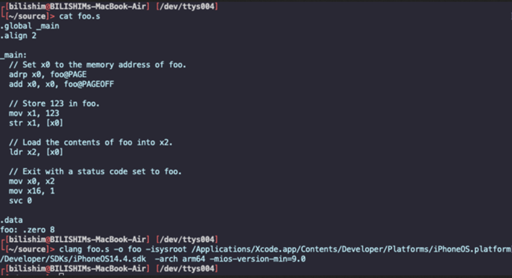
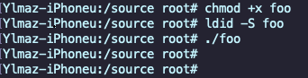
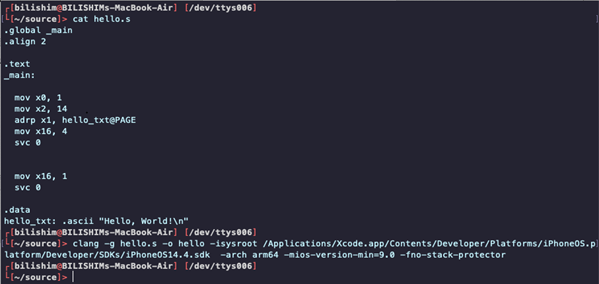
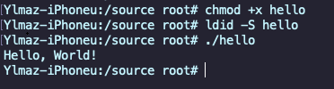

# iOS arm64 assembly - syscalls and fun

Let's take a break from C and dive directly into `arm64` assembly on `iOS`. Yes, it's possible to write, compile, and run your own low-level assembly code on a jailbroken iPhone - complete with system calls and memory operations. This example walks you through two examples: a memory test and a real `Hello, World!` syscall output.     

### requirements

To follow along, we'll need:
- jailbroken iPhone (`iOS 14+` tested, or emulator)     
- installed tools: `openSSH` - for transferring and running binaries 
- optional: `lldb` or `radare2` for deeper debugging     
- `macOS` with `Xcode` for compiling with `iOS SDK`      

### practical example 1: low-level memory test

We'll start with a warm-up: writing a small function in pure `arm64` assembly that stores and reads a value from memory - `foo.s`:    

```bash
.global _main
.align 2

.text
_main:
  // set x0 to the address of 'foo'
  adrp x0, foo@PAGE
  add  x0, x0, foo@PAGEOFF

  // store 123 into [foo]
  mov  x1, 123
  str  x1, [x0]

  // load from [foo] into x2
  ldr  x2, [x0]

  // exit with value in x2
  mov  x0, x2
  mov  x16, 1
  svc  0

.data
foo: .zero 8
```

Compile it with `clang` (replace `path` with your actual `SDK` path):    

```bash
clang foo.s -o foo \
-isysroot /Applications/Xcode.app/.../iPhoneOS14.4.sdk \
-arch arm64 -mios-version-min=9.0
```

    

deploy to iPhone. let's run it and see that runs without any error on `iOS` platform:    

```bash
scp foo root@<iphone-ip>:/var/root/
ssh root@<iphone-ip>
chmod +x foo
ldid -S foo
```

     

it exits with status `123`. Success! we just allocated memory, stored a value, retrieved it, and exited using a system call - all in raw assembly    

### practical example 2: hello world with syscall

Let's make our iPhone say hello - the raw way. No `printf`, no `libc` - just syscalls and memory (`hello.s`):     

```bash
.global _main
.align 2

.text
_main:
  // prepare syscall for write()
  mov  x0, 1              // stdout
  mov  x2, 14             // length
  adrp x1, hello_txt@PAGE // message address
  add  x1, x1, hello_txt@PAGEOFF
  mov  x16, 4             // syscall: write
  svc  0

  // exit syscall
  mov  x16, 1
  svc  0

.data
hello_txt: .ascii "Hello, World!\n"
```

Let's compile it:    

```bash
clang hello.s -o hello \
-isysroot /Applications/Xcode.app/.../iPhoneOS14.4.sdk \
-arch arm64 -mios-version-min=9.0
```

    

Deploy and run:    

```bash
scp hello root@<iphone-ip>:/var/root/
ssh root@<iphone-ip>
chmod +x hello
ldid -S hello
./hello
```

     

output:    

```bash
Hello, World!
```

As you can see, everything is worked as expected! Meow =^..^=!    

Mission complete!     

### note on X16 vs X8

Many `arm64` syscall tutorials use `x8` for syscall `ID` - and that works on Linux.     

But on `iOS`, you must use `x16`, as Apple's ABI specifies `x16` for syscall dispatch (and masks `x8` for their own kernel traps). Don't get tripped up on this one.     

### conclusion

This is a great intro to the raw power of assembly on `iOS`. Whether you're into low-level hacking, reverse engineering, or exploit dev - being able to craft and run custom `arm64` code is a powerful skill.    

In the next examples, we might look into socket programming, writing a shellcode loader, hooking syscalls, or building a tiny `ROP` stub using assembly.     

### references

[opens source an Apple](https://opensource.apple.com/)     