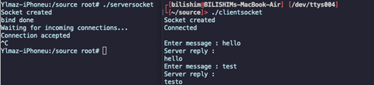

# socket programming on iOS arm64

﷽

Building a basic echo server and client (for reverse shells)    

Today we'll explore low-level socket programming on `iOS arm64` by writing a simple TCP echo server and client in pure `C` - and running it on a jailbroken `iPhone` (or emulator). This is a practical and direct way to understand how networking primitives work without the abstraction of high-level frameworks.     

We'll cover both sides: the server running on `iOS` and the client running from a remote system (e.g., our `macOS` laptop). Let's dive in.     

###  requirements

To follow along with this guide, we'll need:

- a jailbroken iPhone, tested with `iOS 14+`      
- installed packages on the iPhone: `openSSH` - for remote shell access and file transfers     
- `macOS` (or any `unix`-like system) for compiling and running the client      
- a local Wi-Fi network where both devices can reach each other      

### practical example: write socket code

We'll begin by creating two separate programs: a `tcp` server and a client. this server listens on port `8888` and echoes back whatever the client sends:     

```cpp
#include <stdio.h>
#include <string.h>
#include <sys/socket.h>
#include <arpa/inet.h> // for inet_addr
#include <unistd.h>    // for close()

int main() {
  int socket_desc, client_sock, c, read_size;
  struct sockaddr_in server, client;
  char client_message[2048];

  // step 1: create socket
  socket_desc = socket(AF_INET, SOCK_STREAM, 0);
  if (socket_desc == -1) {
      printf("could not create socket\n");
      return 1;
  }
  puts("socket created");

  // step 2: prepare sockaddr_in structure
  server.sin_family = AF_INET;
  server.sin_addr.s_addr = INADDR_ANY;
  server.sin_port = htons(8888);

  // step 3: bind socket to IP/port
  if (bind(socket_desc, (struct sockaddr *)&server, sizeof(server)) < 0) {
    perror("bind failed");
    return 1;
  }
  puts("bind successful");

  // step 4: start listening for incoming connections
  listen(socket_desc, 3);
  puts("waiting for incoming connections...");

  // step 5: accept incoming connection
  c = sizeof(struct sockaddr_in);
  client_sock = accept(socket_desc, (struct sockaddr *)&client, (socklen_t*)&c);
  if (client_sock < 0) {
    perror("accept failed");
    return 1;
  }
  puts("connection accepted");

  // step 6: echo back received messages
  while ((read_size = recv(client_sock, client_message, 2000, 0)) > 0) {
    write(client_sock, client_message, strlen(client_message));
  }

  // handle disconnection or errors
  if (read_size == 0) {
    puts("client disconnected");
  } else if (read_size == -1) {
    perror("recv failed");
  }

  return 0;
}
```

### the echo client

The echo client (runs on `macOS` or `Linux`). This client connects to the server and sends messages, receiving echoed responses.    

```cpp
#include <stdio.h>
#include <string.h>
#include <sys/socket.h>
#include <arpa/inet.h>
#include <unistd.h>

int main() {
  int sock;
  struct sockaddr_in server;
  char message[1000], server_reply[2000];

  // step 1 - create socket
  sock = socket(AF_INET, SOCK_STREAM, 0);
  if (sock == -1) {
    printf("Could not create socket\n");
    return 1;
  }
  puts("Socket created");

  // step 2 - configure server IP and port
  server.sin_addr.s_addr = inet_addr("192.168.56.1"); // replace with our 
  
  // iPhone's IP
  server.sin_family = AF_INET;
  server.sin_port = htons(8888);

  // step 3: connect to server
  if (connect(sock, (struct sockaddr *)&server, sizeof(server)) < 0) {
    perror("Connection failed");
    return 1;
  }
  puts("Connected to server");

  // step 4: interactive message loop
  while (1) {
    printf("Enter message: ");
    scanf("%s", message);

    // send message to server
    if (send(sock, message, strlen(message), 0) < 0) {
      puts("Send failed");
      return 1;
    }

    // receive and print server reply
    if (recv(sock, server_reply, 2000, 0) < 0) {
      puts("Receive failed");
      break;
    }

    puts("Server reply:");
    puts(server_reply);
  }

  close(sock);
  return 0;
}
```

### demo test

To compile for `iOS arm64`, we use the following commands on `macOS`:     

```bash
# client (macOS binary)
clang -g client.c -o client

# server (iOS binary)
clang -g server.c -o server \
-isysroot /Applications/Xcode.app/Contents/Developer/Platforms/iPhoneOS.platform/Developer/SDKs/iPhoneOS14.4.sdk \
-arch arm64 -mios-version-min=9.0
```

The `-isysroot` and `-arch` arm64 options are critical - they ensure that the resulting binary is compatible with `arm64` and uses the correct iOS system libraries.     

### deploy and sign the server binary

Transfer the `server` binary to the jailbroken `iPhone` and make it executable:    

```bash
scp server root@<iphone-ip>:/var/root/
ssh root@<iphone-ip>
chmod +x server
ldid -S server
```

`ldid` is used to pseudo-sign the binary so that it's allowed to run on `iOS` (required on jailbroken devices)      

### test the communication

start the `server` on the iPhone:     

```bash
./server
```

we should see something like this:     

```bash
Socket created
Bind successful
Waiting for incoming connections...
```

start the client on our `macOS` or `Linux` machine (make sure it's on the same network):      

```bash
./client
```

enter a message when prompted, and you should see the same message echoed back from the iPhone.      

     

This hello socket program can be easily improved for transferring files and other purposes. As I said, food for thought.     

### conclusion

In the other words, this demo illustrates how raw socket programming is possible even on `iOS`, as long as you're running in a jailbroken environment with proper tools and permissions. These basics can be expanded into more powerful tools such as:

- file transfer services      
- backdoors or reverse shells (for red team simulation)     
- custom iOS-to-PC remote command infrastructure      
- all this without the need for higher-level frameworks like `CFNetwork` or `NSURLSession`         
- as always, make sure you use this knowledge responsibly and ethically      

### references

[apple developer docs](https://developer.apple.com/documentation/foundation/socketport/socket/)       
