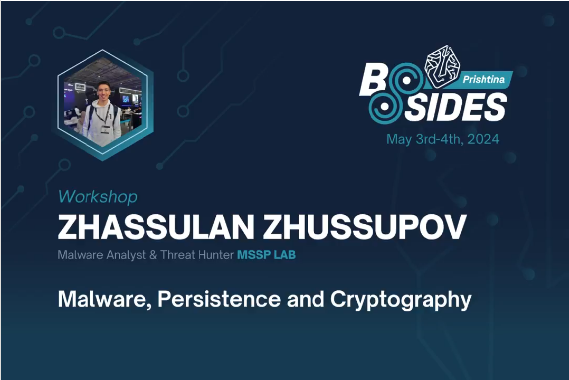

# BSides Prishtina 2024 Malware Development Workshop

     

The course is divided into four logical sections:    
- Malware development tricks and techniques (classic injection tricks, DLL injection tricks, shellcode running)    
- AV evasion tricks (Anti-VM, Anti-Sandbox, Anti-disassembling)    
- Persistence techniques    
- Cryptographic functions in malware development (exclusive)    

Most of the example in this course require a deep understanding of the Python
and C/C++ programming languages.    

Knowledge of assembly language basics is not required but will be an advantage.    

Examples and recommended literature:    

[https://cocomelonc.github.io/book/2022/07/16/mybook.html](https://cocomelonc.github.io/book/2022/07/16/mybook.html)    
[https://packt.link/MalwareDevelopment](https://packt.link/MalwareDevelopment)     